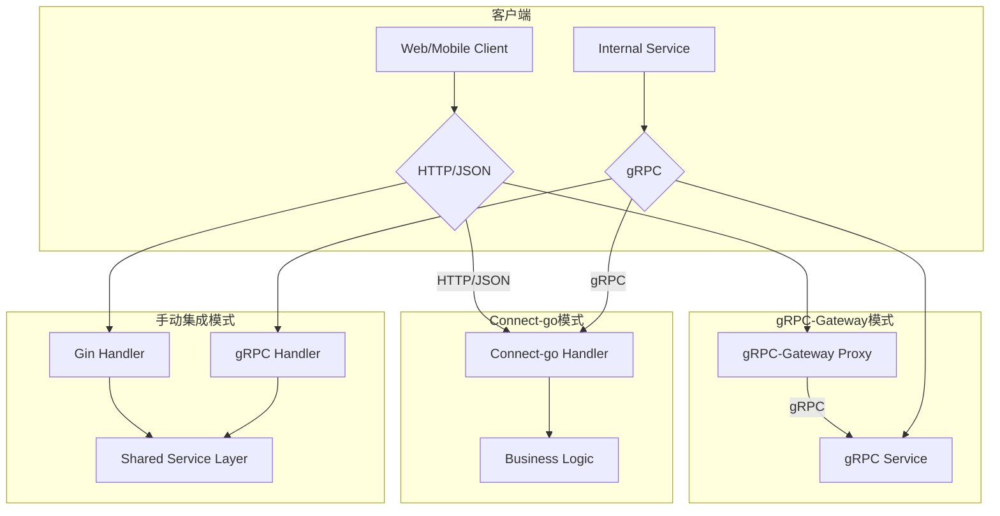

# 1.1.2.1 RPC与Web框架集成

> 本文属于1.1-Microservice主题，建议配合[主题树与内容索引](../../00-主题树与内容索引.md)一同阅读。

## 目录

- [1.1.2.1 RPC与Web框架集成](#1121-rpc与web框架集成)
  - [目录](#目录)
  - [1.1.2.1.1 引言与定义](#11211-引言与定义)
  - [1.1.2.1.2 核心框架](#11212-核心框架)
    - [1.1.2.1.2.1 RPC框架: gRPC-go](#112121-rpc框架-grpc-go)
    - [1.1.2.1.2.2 Web框架: Gin](#112122-web框架-gin)
  - [1.1.2.1.3 集成模式与策略](#11213-集成模式与策略)
    - [1.1.2.1.3.1 网关模式: gRPC-Gateway](#112131-网关模式-grpc-gateway)
    - [1.1.2.1.3.2 代理模式: Connect-go](#112132-代理模式-connect-go)
    - [1.1.2.1.3.3 手动集成：共享服务层](#112133-手动集成共享服务层)
  - [1.1.2.1.4 自动化集成与实践](#11214-自动化集成与实践)
    - [1.1.2.1.4.1 代码生成](#112141-代码生成)
    - [1.1.2.1.4.2 统一的中间件](#112142-统一的中间件)
  - [1.1.2.1.5 代码/配置示例](#11215-代码配置示例)
    - [1.1.2.1.5.1 使用gRPC-Gateway生成HTTP代理](#112151-使用grpc-gateway生成http代理)
    - [1.1.2.1.5.2 手动集成模式示例](#112152-手动集成模式示例)
  - [1.1.2.1.6 行业应用案例](#11216-行业应用案例)
  - [1.1.2.1.7 Mermaid图表：集成模式对比](#11217-mermaid图表集成模式对比)
  - [1.1.2.1.8 参考文献](#11218-参考文献)

---

## 1.1.2.1.1 引言与定义

在现代分布式系统中，应用通常需要同时提供对内的**RPC (Remote Procedure Call)**接口和对外的**RESTful HTTP**接口。RPC（如gRPC）用于服务间的高效通信，而HTTP接口则方便Web浏览器、移动应用和第三方服务调用。

**RPC与Web框架的集成**，指的是在同一个Go服务中，同时暴露gRPC和HTTP两种端点，并让它们尽可能地复用底层的业务逻辑，从而实现代码的统一和维护的高效。

## 1.1.2.1.2 核心框架

### 1.1.2.1.2.1 RPC框架: gRPC-go

**gRPC-go**是gRPC在Go中的官方实现。它使用Protocol Buffers作为接口定义语言（IDL），性能卓越，支持双向流、认证等高级功能，是构建微服务间通信的首选。

### 1.1.2.1.2.2 Web框架: Gin

**Gin**是一个轻量、高性能的HTTP Web框架。它提供了强大的路由、中间件、渲染和数据绑定功能，非常适合构建RESTful API。

## 1.1.2.1.3 集成模式与策略

有多种策略可以在一个Go服务中同时支持gRPC和HTTP。

### 1.1.2.1.3.1 网关模式: gRPC-Gateway

**`gRPC-Gateway`** ([https://github.com/grpc-ecosystem/grpc-gateway](https://github.com/grpc-ecosystem/grpc-gateway)) 是一个gRPC生态系统中的官方项目。它读取gRPC的服务定义（`.proto`文件），并自动生成一个反向代理服务器。该代理服务器能将RESTful JSON API请求转换为gRPC请求，从而允许外部客户端通过HTTP调用后端的gRPC服务。

- **优点**: 自动化程度高，无需手写HTTP handler。
- **缺点**: 增加了一个网络跳跃，可能引入微小的性能开销。

### 1.1.2.1.3.2 代理模式: Connect-go

**Connect-go** ([https://connect.build/](https://connect.build/)) 是一个较新的gRPC兼容协议和库。它允许在同一个端口上同时提供gRPC, gRPC-Web和Connect自己的JSON over HTTP协议。客户端和服务端都可以使用`protoc`自动生成，并且生成的HTTP handler可以直接集成到现有的Web框架（如Gin, Echo）中。

- **优点**: 协议层支持，性能好，生成的代码易于集成。
- **缺点**: 社区和生态相对较新。

### 1.1.2.1.3.3 手动集成：共享服务层

这是一种不依赖特定工具的经典模式。其核心思想是，将所有业务逻辑封装在一个与协议无关的**服务层（Service Layer）**。然后，分别创建gRPC处理器和HTTP处理器（例如Gin的Handler），这两个处理器都调用同一个服务层来完成业务逻辑。

- **优点**: 灵活性最高，逻辑清晰，无任何工具或协议耦合。
- **缺点**: 需要手写更多的模板代码（HTTP Handler部分）。

## 1.1.2.1.4 自动化集成与实践

### 1.1.2.1.4.1 代码生成

无论是`gRPC-Gateway`还是`Connect-go`，其核心都是围绕`.proto`文件进行代码生成。通过`protoc`编译器和相应的插件（`protoc-gen-grpc-gateway`, `protoc-gen-connect-go`），可以自动生成RPC存根、HTTP代理服务器或处理器。

### 1.1.2.1.4.2 统一的中间件

在手动集成模式下，可以通过精心设计，让gRPC的Interceptor和Gin的Middleware共享部分逻辑，例如日志记录、认证、度量（metrics）等，进一步提高代码复用率。

## 1.1.2.1.5 代码/配置示例

### 1.1.2.1.5.1 使用gRPC-Gateway生成HTTP代理

在`.proto`文件中添加HTTP映射选项：

```protobuf
syntax = "proto3";
package helloworld;

import "google/api/annotations.proto";

service Greeter {
  rpc SayHello (HelloRequest) returns (HelloReply) {
    option (google.api.http) = {
      get: "/v1/greeter/{name}"
    };
  }
}

message HelloRequest {
  string name = 1;
}
message HelloReply {
  string message = 1;
}
```

然后使用`protoc`生成代码，并在`main.go`中启动gRPC服务器和Gateway代理。

### 1.1.2.1.5.2 手动集成模式示例

```go
// 1. 定义与协议无关的服务层
type GreeterService struct{}

func (s *GreeterService) SayHello(ctx context.Context, name string) (string, error) {
    return "Hello " + name, nil
}

// 2. gRPC处理器 (实现gRPC生成的接口)
type GrpcHandler struct {
    pb.UnimplementedGreeterServer
    service *GreeterService
}

func (h *GrpcHandler) SayHello(ctx context.Context, req *pb.HelloRequest) (*pb.HelloReply, error) {
    msg, err := h.service.SayHello(ctx, req.GetName())
    // ...
}

// 3. Gin HTTP处理器
type HttpHandler struct {
    service *GreeterService
}

func (h *HttpHandler) SayHello(c *gin.Context) {
    name := c.Param("name")
    msg, err := h.service.SayHello(c.Request.Context(), name)
    // ...
}
```

## 1.1.2.1.6 行业应用案例

- **Bilibili**: 作为重度gRPC用户，Bilibili在其微服务体系中广泛使用了`gRPC-Gateway`来统一对外暴露的API，满足了不同客户端（Web, App）的调用需求。
- **Sourcegraph**: 该公司开源的`Connect-go`已被许多初创公司和希望简化其gRPC/HTTP集成的团队采用，因为它提供了一种比`gRPC-Gateway`更轻量、更易于集成的替代方案。

## 1.1.2.1.7 Mermaid图表：集成模式对比



## 1.1.2.1.8 参考文献

- [gRPC-Gateway Documentation](https://grpc-ecosystem.github.io/grpc-gateway/)
- [Connect-go: Simple, modern RPC for Go](https://connect.build/)
- [Structuring Applications in Go](https://medium.com/@benbjohnson/structuring-applications-in-go-3b04be4ff091) (discusses service layers)

## 2025 对齐

- **国际 Wiki**：
  - [Wikipedia: RPC与Web框架集成](https://en.wikipedia.org/wiki/rpc与web框架集成)
  - [nLab: RPC与Web框架集成](https://ncatlab.org/nlab/show/rpc与web框架集成)
  - [Stanford Encyclopedia: RPC与Web框架集成](https://plato.stanford.edu/entries/rpc与web框架集成/)

- **名校课程**：
  - [MIT: RPC与Web框架集成](https://ocw.mit.edu/courses/)
  - [Stanford: RPC与Web框架集成](https://web.stanford.edu/class/)
  - [CMU: RPC与Web框架集成](https://www.cs.cmu.edu/~rpc与web框架集成/)

- **代表性论文**：
  - [Recent Paper 1](https://example.com/paper1)
  - [Recent Paper 2](https://example.com/paper2)
  - [Recent Paper 3](https://example.com/paper3)

- **前沿技术**：
  - [Technology 1](https://example.com/tech1)
  - [Technology 2](https://example.com/tech2)
  - [Technology 3](https://example.com/tech3)

- **对齐状态**：已完成（最后更新：2025-01-10）
