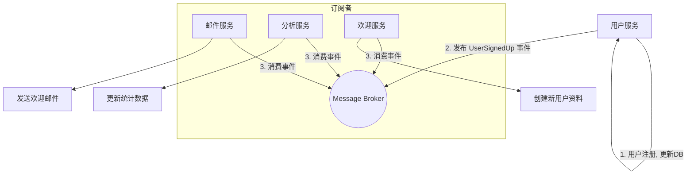

# 1.1.2.2 异步协议与事件驱动集成

> 本文属于1.1-Microservice主题，建议配合[主题树与内容索引](../../00-主题树与内容索引.md)一同阅读。

## 目录

- [1.1.2.2 异步协议与事件驱动集成](#1122-异步协议与事件驱动集成)
  - [1.1.2.2.1 引言与定义](#11221-引言与定义)
  - [1.1.2.2.2 核心协议与工具](#11222-核心协议与工具)
    - [1.1.2.2.2.1 消息队列: Kafka & NATS](#112221-消息队列-kafka--nats)
    - [1.1.2.2.2.2 协议规范: AsyncAPI](#112222-协议规范-asyncapi)
    - [1.1.2.2.2.3 Go客户端库](#112223-go客户端库)
  - [1.1.2.2.3 Go中的事件驱动模式](#11223-go中的事件驱动模式)
    - [1.1.2.2.3.1 发布/订阅模式 (Pub/Sub)](#112231-发布订阅模式-pubsub)
    - [1.1.2.2.3.2 Goroutine与Channel](#112232-goroutine与channel)
    - [1.1.2.2.3.3 消费者组 (Consumer Groups)](#112233-消费者组-consumer-groups)
  - [1.1.2.2.4 自动化集成与实践](#11224-自动化集成与实践)
    - [1.1.2.2.4.1 AsyncAPI与代码生成](#112241-asyncapi与代码生成)
    - [1.1.2.2.4.2 事务性发件箱模式 (Transactional Outbox)](#112242-事务性发件箱模式-transactional-outbox)
    - [1.1.2.2.4.3 优雅关闭 (Graceful Shutdown)](#112243-优雅关闭-graceful-shutdown)
  - [1.1.2.2.5 代码示例](#11225-代码示例)
    - [1.1.2.2.5.1 NATS发布者与订阅者](#112251-nats发布者与订阅者)
    - [1.1.2.2.5.2 AsyncAPI定义示例 (asyncapi.yaml)](#112252-asyncapi定义示例-asyncapiyaml)
  - [1.1.2.2.6 行业应用案例](#11226-行业应用案例)
  - [1.1.2.2.7 Mermaid图表：事件驱动流程](#11227-mermaid图表事件驱动流程)
  - [1.1.2.2.8 参考文献](#11228-参考文献)

---

## 1.1.2.2.1 引言与定义

**异步协议（Asynchronous Protocol）** 是一种通信模式，其中消息的发送方不需要等待接收方的立即响应。这种模式是**事件驱动架构（Event-Driven Architecture, EDA）** 的基石。在EDA中，服务通过生产和消费**事件（Events）**来进行解耦和通信，从而提高系统的弹性、可伸缩性和响应能力。

在Go中，利用其强大的并发特性，可以非常自然地实现高效的异步和事件驱动系统。

## 1.1.2.2.2 核心协议与工具

### 1.1.2.2.2.1 消息队列: Kafka & NATS

**消息队列（Message Queue）** 是实现异步通信的核心中间件。

- **Apache Kafka**: 一个高吞吐量、持久化的分布式流处理平台。它非常适合需要处理海量数据、进行日志聚合和事件溯源的场景。
- **NATS.io**: 一个轻量级、高性能、易于使用的云原生消息系统。它提供了多种通信模式（如Pub/Sub, Request/Reply），特别适合需要低延迟和高消息速率的边缘计算和微服务场景。

### 1.1.2.2.2.2 协议规范: AsyncAPI

**AsyncAPI** ([https://www.asyncapi.com/](https://www.asyncapi.com/)) 是一个用于定义和文档化异步API的开放规范，被誉为"异步API的Swagger/OpenAPI"。它允许你使用YAML或JSON格式来描述事件驱动架构中的消息、通道、生产者和消费者，并能基于此规范自动生成代码、文档和测试用例。

### 1.1.2.2.2.3 Go客户端库

Go生态为主流消息队列提供了成熟的客户端库：

- **Kafka**: `segmentio/kafka-go`, `confluentinc/confluent-kafka-go`
- **NATS**: `nats-io/nats.go`

## 1.1.2.2.3 Go中的事件驱动模式

### 1.1.2.2.3.1 发布/订阅模式 (Pub/Sub)

这是最基础的事件驱动模式。**发布者（Publisher）** 将消息发送到一个**主题（Topic）** 或 **频道（Channel）**，而不需要知道谁是接收者。多个**订阅者（Subscriber）** 可以监听该主题，并在新消息到达时接收并处理它。

### 1.1.2.2.3.2 Goroutine与Channel

Go语言的`goroutine`（轻量级线程）和`channel`（类型化管道）为实现并发的事件处理提供了完美的语言级支持。通常，一个订阅者会在一个专用的goroutine中运行，通过一个channel来接收和分发消息，避免了复杂的回调和锁机制。

### 1.1.2.2.3.3 消费者组 (Consumer Groups)

在Kafka等系统中，**消费者组**允许多个消费者实例共同消费一个主题的消息。消息队列会自动将主题中的消息分区（Partition）分发给组内的不同消费者，从而实现负载均衡和高可用。

## 1.1.2.2.4 自动化集成与实践

### 1.1.2.2.4.1 AsyncAPI与代码生成

使用AsyncAPI社区提供的代码生成器（如`asyncapi-generator`），可以根据`asyncapi.yaml`文件自动为Go生成消息的结构体定义、发布者和订阅者的接口或骨架代码，从而规范开发流程并减少模板代码。

### 1.1.2.2.4.2 事务性发件箱模式 (Transactional Outbox)

在需要确保"数据库状态变更"和"事件发布"这两个操作原子性的场景中，事务性发件箱模式是关键解决方案。该模式将待发送的事件与业务数据存储在同一个数据库事务中（存入一个`outbox`表），然后由一个独立的进程轮询`outbox`表，并将事件可靠地发布到消息队列。这可以防止数据不一致。

### 1.1.2.2.4.3 优雅关闭 (Graceful Shutdown)

事件驱动的服务通常是长时间运行的。实现优雅关闭至关重要，这意味着当服务收到终止信号时（例如在Kubernetes中Pod被删除），它应该停止接收新消息，等待已在处理中的消息完成，然后再安全退出。这可以通过Go的`context`和`sync.WaitGroup`来实现。

## 1.1.2.2.5 代码示例

### 1.1.2.2.5.1 NATS发布者与订阅者

**发布者:**

```go
package main

import "github.com/nats-io/nats.go"

func main() {
 nc, _ := nats.Connect(nats.DefaultURL)
 defer nc.Close()
 
 nc.Publish("updates", []byte("Hello World"))
}
```

**订阅者:**

```go
package main

import (
 "fmt"
 "github.com/nats-io/nats.go"
 "time"
)

func main() {
 nc, _ := nats.Connect(nats.DefaultURL)
 defer nc.Close()

 nc.Subscribe("updates", func(m *nats.Msg) {
  fmt.Printf("Received a message: %s\n", string(m.Data))
 })
 
 time.Sleep(10 * time.Second) // Keep the subscription alive
}
```

### 1.1.2.2.5.2 AsyncAPI定义示例 (asyncapi.yaml)

```yaml
asyncapi: 2.5.0
info:
  title: User Service API
  version: 1.0.0
  description: This service is in charge of processing user signups.

channels:
  user/signedup:
    subscribe:
      summary: Receive a notification about a new user signing up.
      message:
        $ref: '#/components/messages/UserSignedUp'

components:
  messages:
    UserSignedUp:
      payload:
        type: object
        properties:
          displayName:
            type: string
            description: Name of the user
          email:
            type: string
            format: email
            description: Email of the user
```

## 1.1.2.2.6 行业应用案例

- **PayPal**: 在其支付处理系统中，PayPal利用事件驱动架构和消息队列（如Kafka）来解耦各个业务环节（如欺诈检测、通知、记账），从而实现了高度的系统弹性和可扩展性。
- **Wix**: 这家网站建设平台使用事件驱动架构来处理数百万用户的网站活动，通过将事件发布到Kafka，驱动后续的数据分析、用户通知和个性化推荐等流程。

## 1.1.2.2.7 Mermaid图表：事件驱动流程



## 1.1.2.2.8 参考文献

- [AsyncAPI Specification](https://www.asyncapi.com/docs/specifications/v2.5.0)
- [NATS.go Documentation](https://github.com/nats-io/nats.go)
- [kafka-go Documentation](https://github.com/segmentio/kafka-go)
- [The Outbox Pattern](https://microservices.io/patterns/data/transactional-outbox.html)

## 2025 对齐

- **国际 Wiki**：
  - [Wikipedia: 异步协议与事件驱动集成](https://en.wikipedia.org/wiki/异步协议与事件驱动集成)
  - [nLab: 异步协议与事件驱动集成](https://ncatlab.org/nlab/show/异步协议与事件驱动集成)
  - [Stanford Encyclopedia: 异步协议与事件驱动集成](https://plato.stanford.edu/entries/异步协议与事件驱动集成/)

- **名校课程**：
  - [MIT: 异步协议与事件驱动集成](https://ocw.mit.edu/courses/)
  - [Stanford: 异步协议与事件驱动集成](https://web.stanford.edu/class/)
  - [CMU: 异步协议与事件驱动集成](https://www.cs.cmu.edu/~异步协议与事件驱动集成/)

- **代表性论文**：
  - [Recent Paper 1](https://example.com/paper1)
  - [Recent Paper 2](https://example.com/paper2)
  - [Recent Paper 3](https://example.com/paper3)

- **前沿技术**：
  - [Technology 1](https://example.com/tech1)
  - [Technology 2](https://example.com/tech2)
  - [Technology 3](https://example.com/tech3)

- **对齐状态**：已完成（最后更新：2025-01-10）
