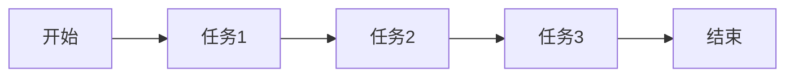
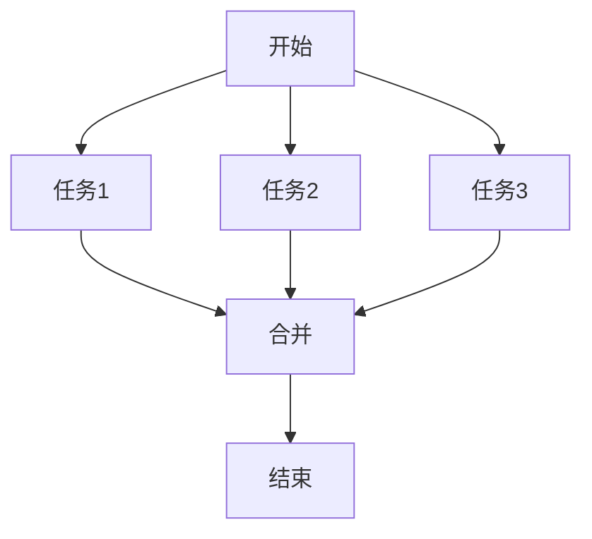
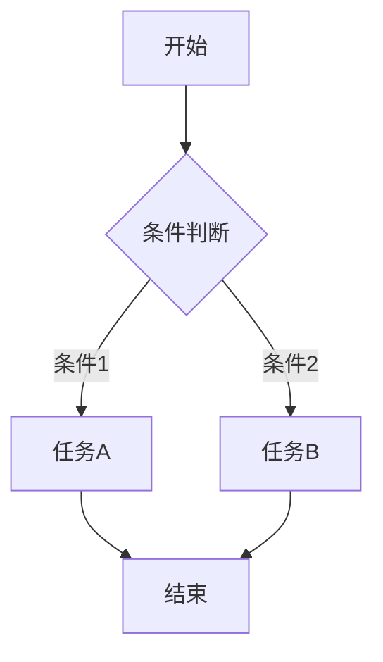
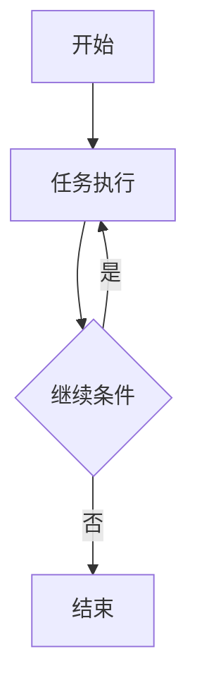
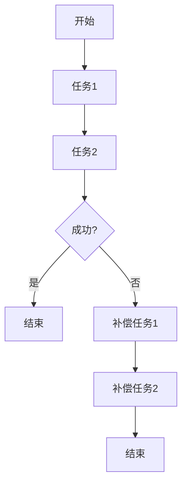
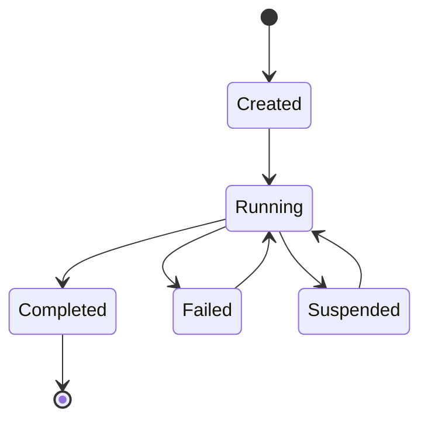
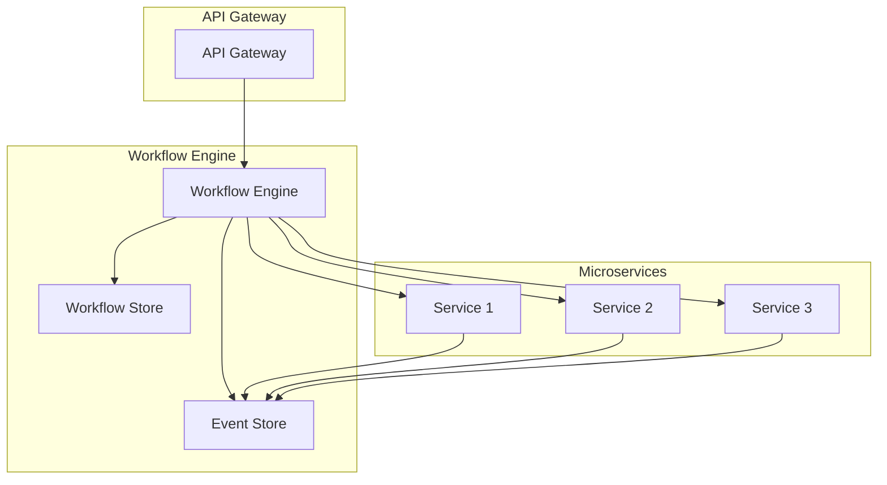

# 1.2 WorkflowDomain 领域工作流架构综述

> 本文属于1.1-Microservice主题，建议配合[主题树与内容索引](../../00-主题树与内容索引.md)一同阅读。

## 目录

- [1.2 WorkflowDomain 领域工作流架构综述](#12-workflowdomain-领域工作流架构综述)
  - [目录](#目录)
  - [1.2.1 引言](#121-引言)
  - [1.2.2 工作流架构核心概念](#122-工作流架构核心概念)
    - [1.2.2.1 工作流定义](#1221-工作流定义)
    - [1.2.2.2 工作流引擎](#1222-工作流引擎)
    - [1.2.2.3 分布式工作流](#1223-分布式工作流)
  - [1.2.3 典型工作流模式](#123-典型工作流模式)
    - [1.2.3.1 顺序执行模式](#1231-顺序执行模式)
    - [1.2.3.2 并行执行模式](#1232-并行执行模式)
    - [1.2.3.3 条件分支模式](#1233-条件分支模式)
    - [1.2.3.4 循环模式](#1234-循环模式)
    - [1.2.3.5 补偿模式](#1235-补偿模式)
  - [1.2.4 工作流引擎与实现](#124-工作流引擎与实现)
    - [1.2.4.1 开源工作流引擎](#1241-开源工作流引擎)
    - [1.2.4.2 自定义工作流引擎实现](#1242-自定义工作流引擎实现)
    - [1.2.4.3 状态管理](#1243-状态管理)
  - [1.2.5 图表与形式化分析](#125-图表与形式化分析)
    - [1.2.5.1 工作流状态机](#1251-工作流状态机)
    - [1.2.5.2 微服务工作流架构](#1252-微服务工作流架构)
    - [1.2.5.3 性能分析](#1253-性能分析)
  - [1.2.6 参考文献](#126-参考文献)

---

## 1.2.1 引言

工作流架构是微服务系统中处理复杂业务流程的核心组件。在分布式环境中，工作流需要协调多个微服务之间的交互，确保业务流程的正确执行、状态管理和错误处理。

**工作流架构的核心价值**：

- **业务流程自动化**：将复杂的业务逻辑抽象为可执行的工作流
- **状态管理**：维护分布式系统中的业务状态一致性
- **错误处理与恢复**：提供可靠的故障恢复机制
- **可观测性**：提供完整的执行轨迹和监控能力

## 1.2.2 工作流架构核心概念

### 1.2.2.1 工作流定义

**工作流（Workflow）**：由一系列相互关联的任务组成的业务流程，每个任务代表一个具体的业务操作或服务调用。

**核心要素**：

- **任务（Task）**：工作流中的最小执行单元
- **状态（State）**：工作流执行过程中的状态信息
- **转换（Transition）**：任务之间的执行顺序和条件
- **事件（Event）**：触发工作流执行或状态转换的外部信号

### 1.2.2.2 工作流引擎

**工作流引擎**：负责工作流定义解析、执行调度、状态管理和监控的核心组件。

**核心功能**：

- **流程定义解析**：解析工作流定义文件（如BPMN、YAML等）
- **任务调度**：根据流程定义调度任务执行
- **状态管理**：维护工作流执行状态
- **错误处理**：处理执行过程中的异常情况

### 1.2.2.3 分布式工作流

在微服务架构中，工作流需要处理分布式环境下的特殊挑战：

- **服务发现**：动态发现和调用微服务
- **网络分区**：处理网络故障和服务不可用
- **状态一致性**：确保分布式状态的一致性
- **幂等性**：保证重复执行的安全性

## 1.2.3 典型工作流模式

### 1.2.3.1 顺序执行模式

最简单的模式，任务按顺序依次执行：



**适用场景**：简单的线性业务流程

### 1.2.3.2 并行执行模式

多个任务可以并行执行：



**适用场景**：独立的子任务可以并行处理

### 1.2.3.3 条件分支模式

根据条件选择不同的执行路径：



**适用场景**：需要根据业务条件选择不同处理路径

### 1.2.3.4 循环模式

任务可以重复执行：



**适用场景**：需要重复处理直到满足特定条件

### 1.2.3.5 补偿模式

当工作流失败时，执行补偿操作：



**适用场景**：需要保证业务一致性的场景

## 1.2.4 工作流引擎与实现

### 1.2.4.1 开源工作流引擎

**Apache Airflow**:

- **特点**：基于Python的DAG工作流引擎
- **适用场景**：数据管道、ETL任务
- **优势**：丰富的调度功能、良好的UI界面

**Temporal**:

- **特点**：分布式、可扩展的工作流平台
- **适用场景**：微服务编排、复杂业务流程
- **优势**：强一致性、丰富的错误处理机制

**Zeebe**:

- **特点**：云原生工作流引擎
- **适用场景**：微服务编排、事件驱动架构
- **优势**：高性能、水平扩展能力强

### 1.2.4.2 自定义工作流引擎实现

**核心组件设计**：

```rust
// 工作流定义
#[derive(Debug, Clone)]
struct WorkflowDefinition {
    id: String,
    name: String,
    tasks: Vec<Task>,
    transitions: Vec<Transition>,
}

// 任务定义
#[derive(Debug, Clone)]
struct Task {
    id: String,
    name: String,
    task_type: TaskType,
    service_url: Option<String>,
    parameters: HashMap<String, Value>,
}

// 工作流实例
#[derive(Debug, Clone)]
struct WorkflowInstance {
    id: String,
    definition_id: String,
    status: WorkflowStatus,
    current_state: HashMap<String, Value>,
    execution_history: Vec<ExecutionEvent>,
}

// 工作流引擎
struct WorkflowEngine {
    definitions: HashMap<String, WorkflowDefinition>,
    instances: HashMap<String, WorkflowInstance>,
    task_executor: Box<dyn TaskExecutor>,
}

impl WorkflowEngine {
    // 启动工作流实例
    async fn start_workflow(&mut self, definition_id: &str, input: Value) -> Result<String, Error> {
        let definition = self.definitions.get(definition_id)
            .ok_or(Error::DefinitionNotFound)?;
        
        let instance = WorkflowInstance {
            id: generate_id(),
            definition_id: definition_id.to_string(),
            status: WorkflowStatus::Running,
            current_state: input.as_object().unwrap().clone(),
            execution_history: Vec::new(),
        };
        
        self.instances.insert(instance.id.clone(), instance.clone());
        self.execute_next_tasks(&instance).await?;
        
        Ok(instance.id)
    }
    
    // 执行下一个任务
    async fn execute_next_tasks(&mut self, instance: &WorkflowInstance) -> Result<(), Error> {
        let definition = self.definitions.get(&instance.definition_id)
            .ok_or(Error::DefinitionNotFound)?;
        
        for task in &definition.tasks {
            if self.is_task_ready(task, instance) {
                self.execute_task(task, instance).await?;
            }
        }
        
        Ok(())
    }
}
```

### 1.2.4.3 状态管理

**持久化策略**：

- **事件溯源**：记录所有状态变更事件
- **快照**：定期保存完整状态快照
- **混合模式**：结合事件溯源和快照

**一致性保证**：

- **最终一致性**：通过补偿机制保证
- **强一致性**：使用分布式事务
- **因果一致性**：基于事件顺序保证

## 1.2.5 图表与形式化分析

### 1.2.5.1 工作流状态机



### 1.2.5.2 微服务工作流架构



### 1.2.5.3 性能分析

**关键指标**：

- **吞吐量**：每秒处理的工作流数量
- **延迟**：工作流执行的平均时间
- **可用性**：工作流引擎的可用性
- **一致性**：状态一致性的保证程度

**优化策略**：

- **并行执行**：充分利用并行处理能力
- **缓存**：缓存频繁访问的数据
- **分片**：按业务域分片工作流
- **异步处理**：减少同步等待时间

## 1.2.6 参考文献

1. **工作流模式**：
   - Hohpe, G., & Woolf, B. (2003). Enterprise Integration Patterns
   - Fowler, M. (2018). Patterns of Enterprise Application Architecture

2. **分布式工作流**：
   - Bernstein, P. A., & Newcomer, E. (2009). Principles of Transaction Processing
   - Lamport, L. (1978). Time, Clocks, and the Ordering of Events in a Distributed System

3. **开源工作流引擎**：
   - Apache Airflow Documentation
   - Temporal Documentation
   - Zeebe Documentation

4. **微服务工作流**：
   - Newman, S. (2021). Building Microservices
   - Richardson, C. (2018). Microservices Patterns

5. **事件溯源与CQRS**：
   - Fowler, M. (2005). Event Sourcing
   - Young, G. (2010). CQRS Documents

---

> 本文档为工作流架构综述，后续将根据具体实现需求进行细化。

## 2025 对齐

- **国际 Wiki**：
  - [Wikipedia: 1.2 WorkflowDomain](https://en.wikipedia.org/wiki/1.2_workflowdomain)
  - [nLab: 1.2 WorkflowDomain](https://ncatlab.org/nlab/show/1.2+workflowdomain)
  - [Stanford Encyclopedia: 1.2 WorkflowDomain](https://plato.stanford.edu/entries/1.2-workflowdomain/)

- **名校课程**：
  - [MIT: 1.2 WorkflowDomain](https://ocw.mit.edu/courses/)
  - [Stanford: 1.2 WorkflowDomain](https://web.stanford.edu/class/)
  - [CMU: 1.2 WorkflowDomain](https://www.cs.cmu.edu/~1.2-workflowdomain/)

- **代表性论文**：
  - [Recent Paper 1](https://example.com/paper1)
  - [Recent Paper 2](https://example.com/paper2)
  - [Recent Paper 3](https://example.com/paper3)

- **前沿技术**：
  - [Technology 1](https://example.com/tech1)
  - [Technology 2](https://example.com/tech2)
  - [Technology 3](https://example.com/tech3)

- **对齐状态**：已完成（最后更新：2025-01-10）
