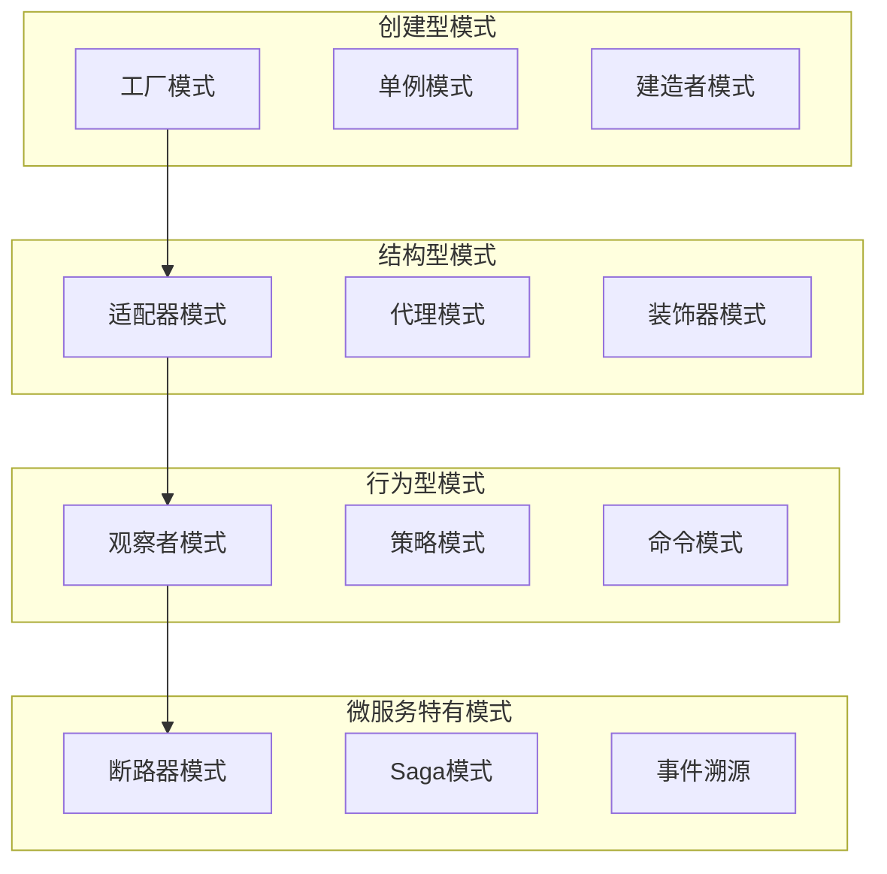
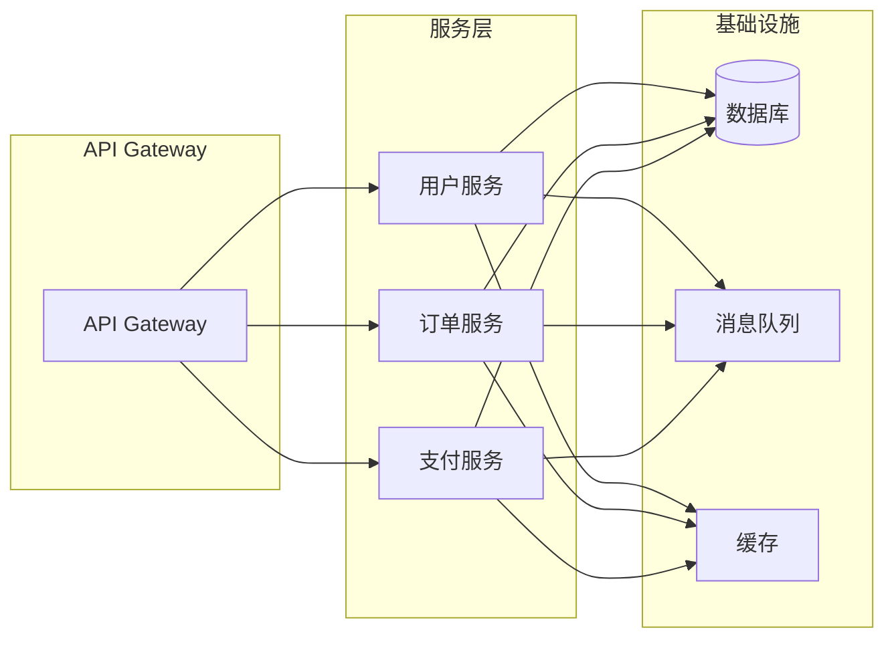

# 1.3 DesignPattern 设计模式与微服务架构

> 本文属于1.1-Microservice主题，建议配合[主题树与内容索引](../../00-主题树与内容索引.md)一同阅读。

## 目录

- [1.3 DesignPattern 设计模式与微服务架构](#13-designpattern-设计模式与微服务架构)
  - [目录](#目录)
  - [1.3.1 引言](#131-引言)
  - [1.3.2 设计模式基础](#132-设计模式基础)
    - [1.3.2.1 设计模式分类](#1321-设计模式分类)
    - [1.3.2.2 微服务特有模式](#1322-微服务特有模式)
  - [1.3.3 经典设计模式详解](#133-经典设计模式详解)
    - [1.3.3.1 创建型模式](#1331-创建型模式)
    - [1.3.3.2 结构型模式](#1332-结构型模式)
    - [1.3.3.3 行为型模式](#1333-行为型模式)
  - [1.3.4 微服务架构中的设计模式应用](#134-微服务架构中的设计模式应用)
    - [1.3.4.1 分布式系统模式](#1341-分布式系统模式)
    - [1.3.4.2 数据管理模式](#1342-数据管理模式)
  - [1.3.5 Rust/Haskell/Go代码示例](#135-rusthaskellgo代码示例)
    - [1.3.5.1 Rust实现](#1351-rust实现)
    - [1.3.5.2 Haskell实现](#1352-haskell实现)
    - [1.3.5.3 Go实现](#1353-go实现)
  - [1.3.6 图表与形式化分析](#136-图表与形式化分析)
    - [1.3.6.1 设计模式关系图](#1361-设计模式关系图)
    - [1.3.6.2 微服务架构模式](#1362-微服务架构模式)
    - [1.3.6.3 性能分析](#1363-性能分析)
  - [1.3.7 参考文献](#137-参考文献)

---

## 1.3.1 引言

设计模式是软件工程中解决常见问题的可重用解决方案。在微服务架构中，设计模式不仅帮助解决单个服务内部的设计问题，更重要的是解决服务间通信、数据一致性、容错处理等分布式系统特有的挑战。

**微服务架构中设计模式的重要性**：

- **服务解耦**：通过模式实现服务间的松耦合
- **容错处理**：提供可靠的错误处理和恢复机制
- **性能优化**：通过缓存、异步等模式提升系统性能
- **可维护性**：提高代码的可读性和可维护性

## 1.3.2 设计模式基础

### 1.3.2.1 设计模式分类

**按目的分类**：

- **创建型模式**：解决对象创建问题（工厂、单例、建造者等）
- **结构型模式**：解决类和对象组合问题（适配器、装饰器、代理等）
- **行为型模式**：解决对象间通信问题（观察者、策略、命令等）

**按范围分类**：

- **类模式**：处理类之间的关系
- **对象模式**：处理对象之间的关系

### 1.3.2.2 微服务特有模式

**分布式系统模式**：

- **断路器模式**：防止级联故障
- **重试模式**：处理临时性故障
- **超时模式**：避免无限等待
- **熔断器模式**：快速失败机制

**数据管理模式**：

- **Saga模式**：分布式事务管理
- **CQRS模式**：命令查询职责分离
- **事件溯源**：基于事件的持久化
- **API网关模式**：统一入口管理

## 1.3.3 经典设计模式详解

### 1.3.3.1 创建型模式

**工厂模式（Factory Pattern）**:

```rust
// 服务工厂
trait ServiceFactory {
    fn create_service(&self, service_type: &str) -> Box<dyn Service>;
}

struct MicroserviceFactory;

impl ServiceFactory for MicroserviceFactory {
    fn create_service(&self, service_type: &str) -> Box<dyn Service> {
        match service_type {
            "user" => Box::new(UserService::new()),
            "order" => Box::new(OrderService::new()),
            "payment" => Box::new(PaymentService::new()),
            _ => panic!("Unknown service type"),
        }
    }
}
```

**单例模式（Singleton Pattern）**:

```rust
use std::sync::Once;

pub struct ConfigurationManager {
    config: HashMap<String, String>,
}

impl ConfigurationManager {
    static INSTANCE: Once = Once::new();
    static mut INSTANCE_PTR: Option<ConfigurationManager> = None;
    
    pub fn instance() -> &'static ConfigurationManager {
        unsafe {
            INSTANCE.call_once(|| {
                INSTANCE_PTR = Some(ConfigurationManager::new());
            });
            INSTANCE_PTR.as_ref().unwrap()
        }
    }
}
```

### 1.3.3.2 结构型模式

**适配器模式（Adapter Pattern）**:

```rust
// 外部API适配器
trait ExternalAPI {
    fn call(&self, request: &str) -> Result<String, Error>;
}

struct LegacyAPIService {
    endpoint: String,
}

impl ExternalAPI for LegacyAPIService {
    fn call(&self, request: &str) -> Result<String, Error> {
        // 调用外部API
        Ok(format!("Response from {}", self.endpoint))
    }
}

// 适配器
struct ModernAPIAdapter {
    legacy_service: LegacyAPIService,
}

impl ModernAPIAdapter {
    fn new(legacy_service: LegacyAPIService) -> Self {
        Self { legacy_service }
    }
    
    fn modern_call(&self, request: &ModernRequest) -> Result<ModernResponse, Error> {
        let legacy_request = self.convert_to_legacy(request);
        let legacy_response = self.legacy_service.call(&legacy_request)?;
        Ok(self.convert_from_legacy(&legacy_response))
    }
}
```

**代理模式（Proxy Pattern）**:

```rust
// 服务代理
trait Service {
    fn execute(&self, request: &str) -> Result<String, Error>;
}

struct RealService;

impl Service for RealService {
    fn execute(&self, request: &str) -> Result<String, Error> {
        // 实际的服务逻辑
        Ok(format!("Processed: {}", request))
    }
}

struct ServiceProxy {
    real_service: RealService,
    cache: HashMap<String, String>,
}

impl Service for ServiceProxy {
    fn execute(&self, request: &str) -> Result<String, Error> {
        // 检查缓存
        if let Some(cached_result) = self.cache.get(request) {
            return Ok(cached_result.clone());
        }
        
        // 调用真实服务
        let result = self.real_service.execute(request)?;
        
        // 缓存结果
        self.cache.insert(request.to_string(), result.clone());
        
        Ok(result)
    }
}
```

### 1.3.3.3 行为型模式

**观察者模式（Observer Pattern）**:

```rust
use std::collections::HashMap;
use std::sync::{Arc, Mutex};

trait Observer: Send + Sync {
    fn update(&self, event: &str);
}

struct EventBus {
    observers: Arc<Mutex<HashMap<String, Vec<Box<dyn Observer>>>>>,
}

impl EventBus {
    fn new() -> Self {
        Self {
            observers: Arc::new(Mutex::new(HashMap::new())),
        }
    }
    
    fn subscribe(&self, event_type: &str, observer: Box<dyn Observer>) {
        let mut observers = self.observers.lock().unwrap();
        observers.entry(event_type.to_string())
            .or_insert_with(Vec::new)
            .push(observer);
    }
    
    fn publish(&self, event_type: &str, event: &str) {
        let observers = self.observers.lock().unwrap();
        if let Some(obs) = observers.get(event_type) {
            for observer in obs {
                observer.update(event);
            }
        }
    }
}
```

**策略模式（Strategy Pattern）**:

```rust
trait PaymentStrategy {
    fn process_payment(&self, amount: f64) -> Result<String, Error>;
}

struct CreditCardPayment;

impl PaymentStrategy for CreditCardPayment {
    fn process_payment(&self, amount: f64) -> Result<String, Error> {
        Ok(format!("Credit card payment processed: ${}", amount))
    }
}

struct PayPalPayment;

impl PaymentStrategy for PayPalPayment {
    fn process_payment(&self, amount: f64) -> Result<String, Error> {
        Ok(format!("PayPal payment processed: ${}", amount))
    }
}

struct PaymentProcessor {
    strategy: Box<dyn PaymentStrategy>,
}

impl PaymentProcessor {
    fn new(strategy: Box<dyn PaymentStrategy>) -> Self {
        Self { strategy }
    }
    
    fn process(&self, amount: f64) -> Result<String, Error> {
        self.strategy.process_payment(amount)
    }
}
```

## 1.3.4 微服务架构中的设计模式应用

### 1.3.4.1 分布式系统模式

**断路器模式（Circuit Breaker Pattern）**:

```rust
use std::sync::{Arc, Mutex};
use std::time::{Duration, Instant};

#[derive(Debug, Clone)]
enum CircuitState {
    Closed,
    Open,
    HalfOpen,
}

struct CircuitBreaker {
    state: Arc<Mutex<CircuitState>>,
    failure_threshold: u32,
    timeout: Duration,
    last_failure_time: Arc<Mutex<Option<Instant>>>,
    failure_count: Arc<Mutex<u32>>,
}

impl CircuitBreaker {
    fn new(failure_threshold: u32, timeout: Duration) -> Self {
        Self {
            state: Arc::new(Mutex::new(CircuitState::Closed)),
            failure_threshold,
            timeout,
            last_failure_time: Arc::new(Mutex::new(None)),
            failure_count: Arc::new(Mutex::new(0)),
        }
    }
    
    async fn call<F, T, E>(&self, operation: F) -> Result<T, E>
    where
        F: FnOnce() -> Result<T, E>,
    {
        let current_state = *self.state.lock().unwrap();
        
        match current_state {
            CircuitState::Open => {
                if self.should_attempt_reset().await {
                    self.set_half_open().await;
                } else {
                    return Err(/* circuit breaker error */);
                }
            }
            CircuitState::HalfOpen => {
                // 允许一次尝试
            }
            CircuitState::Closed => {
                // 正常执行
            }
        }
        
        match operation() {
            Ok(result) => {
                self.on_success().await;
                Ok(result)
            }
            Err(error) => {
                self.on_failure().await;
                Err(error)
            }
        }
    }
    
    async fn should_attempt_reset(&self) -> bool {
        if let Some(last_failure) = *self.last_failure_time.lock().unwrap() {
            return Instant::now().duration_since(last_failure) >= self.timeout;
        }
        false
    }
    
    async fn set_half_open(&self) {
        *self.state.lock().unwrap() = CircuitState::HalfOpen;
    }
    
    async fn on_success(&self) {
        *self.state.lock().unwrap() = CircuitState::Closed;
        *self.failure_count.lock().unwrap() = 0;
    }
    
    async fn on_failure(&self) {
        let mut failure_count = self.failure_count.lock().unwrap();
        *failure_count += 1;
        
        if *failure_count >= self.failure_threshold {
            *self.state.lock().unwrap() = CircuitState::Open;
            *self.last_failure_time.lock().unwrap() = Some(Instant::now());
        }
    }
}
```

**重试模式（Retry Pattern）**:

```rust
use std::time::Duration;

struct RetryPolicy {
    max_attempts: u32,
    backoff_delay: Duration,
    max_delay: Duration,
}

impl RetryPolicy {
    fn new(max_attempts: u32, backoff_delay: Duration, max_delay: Duration) -> Self {
        Self {
            max_attempts,
            backoff_delay,
            max_delay,
        }
    }
    
    async fn execute<F, T, E>(&self, operation: F) -> Result<T, E>
    where
        F: Fn() -> Result<T, E>,
    {
        let mut last_error = None;
        
        for attempt in 1..=self.max_attempts {
            match operation() {
                Ok(result) => return Ok(result),
                Err(error) => {
                    last_error = Some(error);
                    
                    if attempt < self.max_attempts {
                        let delay = self.calculate_delay(attempt);
                        tokio::time::sleep(delay).await;
                    }
                }
            }
        }
        
        Err(last_error.unwrap())
    }
    
    fn calculate_delay(&self, attempt: u32) -> Duration {
        let delay = self.backoff_delay * 2_u32.pow(attempt - 1);
        std::cmp::min(delay, self.max_delay)
    }
}
```

### 1.3.4.2 数据管理模式

**Saga模式（Saga Pattern）**:

```rust
use async_trait::async_trait;

#[async_trait]
trait SagaStep {
    async fn execute(&self) -> Result<(), Error>;
    async fn compensate(&self) -> Result<(), Error>;
}

struct CreateOrderSaga {
    steps: Vec<Box<dyn SagaStep + Send + Sync>>,
}

impl CreateOrderSaga {
    fn new() -> Self {
        Self { steps: Vec::new() }
    }
    
    fn add_step(&mut self, step: Box<dyn SagaStep + Send + Sync>) {
        self.steps.push(step);
    }
    
    async fn execute(&self) -> Result<(), Error> {
        let mut executed_steps = Vec::new();
        
        for step in &self.steps {
            match step.execute().await {
                Ok(()) => {
                    executed_steps.push(step);
                }
                Err(error) => {
                    // 补偿已执行的步骤
                    for executed_step in executed_steps.iter().rev() {
                        if let Err(compensation_error) = executed_step.compensate().await {
                            // 记录补偿错误
                            eprintln!("Compensation failed: {:?}", compensation_error);
                        }
                    }
                    return Err(error);
                }
            }
        }
        
        Ok(())
    }
}
```

## 1.3.5 Rust/Haskell/Go代码示例

### 1.3.5.1 Rust实现

**事件溯源模式**:

```rust
use serde::{Deserialize, Serialize};
use std::collections::HashMap;

#[derive(Debug, Clone, Serialize, Deserialize)]
enum DomainEvent {
    OrderCreated { order_id: String, customer_id: String },
    OrderConfirmed { order_id: String },
    OrderCancelled { order_id: String, reason: String },
}

#[derive(Debug, Clone)]
struct EventStore {
    events: HashMap<String, Vec<DomainEvent>>,
}

impl EventStore {
    fn new() -> Self {
        Self {
            events: HashMap::new(),
        }
    }
    
    fn append_events(&mut self, aggregate_id: &str, events: Vec<DomainEvent>) {
        self.events.entry(aggregate_id.to_string())
            .or_insert_with(Vec::new)
            .extend(events);
    }
    
    fn get_events(&self, aggregate_id: &str) -> Vec<DomainEvent> {
        self.events.get(aggregate_id)
            .cloned()
            .unwrap_or_default()
    }
}

#[derive(Debug, Clone)]
struct OrderAggregate {
    id: String,
    customer_id: String,
    status: OrderStatus,
    version: u64,
}

#[derive(Debug, Clone)]
enum OrderStatus {
    Created,
    Confirmed,
    Cancelled,
}

impl OrderAggregate {
    fn new(id: String, customer_id: String) -> Self {
        Self {
            id,
            customer_id,
            status: OrderStatus::Created,
            version: 0,
        }
    }
    
    fn apply_event(&mut self, event: &DomainEvent) {
        match event {
            DomainEvent::OrderCreated { order_id, customer_id } => {
                self.id = order_id.clone();
                self.customer_id = customer_id.clone();
                self.status = OrderStatus::Created;
            }
            DomainEvent::OrderConfirmed { order_id } => {
                if self.id == *order_id {
                    self.status = OrderStatus::Confirmed;
                }
            }
            DomainEvent::OrderCancelled { order_id, .. } => {
                if self.id == *order_id {
                    self.status = OrderStatus::Cancelled;
                }
            }
        }
        self.version += 1;
    }
    
    fn create_order(&mut self) -> Vec<DomainEvent> {
        vec![DomainEvent::OrderCreated {
            order_id: self.id.clone(),
            customer_id: self.customer_id.clone(),
        }]
    }
    
    fn confirm_order(&mut self) -> Vec<DomainEvent> {
        vec![DomainEvent::OrderConfirmed {
            order_id: self.id.clone(),
        }]
    }
    
    fn cancel_order(&mut self, reason: String) -> Vec<DomainEvent> {
        vec![DomainEvent::OrderCancelled {
            order_id: self.id.clone(),
            reason,
        }]
    }
}
```

### 1.3.5.2 Haskell实现

**函数式设计模式**:

```haskell
-- 单子变换器模式
newtype ServiceT m a = ServiceT { runServiceT :: ReaderT Config (ExceptT Error m) a }
  deriving (Functor, Applicative, Monad)

instance MonadTrans ServiceT where
  lift = ServiceT . lift . lift

-- 配置单子
data Config = Config
  { databaseUrl :: String
  , apiKey :: String
  , timeout :: Int
  }

-- 错误类型
data Error = DatabaseError String
           | NetworkError String
           | ValidationError String
  deriving (Show, Eq)

-- 服务类型类
class Monad m => Service m where
  getUser :: UserId -> m (Maybe User)
  createUser :: User -> m UserId
  updateUser :: UserId -> User -> m Bool

-- 具体实现
instance MonadIO m => Service (ServiceT m) where
  getUser userId = do
    config <- ask
    result <- liftIO $ queryDatabase (databaseUrl config) userId
    case result of
      Left err -> throwError (DatabaseError err)
      Right user -> return user
  
  createUser user = do
    config <- ask
    result <- liftIO $ insertUser (databaseUrl config) user
    case result of
      Left err -> throwError (DatabaseError err)
      Right userId -> return userId
  
  updateUser userId user = do
    config <- ask
    result <- liftIO $ updateUserInDb (databaseUrl config) userId user
    case result of
      Left err -> throwError (DatabaseError err)
      Right success -> return success

-- 使用示例
main :: IO ()
main = do
  let config = Config "postgresql://localhost/db" "api-key" 30
  result <- runExceptT $ runReaderT (runServiceT createUserService) config
  case result of
    Left err -> putStrLn $ "Error: " ++ show err
    Right userId -> putStrLn $ "Created user: " ++ show userId

createUserService :: ServiceT IO UserId
createUserService = do
  let user = User "john" "john@example.com"
  userId <- createUser user
  return userId
```

### 1.3.5.3 Go实现

**微服务模式**:

```go
package main

import (
    "context"
    "errors"
    "time"
)

// 服务接口
type UserService interface {
    GetUser(ctx context.Context, id string) (*User, error)
    CreateUser(ctx context.Context, user *User) (string, error)
    UpdateUser(ctx context.Context, id string, user *User) error
}

// 用户模型
type User struct {
    ID       string `json:"id"`
    Name     string `json:"name"`
    Email    string `json:"email"`
    Created  time.Time `json:"created"`
}

// 服务实现
type userService struct {
    repo   UserRepository
    cache  Cache
    events EventBus
}

func NewUserService(repo UserRepository, cache Cache, events EventBus) UserService {
    return &userService{
        repo:   repo,
        cache:  cache,
        events: events,
    }
}

func (s *userService) GetUser(ctx context.Context, id string) (*User, error) {
    // 先查缓存
    if user, found := s.cache.Get(id); found {
        return user.(*User), nil
    }
    
    // 查数据库
    user, err := s.repo.GetByID(ctx, id)
    if err != nil {
        return nil, err
    }
    
    // 更新缓存
    s.cache.Set(id, user, time.Hour)
    
    return user, nil
}

func (s *userService) CreateUser(ctx context.Context, user *User) (string, error) {
    // 创建用户
    id, err := s.repo.Create(ctx, user)
    if err != nil {
        return "", err
    }
    
    // 发布事件
    s.events.Publish("user.created", &UserCreatedEvent{
        UserID: id,
        User:   user,
    })
    
    return id, nil
}

func (s *userService) UpdateUser(ctx context.Context, id string, user *User) error {
    // 更新用户
    err := s.repo.Update(ctx, id, user)
    if err != nil {
        return err
    }
    
    // 清除缓存
    s.cache.Delete(id)
    
    // 发布事件
    s.events.Publish("user.updated", &UserUpdatedEvent{
        UserID: id,
        User:   user,
    })
    
    return nil
}

// 中间件模式
type Middleware func(UserService) UserService

func LoggingMiddleware(logger Logger) Middleware {
    return func(next UserService) UserService {
        return &loggingService{
            next:   next,
            logger: logger,
        }
    }
}

type loggingService struct {
    next   UserService
    logger Logger
}

func (s *loggingService) GetUser(ctx context.Context, id string) (*User, error) {
    s.logger.Info("Getting user", "id", id)
    user, err := s.next.GetUser(ctx, id)
    if err != nil {
        s.logger.Error("Failed to get user", "id", id, "error", err)
    } else {
        s.logger.Info("Successfully got user", "id", id)
    }
    return user, err
}

// 使用中间件
func main() {
    repo := NewUserRepository()
    cache := NewCache()
    events := NewEventBus()
    
    service := NewUserService(repo, cache, events)
    service = LoggingMiddleware(NewLogger())(service)
    service = MetricsMiddleware(NewMetrics())(service)
    
    // 使用服务
    user, err := service.GetUser(context.Background(), "123")
    if err != nil {
        panic(err)
    }
    fmt.Printf("User: %+v\n", user)
}
```

## 1.3.6 图表与形式化分析

### 1.3.6.1 设计模式关系图



### 1.3.6.2 微服务架构模式



### 1.3.6.3 性能分析

**模式性能影响**：

- **缓存模式**：减少数据库访问，提升响应速度
- **异步模式**：提高并发处理能力
- **连接池模式**：减少连接开销
- **懒加载模式**：减少内存占用

**最佳实践**：

- 合理使用设计模式，避免过度设计
- 考虑模式对性能的影响
- 在分布式环境中特别注意模式的一致性
- 定期重构，保持代码简洁

## 1.3.7 参考文献

1. **经典设计模式**：
   - Gamma, E., Helm, R., Johnson, R., & Vlissides, J. (1994). Design Patterns: Elements of Reusable Object-Oriented Software
   - Freeman, E., Robson, E., Sierra, K., & Bates, B. (2004). Head First Design Patterns

2. **微服务模式**：
   - Richardson, C. (2018). Microservices Patterns
   - Newman, S. (2021). Building Microservices
   - Fowler, M. (2014). Microservices

3. **分布式系统模式**：
   - Hohpe, G., & Woolf, B. (2003). Enterprise Integration Patterns
   - Kleppmann, M. (2017). Designing Data-Intensive Applications

4. **函数式编程模式**：
   - Bird, R. (1998). Introduction to Functional Programming using Haskell
   - Hutton, G. (2016). Programming in Haskell

5. **Rust设计模式**：
   - Blandy, J., & Orendorff, J. (2017). Programming Rust
   - Klabnik, S., & Nichols, C. (2019). The Rust Programming Language

---

> 本文档为设计模式与微服务架构综述，后续将根据具体实现需求进行细化。

## 2025 对齐

- **国际 Wiki**：
  - [Wikipedia: 1.3 DesignPattern](https://en.wikipedia.org/wiki/1.3_designpattern)
  - [nLab: 1.3 DesignPattern](https://ncatlab.org/nlab/show/1.3+designpattern)
  - [Stanford Encyclopedia: 1.3 DesignPattern](https://plato.stanford.edu/entries/1.3-designpattern/)

- **名校课程**：
  - [MIT: 1.3 DesignPattern](https://ocw.mit.edu/courses/)
  - [Stanford: 1.3 DesignPattern](https://web.stanford.edu/class/)
  - [CMU: 1.3 DesignPattern](https://www.cs.cmu.edu/~1.3-designpattern/)

- **代表性论文**：
  - [Recent Paper 1](https://example.com/paper1)
  - [Recent Paper 2](https://example.com/paper2)
  - [Recent Paper 3](https://example.com/paper3)

- **前沿技术**：
  - [Technology 1](https://example.com/tech1)
  - [Technology 2](https://example.com/tech2)
  - [Technology 3](https://example.com/tech3)

- **对齐状态**：已完成（最后更新：2025-01-10）
