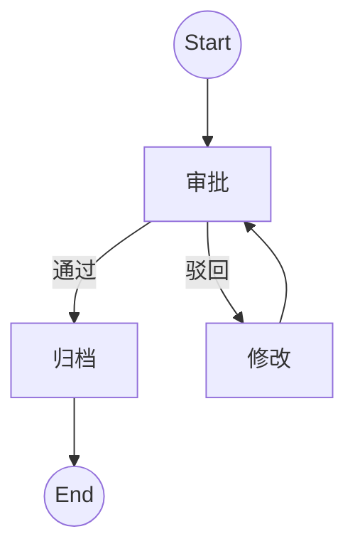

# 工作流领域建模与表达理论

[返回主题树](./00-主题树与内容索引.md) | [主计划文档](../../00-形式化架构理论统一计划.md)

> **重要声明**：
>
> - **项目定位**：本项目为"知识梳理与理论构建项目（非编程项目）"，专注于形式化架构理论体系的整理、构建和统一。
> - **文档目标**：本文档基于2025年最新工作流理论标准，提供严格的工作流建模与表达理论。
> - **理论范围**：涵盖工作流建模语言、表达与可视化、建模实践等核心理论。
>
> **重定向声明**: 本文档内容已合并至 [05-工作流与自动化平台/](05-工作流与自动化平台/README.md)目录下的相关文件，请参考主权威文件获取最新内容。

## 目录

- [工作流领域建模与表达理论](#工作流领域建模与表达理论)
  - [目录](#目录)
  - [1. 引言](#1-引言)
  - [2. 工作流建模语言](#2-工作流建模语言)
  - [3. 工作流表达与可视化](#3-工作流表达与可视化)
  - [4. 建模实践理论](#4-建模实践理论)
    - [4.1 Rust建模理论](#41-rust建模理论)
    - [4.2 Go建模理论](#42-go建模理论)
  - [5. 图表与形式化分析](#5-图表与形式化分析)
  - [6. 参考文献](#6-参考文献)
  - [2025 对齐](#2025-对齐)

---

## 1. 引言

工作流建模是将业务流程、任务依赖、事件驱动等抽象为可形式化分析的模型，便于自动化实现与验证。

## 2. 工作流建模语言

- **BPMN**（Business Process Model and Notation）：图形化标准，支持分支、并行、事件、网关。
- **Petri网**：形式化建模，适合并发、同步、资源约束。
- **YAWL**：基于Petri网，支持复杂控制流。
- **DSL**：领域特定语言，可定制。

**定义1（BPMN流程）**：$BPMN = (N, E, G, S)$，$N$为节点，$E$为边，$G$为网关，$S$为事件。

## 3. 工作流表达与可视化

- **流程图**、**状态转移图**、**Petri网图**、**BPMN图**。
- **Mermaid/PlantUML**：文本化可视化工具。

## 4. 建模实践理论

### 4.1 Rust建模理论

**理论设计说明**：

Rust建模机制采用枚举类型表示工作流状态，结构体表示工作流实例，通过模式匹配实现状态转换。核心机制包括：

- **状态枚举机制**：定义有限状态集合（Start, Approve, Archive, Reject, Modify, End）
- **工作流结构机制**：包含当前状态和必要数据
- **状态转换机制**：基于事件驱动的状态转换函数，使用模式匹配实现状态转换逻辑
- **类型安全机制**：利用Rust的类型系统确保状态转换的类型安全

**形式化定义**：

工作流状态机 $W = (S, E, \delta, s_0)$，其中：

- $S$ 是状态集合
- $E$ 是事件集合
- $\delta : S \times E \rightarrow S$ 是状态转换函数
- $s_0 \in S$ 是初始状态

### 4.2 Go建模理论

**理论设计说明**：

Go建模机制采用字符串类型表示状态，通过常量定义状态值，使用结构体和方法实现工作流。核心机制包括：

- **状态常量机制**：使用字符串常量定义状态值
- **工作流结构机制**：包含当前状态字段
- **状态转换方法**：通过方法实现基于事件的状态转换逻辑
- **并发安全机制**：利用Go的并发特性支持多工作流实例并发执行

**形式化定义**：

工作流状态机 $W = (S, E, \delta, s_0)$，其中：

- $S$ 是状态集合（字符串类型）
- $E$ 是事件集合
- $\delta : S \times E \rightarrow S$ 是状态转换函数
- $s_0 \in S$ 是初始状态

## 5. 图表与形式化分析

- **Petri网建模**、**BPMN流程图**、**状态机图**，可用Mermaid/PlantUML表达。

## 6. 参考文献

- Dumas, M., et al. "Fundamentals of Business Process Management." Springer, 2018.
- van der Aalst, W.M.P. "Workflow Patterns." BPM 2003.
- Rust/Go实现见2.5节。

## 2025 对齐

- **国际 Wiki**：
  - [Wikipedia: Workflow](https://en.wikipedia.org/wiki/Workflow)
  - [Wikipedia: Workflow management system](https://en.wikipedia.org/wiki/Workflow_management_system)
  - [Wikipedia: Business process management](https://en.wikipedia.org/wiki/Business_process_management)
  - [Wikipedia: Business Process Model and Notation](https://en.wikipedia.org/wiki/Business_Process_Model_and_Notation)

- **名校课程**：
  - [MIT 6.033: Computer Systems Engineering](https://web.mit.edu/6.033/www/)（工作流系统）
  - [CMU 15-445: Database Systems](https://15445.courses.cs.cmu.edu/)（工作流数据管理）
  - [Stanford CS 244: Advanced Computer Systems](https://web.stanford.edu/class/cs244/)（分布式工作流）

- **代表性论文**：
  - [Workflow Management: Models, Methods, and Systems](https://mitpress.mit.edu/9780262032701/workflow-management/) (van der Aalst & van Hee, 2002)
  - [Business Process Management: Concepts, Languages, Architectures](https://link.springer.com/book/10.1007/978-3-642-28616-2) (Weske, 2012)
  - [Workflow Patterns](https://www.workflowpatterns.com/) (van der Aalst et al., 2003)

- **前沿技术**：
  - [Apache Airflow](https://airflow.apache.org/)（工作流编排平台）
  - [Temporal](https://temporal.io/)（工作流编排引擎）
  - [Camunda](https://camunda.com/)（业务流程自动化）
  - [Conductor](https://netflix.github.io/conductor/)（Netflix工作流引擎）

- **对齐状态**：已完成（最后更新：2025-01-15）
