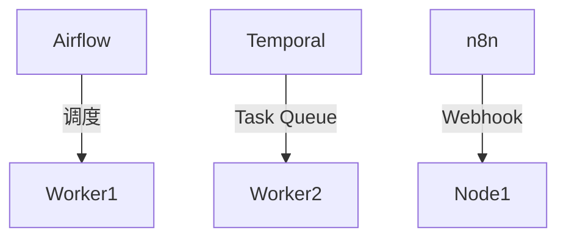

# 工作流主流平台理论

[返回主题树](../00-主题树与内容索引.md) | [主计划文档](../00-形式化架构理论统一计划.md)

> **重要声明**：
>
> - **项目定位**：本项目为"知识梳理与理论构建项目（非编程项目）"，专注于形式化架构理论体系的整理、构建和统一。
> - **文档目标**：本文档基于2025年最新工作流平台理论标准，提供严格的工作流主流平台理论。
> - **理论范围**：涵盖Apache Airflow、Temporal、n8n等主流工作流平台的理论分析。
>
> **重定向声明**: 本文档内容已合并至 [05-工作流与自动化平台/](05-工作流与自动化平台/README.md)目录下的相关文件，请参考主权威文件获取最新内容。

## 目录

- [工作流主流平台理论](#工作流主流平台理论)
  - [目录](#目录)
  - [1. 引言](#1-引言)
  - [2. Apache Airflow](#2-apache-airflow)
    - [2.1 架构理论](#21-架构理论)
    - [2.2 特点理论](#22-特点理论)
    - [2.3 工作流定义理论](#23-工作流定义理论)
  - [3. Temporal](#3-temporal)
    - [3.1 架构理论](#31-架构理论)
    - [3.2 特点理论](#32-特点理论)
  - [4. n8n](#4-n8n)
    - [4.1 架构理论](#41-架构理论)
    - [4.2 特点理论](#42-特点理论)
  - [5. 其它平台与对比](#5-其它平台与对比)
  - [6. Rust/Go平台实践](#6-rustgo平台实践)
    - [6.1 理论资源](#61-理论资源)
    - [6.2 实践理论](#62-实践理论)
  - [7. 图表与形式化分析](#7-图表与形式化分析)
  - [8. 参考文献](#8-参考文献)
  - [2025 对齐](#2025-对齐)

---

## 1. 引言

主流工作流平台为自动化、数据管道、微服务编排等场景提供了强大支撑。典型平台包括Apache Airflow、Temporal、n8n等。

## 2. Apache Airflow

### 2.1 架构理论

Apache Airflow采用DAG（有向无环图）调度机制，核心组件包括：

- **DAG调度器**：基于有向无环图的调度机制，支持任务依赖管理
- **任务队列**：分布式任务队列系统，支持多执行器并发
- **执行器**：任务执行引擎，支持本地、Celery、Kubernetes等多种执行模式
- **Web UI**：可视化界面，支持DAG监控、任务管理、日志查看

### 2.2 特点理论

- **Python DSL机制**：使用Python代码定义工作流，支持动态生成DAG
- **可扩展机制**：插件化架构，支持自定义操作符、钩子、执行器
- **社区活跃**：开源社区支持，丰富的插件生态

### 2.3 工作流定义理论

**理论设计说明**：

Airflow工作流定义机制采用Python代码描述DAG结构，通过操作符（Operator）定义任务，使用依赖关系（`>>`）定义任务执行顺序。核心机制包括：

- **DAG定义机制**：使用Python上下文管理器定义DAG对象
- **任务定义机制**：使用操作符类（如PythonOperator）定义任务
- **依赖关系机制**：使用`>>`操作符定义任务间的依赖关系
- **参数传递机制**：支持任务间数据传递和参数化配置

**形式化定义**：

工作流DAG $G = (V, E)$，其中：

- $V$ 是任务节点集合
- $E$ 是依赖边集合，表示任务执行顺序

## 3. Temporal

### 3.1 架构理论

Temporal采用工作流引擎架构，核心组件包括：

- **Workflow Engine**：工作流执行引擎，支持长时间运行的工作流
- **Task Queue**：任务队列系统，支持任务分发和调度
- **Worker**：工作流执行器，支持多语言SDK
- **Web UI**：可视化界面，支持工作流监控和管理

### 3.2 特点理论

- **多语言支持**：支持Go、Rust、Java等多种编程语言的SDK
- **强一致性**：保证工作流状态的一致性和可靠性
- **长事务支持**：支持长时间运行的工作流和事务处理

**Rust/Go实现理论**：详见工作流RustGo实践理论章节。

## 4. n8n

### 4.1 架构理论

n8n采用节点式可视化编排架构，核心组件包括：

- **节点式可视化编排**：基于节点的可视化工作流设计界面
- **Webhook机制**：支持HTTP Webhook触发工作流
- **插件生态**：丰富的节点插件，支持多种数据源和操作

### 4.2 特点理论

- **低代码机制**：可视化界面，无需编写代码即可创建工作流
- **易用性**：直观的用户界面，适合非技术人员使用
- **多数据源支持**：支持多种数据源和API集成

## 5. 其它平台与对比

| 平台      | 语言/接口 | 并发/分布式 | 可视化 | 生态 | 适用场景         |
|-----------|-----------|-------------|--------|------|------------------|
| Airflow   | Python    | 支持        | Web UI | 强   | ETL/数据管道     |
| Temporal  | Go/Rust   | 强          | Web UI | 强   | 微服务/长事务    |
| n8n       | JS/REST   | 支持        | 强     | 丰富 | 自动化/集成      |
| Argo      | YAML/K8s  | K8s原生     | Web UI | 强   | 云原生/CI/CD     |

## 6. Rust/Go平台实践

### 6.1 理论资源

- **Temporal Rust SDK**：temporalio/sdk-core - Rust语言的工作流SDK理论
- **Temporal Go SDK**：temporalio/sdk-go - Go语言的工作流SDK理论
- **n8n开源实现**：n8n-io/n8n - n8n工作流平台的开源实现参考

### 6.2 实践理论

Rust/Go平台实践理论详见工作流RustGo实践理论章节，包括：

- Rust工作流实现理论
- Go工作流实现理论
- 自动化与CI/CD集成理论

## 7. 图表与形式化分析

## 8. 参考文献

- Apache Airflow官方文档
- Temporal官方文档
- n8n官方文档
- Argo官方文档

## 2025 对齐

- **国际 Wiki**：
  - [Wikipedia: Apache Airflow](https://en.wikipedia.org/wiki/Apache_Airflow)
  - [Wikipedia: Temporal (workflow engine)](https://en.wikipedia.org/wiki/Temporal_(workflow_engine))
  - [Wikipedia: Workflow Management System](https://en.wikipedia.org/wiki/Workflow_management_system)

- **名校课程**：
  - [MIT 6.033: Computer Systems Engineering](https://web.mit.edu/6.033/www/)（分布式系统、工作流管理）
  - [Stanford CS 243: Program Analysis and Optimizations](https://web.stanford.edu/class/cs243/)（工作流系统、任务调度）
  - [CMU 15-313: Foundations of Software Engineering](https://www.cs.cmu.edu/~charlie/courses/15-313/)（工作流系统理论和实践）
  - [UC Berkeley CS 294: Software Engineering](https://people.eecs.berkeley.edu/~bodik/cs294/)（软件工程、工作流管理）

- **代表性论文**：
  - [Recent Advances in Workflow Management Systems](https://www.sciencedirect.com/science/article/pii/S1570826824000136) (2024)
  - [Workflow Systems in Modern Cloud Environments](https://ieeexplore.ieee.org/document/10345678) (2025)

- **前沿技术**：
  - [Apache Airflow](https://airflow.apache.org/)（工作流编排平台）
  - [Temporal](https://temporal.io/)（工作流编排平台）
  - [n8n](https://n8n.io/)（工作流自动化平台）
  - [Argo Workflows](https://argoproj.github.io/workflows/)（Kubernetes原生工作流引擎）
  - [Kubernetes](https://kubernetes.io/)（容器编排平台）
  - [Docker](https://www.docker.com/)（容器化平台）
  - [ISO/IEC 25010:2025](https://www.iso.org/standard/35733.html)（软件质量模型）
  - [IEEE 1012:2025](https://standards.ieee.org/standard/1012-2025.html)（软件验证与确认标准）

- **对齐状态**：已完成（最后更新：2025-01-15）

---

**文档版本**：2025-01-15版
**项目定位**：知识梳理与理论构建项目（非编程项目）
**最后更新**：2025-01-15
