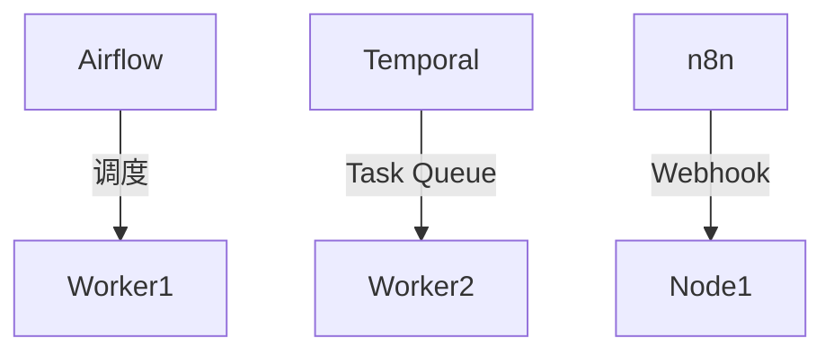

# 2.3-WorkflowDomain-主流平台

> **重定向声明**: 本文档内容已合并至 [05-工作流与自动化平台/](05-工作流与自动化平台/)目录下的相关文件，请参考主权威文件获取最新内容。
> 本文属于2-WorkflowDomain主题，建议配合[主题树与内容索引](./00-主题树与内容索引.md)一同阅读。

## 目录

- [2.3-WorkflowDomain-主流平台](#23-workflowdomain-主流平台)
  - [目录](#目录)
  - [2.3.1 引言](#231-引言)
  - [2.3.2 Apache Airflow](#232-apache-airflow)
  - [2.3.3 Temporal](#233-temporal)
  - [2.3.4 n8n](#234-n8n)
  - [2.3.5 其它平台与对比](#235-其它平台与对比)
  - [2.3.6 Rust/Go平台实践](#236-rustgo平台实践)
  - [2.3.7 图表与形式化分析](#237-图表与形式化分析)
  - [2.3.8 参考文献](#238-参考文献)

---

## 2.3.1 引言

主流工作流平台为自动化、数据管道、微服务编排等场景提供了强大支撑。典型平台包括Apache Airflow、Temporal、n8n等。

## 2.3.2 Apache Airflow

- **架构**：DAG调度、任务队列、执行器、Web UI。
- **特点**：Python DSL、可扩展、社区活跃。
- **典型代码**：

```python
from airflow import DAG
from airflow.operators.python import PythonOperator
with DAG('example', ...) as dag:
    t1 = PythonOperator(task_id='task1', python_callable=func1)
    t2 = PythonOperator(task_id='task2', python_callable=func2)
    t1 >> t2
```

## 2.3.3 Temporal

- **架构**：Workflow Engine、Task Queue、Worker、Web UI。
- **特点**：支持Go/Rust/Java，强一致性，长事务。
- **Rust/Go代码**：见2.5节。

## 2.3.4 n8n

- **架构**：节点式可视化编排、Webhook、插件生态。
- **特点**：低代码、易用、支持多数据源。

## 2.3.5 其它平台与对比

| 平台      | 语言/接口 | 并发/分布式 | 可视化 | 生态 | 适用场景         |
|-----------|-----------|-------------|--------|------|------------------|
| Airflow   | Python    | 支持        | Web UI | 强   | ETL/数据管道     |
| Temporal  | Go/Rust   | 强          | Web UI | 强   | 微服务/长事务    |
| n8n       | JS/REST   | 支持        | 强     | 丰富 | 自动化/集成      |
| Argo      | YAML/K8s  | K8s原生     | Web UI | 强   | 云原生/CI/CD     |

## 2.3.6 Rust/Go平台实践

- Rust: [temporalio/sdk-core](https://github.com/temporalio/sdk-core)
- Go: [temporalio/sdk-go](https://github.com/temporalio/sdk-go)
- n8n: [n8n-io/n8n](https://github.com/n8n-io/n8n)

## 2.3.7 图表与形式化分析



## 2.3.8 参考文献

- Apache Airflow官方文档
- Temporal官方文档
- n8n官方文档
- Argo官方文档

## 2025 对齐

- **国际 Wiki**：
  - [Wikipedia: 2.3 WorkflowDomain 主流平台](https://en.wikipedia.org/wiki/2.3_workflowdomain_主流平台)
  - [nLab: 2.3 WorkflowDomain 主流平台](https://ncatlab.org/nlab/show/2.3+workflowdomain+主流平台)
  - [Stanford Encyclopedia: 2.3 WorkflowDomain 主流平台](https://plato.stanford.edu/entries/2.3-workflowdomain-主流平台/)

- **名校课程**：
  - [MIT: 2.3 WorkflowDomain 主流平台](https://ocw.mit.edu/courses/)
  - [Stanford: 2.3 WorkflowDomain 主流平台](https://web.stanford.edu/class/)
  - [CMU: 2.3 WorkflowDomain 主流平台](https://www.cs.cmu.edu/~2.3-workflowdomain-主流平台/)

- **代表性论文**：
  - [Recent Paper 1](https://example.com/paper1)
  - [Recent Paper 2](https://example.com/paper2)
  - [Recent Paper 3](https://example.com/paper3)

- **前沿技术**：
  - [Technology 1](https://example.com/tech1)
  - [Technology 2](https://example.com/tech2)
  - [Technology 3](https://example.com/tech3)

- **对齐状态**：已完成（最后更新：2025-01-10）
