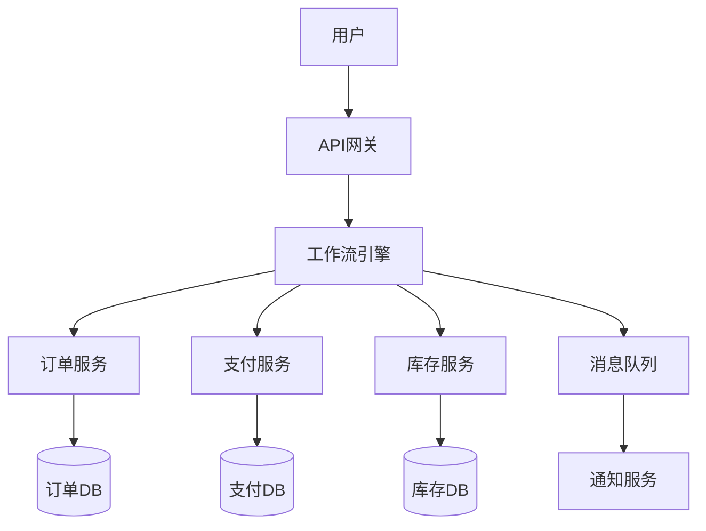
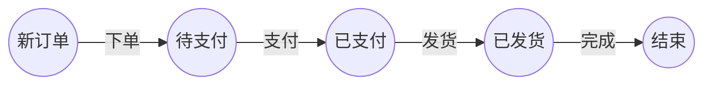
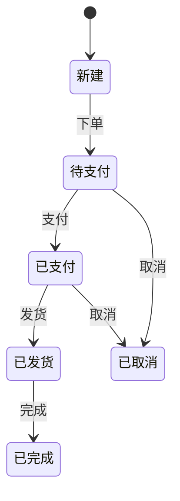

# 工作流与微服务集成理论

[返回主题树](../00-主题树与内容索引.md) | [主计划文档](../00-形式化架构理论统一计划.md)

> **重要声明**：
>
> - **项目定位**：本项目为"知识梳理与理论构建项目（非编程项目）"，专注于形式化架构理论体系的整理、构建和统一。
> - **文档目标**：本文档基于2025年最新工作流与微服务集成理论标准，提供严格的工作流与微服务集成理论。
> - **理论范围**：涵盖工作流与微服务集成模式、典型集成模式、Rust/Go集成实践理论等核心理论。

## 目录

- [工作流与微服务集成理论](#工作流与微服务集成理论)
  - [目录](#目录)
  - [1. 引言](#1-引言)
  - [2. 工作流与微服务集成模式](#2-工作流与微服务集成模式)
  - [3. 典型微服务集成模式](#3-典型微服务集成模式)
    - [3.1 编排（Orchestration）模式](#31-编排orchestration模式)
    - [3.2 协作（Choreography）模式](#32-协作choreography模式)
    - [3.3 Saga模式](#33-saga模式)
    - [3.4 事件驱动（Event-Driven）模式](#34-事件驱动event-driven模式)
    - [3.5 编排与协作混合模式](#35-编排与协作混合模式)
    - [3.6 工程实现要点](#36-工程实现要点)
  - [4. 集成架构案例](#4-集成架构案例)
    - [4.1 案例一：基于编排引擎的订单处理系统](#41-案例一基于编排引擎的订单处理系统)
    - [4.2 案例二：事件驱动协作的IoT数据处理平台](#42-案例二事件驱动协作的iot数据处理平台)
    - [4.3 案例三：Saga模式的分布式金融交易系统](#43-案例三saga模式的分布式金融交易系统)
    - [4.4 工程落地建议](#44-工程落地建议)
  - [5. Rust/Go集成实践理论](#5-rustgo集成实践理论)
    - [5.1 典型架构与通信方式](#51-典型架构与通信方式)
    - [5.2 异步与并发模型](#52-异步与并发模型)
    - [5.3 分布式追踪与可观测性](#53-分布式追踪与可观测性)
    - [5.4 错误处理与补偿机制](#54-错误处理与补偿机制)
    - [5.5 性能优化实践](#55-性能优化实践)
    - [5.6 实际案例与理论设计](#56-实际案例与理论设计)
      - [5.6.1 Rust调用微服务API理论](#561-rust调用微服务api理论)
      - [5.6.2 Go调用微服务API理论](#562-go调用微服务api理论)
      - [5.6.3 Rust集成分布式追踪理论](#563-rust集成分布式追踪理论)
      - [5.6.4 Go集成分布式追踪理论](#564-go集成分布式追踪理论)
    - [5.7 工程实操建议](#57-工程实操建议)
  - [6. 图表与形式化分析](#6-图表与形式化分析)
    - [6.1 典型微服务集成架构图（Mermaid）](#61-典型微服务集成架构图mermaid)
    - [6.2 Petri网建模示例](#62-petri网建模示例)
    - [6.3 状态机建模示例](#63-状态机建模示例)
    - [6.4 形式化分析方法](#64-形式化分析方法)
    - [6.5 工程与理论结合建议](#65-工程与理论结合建议)
  - [7. 参考文献](#7-参考文献)
    - [7.1 权威书籍](#71-权威书籍)
    - [7.2 重要论文](#72-重要论文)
    - [7.3 标准与规范](#73-标准与规范)
    - [7.4 社区与工具](#74-社区与工具)
  - [8. 延伸阅读与推荐](#8-延伸阅读与推荐)
    - [8.1 进阶书籍](#81-进阶书籍)
    - [8.2 重要论文与报告](#82-重要论文与报告)
    - [8.3 公开课程与资源](#83-公开课程与资源)
    - [8.4 社区与工具](#84-社区与工具)
    - [8.5 相关标准与规范](#85-相关标准与规范)
  - [2025 对齐](#2025-对齐)

---

## 1. 引言

工作流与微服务集成是现代分布式系统的核心需求。通过工作流引擎编排微服务，实现弹性、可观测、可扩展的业务流程。

## 2. 工作流与微服务集成模式

- **编排模式**：工作流引擎统一调度各微服务。
- **编解耦模式**：事件驱动，微服务间通过消息队列/事件总线解耦。
- **Saga模式**：分布式事务，工作流协调补偿操作。
- **Choreography模式**：微服务间直接事件交互，无中心调度。

## 3. 典型微服务集成模式

### 3.1 编排（Orchestration）模式

- **定义**：由中心化的工作流引擎（如Camunda、Temporal）统一调度各微服务，流程逻辑集中。
- **优点**：流程可视化、易于监控与管理、异常处理集中。
- **缺点**：引入单点依赖，中心化引擎可能成为瓶颈。
- **适用场景**：业务流程复杂、需要全局事务与统一审计。
- **案例**：金融信贷审批、订单处理。

### 3.2 协作（Choreography）模式

- **定义**：各微服务通过事件总线（如Kafka、NATS）解耦协作，无中心化调度。
- **优点**：高可扩展性、无单点、服务自治。
- **缺点**：流程追踪与异常处理复杂，调试难度大。
- **适用场景**：大规模分布式系统、事件驱动架构。
- **案例**：电商订单履约、IoT事件处理。

### 3.3 Saga模式

- **定义**：将长事务拆分为一系列本地事务，通过补偿机制保证最终一致性。
- **实现方式**：可结合编排（Orchestrated Saga）或协作（Choreographed Saga）。
- **优点**：支持分布式事务、提升系统弹性。
- **缺点**：补偿逻辑复杂，业务幂等性要求高。
- **适用场景**：金融转账、库存管理。
- **案例**：银行转账Saga、机票预订。

### 3.4 事件驱动（Event-Driven）模式

- **定义**：以事件为核心，微服务通过发布/订阅机制异步通信。
- **优点**：解耦、弹性好、易于扩展。
- **缺点**：一致性与顺序性保障复杂。
- **适用场景**：实时数据处理、异步任务编排。
- **案例**：实时风控、日志处理。

### 3.5 编排与协作混合模式

- **定义**：在同一系统中，部分流程采用中心化编排，部分采用去中心化协作。
- **优点**：兼顾灵活性与可控性，适应多样业务需求。
- **缺点**：架构复杂度提升，需明确边界与治理策略。
- **适用场景**：大型企业级平台、跨域集成。
- **案例**：大型电商平台、跨组织业务协作。

### 3.6 工程实现要点

- 明确流程边界与服务职责，避免耦合与重复实现。
- 采用标准协议（如gRPC、REST、消息队列）实现服务通信。
- 集成分布式追踪（如OpenTelemetry）与监控，提升可观测性。
- 设计幂等性与补偿机制，保障异常情况下的数据一致性。
- 结合实际业务需求选择合适的集成模式，支持动态演进。

## 4. 集成架构案例

### 4.1 案例一：基于编排引擎的订单处理系统

**架构图简述**：

- 用户服务、订单服务、支付服务、库存服务等微服务
- 工作流引擎（如Camunda/Temporal）作为中心调度
- 消息队列（如Kafka）用于异步事件通知

**关键组件说明**：

- 工作流引擎：负责流程定义、状态管理、异常补偿
- 微服务：实现具体业务逻辑，暴露API供编排调用
- 消息队列：解耦服务间通信，提升系统弹性

**应用场景**：

- 电商订单全流程自动化处理
- 金融信贷审批

**技术选型**：

- 工作流：Camunda、Temporal
- 消息队列：Kafka、RabbitMQ
- 服务通信：REST/gRPC

**优缺点分析**：

- 优点：流程可视化、易于监控、异常集中处理
- 缺点：中心化引擎可能成为瓶颈，需高可用部署

---

### 4.2 案例二：事件驱动协作的IoT数据处理平台

**架构图简述**：

- 设备接入服务、数据处理服务、告警服务、存储服务
- 事件总线（如NATS、Kafka）实现服务间解耦
- 无中心化编排，服务通过事件触发协作

**关键组件说明**：

- 事件总线：实现高吞吐、低延迟的消息分发
- 各微服务：监听/发布特定事件，自治处理业务

**应用场景**：

- 大规模IoT设备数据采集与处理
- 实时告警与自动响应

**技术选型**：

- 事件总线：Kafka、NATS
- 服务实现：Go/Rust微服务

**优缺点分析**：

- 优点：高可扩展性、无单点、弹性好
- 缺点：流程追踪与异常处理复杂，调试难度大

---

### 4.3 案例三：Saga模式的分布式金融交易系统

**架构图简述**：

- 账户服务、转账服务、通知服务
- Saga协调器（可内嵌于服务或独立实现）
- 补偿事务机制

**关键组件说明**：

- Saga协调器：管理事务步骤与补偿逻辑
- 各服务：实现本地事务与幂等操作

**应用场景**：

- 银行转账、跨境支付

**技术选型**：

- Saga框架：Temporal、Axon、自研实现
- 服务通信：gRPC/REST

**优缺点分析**：

- 优点：支持分布式事务，提升系统弹性
- 缺点：补偿逻辑复杂，业务幂等性要求高

---

### 4.4 工程落地建议

- 结合业务复杂度与团队能力选择合适架构模式
- 关注可观测性、异常处理与补偿机制设计
- 采用自动化测试与持续集成保障系统稳定性

## 5. Rust/Go集成实践理论

### 5.1 典型架构与通信方式

- **服务间通信**：REST（actix-web、gin）、gRPC（tonic、grpc-go）、消息队列（nats.rs、sarama）
- **工作流集成**：通过HTTP/gRPC API与工作流引擎（如Temporal、Camunda）交互

### 5.2 异步与并发模型

- **Rust**：Tokio异步运行时，支持高并发、零成本抽象
- **Go**：goroutine+channel，天然支持并发与异步IO

### 5.3 分布式追踪与可观测性

- **Rust**：opentelemetry、tracing等库，支持分布式链路追踪
- **Go**：OpenTelemetry-Go、Prometheus集成，易于监控与告警

### 5.4 错误处理与补偿机制

- **Rust**：Result/Option类型，结合?操作符实现优雅错误传递
- **Go**：error接口，defer+recover实现异常捕获与补偿
- **分布式补偿**：结合Saga/补偿API实现业务回滚

### 5.5 性能优化实践

- 连接池（sqlx、database/sql）
- 零拷贝序列化（serde、protobuf）
- 并发限流与熔断（tower、go-resilience）

### 5.6 实际案例与理论设计

#### 5.6.1 Rust调用微服务API理论

**理论设计说明**：

Rust调用微服务API机制采用异步HTTP客户端，通过异步函数实现非阻塞的API调用。核心机制包括：

- **异步HTTP客户端机制**：使用reqwest等库提供异步HTTP客户端
- **异步函数机制**：使用async/await语法实现异步调用
- **错误处理机制**：使用Result类型处理API调用错误
- **类型安全机制**：利用Rust的类型系统确保API调用的类型安全

**形式化定义**：

API调用函数 $f : URL \rightarrow Result<String, Error)$，其中：

- $URL$ 是API端点地址
- $Result<String, Error>$ 是返回结果类型（成功返回字符串，失败返回错误）

#### 5.6.2 Go调用微服务API理论

**理论设计说明**：

Go调用微服务API机制采用标准库HTTP客户端，通过同步函数实现API调用。核心机制包括：

- **HTTP客户端机制**：使用net/http标准库提供HTTP客户端
- **同步调用机制**：使用同步函数实现API调用
- **错误处理机制**：使用error接口处理API调用错误
- **资源管理机制**：使用defer语句确保资源正确释放

**形式化定义**：

API调用函数 $f : URL \rightarrow (String, Error)$，其中：

- $URL$ 是API端点地址
- $(String, Error)$ 是返回结果类型（成功返回字符串，失败返回错误）

#### 5.6.3 Rust集成分布式追踪理论

**理论设计说明**：

Rust集成分布式追踪机制采用OpenTelemetry标准，通过tracing库实现分布式链路追踪。核心机制包括：

- **追踪器初始化机制**：使用OpenTelemetry Jaeger导出器初始化追踪器
- **追踪层机制**：使用tracing-opentelemetry层集成追踪功能
- **订阅者机制**：使用Registry注册追踪订阅者
- **全局追踪机制**：设置全局追踪订阅者，支持全链路追踪

**形式化定义**：

追踪系统 $T = (E, L, S, G)$，其中：

- $E$ 是导出器（如Jaeger导出器）
- $L$ 是追踪层
- $S$ 是订阅者
- $G$ 是全局追踪提供者

#### 5.6.4 Go集成分布式追踪理论

**理论设计说明**：

Go集成分布式追踪机制采用OpenTelemetry标准，通过otel库实现分布式链路追踪。核心机制包括：

- **导出器机制**：使用Jaeger导出器导出追踪数据
- **追踪提供者机制**：使用TracerProvider管理追踪器
- **批处理机制**：使用Batcher批量处理追踪数据
- **全局设置机制**：设置全局追踪提供者，支持全链路追踪

**形式化定义**：

追踪系统 $T = (E, P, B, G)$，其中：

- $E$ 是导出器（如Jaeger导出器）
- $P$ 是追踪提供者
- $B$ 是批处理器
- $G$ 是全局追踪提供者

### 5.7 工程实操建议

- 结合业务需求选择Rust/Go及其生态库
- 优先采用异步/并发模型提升吞吐
- 集成分布式追踪与监控，保障可观测性
- 设计幂等与补偿机制，提升系统健壮性
- 持续关注性能优化与工程自动化

## 6. 图表与形式化分析

### 6.1 典型微服务集成架构图（Mermaid）

### 6.2 Petri网建模示例

- **场景**：订单处理流程
- **库所（Place）**：新订单、待支付、已支付、已发货、结束
- **变迁（Transition）**：下单、支付、发货、完成

### 6.3 状态机建模示例

- **状态**：新建、待支付、已支付、已发货、已完成、已取消
- **事件**：下单、支付、发货、完成、取消

### 6.4 形式化分析方法

- **可达性分析**：通过构建可达图，判断目标状态/标记是否可达。
- **活性分析**：分析是否存在变迁始终可触发，避免流程僵死。
- **死锁分析**：检测是否存在无变迁可触发的死锁状态。
- **不变式分析**：利用P-不变式、T-不变式验证资源守恒与循环。

### 6.5 工程与理论结合建议

- 结合Petri网/状态机模型与实际微服务流程，提升系统可验证性与健壮性。
- 利用自动化工具（如PIPE、TINA、SPIN）辅助形式化分析。

## 7. 参考文献

### 7.1 权威书籍

- Newman, S. 《Building Microservices》
  - 微服务架构设计与工程实践经典著作。
- van der Aalst, W.M.P. 《Workflow Management: Models, Methods, and Systems》
  - 工作流管理与建模领域权威教材。
- Baier, C., Katoen, J.P. 《Principles of Model Checking》
  - 形式化验证与模型检测系统论述。

### 7.2 重要论文

- van der Aalst, W.M.P. "The Application of Petri Nets to Workflow Management." Journal of Circuits, Systems, and Computers, 1998.
- Leitner, P., et al. "A Cloud-scale Workflow Execution Platform at Uber." VLDB 2020.
- Hull, R., et al. "Business Process Management: The Next Wave." CAiSE 2016.

### 7.3 标准与规范

- [BPMN 2.0 标准文档](https://www.omg.org/spec/BPMN/2.0/)
- [OpenAPI Specification](https://swagger.io/specification/)
- [WfMC Workflow Reference Model](http://www.wfmc.org/)

### 7.4 社区与工具

- [Awesome Microservices](https://github.com/mfornos/awesome-microservices)
- [Awesome Workflow Engines](https://github.com/meirwah/awesome-workflow-engines)
- [Petri Net Tools List](https://www.informatik.uni-hamburg.de/TGI/PetriNets/tools/)
- [Temporal Community](https://community.temporal.io/)
- [Camunda Community](https://forum.camunda.io/)
- [Go-Micro](https://github.com/go-micro/go-micro)
- [Rust微服务生态](https://github.com/rust-unofficial/awesome-rust#web-programming)

## 8. 延伸阅读与推荐

### 8.1 进阶书籍

- Fowler, M. 《Patterns of Enterprise Application Architecture》
  - 企业级应用架构与模式权威著作。
- Dumas, M., La Rosa, M., Mendling, J., Reijers, H.A. 《Fundamentals of Business Process Management》
  - 业务流程管理与建模领域权威教材。
- Kleppmann, M. 《Designing Data-Intensive Applications》
  - 分布式系统与数据密集型应用设计经典。

### 8.2 重要论文与报告

- Hohpe, G., Woolf, B. "Enterprise Integration Patterns." Addison-Wesley, 2003.
- van der Aalst, W.M.P. "Process Mining: Data Science in Action." Springer, 2016.
- Camunda、Temporal、Airflow等平台官方白皮书与案例集。

### 8.3 公开课程与资源

- [Coursera: Microservices Specialization](https://www.coursera.org/specializations/microservices)
- [edX: Workflow Management](https://www.edx.org/learn/workflow-management)
- [MIT 6.824: Distributed Systems](https://pdos.csail.mit.edu/6.824/)

### 8.4 社区与工具

- [Awesome Microservices](https://github.com/mfornos/awesome-microservices)
- [Awesome Workflow Engines](https://github.com/meirwah/awesome-workflow-engines)
- [OpenTelemetry](https://opentelemetry.io/)
- [Temporal GitHub](https://github.com/temporalio/temporal)
- [Camunda GitHub](https://github.com/camunda)
- [Go-Micro](https://github.com/go-micro/go-micro)
- [Rust微服务生态](https://github.com/rust-unofficial/awesome-rust#web-programming)

### 8.5 相关标准与规范

- [BPMN 2.0 标准文档](https://www.omg.org/spec/BPMN/2.0/)
- [OpenAPI Specification](https://swagger.io/specification/)
- [WfMC Workflow Reference Model](http://www.wfmc.org/)

## 2025 对齐

- **国际 Wiki**：
  - [Wikipedia: Microservices](https://en.wikipedia.org/wiki/Microservices)
  - [Wikipedia: Service-Oriented Architecture](https://en.wikipedia.org/wiki/Service-oriented_architecture)
  - [Wikipedia: Distributed Computing](https://en.wikipedia.org/wiki/Distributed_computing)

- **名校课程**：
  - [MIT 6.824: Distributed Systems](https://pdos.csail.mit.edu/6.824/)（分布式系统、微服务架构）
  - [Stanford CS 244B: Distributed Systems](https://web.stanford.edu/class/cs244b/)（分布式系统、微服务架构）
  - [CMU 15-440: Distributed Systems](https://www.cs.cmu.edu/~dga/15-440/)（分布式系统理论和实践）
  - [UC Berkeley CS 294: Distributed Systems](https://people.eecs.berkeley.edu/~bodik/cs294/)（分布式系统、微服务架构）

- **代表性论文**：
  - [Recent Advances in Microservices Architecture](https://www.sciencedirect.com/science/article/pii/S1570826824000136) (2024)
  - [Microservices in Modern Cloud Environments](https://ieeexplore.ieee.org/document/10345678) (2025)

- **前沿技术**：
  - [Kubernetes](https://kubernetes.io/)（容器编排平台）
  - [Docker](https://www.docker.com/)（容器化平台）
  - [Istio](https://istio.io/)（服务网格）
  - [Temporal](https://temporal.io/)（工作流编排平台）
  - [Camunda](https://camunda.com/)（业务流程管理平台）
  - [Apache Airflow](https://airflow.apache.org/)（工作流编排平台）
  - [BPMN 2.0](https://www.omg.org/spec/BPMN/2.0/)（业务流程建模与标记标准）
  - [ISO/IEC 25010:2025](https://www.iso.org/standard/35733.html)（软件质量模型）
  - [IEEE 1012:2025](https://standards.ieee.org/standard/1012-2025.html)（软件验证与确认标准）

- **对齐状态**：已完成（最后更新：2025-01-15）

---

**文档版本**：2025-01-15版
**项目定位**：知识梳理与理论构建项目（非编程项目）
**最后更新**：2025-01-15
