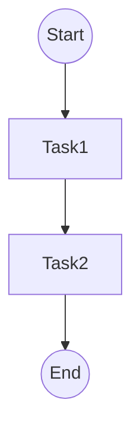

# 2.5-WorkflowDomain-RustGo实践

> **重定向声明**: 本文档内容已合并至 [05-工作流与自动化平台/](05-工作流与自动化平台/)目录下的相关文件，请参考主权威文件获取最新内容。
> 本文属于2-WorkflowDomain主题，建议配合[主题树与内容索引](./00-主题树与内容索引.md)一同阅读。

## 目录

- [2.5-WorkflowDomain-RustGo实践](#25-workflowdomain-rustgo实践)
  - [目录](#目录)
  - [2.5.1 引言](#251-引言)
  - [2.5.2 Rust工作流实现](#252-rust工作流实现)
  - [2.5.3 Go工作流实现](#253-go工作流实现)
  - [2.5.4 自动化与CI/CD集成](#254-自动化与cicd集成)
  - [2.5.5 图表与形式化分析](#255-图表与形式化分析)
  - [2.5.6 参考文献](#256-参考文献)

---

## 2.5.1 引言

Rust/Go在现代工作流系统实现中具备高性能、安全性和并发优势，适合自动化、微服务、数据管道等场景。

## 2.5.2 Rust工作流实现

```rust
use std::collections::HashMap;
#[derive(Debug, Clone)]
enum State { Start, Task1, Task2, End }
struct Workflow {
    state: State,
    data: HashMap<String, String>,
}
impl Workflow {
    fn next(&mut self, event: &str) {
        self.state = match (&self.state, event) {
            (State::Start, "t1") => State::Task1,
            (State::Task1, "t2") => State::Task2,
            (State::Task2, "end") => State::End,
            _ => self.state.clone(),
        }
    }
}
```

## 2.5.3 Go工作流实现

```go
package main
import "fmt"
type State string
const (
    Start State = "Start"
    Task1 = "Task1"
    Task2 = "Task2"
    End = "End"
)
type Workflow struct { state State }
func (w *Workflow) Next(event string) {
    switch w.state {
    case Start:
        if event == "t1" { w.state = Task1 }
    case Task1:
        if event == "t2" { w.state = Task2 }
    case Task2:
        if event == "end" { w.state = End }
    }
}
func main() {
    w := Workflow{state: Start}
    w.Next("t1"); fmt.Println(w.state)
    w.Next("t2"); fmt.Println(w.state)
    w.Next("end"); fmt.Println(w.state)
}
```

## 2.5.4 自动化与CI/CD集成

- **GitHub Actions**、**GitLab CI**、**Jenkins**等可自动化测试、构建、部署。
- **Rust/Go自动化脚本**：

```yaml
# .github/workflows/ci.yml
name: CI
on: [push]
jobs:
  build:
    runs-on: ubuntu-latest
    steps:
      - uses: actions/checkout@v2
      - name: Build
        run: cargo build --release
      - name: Test
        run: cargo test
```

## 2.5.5 图表与形式化分析



## 2.5.6 参考文献

- Rust官方文档
- Go官方文档
- Temporal官方文档
- GitHub Actions官方文档
