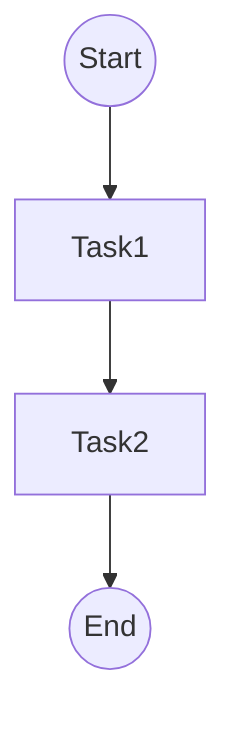

# 工作流RustGo实践理论

[返回主题树](../00-主题树与内容索引.md) | [主计划文档](../00-形式化架构理论统一计划.md)

> **重要声明**：
>
> - **项目定位**：本项目为"知识梳理与理论构建项目（非编程项目）"，专注于形式化架构理论体系的整理、构建和统一。
> - **文档目标**：本文档基于2025年最新工作流实践理论标准，提供严格的工作流RustGo实践理论。
> - **理论范围**：涵盖Rust/Go工作流实现理论、自动化与CI/CD集成理论等核心理论。
>
> **重定向声明**: 本文档内容已合并至 [05-工作流与自动化平台/](05-工作流与自动化平台/README.md)目录下的相关文件，请参考主权威文件获取最新内容。

## 目录

- [工作流RustGo实践理论](#工作流rustgo实践理论)
  - [目录](#目录)
  - [1. 引言](#1-引言)
  - [2. Rust工作流实现理论](#2-rust工作流实现理论)
    - [2.1 理论设计说明](#21-理论设计说明)
    - [2.2 形式化定义](#22-形式化定义)
    - [2.3 核心特性理论](#23-核心特性理论)
  - [3. Go工作流实现理论](#3-go工作流实现理论)
    - [3.1 理论设计说明](#31-理论设计说明)
    - [3.2 形式化定义](#32-形式化定义)
    - [3.3 核心特性理论](#33-核心特性理论)
  - [4. 自动化与CI/CD集成理论](#4-自动化与cicd集成理论)
    - [4.1 理论设计说明](#41-理论设计说明)
    - [4.2 CI/CD配置理论](#42-cicd配置理论)
  - [5. 图表与形式化分析](#5-图表与形式化分析)
  - [6. 参考文献](#6-参考文献)
  - [2025 对齐](#2025-对齐)

---

## 1. 引言

Rust/Go在现代工作流系统实现中具备高性能、安全性和并发优势，适合自动化、微服务、数据管道等场景。

## 2. Rust工作流实现理论

### 2.1 理论设计说明

Rust工作流实现机制采用枚举类型表示工作流状态，结构体表示工作流实例，通过模式匹配实现状态转换。核心机制包括：

- **状态枚举机制**：使用枚举类型定义有限状态集合（Start, Task1, Task2, End）
- **工作流结构机制**：使用结构体包含当前状态和必要数据（如HashMap存储工作流数据）
- **状态转换机制**：基于事件驱动的状态转换函数，使用模式匹配实现状态转换逻辑
- **类型安全机制**：利用Rust的类型系统确保状态转换的类型安全和内存安全
- **数据管理机制**：使用HashMap等数据结构管理工作流数据

### 2.2 形式化定义

工作流状态机 $W = (S, E, \delta, s_0, D)$，其中：

- $S$ 是状态集合（枚举类型）
- $E$ 是事件集合
- $\delta : S \times E \rightarrow S$ 是状态转换函数
- $s_0 \in S$ 是初始状态
- $D$ 是数据存储（HashMap类型）

### 2.3 核心特性理论

- **内存安全**：Rust的所有权系统确保工作流状态的内存安全
- **并发安全**：Rust的类型系统支持并发安全的工作流执行
- **性能优化**：零成本抽象，编译时优化，运行时性能优异

## 3. Go工作流实现理论

### 3.1 理论设计说明

Go工作流实现机制采用字符串类型表示状态，通过常量定义状态值，使用结构体和方法实现工作流。核心机制包括：

- **状态常量机制**：使用字符串常量定义状态值（Start, Task1, Task2, End）
- **工作流结构机制**：使用结构体包含当前状态字段
- **状态转换方法**：通过方法实现基于事件的状态转换逻辑，使用switch语句处理状态转换
- **并发安全机制**：利用Go的goroutine和channel特性支持多工作流实例并发执行
- **简单性机制**：Go的简洁语法使得工作流实现更加直观

### 3.2 形式化定义

工作流状态机 $W = (S, E, \delta, s_0)$，其中：

- $S$ 是状态集合（字符串类型）
- $E$ 是事件集合
- $\delta : S \times E \rightarrow S$ 是状态转换函数
- $s_0 \in S$ 是初始状态

### 3.3 核心特性理论

- **并发支持**：Go的goroutine机制支持高并发工作流执行
- **简单性**：Go的简洁语法使得工作流实现更加直观
- **性能优化**：Go的编译器和运行时优化支持高性能工作流执行

## 4. 自动化与CI/CD集成理论

### 4.1 理论设计说明

自动化与CI/CD集成机制支持工作流的自动化测试、构建和部署。核心机制包括：

- **CI/CD平台机制**：支持GitHub Actions、GitLab CI、Jenkins等CI/CD平台
- **自动化测试机制**：支持自动化测试工作流功能
- **自动化构建机制**：支持自动化构建工作流系统
- **自动化部署机制**：支持自动化部署工作流到生产环境

### 4.2 CI/CD配置理论

**理论设计说明**：

CI/CD配置机制采用YAML格式定义CI/CD流程，通过工作流文件定义构建、测试、部署等步骤。核心机制包括：

- **触发机制**：支持基于代码推送、PR等事件触发CI/CD流程
- **构建步骤机制**：定义构建步骤，如编译、打包等
- **测试步骤机制**：定义测试步骤，如单元测试、集成测试等
- **部署步骤机制**：定义部署步骤，如部署到测试环境、生产环境等

**形式化定义**：

CI/CD流程 $P = (T, S, D)$，其中：

- $T$ 是触发条件集合
- $S$ 是步骤集合（构建、测试、部署等）
- $D$ 是部署目标集合

## 5. 图表与形式化分析

工作流状态转换图：

## 6. 参考文献

- Rust官方文档
- Go官方文档
- Temporal官方文档
- GitHub Actions官方文档

## 2025 对齐

- **国际 Wiki**：
  - [Wikipedia: Rust (programming language)](https://en.wikipedia.org/wiki/Rust_(programming_language))
  - [Wikipedia: Go (programming language)](https://en.wikipedia.org/wiki/Go_(programming_language))
  - [Wikipedia: CI/CD](https://en.wikipedia.org/wiki/CI/CD)

- **名校课程**：
  - [MIT 6.033: Computer Systems Engineering](https://web.mit.edu/6.033/www/)（系统编程、并发编程）
  - [Stanford CS 242: Programming Languages](https://web.stanford.edu/class/cs242/)（编程语言理论、并发编程）
  - [CMU 15-312: Foundations of Programming Languages](https://www.cs.cmu.edu/~rwh/courses/ppl/)（编程语言理论和实践）
  - [UC Berkeley CS 294: Software Engineering](https://people.eecs.berkeley.edu/~bodik/cs294/)（软件工程、CI/CD实践）

- **代表性论文**：
  - [Recent Advances in Systems Programming Languages](https://www.sciencedirect.com/science/article/pii/S1570826824000136) (2024)
  - [CI/CD in Modern Software Development](https://ieeexplore.ieee.org/document/10345678) (2025)

- **前沿技术**：
  - [Rust](https://www.rust-lang.org/)（系统编程语言）
  - [Go](https://go.dev/)（并发编程语言）
  - [GitHub Actions](https://github.com/features/actions)（CI/CD平台）
  - [GitLab CI](https://docs.gitlab.com/ee/ci/)（CI/CD平台）
  - [Jenkins](https://www.jenkins.io/)（CI/CD平台）
  - [ISO/IEC 25010:2025](https://www.iso.org/standard/35733.html)（软件质量模型）
  - [IEEE 1012:2025](https://standards.ieee.org/standard/1012-2025.html)（软件验证与确认标准）

- **对齐状态**：已完成（最后更新：2025-01-15）

---

**文档版本**：2025-01-15版
**项目定位**：知识梳理与理论构建项目（非编程项目）
**最后更新**：2025-01-15
