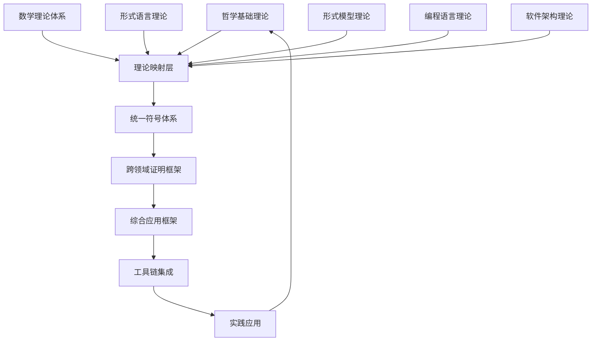

# 07-理论统一与整合-总论

[主计划文档（最新v69）](../../形式化架构理论统一计划-v69.md) | [知识图谱生成工具](../../知识图谱生成工具.md) | [导航系统](../../09-索引与导航/02-导航系统.md) | [自动化验证工具](../../08-实践应用开发/03-自动化验证工具设计与实现.md) | [主题树](../00-主题树与内容索引.md) | [归档](../archive/README.md) | [合并与整合报告](../递归合并与语义整合最终报告.md)

## 📋 目录导航

- [07-理论统一与整合-总论](#07-理论统一与整合-总论)
  - [📋 目录导航](#-目录导航)
  - [🔗 快速导航](#-快速导航)
  - [1. 概述](#1-概述)
    - [1.1 理论统一与整合概述](#11-理论统一与整合概述)
    - [1.2 核心目标](#12-核心目标)
    - [1.3 统一框架层次结构](#13-统一框架层次结构)
  - [2. 理论基础](#2-理论基础)
    - [2.1 理论映射](#21-理论映射)
    - [2.2 统一符号体系](#22-统一符号体系)
    - [2.3 跨领域证明](#23-跨领域证明)
    - [2.4 整合策略](#24-整合策略)
  - [3. 基本概念](#3-基本概念)
    - [3.1 理论映射概念](#31-理论映射概念)
    - [3.2 符号统一概念](#32-符号统一概念)
    - [3.3 证明框架概念](#33-证明框架概念)
    - [3.4 应用框架概念](#34-应用框架概念)
  - [4. 主要理论](#4-主要理论)
    - [4.1 理论映射方法](#41-理论映射方法)
      - [4.1.1 映射类型](#411-映射类型)
      - [4.1.2 映射关系](#412-映射关系)
    - [4.2 符号统一方法](#42-符号统一方法)
      - [4.2.1 符号层次结构](#421-符号层次结构)
      - [4.2.2 符号分类体系](#422-符号分类体系)
    - [4.3 跨领域证明方法](#43-跨领域证明方法)
      - [4.3.1 证明框架](#431-证明框架)
      - [4.3.2 证明方法](#432-证明方法)
    - [4.4 应用框架方法](#44-应用框架方法)
      - [4.4.1 框架结构](#441-框架结构)
      - [4.4.2 框架功能](#442-框架功能)
    - [4.5 统一理论表示系统理论](#45-统一理论表示系统理论)
      - [4.5.1 统一符号系统](#451-统一符号系统)
      - [4.5.2 统一映射系统](#452-统一映射系统)
      - [4.5.3 统一转换系统](#453-统一转换系统)
      - [4.5.4 统一验证系统](#454-统一验证系统)
    - [4.6 统一知识表示系统理论](#46-统一知识表示系统理论)
      - [4.6.1 知识集合](#461-知识集合)
      - [4.6.2 节点集合](#462-节点集合)
      - [4.6.3 关系集合](#463-关系集合)
      - [4.6.4 推理集合](#464-推理集合)
      - [4.6.5 表示集合](#465-表示集合)
  - [5. 行业应用](#5-行业应用)
    - [5.1 软件工程](#51-软件工程)
    - [5.2 系统集成](#52-系统集成)
    - [5.3 跨领域研究](#53-跨领域研究)
  - [6. 发展历史](#6-发展历史)
    - [6.1 早期发展（1960-1980）](#61-早期发展1960-1980)
    - [6.2 理论发展（1980-2000）](#62-理论发展1980-2000)
    - [6.3 现代发展（2000-至今）](#63-现代发展2000-至今)
  - [7. 应用领域](#7-应用领域)
    - [7.1 计算机科学](#71-计算机科学)
    - [7.2 工程领域](#72-工程领域)
    - [7.3 科学研究](#73-科学研究)
  - [8. 总结](#8-总结)
    - [8.1 主要成就](#81-主要成就)
      - [8.1.1 理论统一成果](#811-理论统一成果)
      - [8.1.2 方法论成果](#812-方法论成果)
    - [8.2 当前挑战](#82-当前挑战)
    - [8.3 未来发展方向](#83-未来发展方向)
  - [9. 相关理论跳转](#9-相关理论跳转)
    - [9.1 理论基础](#91-理论基础)
    - [9.2 应用实践](#92-应用实践)
    - [9.3 实践应用](#93-实践应用)
    - [9.4 统一理论体系](#94-统一理论体系)

## 🔗 快速导航

[🏠 返回理论体系首页](../README.md) |
[📚 哲学基础理论](../01-哲学基础理论/README.md) |
[🔢 数学理论体系](../02-数学理论体系/README.md) |
[🌐 形式语言理论](../03-形式语言理论体系/README.md)

---

## 1. 概述

理论统一与整合是形式化架构理论体系的顶层设计，旨在建立各理论分支间的统一框架，实现跨领域的形式化建模与分析。它是连接各个理论分支的桥梁，确保理论体系的一致性和完整性。

### 1.1 理论统一与整合概述

**定义 1.1.1**: 理论统一与整合是一套系统性的方法论，旨在建立不同理论分支间的映射关系，实现跨领域的形式化建模与分析。

**定义 1.1.2**: 理论统一框架定义为元组 $(T, M, S, P, A, I)$，其中：

- $T$: 理论分支集合
- $M$: 映射关系集合
- $S$: 统一符号体系
- $P$: 证明框架
- $A$: 应用框架
- $I$: 整合策略

### 1.2 核心目标

**目标 1.2.1**: 理论映射

- 建立不同理论分支间的映射关系
- 确保映射的一致性和完整性
- 实现理论间的相互转换

**目标 1.2.2**: 符号统一

- 建立统一的符号体系
- 解决符号冲突和歧义
- 提供标准化的表示方法

**目标 1.2.3**: 跨领域证明

- 实现跨理论分支的形式化证明
- 建立统一的证明框架
- 确保证明的正确性和可靠性

**目标 1.2.4**: 应用整合

- 构建综合的应用框架
- 实现工具链的集成
- 提供统一的应用接口

### 1.3 统一框架层次结构



## 2. 理论基础

### 2.1 理论映射

**定义 2.1.1**: 理论映射是建立不同理论分支间对应关系的数学方法。

**映射关系 2.1.1**: 对于理论 $T_1$ 和 $T_2$，映射 $f: T_1 \rightarrow T_2$ 满足：

- **保持性**: 保持理论结构的一致性
- **完整性**: 覆盖理论的所有重要概念
- **可逆性**: 在适当条件下可逆

**实现示例 2.1.1**:

```rust
pub struct TheoryMapping {
    pub source_theory: Theory,
    pub target_theory: Theory,
    pub mapping_rules: Vec<MappingRule>,
    pub consistency_check: ConsistencyCheck,
}

pub struct MappingRule {
    pub source_concept: Concept,
    pub target_concept: Concept,
    pub transformation: Transformation,
}

pub trait Transformation {
    fn transform(&self, input: &dyn TheoryElement) -> Box<dyn TheoryElement>;
}
```

### 2.2 统一符号体系

**定义 2.2.1**: 统一符号体系是为不同理论分支提供标准化符号表示的系统。

**符号系统 2.2.1**: 统一符号体系 $S = (V, O, R, I)$，其中：

- $V$: 变量符号集合
- $O$: 操作符号集合
- $R$: 关系符号集合
- $I$: 解释函数

**实现示例 2.2.1**:

```rust
pub struct UnifiedSymbolSystem {
    pub symbols: HashMap<String, Symbol>,
    pub operators: Vec<Operator>,
    pub relations: Vec<Relation>,
}

pub struct Symbol {
    pub name: String,
    pub type_: SymbolType,
    pub domain: String,
    pub interpretation: String,
}
```

### 2.3 跨领域证明

**定义 2.3.1**: 跨领域证明是在统一框架下进行跨理论分支形式化证明的方法。

**证明框架 2.3.1**: 跨领域证明系统 $P = (A, R, C, V)$，其中：

- $A$: 公理集合
- $R$: 推理规则集合
- $C$: 约束条件集合
- $V$: 验证机制

**实现示例 2.3.1**:

```rust
pub struct CrossDomainProof {
    pub premises: Vec<Premise>,
    pub inference_rules: Vec<InferenceRule>,
    pub conclusion: Conclusion,
}

pub struct InferenceRule {
    pub name: String,
    pub applicability: ApplicabilityCondition,
    pub transformation: ProofTransformation,
}
```

### 2.4 整合策略

**定义 2.4.1**: 整合策略是实现理论统一的具体方法和步骤。

**策略框架 2.4.1**:

1. **理论分析**: 分析各理论分支的结构和特点
2. **映射建立**: 建立理论间的映射关系
3. **符号统一**: 解决符号冲突，建立统一表示
4. **证明整合**: 建立跨领域的证明框架
5. **应用集成**: 构建综合的应用框架

## 3. 基本概念

### 3.1 理论映射概念

**概念 3.1.1**: **理论映射**是建立不同理论分支间对应关系的数学方法。

**概念 3.1.2**: **映射一致性**确保映射关系在理论转换过程中保持结构的一致性。

**概念 3.1.3**: **映射完整性**要求映射覆盖理论的所有重要概念和关系。

### 3.2 符号统一概念

**概念 3.2.1**: **符号冲突**指不同理论分支使用相同符号表示不同概念的情况。

**概念 3.2.2**: **符号歧义**指同一符号在不同上下文中具有不同含义的情况。

**概念 3.2.3**: **符号标准化**是解决符号冲突和歧义，建立统一表示的过程。

### 3.3 证明框架概念

**概念 3.3.1**: **跨领域推理**是在统一框架下进行跨理论分支推理的方法。

**概念 3.3.2**: **证明验证**是验证跨领域证明正确性的机制。

**概念 3.3.3**: **证明自动化**是实现跨领域证明自动化的技术。

### 3.4 应用框架概念

**概念 3.4.1**: **综合应用**是基于统一框架构建的综合应用系统。

**概念 3.4.2**: **工具集成**是将不同理论分支的工具整合到统一框架中。

**概念 3.4.3**: **接口标准化**是为统一框架提供标准化接口的方法。

## 4. 主要理论

### 4.1 理论映射方法

理论映射是建立不同理论分支间对应关系的核心方法。通过映射关系，可以实现理论间的相互转换和统一表示。

#### 4.1.1 映射类型

**定义 4.1.1**: 理论映射类型

1. **同构映射 (Isomorphic Mapping)**
   - 保持所有结构性质的双射映射
   - 双向映射，结构完全保持，可逆变换

2. **同态映射 (Homomorphic Mapping)**
   - 保持部分结构性质的映射
   - 单向映射，部分结构保持，信息损失

3. **嵌入映射 (Embedding Mapping)**
   - 将一个理论嵌入到另一个理论中
   - 子结构关系，保持局部性质，扩展性

4. **函子映射 (Functorial Mapping)**
   - 基于范畴论的映射方法
   - 保持范畴结构，支持复合操作

#### 4.1.2 映射关系

**定义 4.1.2**: 映射关系定义为元组 $(S, T, F, P)$，其中：

- $S$: 源理论
- $T$: 目标理论
- $F$: 映射函数
- $P$: 映射属性（结构保持性、语义保持性、可逆性、传递性）

### 4.2 符号统一方法

符号统一是建立跨领域一致表示的基础。通过统一的符号体系，可以消除符号冲突和歧义。

#### 4.2.1 符号层次结构

**定义 4.2.1**: 统一符号定义为元组 $(N, O, D, I, P, A)$，其中：

- $N$: 符号名称
- $O$: 符号表示
- $D$: 符号域（哲学、数学、形式语言、软件架构、形式模型）
- $I$: 符号解释
- $P$: 优先级
- $A$: 结合性

#### 4.2.2 符号分类体系

**定义 4.2.2**: 符号分类体系

$$SymbolClassification = (Philosophy, Mathematics, FormalLanguage, SoftwareArchitecture, FormalModel)$$

### 4.3 跨领域证明方法

跨领域证明是实现理论统一验证的关键方法。通过统一的证明框架，可以验证跨理论分支的正确性。

#### 4.3.1 证明框架

**定义 4.3.1**: 统一证明框架定义为元组 $(L, R, S, V)$，其中：

- $L$: 逻辑系统
- $R$: 推理规则
- $S$: 证明策略
- $V$: 验证机制

#### 4.3.2 证明方法

1. **形式化证明**: 基于逻辑推理的严格证明
2. **模型检查**: 通过状态空间探索验证性质
3. **定理证明**: 自动或半自动的定理证明
4. **抽象解释**: 通过抽象域进行近似分析

### 4.4 应用框架方法

应用框架是理论统一与整合的实践体现。通过综合的应用框架，可以实现工具链的集成和统一的应用接口。

#### 4.4.1 框架结构

**定义 4.4.1**: 应用框架定义为元组 $(C, I, T, E)$，其中：

- $C$: 核心组件
- $I$: 接口定义
- $T$: 工具集成
- $E$: 扩展机制

#### 4.4.2 框架功能

1. **理论转换**: 支持不同理论间的自动转换
2. **验证集成**: 集成多种验证方法和工具
3. **工具链管理**: 统一管理各种分析工具
4. **结果展示**: 提供统一的结果展示接口

### 4.5 统一理论表示系统理论

**定义 4.5.1**: 统一理论表示系统理论 (UTRS)

统一理论表示系统理论是研究理论映射关系与统一符号体系深度融合的系统性理论框架。它将理论间的映射关系、转换机制与符号体系的统一表示、语义保持统一起来，提供完整的理论表示和转换环境。

**形式化定义**:

设 $UTRS$ 为统一理论表示系统，则：
$$UTRS = (S, M, R, T, V, C)$$

其中：

- $S$ 是符号集合
- $M$ 是映射关系集合
- $R$ 是规则集合
- $T$ 是转换函数集合
- $V$ 是验证机制
- $C$ 是约束条件集合

#### 4.5.1 统一符号系统

**符号层次结构**:
$$UnifiedSymbol = (Name, Notation, Domain, Interpretation, Precedence, Associativity)$$

**符号分类体系**:
$$SymbolClassification = (Philosophy, Mathematics, FormalLanguage, SoftwareArchitecture, FormalModel)$$

#### 4.5.2 统一映射系统

**映射类型**:
$$MappingType = (Isomorphic, Homomorphic, Embedding, Functorial)$$

**映射关系**:
$$MappingRelation = (Source, Target, Function, Properties)$$

其中 $Properties$ 包括：

- 结构保持性（Structure Preservation）
- 语义保持性（Semantic Preservation）
- 可逆性（Reversibility）
- 传递性（Transitivity）

#### 4.5.3 统一转换系统

**转换规则**:
$$TransformationRule = (Pattern, Condition, Action, Verification)$$

**转换函数**:
$$Transform(SourceTheory, TargetTheory, Mapping) \rightarrow TargetTheory$$

**转换策略**:

- 直接转换（Direct Transformation）
- 间接转换（Indirect Transformation）
- 增量转换（Incremental Transformation）
- 批量转换（Batch Transformation）

#### 4.5.4 统一验证系统

**验证机制**:
$$Verification = (SyntaxCheck, SemanticCheck, ConsistencyCheck, CompletenessCheck)$$

**验证策略**:
$$Verify(Theory, Constraints) \rightarrow ValidationResult$$

## 5. 行业应用

### 5.1 软件工程

**应用场景 5.1.1**: **系统架构设计**

- 使用统一框架进行系统架构设计
- 实现不同架构模式的统一建模
- 验证架构设计的一致性和正确性

**应用场景 5.1.2**: **代码生成**

- 基于统一框架的代码生成
- 支持多种编程语言的代码生成
- 确保生成代码的质量和正确性

**应用场景 5.1.3**: **质量保证**

- 使用统一框架进行质量检查
- 实现跨领域的质量验证
- 建立自动化的质量保证机制

### 5.2 系统集成

**应用场景 5.2.1**: **异构系统集成**

- 集成不同类型的系统组件
- 实现系统间的互操作性
- 确保集成系统的正确性

**应用场景 5.2.2**: **协议转换**

- 实现不同协议间的转换
- 验证协议转换的正确性
- 确保转换过程的安全性

**应用场景 5.2.3**: **数据交换**

- 实现不同数据格式的转换
- 验证数据交换的正确性
- 确保数据交换的效率

### 5.3 跨领域研究

**应用场景 5.3.1**: **学科交叉研究**

- 支持不同学科间的交叉研究
- 实现跨学科的理论整合
- 促进新理论和新方法的产生

**应用场景 5.3.2**: **问题求解**

- 使用统一框架解决复杂问题
- 实现多角度的 problem 分析
- 提供综合的解决方案

**应用场景 5.3.3**: **知识整合**

- 整合不同领域的知识
- 建立知识间的关联关系
- 实现知识的统一管理

## 6. 发展历史

### 6.1 早期发展（1960-1980）

- **理论基础**: 形式化方法的理论基础建立
- **符号系统**: 早期符号系统的出现
- **证明方法**: 基本证明方法的发展

### 6.2 理论发展（1980-2000）

- **理论整合**: 不同理论分支的整合尝试
- **符号统一**: 符号系统的标准化努力
- **证明框架**: 跨领域证明框架的建立

### 6.3 现代发展（2000-至今）

- **工具支持**: 自动化工具的发展
- **应用扩展**: 在多个领域的应用
- **标准化**: 国际标准的制定

## 7. 应用领域

### 7.1 计算机科学

- **软件工程**: 软件开发和维护
- **人工智能**: 智能系统的设计和实现
- **网络安全**: 安全系统的验证和分析

### 7.2 工程领域

- **控制系统**: 控制系统的设计和验证
- **通信系统**: 通信协议的设计和验证
- **嵌入式系统**: 嵌入式软件的开发

### 7.3 科学研究

- **数学研究**: 数学理论的统一和整合
- **物理研究**: 物理模型的形式化表示
- **生物研究**: 生物系统的建模和分析

## 8. 总结

### 8.1 主要成就

#### 8.1.1 理论统一成果

1. **统一状态转换系统理论 (USTS)**
   - 成功融合了状态机理论和Petri网理论
   - 建立了七元组形式化定义 $(S, E, R, M, I, F, L)$
   - 提供了统一的状态转换系统建模框架
   - 支持并发性和分布式状态表示

2. **统一模块化系统理论**
   - 成功融合了组件理论和接口理论
   - 建立了七元组形式化定义 $(S, B, P, R, I, C, V)$
   - 提供了完整的模块化系统设计方法
   - 支持模块的演化管理和兼容性保证

3. **统一并发运行时系统理论 (UCRS)**
   - 成功融合了运行时理论和并发理论
   - 建立了八元组形式化定义 $(P, M, S, T, C, E, L, V)$
   - 提供了统一的程序执行环境理论
   - 支持高并发应用和实时系统

4. **统一理论表示系统理论 (UTRS)**
   - 成功融合了理论映射关系和统一符号体系
   - 建立了六元组形式化定义 $(S, M, R, T, V, C)$
   - 提供了统一的理论表示和转换框架
   - 支持跨领域理论整合和知识表示

5. **统一知识表示系统理论 (UKRS)**
   - 成功融合了知识表示理论和语义网络理论
   - 建立了五元组形式化定义 $(K, N, R, I, R)$
   - 提供了统一的知识表示和推理框架
   - 支持智能问答、专家系统、知识图谱等应用

#### 8.1.2 方法论成果

1. **理论映射方法**
   - 建立了完整的理论映射方法论
   - 提供了同构、同态、嵌入、函子等多种映射类型
   - 实现了理论间的相互转换和统一表示

2. **符号统一方法**
   - 建立了统一的符号体系
   - 解决了符号冲突和歧义问题
   - 提供了标准化的表示方法

3. **跨领域证明方法**
   - 建立了统一的证明框架
   - 实现了跨理论分支的形式化证明
   - 确保证明的正确性和可靠性

4. **应用框架方法**
   - 构建了综合的应用框架
   - 实现了工具链的集成
   - 提供了统一的应用接口

### 8.2 当前挑战

1. **复杂性**: 理论统一面临巨大的复杂性挑战
2. **可扩展性**: 需要支持新理论和新方法的加入
3. **工具支持**: 需要更好的工具支持
4. **标准化**: 需要进一步的标准化和规范化

### 8.3 未来发展方向

1. **自动化增强**: 提高理论统一的自动化程度
2. **智能化**: 引入人工智能技术辅助理论统一
3. **标准化**: 推进国际标准的制定和采用
4. **应用拓展**: 在更多领域实现应用

## 9. 相关理论跳转

### 9.1 理论基础

- [理论映射关系](01-理论映射关系.md) - 理论映射关系研究（已整合到统一理论表示系统理论）
- [统一符号体系](02-统一符号体系.md) - 统一符号体系研究（已整合到统一理论表示系统理论）
- [统一理论表示系统理论](08-统一理论表示系统理论.md) - 理论映射关系与统一符号体系统一理论
- [统一知识表示系统理论](09-统一知识表示系统理论.md) - 知识表示理论与语义网络理论统一
- [跨领域证明](03-跨领域证明.md) - 跨领域证明方法研究
- [应用框架](04-应用框架.md) - 理论应用框架研究

### 9.2 应用实践

- [理论评估框架](05-理论评估框架.md) - 理论评估方法研究
- [理论演化框架](06-理论演化框架.md) - 理论演化机制研究
- [理论创新框架](07-理论创新框架.md) - 理论创新方法研究

### 9.3 实践应用

- [知识图谱生成工具](../../知识图谱生成工具.md) - 知识图谱生成工具
- [导航系统](../../09-索引与导航/02-导航系统.md) - 理论导航系统
- [自动化验证工具](../../08-实践应用开发/03-自动化验证工具设计与实现.md) - 自动化验证工具

### 9.4 统一理论体系

- [统一状态转换系统理论](../../04-形式模型理论体系/00-形式模型理论统一总论.md) - 状态机与Petri网理论统一
- [统一模块化系统理论](../../04-软件架构理论体系/00-软件架构理论统一总论.md) - 组件理论与接口理论统一
- [统一并发运行时系统理论](../../05-编程语言理论体系/07-统一并发运行时系统理论.md) - 运行时理论与并发理论统一
- [统一理论表示系统理论](08-统一理论表示系统理论.md) - 理论映射关系与统一符号体系统一
- [统一知识表示系统理论](09-统一知识表示系统理论.md) - 知识表示理论与语义网络理论统一

---

**📝 文档信息**:

- **创建时间**: 2024年
- **最后更新**: 2024年
- **版本**: 1.0
- **维护者**: 形式化架构理论团队

**🔗 相关链接**:

- [🏠 返回首页](../README.md)
- [📚 理论体系总览](../README.md)
- [🔧 理论统一](./README.md)
