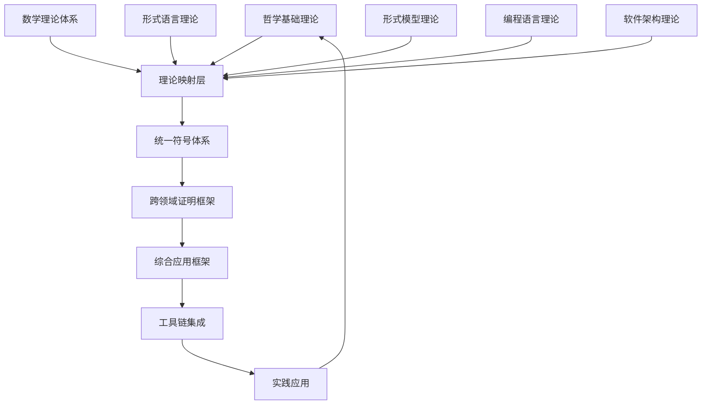

# 07-理论统一与整合-总论

## 📋 目录导航

- [07-理论统一与整合-总论](#07-理论统一与整合-总论)
  - [📋 目录导航](#-目录导航)
  - [🔗 快速导航](#-快速导航)
  - [1. 概述](#1-概述)
    - [1.1 理论统一与整合概述](#11-理论统一与整合概述)
    - [1.2 核心目标](#12-核心目标)
    - [1.3 统一框架层次结构](#13-统一框架层次结构)
  - [2. 理论基础](#2-理论基础)
    - [2.1 理论映射](#21-理论映射)
    - [2.2 统一符号体系](#22-统一符号体系)
    - [2.3 跨领域证明](#23-跨领域证明)
    - [2.4 整合策略](#24-整合策略)
  - [3. 基本概念](#3-基本概念)
    - [3.1 理论映射概念](#31-理论映射概念)
    - [3.2 符号统一概念](#32-符号统一概念)
    - [3.3 证明框架概念](#33-证明框架概念)
    - [3.4 应用框架概念](#34-应用框架概念)
  - [4. 主要理论](#4-主要理论)
    - [4.1 理论映射方法](#41-理论映射方法)
    - [4.2 符号统一方法](#42-符号统一方法)
    - [4.3 跨领域证明方法](#43-跨领域证明方法)
    - [4.4 应用框架方法](#44-应用框架方法)
  - [5. 行业应用](#5-行业应用)
    - [5.1 软件工程](#51-软件工程)
    - [5.2 系统集成](#52-系统集成)
    - [5.3 跨领域研究](#53-跨领域研究)
  - [6. 发展历史](#6-发展历史)
    - [6.1 早期发展（1960-1980）](#61-早期发展1960-1980)
    - [6.2 理论发展（1980-2000）](#62-理论发展1980-2000)
    - [6.3 现代发展（2000-至今）](#63-现代发展2000-至今)
  - [7. 应用领域](#7-应用领域)
    - [7.1 计算机科学](#71-计算机科学)
    - [7.2 工程领域](#72-工程领域)
    - [7.3 科学研究](#73-科学研究)
  - [8. 总结](#8-总结)
    - [8.1 主要成就](#81-主要成就)
    - [8.2 当前挑战](#82-当前挑战)
    - [8.3 未来发展方向](#83-未来发展方向)
  - [9. 相关理论跳转](#9-相关理论跳转)
    - [9.1 理论基础](#91-理论基础)
    - [9.2 应用实践](#92-应用实践)
    - [9.3 实践应用](#93-实践应用)

## 🔗 快速导航

[🏠 返回理论体系首页](../README.md) |
[📚 哲学基础理论](../01-哲学基础理论/README.md) |
[🔢 数学理论体系](../02-数学理论体系/README.md) |
[🌐 形式语言理论](../03-形式语言理论体系/README.md)

---

## 1. 概述

理论统一与整合是形式化架构理论体系的顶层设计，旨在建立各理论分支间的统一框架，实现跨领域的形式化建模与分析。它是连接各个理论分支的桥梁，确保理论体系的一致性和完整性。

### 1.1 理论统一与整合概述

**定义 1.1.1**: 理论统一与整合是一套系统性的方法论，旨在建立不同理论分支间的映射关系，实现跨领域的形式化建模与分析。

**定义 1.1.2**: 理论统一框架定义为元组 $(T, M, S, P, A, I)$，其中：

- $T$: 理论分支集合
- $M$: 映射关系集合
- $S$: 统一符号体系
- $P$: 证明框架
- $A$: 应用框架
- $I$: 整合策略

### 1.2 核心目标

**目标 1.2.1**: 理论映射

- 建立不同理论分支间的映射关系
- 确保映射的一致性和完整性
- 实现理论间的相互转换

**目标 1.2.2**: 符号统一

- 建立统一的符号体系
- 解决符号冲突和歧义
- 提供标准化的表示方法

**目标 1.2.3**: 跨领域证明

- 实现跨理论分支的形式化证明
- 建立统一的证明框架
- 确保证明的正确性和可靠性

**目标 1.2.4**: 应用整合

- 构建综合的应用框架
- 实现工具链的集成
- 提供统一的应用接口

### 1.3 统一框架层次结构



## 2. 理论基础

### 2.1 理论映射

**定义 2.1.1**: 理论映射是建立不同理论分支间对应关系的数学方法。

**映射关系 2.1.1**: 对于理论 $T_1$ 和 $T_2$，映射 $f: T_1 \rightarrow T_2$ 满足：

- **保持性**: 保持理论结构的一致性
- **完整性**: 覆盖理论的所有重要概念
- **可逆性**: 在适当条件下可逆

**实现示例 2.1.1**:

```rust
pub struct TheoryMapping {
    pub source_theory: Theory,
    pub target_theory: Theory,
    pub mapping_rules: Vec<MappingRule>,
    pub consistency_check: ConsistencyCheck,
}

pub struct MappingRule {
    pub source_concept: Concept,
    pub target_concept: Concept,
    pub transformation: Transformation,
}

pub trait Transformation {
    fn transform(&self, input: &dyn TheoryElement) -> Box<dyn TheoryElement>;
}
```

### 2.2 统一符号体系

**定义 2.2.1**: 统一符号体系是为不同理论分支提供标准化符号表示的系统。

**符号系统 2.2.1**: 统一符号体系 $S = (V, O, R, I)$，其中：

- $V$: 变量符号集合
- $O$: 操作符号集合
- $R$: 关系符号集合
- $I$: 解释函数

**实现示例 2.2.1**:

```rust
pub struct UnifiedSymbolSystem {
    pub symbols: HashMap<String, Symbol>,
    pub operators: Vec<Operator>,
    pub relations: Vec<Relation>,
}

pub struct Symbol {
    pub name: String,
    pub type_: SymbolType,
    pub domain: String,
    pub interpretation: String,
}
```

### 2.3 跨领域证明

**定义 2.3.1**: 跨领域证明是在统一框架下进行跨理论分支形式化证明的方法。

**证明框架 2.3.1**: 跨领域证明系统 $P = (A, R, C, V)$，其中：

- $A$: 公理集合
- $R$: 推理规则集合
- $C$: 约束条件集合
- $V$: 验证机制

**实现示例 2.3.1**:

```rust
pub struct CrossDomainProof {
    pub premises: Vec<Premise>,
    pub inference_rules: Vec<InferenceRule>,
    pub conclusion: Conclusion,
}

pub struct InferenceRule {
    pub name: String,
    pub applicability: ApplicabilityCondition,
    pub transformation: ProofTransformation,
}
```

### 2.4 整合策略

**定义 2.4.1**: 整合策略是实现理论统一的具体方法和步骤。

**策略框架 2.4.1**:

1. **理论分析**: 分析各理论分支的结构和特点
2. **映射建立**: 建立理论间的映射关系
3. **符号统一**: 解决符号冲突，建立统一表示
4. **证明整合**: 建立跨领域的证明框架
5. **应用集成**: 构建综合的应用框架

## 3. 基本概念

### 3.1 理论映射概念

**概念 3.1.1**: **理论映射**是建立不同理论分支间对应关系的数学方法。

**概念 3.1.2**: **映射一致性**确保映射关系在理论转换过程中保持结构的一致性。

**概念 3.1.3**: **映射完整性**要求映射覆盖理论的所有重要概念和关系。

### 3.2 符号统一概念

**概念 3.2.1**: **符号冲突**指不同理论分支使用相同符号表示不同概念的情况。

**概念 3.2.2**: **符号歧义**指同一符号在不同上下文中具有不同含义的情况。

**概念 3.2.3**: **符号标准化**是解决符号冲突和歧义，建立统一表示的过程。

### 3.3 证明框架概念

**概念 3.3.1**: **跨领域推理**是在统一框架下进行跨理论分支推理的方法。

**概念 3.3.2**: **证明验证**是验证跨领域证明正确性的机制。

**概念 3.3.3**: **证明自动化**是实现跨领域证明自动化的技术。

### 3.4 应用框架概念

**概念 3.4.1**: **综合应用**是基于统一框架构建的综合应用系统。

**概念 3.4.2**: **工具集成**是将不同理论分支的工具整合到统一框架中。

**概念 3.4.3**: **接口标准化**是为统一框架提供标准化接口的方法。

## 4. 主要理论

### 4.1 理论映射方法

**方法 4.1.1**: **概念对齐**

- 分析不同理论分支的核心概念
- 建立概念间的对应关系
- 验证概念对齐的一致性

**方法 4.1.2**: **关系映射**

- 识别理论分支间的结构关系
- 建立关系间的映射规则
- 确保关系映射的完整性

**方法 4.1.3**: **约束转换**

- 分析理论分支的约束条件
- 建立约束间的转换规则
- 验证约束转换的正确性

**实现示例 4.1.1**:

```rust
pub struct TheoryMapper {
    pub mappings: Vec<TheoryMapping>,
    pub validation_rules: Vec<ValidationRule>,
}

impl TheoryMapper {
    pub fn map_theory(&self, source: &Theory, target: &Theory) -> Result<TheoryMapping, Error> {
        // 1. 概念对齐
        let concept_mapping = self.align_concepts(source, target)?;
        
        // 2. 关系映射
        let relation_mapping = self.map_relations(source, target)?;
        
        // 3. 约束转换
        let constraint_mapping = self.transform_constraints(source, target)?;
        
        Ok(TheoryMapping {
            source_theory: source.clone(),
            target_theory: target.clone(),
            mapping_rules: vec![concept_mapping, relation_mapping, constraint_mapping],
            consistency_check: ConsistencyCheck::new(),
        })
    }
}
```

### 4.2 符号统一方法

**方法 4.2.1**: **符号收集**

- 收集各理论分支使用的符号
- 分析符号的含义和用法
- 识别符号冲突和歧义

**方法 4.2.2**: **冲突检测**

- 检测符号间的冲突
- 分析冲突的原因和影响
- 制定冲突解决策略

**方法 4.2.3**: **冲突解决**

- 建立符号命名规范
- 实现符号的标准化
- 验证符号统一的一致性

**实现示例 4.2.1**:

```rust
pub struct SymbolUnifier {
    pub symbol_registry: SymbolRegistry,
    pub conflict_resolver: ConflictResolver,
}

impl SymbolUnifier {
    pub fn unify_symbols(&mut self, theories: &[Theory]) -> Result<UnifiedSymbolSystem, Error> {
        // 1. 收集所有符号
        let all_symbols = self.collect_symbols(theories);
        
        // 2. 检测冲突
        let conflicts = self.detect_conflicts(&all_symbols);
        
        // 3. 解决冲突
        let resolved_symbols = self.resolve_conflicts(conflicts)?;
        
        // 4. 构建统一体系
        self.build_unified_system(resolved_symbols)
    }
}
```

### 4.3 跨领域证明方法

**方法 4.3.1**: **目标分解**

- 将跨领域证明目标分解为子目标
- 识别各子目标所属的理论分支
- 建立子目标间的依赖关系

**方法 4.3.2**: **推理规则应用**

- 选择合适的推理规则
- 验证规则的应用条件
- 执行推理规则的转换

**方法 4.3.3**: **证明组合**

- 将各子目标的证明组合
- 验证证明组合的正确性
- 生成完整的跨领域证明

**实现示例 4.3.1**:

```rust
impl CrossDomainProof {
    pub fn prove(&self, goal: &Goal) -> Result<Proof, Error> {
        // 1. 目标分解
        let subgoals = self.decompose_goal(goal)?;
        
        // 2. 子目标证明
        let mut subproofs = Vec::new();
        for subgoal in subgoals {
            let subproof = self.prove_subgoal(&subgoal)?;
            subproofs.push(subproof);
        }
        
        // 3. 证明组合
        self.combine_proofs(subproofs)
    }
}
```

### 4.4 应用框架方法

**方法 4.4.1**: **框架设计**

- 设计统一的应用框架结构
- 定义框架的核心组件
- 建立组件间的接口规范

**方法 4.4.2**: **工具集成**

- 集成各理论分支的工具
- 建立工具间的通信机制
- 实现工具的协同工作

**方法 4.4.3**: **接口标准化**

- 定义标准化的接口规范
- 实现接口的版本管理
- 提供接口的文档说明

## 5. 行业应用

### 5.1 软件工程

**应用场景 5.1.1**: **系统架构设计**

- 使用统一框架进行系统架构设计
- 实现不同架构模式的统一建模
- 验证架构设计的一致性和正确性

**应用场景 5.1.2**: **代码生成**

- 基于统一框架的代码生成
- 支持多种编程语言的代码生成
- 确保生成代码的质量和正确性

**应用场景 5.1.3**: **质量保证**

- 使用统一框架进行质量检查
- 实现跨领域的质量验证
- 建立自动化的质量保证机制

### 5.2 系统集成

**应用场景 5.2.1**: **异构系统集成**

- 集成不同类型的系统组件
- 实现系统间的互操作性
- 确保集成系统的正确性

**应用场景 5.2.2**: **协议转换**

- 实现不同协议间的转换
- 验证协议转换的正确性
- 确保转换过程的安全性

**应用场景 5.2.3**: **数据交换**

- 实现不同数据格式的转换
- 验证数据交换的正确性
- 确保数据交换的效率

### 5.3 跨领域研究

**应用场景 5.3.1**: **学科交叉研究**

- 支持不同学科间的交叉研究
- 实现跨学科的理论整合
- 促进新理论和新方法的产生

**应用场景 5.3.2**: **问题求解**

- 使用统一框架解决复杂问题
- 实现多角度的 problem 分析
- 提供综合的解决方案

**应用场景 5.3.3**: **知识整合**

- 整合不同领域的知识
- 建立知识间的关联关系
- 实现知识的统一管理

## 6. 发展历史

### 6.1 早期发展（1960-1980）

- **理论基础**: 形式化方法的理论基础建立
- **符号系统**: 早期符号系统的出现
- **证明方法**: 基本证明方法的发展

### 6.2 理论发展（1980-2000）

- **理论整合**: 不同理论分支的整合尝试
- **符号统一**: 符号系统的标准化努力
- **证明框架**: 跨领域证明框架的建立

### 6.3 现代发展（2000-至今）

- **工具支持**: 自动化工具的发展
- **应用扩展**: 在多个领域的应用
- **标准化**: 国际标准的制定

## 7. 应用领域

### 7.1 计算机科学

- **软件工程**: 软件开发和维护
- **人工智能**: 智能系统的设计和实现
- **网络安全**: 安全系统的验证和分析

### 7.2 工程领域

- **控制系统**: 控制系统的设计和验证
- **通信系统**: 通信协议的设计和验证
- **嵌入式系统**: 嵌入式软件的开发

### 7.3 科学研究

- **数学研究**: 数学理论的统一和整合
- **物理研究**: 物理模型的形式化表示
- **生物研究**: 生物系统的建模和分析

## 8. 总结

### 8.1 主要成就

1. **理论统一**: 建立了不同理论分支间的统一框架
2. **符号标准化**: 实现了符号系统的统一和标准化
3. **证明整合**: 建立了跨领域的证明框架
4. **应用扩展**: 在多个领域实现了成功应用

### 8.2 当前挑战

1. **复杂性**: 理论统一面临巨大的复杂性挑战
2. **可扩展性**: 需要支持新理论和新方法的加入
3. **工具支持**: 需要更好的工具支持
4. **标准化**: 需要进一步的标准化和规范化

### 8.3 未来发展方向

1. **自动化增强**: 提高理论统一的自动化程度
2. **智能化**: 引入人工智能技术辅助理论统一
3. **标准化**: 推进国际标准的制定和采用
4. **应用拓展**: 在更多领域实现应用

## 9. 相关理论跳转

### 9.1 理论基础

- [哲学基础理论](../01-哲学基础理论/README.md)
- [数学理论体系](../02-数学理论体系/README.md)
- [形式语言理论体系](../03-形式语言理论体系/README.md)

### 9.2 应用实践

- [形式模型理论体系](../04-形式模型理论体系/README.md)
- [编程语言理论体系](../05-编程语言理论体系/README.md)
- [软件架构理论体系](../04-软件架构理论体系/README.md)

### 9.3 实践应用

- [实践应用开发](../08-实践应用开发/README.md)
- [索引与导航](../09-索引与导航/README.md)

---

**📝 文档信息**:

- **创建时间**: 2024年
- **最后更新**: 2024年
- **版本**: 1.0
- **维护者**: 形式化架构理论团队

**🔗 相关链接**:

- [🏠 返回首页](../README.md)
- [📚 理论体系总览](../README.md)
- [🔧 理论统一](./README.md)
