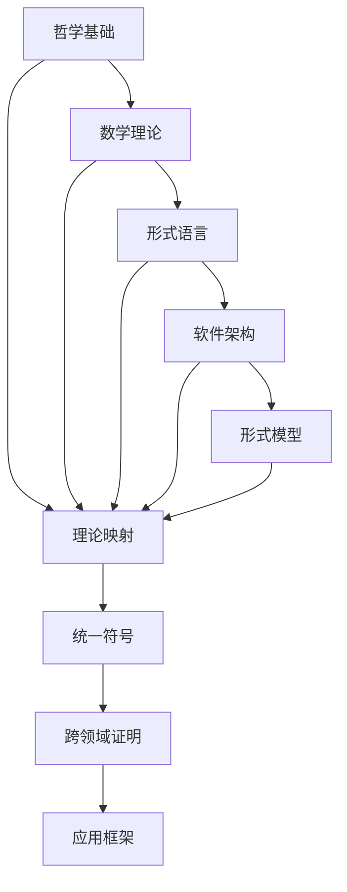

# 理论统一与整合总论

## 目录

- [理论统一与整合总论](#理论统一与整合总论)
  - [目录](#目录)
  - [1. 理论框架](#1-理论框架)
    - [1.1 统一目标](#11-统一目标)
    - [1.2 整合策略](#12-整合策略)
  - [2. 基本概念](#2-基本概念)
    - [2.1 理论映射](#21-理论映射)
    - [2.2 统一符号体系](#22-统一符号体系)
  - [3. 形式化表示](#3-形式化表示)
    - [3.1 理论关系图](#31-理论关系图)
    - [3.2 数学表示](#32-数学表示)
  - [4. 统一方法](#4-统一方法)
    - [4.1 理论映射方法](#41-理论映射方法)
    - [4.2 符号统一方法](#42-符号统一方法)
  - [5. 跨领域证明](#5-跨领域证明)
    - [5.1 证明框架](#51-证明框架)
    - [5.2 证明验证](#52-证明验证)
  - [6. 应用框架](#6-应用框架)
    - [6.1 综合应用框架](#61-综合应用框架)
    - [6.2 工具链集成](#62-工具链集成)
  - [7. 交叉引用](#7-交叉引用)
    - [7.1 相关理论](#71-相关理论)
    - [7.2 实践应用](#72-实践应用)
  - [8. 导航](#8-导航)

## 1. 理论框架

理论统一与整合是形式化架构理论体系的顶层设计，旨在建立各理论分支间的统一框架，实现跨领域的形式化建模与分析。

### 1.1 统一目标

- 建立理论间的映射关系
- 提供统一的符号体系
- 实现跨领域的形式化证明
- 构建综合应用框架

### 1.2 整合策略

- 理论映射与转换
- 符号体系标准化
- 证明方法统一
- 工具链集成

## 2. 基本概念

### 2.1 理论映射

```rust
pub struct TheoryMapping {
    pub source_theory: Theory,
    pub target_theory: Theory,
    pub mapping_rules: Vec<MappingRule>,
    pub consistency_check: ConsistencyCheck,
}

pub struct MappingRule {
    pub source_concept: Concept,
    pub target_concept: Concept,
    pub transformation: Transformation,
}

pub trait Transformation {
    fn transform(&self, input: &dyn TheoryElement) -> Box<dyn TheoryElement>;
}
```

### 2.2 统一符号体系

```rust
pub struct UnifiedSymbolSystem {
    pub symbols: HashMap<String, Symbol>,
    pub operators: Vec<Operator>,
    pub relations: Vec<Relation>,
}

pub struct Symbol {
    pub name: String,
    pub type_: SymbolType,
    pub domain: String,
    pub interpretation: String,
}
```

## 3. 形式化表示

### 3.1 理论关系图



### 3.2 数学表示

理论统一可形式化为映射 $U: T_1 \times T_2 \times \ldots \times T_n \rightarrow T_{unified}$，其中：

- $T_i$ 为各理论分支
- $T_{unified}$ 为统一理论框架

整合约束：
$$\forall t_i, t_j \in T: \text{Consistent}(U(t_i), U(t_j))$$

## 4. 统一方法

### 4.1 理论映射方法

```rust
pub struct TheoryMapper {
    pub mappings: Vec<TheoryMapping>,
    pub validation_rules: Vec<ValidationRule>,
}

impl TheoryMapper {
    pub fn map_theory(&self, source: &Theory, target: &Theory) -> Result<TheoryMapping, Error> {
        // 1. 概念对齐
        let concept_mapping = self.align_concepts(source, target)?;
        
        // 2. 关系映射
        let relation_mapping = self.map_relations(source, target)?;
        
        // 3. 约束转换
        let constraint_mapping = self.transform_constraints(source, target)?;
        
        Ok(TheoryMapping {
            source_theory: source.clone(),
            target_theory: target.clone(),
            mapping_rules: vec![concept_mapping, relation_mapping, constraint_mapping],
            consistency_check: ConsistencyCheck::new(),
        })
    }
}
```

### 4.2 符号统一方法

```rust
pub struct SymbolUnifier {
    pub symbol_registry: SymbolRegistry,
    pub conflict_resolver: ConflictResolver,
}

impl SymbolUnifier {
    pub fn unify_symbols(&mut self, theories: &[Theory]) -> Result<UnifiedSymbolSystem, Error> {
        // 1. 收集所有符号
        let all_symbols = self.collect_symbols(theories);
        
        // 2. 检测冲突
        let conflicts = self.detect_conflicts(&all_symbols);
        
        // 3. 解决冲突
        let resolved_symbols = self.resolve_conflicts(conflicts)?;
        
        // 4. 构建统一体系
        self.build_unified_system(resolved_symbols)
    }
}
```

## 5. 跨领域证明

### 5.1 证明框架

```rust
pub struct CrossDomainProof {
    pub premises: Vec<Premise>,
    pub inference_rules: Vec<InferenceRule>,
    pub conclusion: Conclusion,
}

pub struct InferenceRule {
    pub name: String,
    pub applicability: ApplicabilityCondition,
    pub transformation: ProofTransformation,
}

impl CrossDomainProof {
    pub fn prove(&self, goal: &Goal) -> Result<Proof, Error> {
        // 1. 目标分解
        let subgoals = self.decompose_goal(goal)?;
        
        // 2. 策略选择
        let strategies = self.select_strategies(&subgoals)?;
        
        // 3. 证明执行
        let proofs = self.execute_proofs(&subgoals, &strategies)?;
        
        // 4. 证明组合
        self.combine_proofs(proofs)
    }
}
```

### 5.2 证明验证

```rust
pub struct ProofVerifier {
    pub verification_rules: Vec<VerificationRule>,
    pub soundness_checker: SoundnessChecker,
}

impl ProofVerifier {
    pub fn verify_proof(&self, proof: &Proof) -> Result<VerificationResult, Error> {
        // 1. 语法检查
        self.check_syntax(proof)?;
        
        // 2. 语义验证
        self.verify_semantics(proof)?;
        
        // 3. 一致性检查
        self.check_consistency(proof)?;
        
        Ok(VerificationResult::Valid)
    }
}
```

## 6. 应用框架

### 6.1 综合应用框架

```rust
pub struct IntegratedApplicationFramework {
    pub theory_registry: TheoryRegistry,
    pub mapping_engine: MappingEngine,
    pub proof_engine: ProofEngine,
    pub application_templates: Vec<ApplicationTemplate>,
}

impl IntegratedApplicationFramework {
    pub fn create_application(&self, requirements: &Requirements) -> Result<Application, Error> {
        // 1. 需求分析
        let analysis = self.analyze_requirements(requirements)?;
        
        // 2. 理论选择
        let theories = self.select_theories(&analysis)?;
        
        // 3. 映射构建
        let mappings = self.build_mappings(&theories)?;
        
        // 4. 应用生成
        self.generate_application(&mappings, requirements)
    }
}
```

### 6.2 工具链集成

```rust
pub struct ToolchainIntegration {
    pub tools: Vec<Tool>,
    pub integration_points: Vec<IntegrationPoint>,
    pub workflow_engine: WorkflowEngine,
}

impl ToolchainIntegration {
    pub fn integrate_tools(&mut self) -> Result<IntegratedToolchain, Error> {
        // 1. 工具注册
        self.register_tools()?;
        
        // 2. 接口定义
        self.define_interfaces()?;
        
        // 3. 工作流构建
        let workflows = self.build_workflows()?;
        
        // 4. 集成测试
        self.test_integration(&workflows)?;
        
        Ok(IntegratedToolchain::new(workflows))
    }
}
```

## 7. 交叉引用

### 7.1 相关理论

- [哲学基础理论](../01-哲学基础理论/00-哲学基础理论总论.md)
- [数学理论体系](../02-数学理论体系/00-数学理论体系总论.md)
- [形式语言理论](../03-形式语言理论/00-形式语言理论总论.md)
- [软件架构理论](../04-软件架构理论/00-软件架构理论总论.md)
- [形式模型理论](../06-形式模型理论/00-形式模型理论总论.md)

### 7.2 实践应用

- [实践应用开发](../08-实践应用开发/README.md)

## 8. 导航

- [理论映射关系](01-理论映射关系.md)
- [统一符号体系](02-统一符号体系.md)
- [跨领域证明](03-跨领域证明.md)
- [应用框架](04-应用框架.md)
