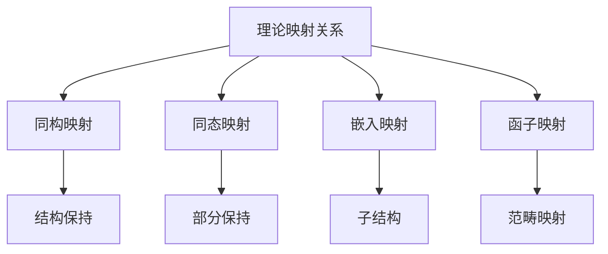

# 07-理论统一与整合-理论映射关系

[返回主题树](../00-主题树与内容索引.md) | [主计划文档（最新v69）](../../形式化架构理论统一计划-v69.md) | [知识图谱生成工具](../../知识图谱生成工具.md) | [导航系统](../../09-索引与导航/02-导航系统.md) | [自动化验证工具](../../08-实践应用开发/03-自动化验证工具设计与实现.md) | [主题树](../00-主题树与内容索引.md) | [归档](../archive/README.md) | [合并与整合报告](../递归合并与语义整合最终报告.md) | [相关计划](../递归合并计划.md) | [返回上级](../README.md)

> 本文档为理论统一与整合分支理论映射关系，所有最新进展与结论以主计划文档为准，历史细节归档于archive/。

## 目录

- [07-理论统一与整合-理论映射关系](#07-理论统一与整合-理论映射关系)
  - [目录](#目录)
  - [1. 概述](#1-概述)
    - [1.1 理论映射关系概述](#11-理论映射关系概述)
    - [1.2 核心目标](#12-核心目标)
    - [1.3 映射关系层次结构](#13-映射关系层次结构)
  - [2. 主要文件与内容索引](#2-主要文件与内容索引)
    - [2.1 核心文件](#21-核心文件)
    - [2.2 相关文件](#22-相关文件)
  - [3. 映射关系的基本定义与解释](#3-映射关系的基本定义与解释)
    - [3.1 映射关系的定义](#31-映射关系的定义)
      - [3.1.1 同构映射](#311-同构映射)
      - [3.1.2 同态映射](#312-同态映射)
      - [3.1.3 嵌入映射](#313-嵌入映射)
  - [4. 理论间的基础映射](#4-理论间的基础映射)
    - [4.1 哲学与数学映射](#41-哲学与数学映射)
      - [4.1.1 本体论映射](#411-本体论映射)
      - [4.1.2 认识论映射](#412-认识论映射)
      - [4.1.3 逻辑学映射](#413-逻辑学映射)
  - [4.2 USTS-UMS映射关系](#42-usts-ums映射关系)
    - [4.3 组件-接口-UMS映射关系](#43-组件-接口-ums映射关系)
    - [4.4 映射方法与案例](#44-映射方法与案例)
  - [5. 理论映射的主要方法](#5-理论映射的主要方法)
    - [5.1 范畴论方法](#51-范畴论方法)
    - [5.2 模型论方法](#52-模型论方法)
    - [5.3 类型论方法](#53-类型论方法)
    - [5.4 代数方法](#54-代数方法)
  - [6. 映射关系的行业应用](#6-映射关系的行业应用)
    - [6.1 形式化验证](#61-形式化验证)
    - [6.2 模型转换](#62-模型转换)
    - [6.3 理论整合](#63-理论整合)
  - [7. 发展历史](#7-发展历史)
  - [8. 应用领域](#8-应用领域)
  - [9. 总结](#9-总结)
  - [10. 相关性跳转与引用](#10-相关性跳转与引用)

## 1. 概述

### 1.1 理论映射关系概述

理论映射关系是理论统一与整合的核心，研究不同理论体系之间的对应关系和转换方法。映射关系为理论整合提供了重要的方法论基础。

### 1.2 核心目标

- 建立理论映射的基本框架
- 提供理论转换的方法论
- 支持理论体系的统一

### 1.3 映射关系层次结构

## 2. 主要文件与内容索引

### 2.1 核心文件

- [理论映射关系.md](../Matter/Theory/理论映射关系.md)
- [理论统一与整合总论.md](00-理论统一与整合总论.md)

### 2.2 相关文件

- [02-统一符号体系.md](02-统一符号体系.md)
- [03-跨领域证明.md](03-跨领域证明.md)
- [04-理论应用框架.md](04-理论应用框架.md)

## 3. 映射关系的基本定义与解释

### 3.1 映射关系的定义

**定义 3.1.1** 理论映射（Theory Mapping）
理论映射是不同理论体系之间的对应关系，保持一定的结构性质。

#### 3.1.1 同构映射

**定义 3.1.2** 同构映射（Isomorphic Mapping）
同构映射是保持所有结构性质的双射映射。

**特点**：

- 双向映射
- 结构完全保持
- 可逆变换

#### 3.1.2 同态映射

**定义 3.1.3** 同态映射（Homomorphic Mapping）
同态映射是保持部分结构性质的映射。

**特点**：

- 单向映射
- 部分结构保持
- 信息损失

#### 3.1.3 嵌入映射

**定义 3.1.4** 嵌入映射（Embedding Mapping）
嵌入映射是将一个理论嵌入到另一个理论中的映射。

**特点**：

- 子结构关系
- 保持局部性质
- 扩展性

## 4. 理论间的基础映射

### 4.1 哲学与数学映射

#### 4.1.1 本体论映射

**映射 4.1.1** 本体论与集合论映射

- 存在 → 集合
- 实体 → 元素
- 关系 → 二元关系

#### 4.1.2 认识论映射

**映射 4.1.2** 认识论与逻辑映射

- 知识 → 真命题
- 信念 → 假设
- 确证 → 证明

#### 4.1.3 逻辑学映射

**映射 4.1.3** 逻辑学与形式系统映射

- 推理 → 演绎
- 论证 → 证明
- 有效性 → 可证性

## 4.2 USTS-UMS映射关系

| USTS概念 | UMS概念 | 映射类型 | 说明 |
|----------|---------|----------|------|
| 状态 (S) | 组件 (C) | 概念映射 | USTS状态元素映射为UMS组件单元 |
| 转换 (T) | 接口 (I) | 结构映射 | USTS状态转换映射为UMS接口方法 |
| 事件 (E) | 消息 (M) | 语义映射 | USTS事件映射为UMS消息类型 |
| 约束 (C) | 契约 (CT) | 约束映射 | USTS约束映射为UMS交互契约 |

### 4.3 组件-接口-UMS映射关系

| 组件理论 | 接口理论 | UMS | 映射说明 |
|----------|----------|-----|----------|
| 组件 | 接口提供者 | 模块单元 | 组件实现并提供接口，统一为UMS模块 |
| 组件实例 | 接口实例 | 模块实例 | 运行时具体实例，包含状态和行为 |
| 组件类型 | 接口类型 | 模块类型 | 定义结构和行为规范 |
| 组件状态 | 接口状态 | 模块状态 | 模块在特定时间点的数据和配置 |
| 组件行为 | 接口协议 | 交互行为 | 模块如何响应事件和请求 |
| 组件依赖 | 接口需求 | 依赖关系 | 模块间依赖 |
| 组件组合 | 接口组合 | 系统组合 | 多模块组合成更大系统 |
| 组件生命周期 | 接口版本 | 演化模型 | 模块随时间变化和演化 |
| 组件替换性 | 接口兼容性 | 替换兼容性 | 模块替换条件和保障 |
| 组件规约 | 接口契约 | 模块契约 | 行为和交互的形式化规范 |
| 组件配置 | 接口参数化 | 模块配置 | 调整属性和行为机制 |
| 组件框架 | 接口生态 | 模块系统 | 支持开发和运行的环境 |

### 4.4 映射方法与案例

- USTS到UMS的混合映射：状态→组件，转换→接口，事件→消息，约束→契约。
- 组件/接口到UMS的同态映射：组件/接口的所有核心属性均可映射为UMS七元组的相应元素。
- 典型案例参见“UMS理论”、“概念图谱v69”与“主计划”相关章节。

## 5. 理论映射的主要方法

### 5.1 范畴论方法

**方法 5.1.1** 范畴论映射
使用范畴论的工具建立理论间的函子映射。

**应用**：

- 代数结构映射
- 拓扑结构映射
- 逻辑结构映射

### 5.2 模型论方法

**方法 5.2.1** 模型论映射
通过模型论建立理论间的解释关系。

**应用**：

- 语义映射
- 解释映射
- 翻译映射

### 5.3 类型论方法

**方法 5.3.1** 类型论映射
使用类型论建立类型系统间的映射。

**应用**：

- 类型转换
- 类型安全
- 类型推断

### 5.4 代数方法

**方法 5.4.1** 代数映射
使用代数方法建立结构间的同态映射。

**应用**：

- 群论映射
- 环论映射
- 域论映射

## 6. 映射关系的行业应用

### 6.1 形式化验证

- 模型检查
- 定理证明
- 程序验证

### 6.2 模型转换

- 模型驱动开发
- 代码生成
- 逆向工程

### 6.3 理论整合

- 跨领域研究
- 理论统一
- 知识整合

## 7. 发展历史

理论映射关系的发展经历了从简单的对应关系到复杂的范畴论映射的演进过程。布尔巴基学派、哥德尔、塔斯基等学者为理论映射的发展做出了重要贡献。

## 8. 应用领域

理论映射在形式化验证、模型转换、理论整合、跨领域研究等领域有广泛应用，是理论统一的重要方法论。

## 9. 总结

理论映射关系作为理论统一与整合的核心，为不同理论体系间的整合提供了重要的方法论基础。

## 10. 相关性跳转与引用

- [00-理论统一与整合总论.md](00-理论统一与整合总论.md)
- [02-统一符号体系.md](02-统一符号体系.md)
- [03-跨领域证明.md](03-跨领域证明.md)
- [04-理论应用框架.md](04-理论应用框架.md)
- [05-理论评估框架.md](05-理论评估框架.md)
- [06-理论演化框架.md](06-理论演化框架.md)
- [07-理论创新框架.md](07-理论创新框架.md)
- [00-主题树与内容索引.md](../00-主题树与内容索引.md)
- [进度追踪与上下文.md](../进度追踪与上下文.md)

---

> 本文件为自动归纳生成，后续将递归细化相关内容，持续补全图表、公式、代码等多表征内容。
