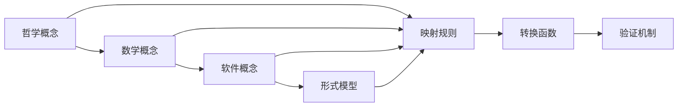

# 理论映射关系

## 1. 理论基础

理论映射关系研究不同理论分支间的对应关系，建立概念、结构、方法的转换桥梁，实现跨理论的形式化分析。

### 1.1 映射类型

- 概念映射：核心概念的对应关系
- 结构映射：理论结构的转换规则
- 方法映射：分析方法的适配转换

## 2. 基本概念

### 2.1 映射定义

```rust
pub struct TheoryMapping {
    pub source_theory: Theory,
    pub target_theory: Theory,
    pub mapping_type: MappingType,
    pub mapping_rules: Vec<MappingRule>,
}

pub enum MappingType {
    Isomorphic,      // 同构映射
    Homomorphic,     // 同态映射
    Embedding,       // 嵌入映射
    Projection,      // 投影映射
}

pub struct MappingRule {
    pub source_pattern: Pattern,
    pub target_pattern: Pattern,
    pub transformation: Box<dyn Transformation>,
    pub validity_condition: Condition,
}
```

### 2.2 映射验证

```rust
pub struct MappingValidator {
    pub consistency_checker: ConsistencyChecker,
    pub completeness_checker: CompletenessChecker,
    pub soundness_checker: SoundnessChecker,
}

impl MappingValidator {
    pub fn validate_mapping(&self, mapping: &TheoryMapping) -> ValidationResult {
        // 1. 一致性检查
        let consistency = self.consistency_checker.check(mapping)?;
        
        // 2. 完整性检查
        let completeness = self.completeness_checker.check(mapping)?;
        
        // 3. 可靠性检查
        let soundness = self.soundness_checker.check(mapping)?;
        
        ValidationResult {
            is_valid: consistency && completeness && soundness,
            details: vec![consistency, completeness, soundness],
        }
    }
}
```

## 3. 映射方法

### 3.1 概念映射

```rust
pub struct ConceptMapper {
    pub concept_registry: ConceptRegistry,
    pub similarity_measure: SimilarityMeasure,
}

impl ConceptMapper {
    pub fn map_concepts(&self, source_concepts: &[Concept], target_theory: &Theory) -> Vec<ConceptMapping> {
        let mut mappings = Vec::new();
        
        for source_concept in source_concepts {
            // 1. 相似性计算
            let similarities = self.calculate_similarities(source_concept, target_theory);
            
            // 2. 最佳匹配选择
            if let Some(best_match) = self.select_best_match(&similarities) {
                mappings.push(ConceptMapping {
                    source: source_concept.clone(),
                    target: best_match,
                    confidence: similarities[&best_match],
                });
            }
        }
        
        mappings
    }
    
    fn calculate_similarities(&self, concept: &Concept, theory: &Theory) -> HashMap<Concept, f64> {
        // 实现概念相似性计算
        todo!("实现相似性计算")
    }
}
```

### 3.2 结构映射

```rust
pub struct StructureMapper {
    pub graph_matcher: GraphMatcher,
    pub pattern_matcher: PatternMatcher,
}

impl StructureMapper {
    pub fn map_structure(&self, source_structure: &Structure, target_theory: &Theory) -> Result<StructureMapping, Error> {
        // 1. 图结构匹配
        let graph_mapping = self.graph_matcher.match_graphs(source_structure, target_theory)?;
        
        // 2. 模式匹配
        let pattern_mapping = self.pattern_matcher.match_patterns(source_structure, target_theory)?;
        
        // 3. 结构转换
        let transformation = self.build_transformation(&graph_mapping, &pattern_mapping)?;
        
        Ok(StructureMapping {
            source_structure: source_structure.clone(),
            target_structure: transformation,
            mapping_rules: vec![graph_mapping, pattern_mapping],
        })
    }
}
```

## 4. 转换规则

### 4.1 语法转换

```rust
pub struct SyntaxTransformer {
    pub grammar_mapper: GrammarMapper,
    pub parser_generator: ParserGenerator,
}

impl SyntaxTransformer {
    pub fn transform_syntax(&self, source_syntax: &Syntax, target_language: &Language) -> Result<Syntax, Error> {
        // 1. 语法映射
        let grammar_mapping = self.grammar_mapper.map_grammar(source_syntax, target_language)?;
        
        // 2. 解析器生成
        let parser = self.parser_generator.generate_parser(&grammar_mapping)?;
        
        // 3. 语法转换
        let transformed_syntax = parser.transform(source_syntax)?;
        
        Ok(transformed_syntax)
    }
}
```

### 4.2 语义转换

```rust
pub struct SemanticTransformer {
    pub semantic_mapper: SemanticMapper,
    pub type_checker: TypeChecker,
}

impl SemanticTransformer {
    pub fn transform_semantics(&self, source_semantics: &Semantics, target_theory: &Theory) -> Result<Semantics, Error> {
        // 1. 语义映射
        let semantic_mapping = self.semantic_mapper.map_semantics(source_semantics, target_theory)?;
        
        // 2. 类型检查
        self.type_checker.check_types(&semantic_mapping)?;
        
        // 3. 语义转换
        let transformed_semantics = self.apply_semantic_transformation(&semantic_mapping)?;
        
        Ok(transformed_semantics)
    }
}
```

## 5. 应用示例

### 5.1 哲学到数学的映射

```rust
pub struct PhilosophyToMathMapper {
    pub ontology_mapper: OntologyMapper,
    pub logic_mapper: LogicMapper,
}

impl PhilosophyToMathMapper {
    pub fn map_philosophy_to_math(&self, philosophy_concept: &PhilosophyConcept) -> Result<MathConcept, Error> {
        match philosophy_concept {
            PhilosophyConcept::Being => Ok(MathConcept::Set),
            PhilosophyConcept::Becoming => Ok(MathConcept::Function),
            PhilosophyConcept::Truth => Ok(MathConcept::Theorem),
            PhilosophyConcept::Knowledge => Ok(MathConcept::Proof),
            _ => Err(Error::UnmappableConcept),
        }
    }
}
```

### 5.2 数学到软件的映射

```rust
pub struct MathToSoftwareMapper {
    pub algebra_mapper: AlgebraMapper,
    pub geometry_mapper: GeometryMapper,
}

impl MathToSoftwareMapper {
    pub fn map_math_to_software(&self, math_concept: &MathConcept) -> Result<SoftwareConcept, Error> {
        match math_concept {
            MathConcept::Set => Ok(SoftwareConcept::Class),
            MathConcept::Function => Ok(SoftwareConcept::Method),
            MathConcept::Relation => Ok(SoftwareConcept::Interface),
            MathConcept::Theorem => Ok(SoftwareConcept::Invariant),
            _ => Err(Error::UnmappableConcept),
        }
    }
}
```

## 6. 形式化表示

### 6.1 映射关系图



### 6.2 数学表示

映射关系可表示为函数 $f: T_1 \rightarrow T_2$，其中：

- $T_1$ 为源理论
- $T_2$ 为目标理论

映射约束：
$$\forall x, y \in T_1: x \sim y \Rightarrow f(x) \sim f(y)$$

## 7. 交叉引用

### 7.1 相关理论

- [理论统一与整合总论](00-理论统一与整合总论.md)
- [统一符号体系](02-统一符号体系.md)
- [跨领域证明](03-跨领域证明.md)

### 7.2 实践应用

- [应用框架](04-应用框架.md)
- [实践应用开发](../08-实践应用开发/README.md)

## 8. 导航

- [返回理论统一与整合总论](00-理论统一与整合总论.md)
- [统一符号体系](02-统一符号体系.md)
- [跨领域证明](03-跨领域证明.md)
- [应用框架](04-应用框架.md)
