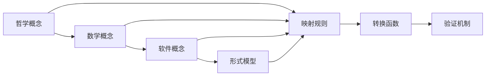
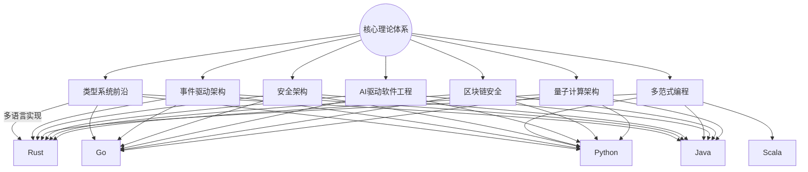

# 07-理论统一与整合-理论映射关系

[返回主题树](../00-主题树与内容索引.md) | [主计划文档](../00-形式化架构理论统一计划.md) | [相关计划](../递归合并计划.md)

> 本文档为理论统一与整合分支理论映射关系，所有最新进展与结论以主计划文档为准，历史细节归档于archive/。

## 目录

- [07-理论统一与整合-理论映射关系](#07-理论统一与整合-理论映射关系)
  - [目录](#目录)
  - [1. 理论映射关系概述](#1-理论映射关系概述)
    - [1.1 映射关系的定义](#11-映射关系的定义)
    - [1.2 映射关系的核心问题](#12-映射关系的核心问题)
  - [2. 数学理论与形式语言理论的映射](#2-数学理论与形式语言理论的映射)
    - [2.1 集合论与自动机](#21-集合论与自动机)
    - [2.2 代数理论与语法](#22-代数理论与语法)
    - [2.3 拓扑理论与语义](#23-拓扑理论与语义)
  - [3. 形式语言理论与形式模型理论的映射](#3-形式语言理论与形式模型理论的映射)
    - [3.1 语法与状态机](#31-语法与状态机)
    - [3.2 语义与Petri网](#32-语义与petri网)
    - [3.3 类型与时序逻辑](#33-类型与时序逻辑)
  - [4. 形式模型理论与编程语言理论的映射](#4-形式模型理论与编程语言理论的映射)
    - [4.1 状态机与语言设计](#41-状态机与语言设计)
    - [4.2 Petri网与并发模型](#42-petri网与并发模型)
    - [4.3 时序逻辑与程序验证](#43-时序逻辑与程序验证)
  - [5. 编程语言理论与软件架构理论的映射](#5-编程语言理论与软件架构理论的映射)
    - [5.1 语言特性与架构模式](#51-语言特性与架构模式)
    - [5.2 类型系统与设计模式](#52-类型系统与设计模式)
    - [5.3 语义理论与架构验证](#53-语义理论与架构验证)
  - [6. 映射关系在软件系统中的应用](#6-映射关系在软件系统中的应用)
    - [6.1 跨领域验证](#61-跨领域验证)
    - [6.2 统一建模](#62-统一建模)
  - [7. 总结](#7-总结)
  - [8. 核心理论映射](#8-核心理论映射)
    - [8.1 USTS与UMS映射](#81-usts与ums映射)
      - [8.1.1 概念映射](#811-概念映射)
      - [8.1.2 结构映射](#812-结构映射)
      - [8.1.3 语义映射](#813-语义映射)
    - [8.2 哲学到数学的映射](#82-哲学到数学的映射)
    - [8.3 数学到软件的映射](#83-数学到软件的映射)
  - [9. 应用示例](#9-应用示例)
    - [9.1 状态机到组件映射](#91-状态机到组件映射)
    - [9.2 接口到转换映射](#92-接口到转换映射)
  - [10. 形式化表示](#10-形式化表示)
    - [10.1 映射关系图](#101-映射关系图)
    - [10.2 数学表示](#102-数学表示)
  - [11. 交叉引用](#11-交叉引用)
    - [11.1 相关理论](#111-相关理论)
    - [11.2 实践应用](#112-实践应用)
  - [12. 导航](#12-导航)
  - [13. 多语言实现与工程安全机制的理论映射](#13-多语言实现与工程安全机制的理论映射)
  - [14. 理论映射关系可视化（Mermaid）](#14-理论映射关系可视化mermaid)

## 1. 理论映射关系概述

理论映射关系研究不同理论分支间的对应关系，建立概念、结构、方法的转换桥梁，实现跨理论的形式化分析。

### 1.1 映射关系的定义

- 概念映射：核心概念的对应关系
- 结构映射：理论结构的转换规则
- 方法映射：分析方法的适配转换

### 1.2 映射关系的核心问题

## 2. 数学理论与形式语言理论的映射

### 2.1 集合论与自动机

### 2.2 代数理论与语法

### 2.3 拓扑理论与语义

## 3. 形式语言理论与形式模型理论的映射

### 3.1 语法与状态机

### 3.2 语义与Petri网

### 3.3 类型与时序逻辑

## 4. 形式模型理论与编程语言理论的映射

### 4.1 状态机与语言设计

### 4.2 Petri网与并发模型

### 4.3 时序逻辑与程序验证

## 5. 编程语言理论与软件架构理论的映射

### 5.1 语言特性与架构模式

### 5.2 类型系统与设计模式

### 5.3 语义理论与架构验证

## 6. 映射关系在软件系统中的应用

### 6.1 跨领域验证

### 6.2 统一建模

## 7. 总结

## 8. 核心理论映射

### 8.1 USTS与UMS映射

统一状态转换系统(USTS)与统一模块化系统(UMS)之间存在深层的理论映射关系，两者在形式化建模和系统设计方面具有互补性。

#### 8.1.1 概念映射

```rust
pub struct USTS_UMS_Mapping {
    // 状态映射到组件
    pub state_to_component: HashMap<State, Component>,
    // 转换映射到接口
    pub transition_to_interface: HashMap<Transition, Interface>,
    // 事件映射到消息
    pub event_to_message: HashMap<Event, Message>,
    // 约束映射到契约
    pub constraint_to_contract: HashMap<Constraint, Contract>,
}

impl USTS_UMS_Mapping {
    pub fn map_state_to_component(&self, state: &State) -> Result<Component, Error> {
        match state {
            State::Simple { id, properties } => {
                Ok(Component::Atomic {
                    id: id.clone(),
                    behavior: Behavior::from_properties(properties),
                    interface: Interface::empty(),
                })
            },
            State::Composite { id, substates } => {
                let subcomponents: Vec<Component> = substates
                    .iter()
                    .map(|s| self.map_state_to_component(s))
                    .collect::<Result<Vec<_>, _>>()?;
                
                Ok(Component::Composite {
                    id: id.clone(),
                    components: subcomponents,
                    coordination: Coordination::Sequential,
                })
            },
        }
    }
    
    pub fn map_transition_to_interface(&self, transition: &Transition) -> Result<Interface, Error> {
        let methods = vec![
            Method {
                name: format!("trigger_{}", transition.event),
                signature: Signature {
                    parameters: transition.conditions.clone(),
                    return_type: Type::Unit,
                },
                contract: Contract::from_conditions(&transition.conditions),
            }
        ];
        
        Ok(Interface {
            id: format!("interface_{}", transition.id),
            methods,
            events: vec![Event {
                name: transition.event.clone(),
                payload: transition.actions.clone(),
            }],
        })
    }
}
```

#### 8.1.2 结构映射

```rust
pub struct USTS_UMS_StructureMapper {
    pub state_hierarchy_mapper: StateHierarchyMapper,
    pub transition_network_mapper: TransitionNetworkMapper,
}

impl USTS_UMS_StructureMapper {
    pub fn map_state_hierarchy(&self, hierarchy: &StateHierarchy) -> Result<ComponentHierarchy, Error> {
        // 状态层次结构映射到组件层次结构
        let root_component = self.map_state_to_component(&hierarchy.root)?;
        
        let mut component_hierarchy = ComponentHierarchy {
            root: root_component,
            relationships: Vec::new(),
        };
        
        // 映射父子关系
        for (parent, children) in &hierarchy.parent_child_relations {
            let parent_component = self.map_state_to_component(parent)?;
            for child in children {
                let child_component = self.map_state_to_component(child)?;
                component_hierarchy.relationships.push(
                    Relationship::Composition {
                        parent: parent_component.id.clone(),
                        child: child_component.id.clone(),
                    }
                );
            }
        }
        
        Ok(component_hierarchy)
    }
    
    pub fn map_transition_network(&self, network: &TransitionNetwork) -> Result<InterfaceNetwork, Error> {
        // 转换网络映射到接口网络
        let mut interface_network = InterfaceNetwork {
            interfaces: Vec::new(),
            connections: Vec::new(),
        };
        
        for transition in &network.transitions {
            let interface = self.map_transition_to_interface(transition)?;
            interface_network.interfaces.push(interface);
        }
        
        // 映射转换连接
        for connection in &network.connections {
            interface_network.connections.push(
                Connection {
                    source: format!("interface_{}", connection.source),
                    target: format!("interface_{}", connection.target),
                    protocol: Protocol::Synchronous,
                }
            );
        }
        
        Ok(interface_network)
    }
}
```

#### 8.1.3 语义映射

```rust
pub struct USTS_UMS_SemanticMapper {
    pub behavior_mapper: BehaviorMapper,
    pub constraint_mapper: ConstraintMapper,
}

impl USTS_UMS_SemanticMapper {
    pub fn map_behavior_semantics(&self, usts_behavior: &USTSBehavior) -> Result<UMSBehavior, Error> {
        match usts_behavior {
            USTSBehavior::Sequential { states } => {
                let components: Vec<Component> = states
                    .iter()
                    .map(|s| self.map_state_to_component(s))
                    .collect::<Result<Vec<_>, _>>()?;
                
                Ok(UMSBehavior::Sequential { components })
            },
            USTSBehavior::Parallel { states } => {
                let components: Vec<Component> = states
                    .iter()
                    .map(|s| self.map_state_to_component(s))
                    .collect::<Result<Vec<_>, _>>()?;
                
                Ok(UMSBehavior::Parallel { components })
            },
            USTSBehavior::Conditional { condition, then_branch, else_branch } => {
                let condition_component = self.map_condition_to_component(condition)?;
                let then_component = self.map_state_to_component(then_branch)?;
                let else_component = self.map_state_to_component(else_branch)?;
                
                Ok(UMSBehavior::Conditional {
                    condition: condition_component,
                    then_branch,
                    else_branch,
                })
            },
        }
    }
    
    pub fn map_constraint_semantics(&self, usts_constraint: &USTSConstraint) -> Result<UMSContract, Error> {
        match usts_constraint {
            USTSConstraint::Invariant { condition } => {
                Ok(UMSContract::Invariant {
                    condition: condition.clone(),
                    verification: VerificationMethod::StaticAnalysis,
                })
            },
            USTSConstraint::Precondition { condition } => {
                Ok(UMSContract::Precondition {
                    condition: condition.clone(),
                    verification: VerificationMethod::RuntimeCheck,
                })
            },
            USTSConstraint::Postcondition { condition } => {
                Ok(UMSContract::Postcondition {
                    condition: condition.clone(),
                    verification: VerificationMethod::RuntimeCheck,
                })
            },
        }
    }
}
```

### 8.2 哲学到数学的映射

```rust
pub struct PhilosophyToMathMapper {
    pub ontology_mapper: OntologyMapper,
    pub logic_mapper: LogicMapper,
}

impl PhilosophyToMathMapper {
    pub fn map_philosophy_to_math(&self, philosophy_concept: &PhilosophyConcept) -> Result<MathConcept, Error> {
        match philosophy_concept {
            PhilosophyConcept::Being => Ok(MathConcept::Set),
            PhilosophyConcept::Becoming => Ok(MathConcept::Function),
            PhilosophyConcept::Truth => Ok(MathConcept::Theorem),
            PhilosophyConcept::Knowledge => Ok(MathConcept::Proof),
            _ => Err(Error::UnmappableConcept),
        }
    }
}
```

### 8.3 数学到软件的映射

```rust
pub struct MathToSoftwareMapper {
    pub algebra_mapper: AlgebraMapper,
    pub geometry_mapper: GeometryMapper,
}

impl MathToSoftwareMapper {
    pub fn map_math_to_software(&self, math_concept: &MathConcept) -> Result<SoftwareConcept, Error> {
        match math_concept {
            MathConcept::Set => Ok(SoftwareConcept::Class),
            MathConcept::Function => Ok(SoftwareConcept::Method),
            MathConcept::Relation => Ok(SoftwareConcept::Interface),
            MathConcept::Theorem => Ok(SoftwareConcept::Invariant),
            _ => Err(Error::UnmappableConcept),
        }
    }
}
```

## 9. 应用示例

### 9.1 状态机到组件映射

```rust
// 示例：将USTS状态机映射为UMS组件系统
pub struct StateMachineToComponentMapper;

impl StateMachineToComponentMapper {
    pub fn map_traffic_light_system(&self) -> Result<ComponentSystem, Error> {
        // 原始USTS状态机定义
        let traffic_light_usts = USTS {
            states: vec![
                State::Simple { id: "red".to_string(), properties: vec!["stop".to_string()] },
                State::Simple { id: "yellow".to_string(), properties: vec!["caution".to_string()] },
                State::Simple { id: "green".to_string(), properties: vec!["go".to_string()] },
            ],
            transitions: vec![
                Transition {
                    id: "red_to_green".to_string(),
                    source: "red".to_string(),
                    target: "green".to_string(),
                    event: "timer_expired".to_string(),
                    conditions: vec!["timer >= 30".to_string()],
                    actions: vec!["start_green_timer".to_string()],
                },
                Transition {
                    id: "green_to_yellow".to_string(),
                    source: "green".to_string(),
                    target: "yellow".to_string(),
                    event: "timer_expired".to_string(),
                    conditions: vec!["timer >= 45".to_string()],
                    actions: vec!["start_yellow_timer".to_string()],
                },
                Transition {
                    id: "yellow_to_red".to_string(),
                    source: "yellow".to_string(),
                    target: "red".to_string(),
                    event: "timer_expired".to_string(),
                    conditions: vec!["timer >= 5".to_string()],
                    actions: vec!["start_red_timer".to_string()],
                },
            ],
        };
        
        // 映射为UMS组件系统
        let mapper = USTS_UMS_Mapping::new();
        let component_system = mapper.map_usts_to_ums(&traffic_light_usts)?;
        
        Ok(component_system)
    }
}
```

### 9.2 接口到转换映射

```rust
// 示例：将UMS接口系统映射为USTS转换系统
pub struct InterfaceToTransitionMapper;

impl InterfaceToTransitionMapper {
    pub fn map_microservice_interfaces(&self) -> Result<USTS, Error> {
        // 原始UMS接口定义
        let user_service_ums = ComponentSystem {
            components: vec![
                Component::Atomic {
                    id: "user_service".to_string(),
                    behavior: Behavior::Service,
                    interface: Interface {
                        id: "user_interface".to_string(),
                        methods: vec![
                            Method {
                                name: "create_user".to_string(),
                                signature: Signature {
                                    parameters: vec!["user_data".to_string()],
                                    return_type: Type::User,
                                },
                                contract: Contract::Precondition {
                                    condition: "user_data.valid()".to_string(),
                                    verification: VerificationMethod::RuntimeCheck,
                                },
                            },
                            Method {
                                name: "get_user".to_string(),
                                signature: Signature {
                                    parameters: vec!["user_id".to_string()],
                                    return_type: Type::User,
                                },
                                contract: Contract::Postcondition {
                                    condition: "result.is_some()".to_string(),
                                    verification: VerificationMethod::RuntimeCheck,
                                },
                            },
                        ],
                        events: vec![
                            Event {
                                name: "user_created".to_string(),
                                payload: vec!["user_id".to_string()],
                            },
                        ],
                    },
                },
            ],
        };
        
        // 映射为USTS转换系统
        let mapper = UMS_USTS_Mapping::new();
        let usts_system = mapper.map_ums_to_usts(&user_service_ums)?;
        
        Ok(usts_system)
    }
}
```

## 10. 形式化表示

### 10.1 映射关系图



### 10.2 数学表示

映射关系可表示为函数 $f: T_1 \rightarrow T_2$，其中：

- $T_1$ 为源理论
- $T_2$ 为目标理论

映射约束：
$$\forall x, y \in T_1: x \sim y \Rightarrow f(x) \sim f(y)$$

## 11. 交叉引用

### 11.1 相关理论

- [理论统一与整合总论](00-理论统一与整合总论.md)
- [统一符号体系](02-统一符号体系.md)
- [跨领域证明](03-跨领域证明.md)

### 11.2 实践应用

- [应用框架](04-应用框架.md)
- [实践应用开发](../08-实践应用开发/README.md)

## 12. 导航

- [返回理论统一与整合总论](00-理论统一与整合总论.md)
- [统一符号体系](02-统一符号体系.md)
- [跨领域证明](03-跨领域证明.md)
- [应用框架](04-应用框架.md)

## 13. 多语言实现与工程安全机制的理论映射

| 理论体系           | Rust实现 | Go实现 | Python实现 | Java/Scala实现 | 工程安全机制 | 典型应用场景 |
|--------------------|----------|--------|------------|----------------|--------------|--------------|
| 类型系统前沿       | ✅        | 部分   | 部分       | ✅             | 内存/类型安全 | 编译器、静态分析 |
| 事件驱动架构       | ✅        | ✅     | ✅         | ✅             | 并发安全      | 微服务、流处理 |
| 安全架构           | ✅        | ✅     | ✅         | ✅             | 加密/认证     | 金融、IoT、云原生 |
| 多范式编程         | ✅        | 部分   | ✅         | ✅             | 并发/消息驱动 | 分布式系统、AI |
| AI驱动软件工程     | ✅        | ✅     | ✅         | ✅             | 数据安全      | 智能推荐、自动化 |
| 区块链安全         | ✅        | ✅     | ✅         | ✅             | 密码学/共识   | 数字货币、智能合约 |
| 量子计算架构       | 部分      | 部分   | ✅         | 部分           | 算法安全      | 量子算法、模拟 |

---

## 14. 理论映射关系可视化（Mermaid）


