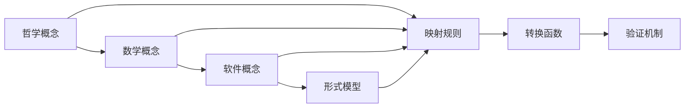
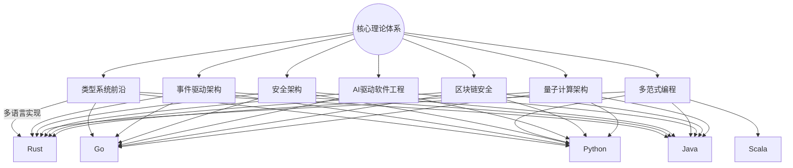

# 理论映射关系

## 目录

- [理论映射关系](#理论映射关系)
  - [目录](#目录)
  - [1. 理论基础](#1-理论基础)
    - [1.1 映射类型](#11-映射类型)
  - [2. 基本概念](#2-基本概念)
    - [2.1 映射定义](#21-映射定义)
    - [2.2 映射验证](#22-映射验证)
  - [3. 映射方法](#3-映射方法)
    - [3.1 概念映射](#31-概念映射)
    - [3.2 结构映射](#32-结构映射)
  - [4. 转换规则](#4-转换规则)
    - [4.1 语法转换](#41-语法转换)
    - [4.2 语义转换](#42-语义转换)
  - [5. 核心理论映射](#5-核心理论映射)
    - [5.1 USTS与UMS映射](#51-usts与ums映射)
    - [5.2 哲学到数学的映射](#52-哲学到数学的映射)
    - [5.3 数学到软件的映射](#53-数学到软件的映射)
  - [6. 应用示例](#6-应用示例)
    - [6.1 状态机到组件映射](#61-状态机到组件映射)
    - [6.2 接口到转换映射](#62-接口到转换映射)
  - [7. 形式化表示](#7-形式化表示)
    - [7.1 映射关系图](#71-映射关系图)
    - [7.2 数学表示](#72-数学表示)
  - [8. 交叉引用](#8-交叉引用)
    - [8.1 相关理论](#81-相关理论)
    - [8.2 实践应用](#82-实践应用)
  - [9. 导航](#9-导航)

## 1. 理论基础

理论映射关系研究不同理论分支间的对应关系，建立概念、结构、方法的转换桥梁，实现跨理论的形式化分析。

### 1.1 映射类型

- 概念映射：核心概念的对应关系
- 结构映射：理论结构的转换规则
- 方法映射：分析方法的适配转换

## 2. 基本概念

### 2.1 映射定义

```rust
pub struct TheoryMapping {
    pub source_theory: Theory,
    pub target_theory: Theory,
    pub mapping_type: MappingType,
    pub mapping_rules: Vec<MappingRule>,
}

pub enum MappingType {
    Isomorphic,      // 同构映射
    Homomorphic,     // 同态映射
    Embedding,       // 嵌入映射
    Projection,      // 投影映射
}

pub struct MappingRule {
    pub source_pattern: Pattern,
    pub target_pattern: Pattern,
    pub transformation: Box<dyn Transformation>,
    pub validity_condition: Condition,
}
```

### 2.2 映射验证

```rust
pub struct MappingValidator {
    pub consistency_checker: ConsistencyChecker,
    pub completeness_checker: CompletenessChecker,
    pub soundness_checker: SoundnessChecker,
}

impl MappingValidator {
    pub fn validate_mapping(&self, mapping: &TheoryMapping) -> ValidationResult {
        // 1. 一致性检查
        let consistency = self.consistency_checker.check(mapping)?;
        
        // 2. 完整性检查
        let completeness = self.completeness_checker.check(mapping)?;
        
        // 3. 可靠性检查
        let soundness = self.soundness_checker.check(mapping)?;
        
        ValidationResult {
            is_valid: consistency && completeness && soundness,
            details: vec![consistency, completeness, soundness],
        }
    }
}
```

## 3. 映射方法

### 3.1 概念映射

```rust
pub struct ConceptMapper {
    pub concept_registry: ConceptRegistry,
    pub similarity_measure: SimilarityMeasure,
}

impl ConceptMapper {
    pub fn map_concepts(&self, source_concepts: &[Concept], target_theory: &Theory) -> Vec<ConceptMapping> {
        let mut mappings = Vec::new();
        
        for source_concept in source_concepts {
            // 1. 相似性计算
            let similarities = self.calculate_similarities(source_concept, target_theory);
            
            // 2. 最佳匹配选择
            if let Some(best_match) = self.select_best_match(&similarities) {
                mappings.push(ConceptMapping {
                    source: source_concept.clone(),
                    target: best_match,
                    confidence: similarities[&best_match],
                });
            }
        }
        
        mappings
    }
    
    fn calculate_similarities(&self, concept: &Concept, theory: &Theory) -> HashMap<Concept, f64> {
        // 实现概念相似性计算
        todo!("实现相似性计算")
    }
}
```

### 3.2 结构映射

```rust
pub struct StructureMapper {
    pub graph_matcher: GraphMatcher,
    pub pattern_matcher: PatternMatcher,
}

impl StructureMapper {
    pub fn map_structure(&self, source_structure: &Structure, target_theory: &Theory) -> Result<StructureMapping, Error> {
        // 1. 图结构匹配
        let graph_mapping = self.graph_matcher.match_graphs(source_structure, target_theory)?;
        
        // 2. 模式匹配
        let pattern_mapping = self.pattern_matcher.match_patterns(source_structure, target_theory)?;
        
        // 3. 结构转换
        let transformation = self.build_transformation(&graph_mapping, &pattern_mapping)?;
        
        Ok(StructureMapping {
            source_structure: source_structure.clone(),
            target_structure: transformation,
            mapping_rules: vec![graph_mapping, pattern_mapping],
        })
    }
}
```

## 4. 转换规则

### 4.1 语法转换

```rust
pub struct SyntaxTransformer {
    pub grammar_mapper: GrammarMapper,
    pub parser_generator: ParserGenerator,
}

impl SyntaxTransformer {
    pub fn transform_syntax(&self, source_syntax: &Syntax, target_language: &Language) -> Result<Syntax, Error> {
        // 1. 语法映射
        let grammar_mapping = self.grammar_mapper.map_grammar(source_syntax, target_language)?;
        
        // 2. 解析器生成
        let parser = self.parser_generator.generate_parser(&grammar_mapping)?;
        
        // 3. 语法转换
        let transformed_syntax = parser.transform(source_syntax)?;
        
        Ok(transformed_syntax)
    }
}
```

### 4.2 语义转换

```rust
pub struct SemanticTransformer {
    pub semantic_mapper: SemanticMapper,
    pub type_checker: TypeChecker,
}

impl SemanticTransformer {
    pub fn transform_semantics(&self, source_semantics: &Semantics, target_theory: &Theory) -> Result<Semantics, Error> {
        // 1. 语义映射
        let semantic_mapping = self.semantic_mapper.map_semantics(source_semantics, target_theory)?;
        
        // 2. 类型检查
        self.type_checker.check_types(&semantic_mapping)?;
        
        // 3. 语义转换
        let transformed_semantics = self.apply_semantic_transformation(&semantic_mapping)?;
        
        Ok(transformed_semantics)
    }
}
```

## 5. 核心理论映射

### 5.1 USTS与UMS映射

统一状态转换系统(USTS)与统一模块化系统(UMS)之间存在深层的理论映射关系，两者在形式化建模和系统设计方面具有互补性。

#### 5.1.1 概念映射

```rust
pub struct USTS_UMS_Mapping {
    // 状态映射到组件
    pub state_to_component: HashMap<State, Component>,
    // 转换映射到接口
    pub transition_to_interface: HashMap<Transition, Interface>,
    // 事件映射到消息
    pub event_to_message: HashMap<Event, Message>,
    // 约束映射到契约
    pub constraint_to_contract: HashMap<Constraint, Contract>,
}

impl USTS_UMS_Mapping {
    pub fn map_state_to_component(&self, state: &State) -> Result<Component, Error> {
        match state {
            State::Simple { id, properties } => {
                Ok(Component::Atomic {
                    id: id.clone(),
                    behavior: Behavior::from_properties(properties),
                    interface: Interface::empty(),
                })
            },
            State::Composite { id, substates } => {
                let subcomponents: Vec<Component> = substates
                    .iter()
                    .map(|s| self.map_state_to_component(s))
                    .collect::<Result<Vec<_>, _>>()?;
                
                Ok(Component::Composite {
                    id: id.clone(),
                    components: subcomponents,
                    coordination: Coordination::Sequential,
                })
            },
        }
    }
    
    pub fn map_transition_to_interface(&self, transition: &Transition) -> Result<Interface, Error> {
        let methods = vec![
            Method {
                name: format!("trigger_{}", transition.event),
                signature: Signature {
                    parameters: transition.conditions.clone(),
                    return_type: Type::Unit,
                },
                contract: Contract::from_conditions(&transition.conditions),
            }
        ];
        
        Ok(Interface {
            id: format!("interface_{}", transition.id),
            methods,
            events: vec![Event {
                name: transition.event.clone(),
                payload: transition.actions.clone(),
            }],
        })
    }
}
```

#### 5.1.2 结构映射

```rust
pub struct USTS_UMS_StructureMapper {
    pub state_hierarchy_mapper: StateHierarchyMapper,
    pub transition_network_mapper: TransitionNetworkMapper,
}

impl USTS_UMS_StructureMapper {
    pub fn map_state_hierarchy(&self, hierarchy: &StateHierarchy) -> Result<ComponentHierarchy, Error> {
        // 状态层次结构映射到组件层次结构
        let root_component = self.map_state_to_component(&hierarchy.root)?;
        
        let mut component_hierarchy = ComponentHierarchy {
            root: root_component,
            relationships: Vec::new(),
        };
        
        // 映射父子关系
        for (parent, children) in &hierarchy.parent_child_relations {
            let parent_component = self.map_state_to_component(parent)?;
            for child in children {
                let child_component = self.map_state_to_component(child)?;
                component_hierarchy.relationships.push(
                    Relationship::Composition {
                        parent: parent_component.id.clone(),
                        child: child_component.id.clone(),
                    }
                );
            }
        }
        
        Ok(component_hierarchy)
    }
    
    pub fn map_transition_network(&self, network: &TransitionNetwork) -> Result<InterfaceNetwork, Error> {
        // 转换网络映射到接口网络
        let mut interface_network = InterfaceNetwork {
            interfaces: Vec::new(),
            connections: Vec::new(),
        };
        
        for transition in &network.transitions {
            let interface = self.map_transition_to_interface(transition)?;
            interface_network.interfaces.push(interface);
        }
        
        // 映射转换连接
        for connection in &network.connections {
            interface_network.connections.push(
                Connection {
                    source: format!("interface_{}", connection.source),
                    target: format!("interface_{}", connection.target),
                    protocol: Protocol::Synchronous,
                }
            );
        }
        
        Ok(interface_network)
    }
}
```

#### 5.1.3 语义映射

```rust
pub struct USTS_UMS_SemanticMapper {
    pub behavior_mapper: BehaviorMapper,
    pub constraint_mapper: ConstraintMapper,
}

impl USTS_UMS_SemanticMapper {
    pub fn map_behavior_semantics(&self, usts_behavior: &USTSBehavior) -> Result<UMSBehavior, Error> {
        match usts_behavior {
            USTSBehavior::Sequential { states } => {
                let components: Vec<Component> = states
                    .iter()
                    .map(|s| self.map_state_to_component(s))
                    .collect::<Result<Vec<_>, _>>()?;
                
                Ok(UMSBehavior::Sequential { components })
            },
            USTSBehavior::Parallel { states } => {
                let components: Vec<Component> = states
                    .iter()
                    .map(|s| self.map_state_to_component(s))
                    .collect::<Result<Vec<_>, _>>()?;
                
                Ok(UMSBehavior::Parallel { components })
            },
            USTSBehavior::Conditional { condition, then_branch, else_branch } => {
                let condition_component = self.map_condition_to_component(condition)?;
                let then_component = self.map_state_to_component(then_branch)?;
                let else_component = self.map_state_to_component(else_branch)?;
                
                Ok(UMSBehavior::Conditional {
                    condition: condition_component,
                    then_branch,
                    else_branch,
                })
            },
        }
    }
    
    pub fn map_constraint_semantics(&self, usts_constraint: &USTSConstraint) -> Result<UMSContract, Error> {
        match usts_constraint {
            USTSConstraint::Invariant { condition } => {
                Ok(UMSContract::Invariant {
                    condition: condition.clone(),
                    verification: VerificationMethod::StaticAnalysis,
                })
            },
            USTSConstraint::Precondition { condition } => {
                Ok(UMSContract::Precondition {
                    condition: condition.clone(),
                    verification: VerificationMethod::RuntimeCheck,
                })
            },
            USTSConstraint::Postcondition { condition } => {
                Ok(UMSContract::Postcondition {
                    condition: condition.clone(),
                    verification: VerificationMethod::RuntimeCheck,
                })
            },
        }
    }
}
```

### 5.2 哲学到数学的映射

```rust
pub struct PhilosophyToMathMapper {
    pub ontology_mapper: OntologyMapper,
    pub logic_mapper: LogicMapper,
}

impl PhilosophyToMathMapper {
    pub fn map_philosophy_to_math(&self, philosophy_concept: &PhilosophyConcept) -> Result<MathConcept, Error> {
        match philosophy_concept {
            PhilosophyConcept::Being => Ok(MathConcept::Set),
            PhilosophyConcept::Becoming => Ok(MathConcept::Function),
            PhilosophyConcept::Truth => Ok(MathConcept::Theorem),
            PhilosophyConcept::Knowledge => Ok(MathConcept::Proof),
            _ => Err(Error::UnmappableConcept),
        }
    }
}
```

### 5.3 数学到软件的映射

```rust
pub struct MathToSoftwareMapper {
    pub algebra_mapper: AlgebraMapper,
    pub geometry_mapper: GeometryMapper,
}

impl MathToSoftwareMapper {
    pub fn map_math_to_software(&self, math_concept: &MathConcept) -> Result<SoftwareConcept, Error> {
        match math_concept {
            MathConcept::Set => Ok(SoftwareConcept::Class),
            MathConcept::Function => Ok(SoftwareConcept::Method),
            MathConcept::Relation => Ok(SoftwareConcept::Interface),
            MathConcept::Theorem => Ok(SoftwareConcept::Invariant),
            _ => Err(Error::UnmappableConcept),
        }
    }
}
```

## 6. 应用示例

### 6.1 状态机到组件映射

```rust
// 示例：将USTS状态机映射为UMS组件系统
pub struct StateMachineToComponentMapper;

impl StateMachineToComponentMapper {
    pub fn map_traffic_light_system(&self) -> Result<ComponentSystem, Error> {
        // 原始USTS状态机定义
        let traffic_light_usts = USTS {
            states: vec![
                State::Simple { id: "red".to_string(), properties: vec!["stop".to_string()] },
                State::Simple { id: "yellow".to_string(), properties: vec!["caution".to_string()] },
                State::Simple { id: "green".to_string(), properties: vec!["go".to_string()] },
            ],
            transitions: vec![
                Transition {
                    id: "red_to_green".to_string(),
                    source: "red".to_string(),
                    target: "green".to_string(),
                    event: "timer_expired".to_string(),
                    conditions: vec!["timer >= 30".to_string()],
                    actions: vec!["start_green_timer".to_string()],
                },
                Transition {
                    id: "green_to_yellow".to_string(),
                    source: "green".to_string(),
                    target: "yellow".to_string(),
                    event: "timer_expired".to_string(),
                    conditions: vec!["timer >= 45".to_string()],
                    actions: vec!["start_yellow_timer".to_string()],
                },
                Transition {
                    id: "yellow_to_red".to_string(),
                    source: "yellow".to_string(),
                    target: "red".to_string(),
                    event: "timer_expired".to_string(),
                    conditions: vec!["timer >= 5".to_string()],
                    actions: vec!["start_red_timer".to_string()],
                },
            ],
        };
        
        // 映射为UMS组件系统
        let mapper = USTS_UMS_Mapping::new();
        let component_system = mapper.map_usts_to_ums(&traffic_light_usts)?;
        
        Ok(component_system)
    }
}
```

### 6.2 接口到转换映射

```rust
// 示例：将UMS接口系统映射为USTS转换系统
pub struct InterfaceToTransitionMapper;

impl InterfaceToTransitionMapper {
    pub fn map_microservice_interfaces(&self) -> Result<USTS, Error> {
        // 原始UMS接口定义
        let user_service_ums = ComponentSystem {
            components: vec![
                Component::Atomic {
                    id: "user_service".to_string(),
                    behavior: Behavior::Service,
                    interface: Interface {
                        id: "user_interface".to_string(),
                        methods: vec![
                            Method {
                                name: "create_user".to_string(),
                                signature: Signature {
                                    parameters: vec!["user_data".to_string()],
                                    return_type: Type::User,
                                },
                                contract: Contract::Precondition {
                                    condition: "user_data.valid()".to_string(),
                                    verification: VerificationMethod::RuntimeCheck,
                                },
                            },
                            Method {
                                name: "get_user".to_string(),
                                signature: Signature {
                                    parameters: vec!["user_id".to_string()],
                                    return_type: Type::User,
                                },
                                contract: Contract::Postcondition {
                                    condition: "result.is_some()".to_string(),
                                    verification: VerificationMethod::RuntimeCheck,
                                },
                            },
                        ],
                        events: vec![
                            Event {
                                name: "user_created".to_string(),
                                payload: vec!["user_id".to_string()],
                            },
                        ],
                    },
                },
            ],
        };
        
        // 映射为USTS转换系统
        let mapper = UMS_USTS_Mapping::new();
        let usts_system = mapper.map_ums_to_usts(&user_service_ums)?;
        
        Ok(usts_system)
    }
}
```

## 7. 形式化表示

### 7.1 映射关系图



### 7.2 数学表示

映射关系可表示为函数 $f: T_1 \rightarrow T_2$，其中：

- $T_1$ 为源理论
- $T_2$ 为目标理论

映射约束：
$$\forall x, y \in T_1: x \sim y \Rightarrow f(x) \sim f(y)$$

## 8. 交叉引用

### 8.1 相关理论

- [理论统一与整合总论](00-理论统一与整合总论.md)
- [统一符号体系](02-统一符号体系.md)
- [跨领域证明](03-跨领域证明.md)

### 8.2 实践应用

- [应用框架](04-应用框架.md)
- [实践应用开发](../08-实践应用开发/README.md)

## 9. 导航

- [返回理论统一与整合总论](00-理论统一与整合总论.md)
- [统一符号体系](02-统一符号体系.md)
- [跨领域证明](03-跨领域证明.md)
- [应用框架](04-应用框架.md)

## 4. 多语言实现与工程安全机制的理论映射

| 理论体系           | Rust实现 | Go实现 | Python实现 | Java/Scala实现 | 工程安全机制 | 典型应用场景 |
|--------------------|----------|--------|------------|----------------|--------------|--------------|
| 类型系统前沿       | ✅        | 部分   | 部分       | ✅             | 内存/类型安全 | 编译器、静态分析 |
| 事件驱动架构       | ✅        | ✅     | ✅         | ✅             | 并发安全      | 微服务、流处理 |
| 安全架构           | ✅        | ✅     | ✅         | ✅             | 加密/认证     | 金融、IoT、云原生 |
| 多范式编程         | ✅        | 部分   | ✅         | ✅             | 并发/消息驱动 | 分布式系统、AI |
| AI驱动软件工程     | ✅        | ✅     | ✅         | ✅             | 数据安全      | 智能推荐、自动化 |
| 区块链安全         | ✅        | ✅     | ✅         | ✅             | 密码学/共识   | 数字货币、智能合约 |
| 量子计算架构       | 部分      | 部分   | ✅         | 部分           | 算法安全      | 量子算法、模拟 |

---

## 5. 理论映射关系可视化（Mermaid）


