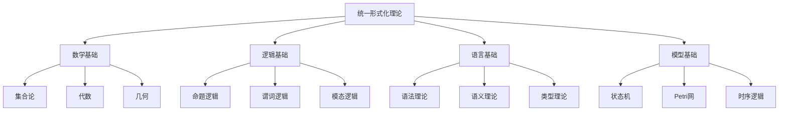

# 07-理论统一与整合-统一形式化理论综述

[返回主题树](../00-主题树与内容索引.md) | [主计划文档](../00-形式化架构理论统一计划.md) | [相关计划](../递归合并计划.md) | [返回上级](../README.md)

> 本文档为理论统一与整合分支统一形式化理论综述，所有最新进展与结论以主计划文档为准，历史细节归档于archive/。

## 目录

- [07-理论统一与整合-统一形式化理论综述](#07-理论统一与整合-统一形式化理论综述)
  - [目录](#目录)
  - [1. 概述](#1-概述)
    - [1.1 统一形式化理论概述](#11-统一形式化理论概述)
    - [1.2 核心目标](#12-核心目标)
    - [1.3 理论层次结构](#13-理论层次结构)
  - [2. 主要文件与内容索引](#2-主要文件与内容索引)
    - [2.1 核心文件](#21-核心文件)
    - [2.2 相关文件](#22-相关文件)
  - [3. 统一理论的基本定义与解释](#3-统一理论的基本定义与解释)
    - [3.1 统一理论的定义](#31-统一理论的定义)
      - [3.1.1 理论框架](#311-理论框架)
      - [3.1.2 统一原则](#312-统一原则)
      - [3.1.3 整合方法](#313-整合方法)
  - [4. 统一理论的基础概念](#4-统一理论的基础概念)
    - [4.1 形式化基础](#41-形式化基础)
      - [4.1.1 数学基础](#411-数学基础)
      - [4.1.2 逻辑基础](#412-逻辑基础)
      - [4.1.3 语言基础](#413-语言基础)
  - [5. 统一理论的主要理论](#5-统一理论的主要理论)
    - [5.1 理论映射](#51-理论映射)
    - [5.2 理论转换](#52-理论转换)
    - [5.3 理论融合](#53-理论融合)
    - [5.4 理论验证](#54-理论验证)
  - [6. 统一理论的行业应用](#6-统一理论的行业应用)
    - [6.1 系统设计](#61-系统设计)
    - [6.2 软件工程](#62-软件工程)
    - [6.3 人工智能](#63-人工智能)
  - [7. 发展历史](#7-发展历史)
  - [8. 应用领域](#8-应用领域)
  - [9. 总结](#9-总结)
  - [10. 相关性跳转与引用](#10-相关性跳转与引用)

## 1. 概述

### 1.1 统一形式化理论概述

统一形式化理论是整合各种形式化方法的综合性理论框架，为形式化架构理论提供了统一的理论基础。统一理论不仅支撑理论整合，也是系统设计和软件工程的重要理论基础。

### 1.2 核心目标

- 建立统一的形式化理论框架
- 提供理论整合的方法论工具
- 支持系统设计和软件工程应用

### 1.3 理论层次结构

## 2. 主要文件与内容索引

### 2.1 核心文件

- [统一形式化理论综述.md](../Matter/Theory/Unified_Formal_Theory_Synthesis/统一形式化理论综述.md)
- [Unified_Formal_Theory_Comprehensive_Synthesis_Extended.md](../Matter/Theory/Unified_Formal_Theory_Synthesis/Unified_Formal_Theory_Comprehensive_Synthesis_Extended.md)

### 2.2 相关文件

- [00-理论统一与整合总论.md](00-理论统一与整合总论.md)
- [01-理论映射关系.md](01-理论映射关系.md)
- [03-理论转换机制.md](03-理论转换机制.md)

## 3. 统一理论的基本定义与解释

### 3.1 统一理论的定义

**定义 3.1.1** 统一形式化理论（Unified Formal Theory）
统一形式化理论是整合各种形式化方法的综合性理论框架。

#### 3.1.1 理论框架

**定义 3.1.2** 理论框架
统一理论框架包含以下要素：

- 基础理论
- 映射关系
- 转换机制
- 验证方法

#### 3.1.2 统一原则

**定义 3.1.3** 统一原则
统一理论遵循以下原则：

- 一致性
- 完备性
- 可扩展性
- 实用性

#### 3.1.3 整合方法

**定义 3.1.4** 整合方法
理论整合采用以下方法：

- 理论映射
- 理论转换
- 理论融合
- 理论验证

## 4. 统一理论的基础概念

### 4.1 形式化基础

#### 4.1.1 数学基础

**基础 4.1.1** 数学基础
统一理论的数学基础包括：

- 集合论
- 代数理论
- 几何理论
- 分析理论

**作用**：

- 提供形式化工具
- 建立理论基础
- 支持推理证明

#### 4.1.2 逻辑基础

**基础 4.1.2** 逻辑基础
统一理论的逻辑基础包括：

- 命题逻辑
- 谓词逻辑
- 模态逻辑
- 时序逻辑

**作用**：

- 提供推理工具
- 建立证明方法
- 支持形式验证

#### 4.1.3 语言基础

**基础 4.1.3** 语言基础
统一理论的语言基础包括：

- 语法理论
- 语义理论
- 类型理论
- 编译理论

**作用**：

- 提供语言工具
- 建立表达方法
- 支持实现技术

## 5. 统一理论的主要理论

### 5.1 理论映射

**理论 5.1.1** 理论映射（Theory Mapping）
理论映射建立不同理论之间的对应关系。

**方法**：

- 同构映射
- 同态映射
- 嵌入映射
- 投影映射

### 5.2 理论转换

**理论 5.2.1** 理论转换（Theory Transformation）
理论转换实现不同理论之间的相互转换。

**类型**：

- 语法转换
- 语义转换
- 模型转换
- 证明转换

### 5.3 理论融合

**理论 5.3.1** 理论融合（Theory Fusion）
理论融合将多个理论整合为统一理论。

**策略**：

- 并集融合
- 交集融合
- 加权融合
- 层次融合

### 5.4 理论验证

**理论 5.4.1** 理论验证（Theory Verification）
理论验证确保统一理论的正确性和一致性。

**方法**：

- 形式化验证
- 模型检查
- 定理证明
- 测试验证

## 6. 统一理论的行业应用

### 6.1 系统设计

- 架构设计
- 模块设计
- 接口设计

### 6.2 软件工程

- 需求分析
- 系统建模
- 代码生成

### 6.3 人工智能

- 知识表示
- 推理系统
- 机器学习

## 7. 发展历史

统一形式化理论的发展经历了从单一理论到综合理论的演进过程。图灵、丘奇、哥德尔、斯科特等学者为统一理论的发展做出了重要贡献。

## 8. 应用领域

统一理论在系统设计、软件工程、人工智能等领域有广泛应用，是现代计算机科学的重要理论基础。

## 9. 总结

统一形式化理论作为理论统一与整合的重要分支，为形式化架构理论提供了重要的理论整合工具，是理解理论统一的基础理论。

## 10. 相关性跳转与引用

- [00-理论统一与整合总论.md](00-理论统一与整合总论.md)
- [01-理论映射关系.md](01-理论映射关系.md)
- [03-理论转换机制.md](03-理论转换机制.md)
- [04-理论融合策略.md](04-理论融合策略.md)
- [05-理论验证方法.md](05-理论验证方法.md)
- [06-理论应用实践.md](06-理论应用实践.md)
- [00-主题树与内容索引.md](../00-主题树与内容索引.md)
- [进度追踪与上下文.md](../进度追踪与上下文.md)

---

> 本文件为自动归纳生成，后续将递归细化相关内容，持续补全图表、公式、代码等多表征内容。
