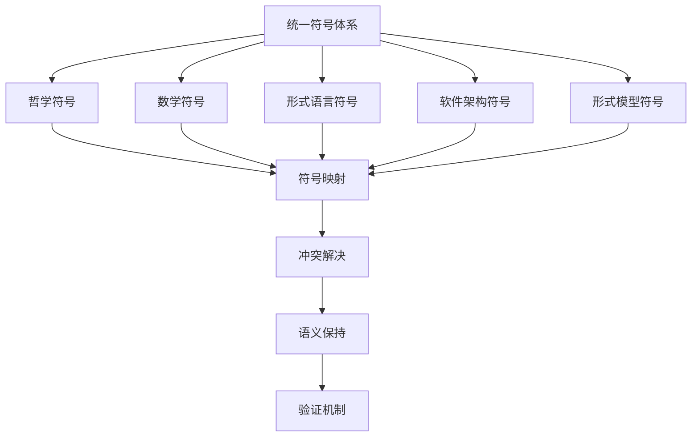

# 统一符号体系

## 1. 理论基础

统一符号体系为各理论分支提供标准化的符号表示，确保跨领域的形式化表达的一致性和可理解性。

### 1.1 统一原则

- 符号唯一性：每个概念对应唯一符号
- 语义明确性：符号含义清晰无歧义
- 层次结构性：符号体系具有层次结构
- 扩展兼容性：支持新符号的添加

## 2. 基本概念

### 2.1 符号定义

```rust
pub struct Symbol {
    pub name: String,
    pub notation: String,
    pub domain: SymbolDomain,
    pub interpretation: String,
    pub precedence: u32,
    pub associativity: Associativity,
}

pub enum SymbolDomain {
    Philosophy,
    Mathematics,
    FormalLanguage,
    SoftwareArchitecture,
    FormalModel,
}

pub enum Associativity {
    Left,
    Right,
    None,
}

pub struct SymbolRegistry {
    pub symbols: HashMap<String, Symbol>,
    pub categories: HashMap<String, Vec<String>>,
    pub conflicts: Vec<SymbolConflict>,
}
```

### 2.2 符号分类

```rust
pub enum SymbolType {
    Constant,      // 常量符号
    Variable,      // 变量符号
    Operator,      // 操作符
    Function,      // 函数符号
    Predicate,     // 谓词符号
    Quantifier,    // 量词符号
    Connective,    // 连接词符号
}
```

## 3. 统一规则

### 3.1 命名规则

```rust
pub struct NamingConvention {
    pub prefix_rules: Vec<PrefixRule>,
    pub suffix_rules: Vec<SuffixRule>,
    pub case_rules: Vec<CaseRule>,
}

impl NamingConvention {
    pub fn generate_symbol_name(&self, concept: &Concept, domain: &SymbolDomain) -> Result<String, Error> {
        // 1. 应用前缀规则
        let prefix = self.apply_prefix_rules(concept, domain)?;
        
        // 2. 应用后缀规则
        let suffix = self.apply_suffix_rules(concept, domain)?;
        
        // 3. 应用大小写规则
        let name = self.apply_case_rules(&format!("{}{}", prefix, suffix))?;
        
        Ok(name)
    }
}
```

### 3.2 冲突解决

```rust
pub struct ConflictResolver {
    pub resolution_strategies: Vec<ResolutionStrategy>,
    pub priority_rules: Vec<PriorityRule>,
}

impl ConflictResolver {
    pub fn resolve_conflict(&self, conflict: &SymbolConflict) -> Result<Resolution, Error> {
        // 1. 分析冲突类型
        let conflict_type = self.analyze_conflict_type(conflict);
        
        // 2. 选择解决策略
        let strategy = self.select_strategy(&conflict_type)?;
        
        // 3. 应用解决策略
        let resolution = strategy.apply(conflict)?;
        
        // 4. 验证解决方案
        self.validate_resolution(&resolution)?;
        
        Ok(resolution)
    }
    
    fn analyze_conflict_type(&self, conflict: &SymbolConflict) -> ConflictType {
        match conflict {
            SymbolConflict::NameCollision { .. } => ConflictType::NameCollision,
            SymbolConflict::NotationCollision { .. } => ConflictType::NotationCollision,
            SymbolConflict::SemanticConflict { .. } => ConflictType::SemanticConflict,
        }
    }
}
```

## 4. 符号映射

### 4.1 跨域映射

```rust
pub struct CrossDomainMapper {
    pub domain_mappings: HashMap<SymbolDomain, DomainMapping>,
    pub translation_rules: Vec<TranslationRule>,
}

impl CrossDomainMapper {
    pub fn map_symbol(&self, symbol: &Symbol, target_domain: &SymbolDomain) -> Result<Symbol, Error> {
        // 1. 查找域映射
        let domain_mapping = self.domain_mappings.get(target_domain)
            .ok_or(Error::DomainMappingNotFound)?;
        
        // 2. 应用翻译规则
        let translated_symbol = self.apply_translation_rules(symbol, domain_mapping)?;
        
        // 3. 验证映射结果
        self.validate_mapping(&translated_symbol, target_domain)?;
        
        Ok(translated_symbol)
    }
}
```

### 4.2 语义保持

```rust
pub struct SemanticPreserver {
    pub semantic_rules: Vec<SemanticRule>,
    pub equivalence_checker: EquivalenceChecker,
}

impl SemanticPreserver {
    pub fn preserve_semantics(&self, original_symbol: &Symbol, transformed_symbol: &Symbol) -> Result<bool, Error> {
        // 1. 提取语义特征
        let original_semantics = self.extract_semantics(original_symbol)?;
        let transformed_semantics = self.extract_semantics(transformed_symbol)?;
        
        // 2. 应用语义规则
        let semantic_equivalence = self.apply_semantic_rules(&original_semantics, &transformed_semantics)?;
        
        // 3. 等价性检查
        let is_equivalent = self.equivalence_checker.check_equivalence(&original_semantics, &transantic_semantics)?;
        
        Ok(semantic_equivalence && is_equivalent)
    }
}
```

## 5. 符号系统

### 5.1 哲学符号

```rust
pub struct PhilosophySymbols {
    pub ontology_symbols: HashMap<String, Symbol>,
    pub epistemology_symbols: HashMap<String, Symbol>,
    pub logic_symbols: HashMap<String, Symbol>,
}

impl PhilosophySymbols {
    pub fn get_being_symbol(&self) -> Symbol {
        Symbol {
            name: "Being".to_string(),
            notation: "∃".to_string(),
            domain: SymbolDomain::Philosophy,
            interpretation: "存在".to_string(),
            precedence: 1,
            associativity: Associativity::None,
        }
    }
    
    pub fn get_truth_symbol(&self) -> Symbol {
        Symbol {
            name: "Truth".to_string(),
            notation: "⊤".to_string(),
            domain: SymbolDomain::Philosophy,
            interpretation: "真".to_string(),
            precedence: 1,
            associativity: Associativity::None,
        }
    }
}
```

### 5.2 数学符号

```rust
pub struct MathematicsSymbols {
    pub set_symbols: HashMap<String, Symbol>,
    pub algebra_symbols: HashMap<String, Symbol>,
    pub logic_symbols: HashMap<String, Symbol>,
}

impl MathematicsSymbols {
    pub fn get_set_symbol(&self) -> Symbol {
        Symbol {
            name: "Set".to_string(),
            notation: "{}".to_string(),
            domain: SymbolDomain::Mathematics,
            interpretation: "集合".to_string(),
            precedence: 1,
            associativity: Associativity::None,
        }
    }
    
    pub fn get_function_symbol(&self) -> Symbol {
        Symbol {
            name: "Function".to_string(),
            notation: "→".to_string(),
            domain: SymbolDomain::Mathematics,
            interpretation: "函数".to_string(),
            precedence: 2,
            associativity: Associativity::Right,
        }
    }
}
```

## 6. 形式化表示

### 6.1 符号体系图



### 6.2 数学表示

统一符号体系可定义为 $S = (D, R, M)$，其中：

- $D$ 为符号域集合
- $R$ 为符号关系集合
- $M$ 为映射函数集合

符号约束：
$$\forall s_1, s_2 \in S: s_1 \neq s_2 \Rightarrow \text{notation}(s_1) \neq \text{notation}(s_2)$$

## 7. 交叉引用

### 7.1 相关理论

- [理论统一与整合总论](00-理论统一与整合总论.md)
- [理论映射关系](01-理论映射关系.md)
- [跨领域证明](03-跨领域证明.md)

### 7.2 实践应用

- [应用框架](04-应用框架.md)
- [实践应用开发](../08-实践应用开发/README.md)

## 8. 导航

- [返回理论统一与整合总论](00-理论统一与整合总论.md)
- [理论映射关系](01-理论映射关系.md)
- [跨领域证明](03-跨领域证明.md)
- [应用框架](04-应用框架.md)
