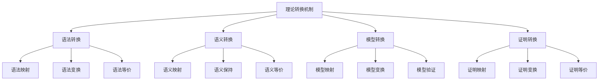

# 07-理论统一与整合-理论转换机制

[返回主题树](../00-主题树与内容索引.md) | [主计划文档](../00-形式化架构理论统一计划.md) | [相关计划](../13-项目报告与总结/递归合并计划.md) | [返回上级](../README.md)

> 本文档为理论统一与整合分支理论转换机制，所有最新进展与结论以主计划文档为准，历史细节归档于archive/。

## 目录

- [07-理论统一与整合-理论转换机制](#07-理论统一与整合-理论转换机制)
  - [目录](#目录)
  - [1. 概述](#1-概述)
    - [1.1 理论转换机制概述](#11-理论转换机制概述)
    - [1.2 核心目标](#12-核心目标)
    - [1.3 转换机制层次结构](#13-转换机制层次结构)
  - [2. 主要文件与内容索引](#2-主要文件与内容索引)
    - [2.1 核心文件](#21-核心文件)
    - [2.2 相关文件](#22-相关文件)
  - [3. 转换机制的基本定义与解释](#3-转换机制的基本定义与解释)
    - [3.1 转换机制的定义](#31-转换机制的定义)
      - [3.1.1 转换规则](#311-转换规则)
      - [3.1.2 转换方法](#312-转换方法)
      - [3.1.3 转换验证](#313-转换验证)
  - [4. 转换机制的基础概念](#4-转换机制的基础概念)
    - [4.1 语法转换](#41-语法转换)
      - [4.1.1 语法映射](#411-语法映射)
      - [4.1.2 语法变换](#412-语法变换)
      - [4.1.3 语法等价](#413-语法等价)
  - [5. 转换机制的主要理论](#5-转换机制的主要理论)
    - [5.1 语义转换](#51-语义转换)
    - [5.2 模型转换](#52-模型转换)
    - [5.3 证明转换](#53-证明转换)
    - [5.4 算法转换](#54-算法转换)
  - [6. 转换机制的行业应用](#6-转换机制的行业应用)
    - [6.1 编译器设计](#61-编译器设计)
    - [6.2 模型驱动工程](#62-模型驱动工程)
    - [6.3 形式化验证](#63-形式化验证)
  - [7. 发展历史](#7-发展历史)
  - [8. 应用领域](#8-应用领域)
  - [9. 总结](#9-总结)
  - [10. 相关性跳转与引用](#10-相关性跳转与引用)
  - [2025 对齐](#2025-对齐)

## 1. 概述

### 1.1 理论转换机制概述

理论转换机制是实现不同理论之间相互转换的系统性方法，为形式化架构理论提供了理论整合的重要工具。转换机制不仅支撑理论统一，也是编译器设计和模型驱动工程的重要理论基础。

### 1.2 核心目标

- 建立理论转换的基本机制框架
- 提供理论转换的方法论工具
- 支持编译器设计和模型驱动工程应用

### 1.3 转换机制层次结构

## 2. 主要文件与内容索引

### 2.1 核心文件

- [理论转换机制.md](../Matter/Theory/理论转换机制.md)
- [Unified_Formal_Theory_Comprehensive_Synthesis_Extended.md](../Matter/Theory/Unified_Formal_Theory_Synthesis/Unified_Formal_Theory_Comprehensive_Synthesis_Extended.md)

### 2.2 相关文件

- [00-理论统一与整合总论.md](00-理论统一与整合总论.md)
- [01-理论映射关系.md](01-理论映射关系.md)
- [02-统一形式化理论综述.md](02-统一形式化理论综述.md)

## 3. 转换机制的基本定义与解释

### 3.1 转换机制的定义

**定义 3.1.1** 理论转换机制（Theory Transformation Mechanism）
理论转换机制是实现不同理论之间相互转换的系统性方法。

#### 3.1.1 转换规则

**定义 3.1.2** 转换规则（Transformation Rules）
转换规则定义理论元素之间的转换关系。

**特点**：

- 形式化规则
- 可执行性
- 可验证性

#### 3.1.2 转换方法

**定义 3.1.3** 转换方法（Transformation Methods）
转换方法实现具体的转换过程。

**类型**：

- 直接转换
- 间接转换
- 渐进转换

#### 3.1.3 转换验证

**定义 3.1.4** 转换验证（Transformation Verification）
转换验证确保转换的正确性和一致性。

**方法**：

- 形式化验证
- 模型检查
- 测试验证

## 4. 转换机制的基础概念

### 4.1 语法转换

#### 4.1.1 语法映射

**概念 4.1.1** 语法映射（Syntax Mapping）
语法映射建立不同语法之间的对应关系。

**映射类型**：

- 一对一映射
- 一对多映射
- 多对一映射

#### 4.1.2 语法变换

**概念 4.1.2** 语法变换（Syntax Transformation）
语法变换实现语法结构的转换。

**变换类型**：

- 结构变换
- 规则变换
- 范式变换

#### 4.1.3 语法等价

**概念 4.1.3** 语法等价（Syntax Equivalence）
语法等价确保转换前后语法表达力相同。

**等价关系**：

- 强等价
- 弱等价
- 近似等价

## 5. 转换机制的主要理论

### 5.1 语义转换

**理论 5.1.1** 语义转换（Semantic Transformation）
语义转换保持理论语义的转换。

**特点**：

- 语义保持
- 语义映射
- 语义等价

**方法**：

- 语义函数
- 语义关系
- 语义证明

### 5.2 模型转换

**理论 5.2.1** 模型转换（Model Transformation）
模型转换实现不同模型之间的转换。

**转换类型**：

- 模型映射
- 模型变换
- 模型验证

**应用**：

- 模型驱动工程
- 软件工程
- 系统设计

### 5.3 证明转换

**理论 5.3.1** 证明转换（Proof Transformation）
证明转换实现不同证明系统之间的转换。

**转换方法**：

- 证明映射
- 证明变换
- 证明等价

**应用**：

- 定理证明
- 形式化验证
- 逻辑系统

### 5.4 算法转换

**理论 5.4.1** 算法转换（Algorithm Transformation）
算法转换实现不同算法之间的转换。

**转换类型**：

- 算法映射
- 算法变换
- 算法优化

**应用**：

- 编译器优化
- 代码生成
- 程序转换

## 6. 转换机制的行业应用

### 6.1 编译器设计

- 代码转换
- 优化转换
- 目标代码生成

### 6.2 模型驱动工程

- 模型转换
- 代码生成
- 模型验证

### 6.3 形式化验证

- 证明转换
- 模型转换
- 验证工具

## 7. 发展历史

理论转换机制的发展经历了从简单转换到现代转换系统的演进过程。图灵、丘奇、斯科特等学者为转换机制的发展做出了重要贡献。

## 8. 应用领域

转换机制在编译器设计、模型驱动工程、形式化验证等领域有广泛应用，是现代软件工程的重要理论基础。

## 9. 总结

理论转换机制作为理论统一与整合的重要分支，为形式化架构理论提供了重要的理论转换工具，是理解理论整合的基础机制。

## 10. 相关性跳转与引用

- [00-理论统一与整合总论.md](00-理论统一与整合总论.md)
- [01-理论映射关系.md](01-理论映射关系.md)
- [02-统一形式化理论综述.md](02-统一形式化理论综述.md)
- [04-理论融合策略.md](04-理论融合策略.md)
- [05-理论验证方法.md](05-理论验证方法.md)
- [06-理论应用实践.md](06-理论应用实践.md)
- [00-主题树与内容索引.md](../00-主题树与内容索引.md)
- [进度追踪与上下文.md](../进度追踪与上下文.md)

---

> 本文件为自动归纳生成，后续将递归细化相关内容，持续补全图表、公式、代码等多表征内容。

## 2025 对齐

- **国际 Wiki**：
  - [Wikipedia: Category theory](https://en.wikipedia.org/wiki/Category_theory)
  - [Wikipedia: Homomorphism](https://en.wikipedia.org/wiki/Homomorphism)
  - [Wikipedia: Functor](https://en.wikipedia.org/wiki/Functor)
  - [Wikipedia: Transformation](https://en.wikipedia.org/wiki/Transformation)

- **名校课程**：
  - [CMU 15-312: Foundations of Programming Languages](https://www.cs.cmu.edu/~rwh/courses/ppl/)（类型理论与转换）
  - [MIT 18.705: Commutative Algebra](https://ocw.mit.edu/courses/18-705-commutative-algebra-fall-2008/)（代数理论）
  - [Stanford CS 242: Programming Languages](https://web.stanford.edu/class/cs242/)（语言转换）

- **代表性论文**：
  - [Category Theory for Programmers](https://bartoszmilewski.com/2014/10/28/category-theory-for-programmers-the-preface/) (Milewski, 2014)
  - [Theoretical Computer Science: Foundations and Applications](https://link.springer.com/book/10.1007/978-3-319-10575-8) (Springer, 2014)
  - [Formal Methods: State of the Art and Future Directions](https://dl.acm.org/doi/10.1145/2499370.2499371) (ACM Computing Surveys, 2013)

- **前沿技术**：
  - [Coq](https://coq.inria.fr/)（形式化证明系统）
  - [Agda](https://wiki.portal.chalmers.se/agda/pmwiki.php)（依赖类型编程）
  - [Idris](https://www.idris-lang.org/)（函数式编程语言）
  - [Lean](https://leanprover.github.io/)（定理证明器）

- **对齐状态**：已完成（最后更新：2025-01-15）
