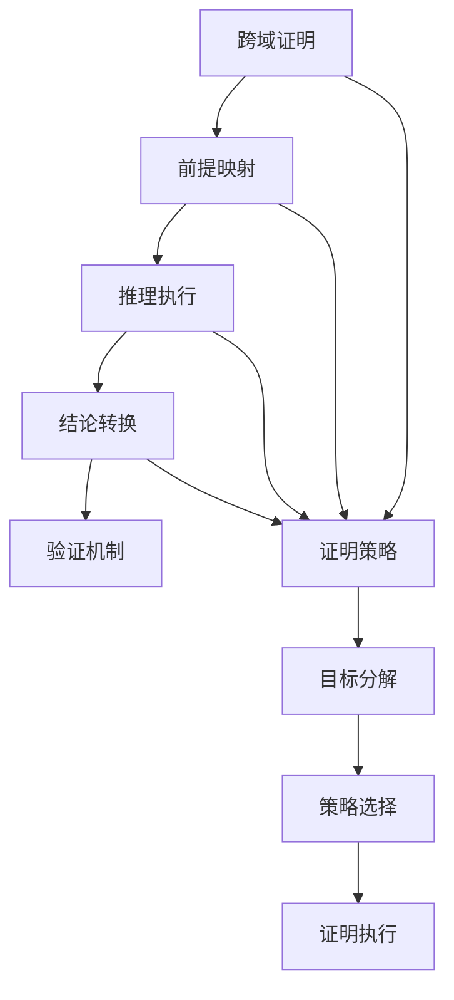

# 跨领域证明

## 目录

- [跨领域证明](#跨领域证明)
  - [目录](#目录)
  - [1. 理论基础](#1-理论基础)
    - [1.1 证明目标](#11-证明目标)
  - [2. 基本概念](#2-基本概念)
    - [2.1 证明框架](#21-证明框架)
    - [2.2 证明验证](#22-证明验证)
  - [3. 推理规则](#3-推理规则)
    - [3.1 跨域推理](#31-跨域推理)
    - [3.2 逻辑推理](#32-逻辑推理)
  - [4. 证明策略](#4-证明策略)
    - [4.1 目标分解](#41-目标分解)
    - [4.2 策略选择](#42-策略选择)
    - [4.3 USTS-UMS证明策略](#43-usts-ums证明策略)
  - [5. 证明示例](#5-证明示例)
    - [5.1 哲学到数学的证明](#51-哲学到数学的证明)
    - [5.2 数学到软件的证明](#52-数学到软件的证明)
    - [5.3 USTS-UMS映射正确性证明](#53-usts-ums映射正确性证明)
    - [5.4 行为等价性证明](#54-行为等价性证明)
    - [5.5 性质保持证明](#55-性质保持证明)
  - [6. 形式化表示](#6-形式化表示)
    - [6.1 证明结构图](#61-证明结构图)
    - [6.2 数学表示](#62-数学表示)
  - [7. 交叉引用](#7-交叉引用)
    - [7.1 相关理论](#71-相关理论)
    - [7.2 实践应用](#72-实践应用)
  - [8. 导航](#8-导航)

## 1. 理论基础

跨领域证明研究如何在不同理论分支间进行形式化推理和证明，建立统一的证明框架，实现跨理论的形式化验证。

### 1.1 证明目标

- 跨理论一致性证明
- 理论间转换正确性证明
- 综合性质验证
- 系统级正确性保证

## 2. 基本概念

### 2.1 证明框架

```rust
pub struct CrossDomainProof {
    pub premises: Vec<Premise>,
    pub inference_rules: Vec<InferenceRule>,
    pub conclusion: Conclusion,
    pub proof_steps: Vec<ProofStep>,
}

pub struct Premise {
    pub theory: Theory,
    pub statement: Statement,
    pub validity: ValidityProof,
}

pub struct InferenceRule {
    pub name: String,
    pub applicability: ApplicabilityCondition,
    pub transformation: ProofTransformation,
    pub soundness_proof: SoundnessProof,
}

pub struct ProofStep {
    pub step_number: u32,
    pub rule_applied: String,
    pub input_statements: Vec<Statement>,
    pub output_statement: Statement,
    pub justification: String,
}
```

### 2.2 证明验证

```rust
pub struct ProofVerifier {
    pub syntax_checker: SyntaxChecker,
    pub semantic_checker: SemanticChecker,
    pub consistency_checker: ConsistencyChecker,
}

impl ProofVerifier {
    pub fn verify_proof(&self, proof: &CrossDomainProof) -> Result<VerificationResult, Error> {
        // 1. 语法检查
        let syntax_valid = self.syntax_checker.check(proof)?;
        
        // 2. 语义验证
        let semantic_valid = self.semantic_checker.check(proof)?;
        
        // 3. 一致性检查
        let consistent = self.consistency_checker.check(proof)?;
        
        Ok(VerificationResult {
            is_valid: syntax_valid && semantic_valid && consistent,
            details: vec![syntax_valid, semantic_valid, consistent],
        })
    }
}
```

## 3. 推理规则

### 3.1 跨域推理

```rust
pub struct CrossDomainInference {
    pub domain_mappings: HashMap<Theory, DomainMapping>,
    pub translation_rules: Vec<TranslationRule>,
}

impl CrossDomainInference {
    pub fn infer(&self, premises: &[Premise], target_theory: &Theory) -> Result<Conclusion, Error> {
        // 1. 理论映射
        let mapped_premises = self.map_premises(premises, target_theory)?;
        
        // 2. 推理执行
        let intermediate_conclusion = self.execute_inference(&mapped_premises)?;
        
        // 3. 结果转换
        let final_conclusion = self.translate_conclusion(&intermediate_conclusion, target_theory)?;
        
        Ok(final_conclusion)
    }
    
    fn map_premises(&self, premises: &[Premise], target_theory: &Theory) -> Result<Vec<Premise>, Error> {
        let mut mapped_premises = Vec::new();
        
        for premise in premises {
            let mapping = self.domain_mappings.get(&premise.theory)
                .ok_or(Error::MappingNotFound)?;
            
            let mapped_statement = self.translate_statement(&premise.statement, mapping)?;
            
            mapped_premises.push(Premise {
                theory: target_theory.clone(),
                statement: mapped_statement,
                validity: premise.validity.clone(),
            });
        }
        
        Ok(mapped_premises)
    }
}
```

### 3.2 逻辑推理

```rust
pub struct LogicalInference {
    pub logical_rules: Vec<LogicalRule>,
    pub proof_strategies: Vec<ProofStrategy>,
}

impl LogicalInference {
    pub fn apply_rule(&self, rule: &LogicalRule, statements: &[Statement]) -> Result<Statement, Error> {
        // 1. 检查规则适用性
        if !self.is_applicable(rule, statements)? {
            return Err(Error::RuleNotApplicable);
        }
        
        // 2. 应用规则转换
        let result = rule.transformation.apply(statements)?;
        
        // 3. 验证结果
        self.validate_result(&result, rule)?;
        
        Ok(result)
    }
    
    fn is_applicable(&self, rule: &LogicalRule, statements: &[Statement]) -> Result<bool, Error> {
        // 检查规则的前置条件
        for condition in &rule.applicability {
            if !condition.check(statements)? {
                return Ok(false);
            }
        }
        Ok(true)
    }
}
```

## 4. 证明策略

### 4.1 目标分解

```rust
pub struct GoalDecomposer {
    pub decomposition_rules: Vec<DecompositionRule>,
    pub subgoal_generator: SubgoalGenerator,
}

impl GoalDecomposer {
    pub fn decompose_goal(&self, goal: &Goal) -> Result<Vec<Subgoal>, Error> {
        // 1. 分析目标结构
        let goal_structure = self.analyze_goal_structure(goal)?;
        
        // 2. 选择分解策略
        let strategy = self.select_decomposition_strategy(&goal_structure)?;
        
        // 3. 生成子目标
        let subgoals = self.subgoal_generator.generate_subgoals(goal, strategy)?;
        
        Ok(subgoals)
    }
}
```

### 4.2 策略选择

```rust
pub struct StrategySelector {
    pub strategies: Vec<ProofStrategy>,
    pub selection_rules: Vec<SelectionRule>,
}

impl StrategySelector {
    pub fn select_strategy(&self, goal: &Goal, context: &ProofContext) -> Result<ProofStrategy, Error> {
        // 1. 分析目标特征
        let goal_features = self.analyze_goal_features(goal)?;
        
        // 2. 评估策略适用性
        let strategy_scores = self.evaluate_strategies(&goal_features, context)?;
        
        // 3. 选择最佳策略
        let best_strategy = self.select_best_strategy(&strategy_scores)?;
        
        Ok(best_strategy)
    }
}
```

### 4.3 USTS-UMS证明策略

```rust
pub struct USTS_UMS_ProofStrategy {
    pub mapping_proofs: Vec<MappingProof>,
    pub equivalence_proofs: Vec<EquivalenceProof>,
    pub preservation_proofs: Vec<PreservationProof>,
}

impl USTS_UMS_ProofStrategy {
    pub fn prove_mapping_correctness(&self, mapping: &USTS_UMS_Mapping) -> Result<MappingCorrectnessProof, Error> {
        // 证明USTS到UMS映射的正确性
        let mut proof_steps = Vec::new();
        
        // 1. 证明状态到组件映射的正确性
        for (state, component) in &mapping.state_to_component {
            let step = self.prove_state_component_mapping(state, component)?;
            proof_steps.push(step);
        }
        
        // 2. 证明转换到接口映射的正确性
        for (transition, interface) in &mapping.transition_to_interface {
            let step = self.prove_transition_interface_mapping(transition, interface)?;
            proof_steps.push(step);
        }
        
        // 3. 证明事件到消息映射的正确性
        for (event, message) in &mapping.event_to_message {
            let step = self.prove_event_message_mapping(event, message)?;
            proof_steps.push(step);
        }
        
        // 4. 证明约束到契约映射的正确性
        for (constraint, contract) in &mapping.constraint_to_contract {
            let step = self.prove_constraint_contract_mapping(constraint, contract)?;
            proof_steps.push(step);
        }
        
        Ok(MappingCorrectnessProof {
            mapping: mapping.clone(),
            proof_steps,
            conclusion: "USTS to UMS mapping is correct".to_string(),
        })
    }
    
    pub fn prove_behavioral_equivalence(&self, usts_behavior: &USTSBehavior, ums_behavior: &UMSBehavior) -> Result<BehavioralEquivalenceProof, Error> {
        // 证明USTS行为和UMS行为的等价性
        let mut proof_steps = Vec::new();
        
        match (usts_behavior, ums_behavior) {
            (USTSBehavior::Sequential { states }, UMSBehavior::Sequential { components }) => {
                // 证明顺序行为的等价性
                let step = self.prove_sequential_equivalence(states, components)?;
                proof_steps.push(step);
            },
            (USTSBehavior::Parallel { states }, UMSBehavior::Parallel { components }) => {
                // 证明并行行为的等价性
                let step = self.prove_parallel_equivalence(states, components)?;
                proof_steps.push(step);
            },
            (USTSBehavior::Conditional { condition, then_branch, else_branch }, 
             UMSBehavior::Conditional { condition: comp_condition, then_branch: comp_then, else_branch: comp_else }) => {
                // 证明条件行为的等价性
                let step = self.prove_conditional_equivalence(condition, then_branch, else_branch, 
                                                             comp_condition, comp_then, comp_else)?;
                proof_steps.push(step);
            },
            _ => return Err(Error::BehaviorMismatch),
        }
        
        Ok(BehavioralEquivalenceProof {
            usts_behavior: usts_behavior.clone(),
            ums_behavior: ums_behavior.clone(),
            proof_steps,
            conclusion: "USTS and UMS behaviors are equivalent".to_string(),
        })
    }
    
    pub fn prove_property_preservation(&self, usts_property: &USTSProperty, ums_property: &UMSProperty) -> Result<PropertyPreservationProof, Error> {
        // 证明USTS性质在UMS中的保持
        let mut proof_steps = Vec::new();
        
        match (usts_property, ums_property) {
            (USTSProperty::Invariant { condition }, UMSProperty::Invariant { condition: comp_condition }) => {
                // 证明不变性质的保持
                let step = self.prove_invariant_preservation(condition, comp_condition)?;
                proof_steps.push(step);
            },
            (USTSProperty::Liveness { condition }, UMSProperty::Liveness { condition: comp_condition }) => {
                // 证明活性性质的保持
                let step = self.prove_liveness_preservation(condition, comp_condition)?;
                proof_steps.push(step);
            },
            (USTSProperty::Safety { condition }, UMSProperty::Safety { condition: comp_condition }) => {
                // 证明安全性质的保持
                let step = self.prove_safety_preservation(condition, comp_condition)?;
                proof_steps.push(step);
            },
            _ => return Err(Error::PropertyMismatch),
        }
        
        Ok(PropertyPreservationProof {
            usts_property: usts_property.clone(),
            ums_property: ums_property.clone(),
            proof_steps,
            conclusion: "USTS property is preserved in UMS".to_string(),
        })
    }
}
```

## 5. 证明示例

### 5.1 哲学到数学的证明

```rust
pub struct PhilosophyToMathProof {
    pub ontology_mapper: OntologyMapper,
    pub logic_translator: LogicTranslator,
}

impl PhilosophyToMathProof {
    pub fn prove_existence(&self, philosophical_statement: &Statement) -> Result<MathTheorem, Error> {
        // 1. 哲学陈述解析
        let ontology_concept = self.parse_ontology_concept(philosophical_statement)?;
        
        // 2. 映射到数学概念
        let math_concept = self.ontology_mapper.map_to_math(ontology_concept)?;
        
        // 3. 构建数学证明
        let math_proof = self.construct_math_proof(math_concept)?;
        
        // 4. 验证证明正确性
        self.verify_math_proof(&math_proof)?;
        
        Ok(math_proof)
    }
}
```

### 5.2 数学到软件的证明

```rust
pub struct MathToSoftwareProof {
    pub algebra_mapper: AlgebraMapper,
    pub invariant_translator: InvariantTranslator,
}

impl MathToSoftwareProof {
    pub fn prove_invariant(&self, math_theorem: &MathTheorem) -> Result<SoftwareInvariant, Error> {
        // 1. 数学定理分析
        let mathematical_structure = self.analyze_math_structure(math_theorem)?;
        
        // 2. 映射到软件结构
        let software_structure = self.algebra_mapper.map_to_software(mathematical_structure)?;
        
        // 3. 生成软件不变量
        let invariant = self.invariant_translator.translate_invariant(software_structure)?;
        
        // 4. 验证不变量正确性
        self.verify_invariant(&invariant)?;
        
        Ok(invariant)
    }
}
```

### 5.3 USTS-UMS映射正确性证明

```rust
// 示例：证明交通灯状态机到组件系统的映射正确性
pub struct TrafficLightMappingProof;

impl TrafficLightMappingProof {
    pub fn prove_traffic_light_mapping(&self) -> Result<MappingCorrectnessProof, Error> {
        // 1. 定义原始USTS
        let traffic_light_usts = USTS {
            states: vec![
                State::Simple { id: "red".to_string(), properties: vec!["stop".to_string()] },
                State::Simple { id: "yellow".to_string(), properties: vec!["caution".to_string()] },
                State::Simple { id: "green".to_string(), properties: vec!["go".to_string()] },
            ],
            transitions: vec![
                Transition {
                    id: "red_to_green".to_string(),
                    source: "red".to_string(),
                    target: "green".to_string(),
                    event: "timer_expired".to_string(),
                    conditions: vec!["timer >= 30".to_string()],
                    actions: vec!["start_green_timer".to_string()],
                },
                // ... 其他转换
            ],
        };
        
        // 2. 定义映射后的UMS
        let traffic_light_ums = ComponentSystem {
            components: vec![
                Component::Atomic {
                    id: "red_light".to_string(),
                    behavior: Behavior::State { properties: vec!["stop".to_string()] },
                    interface: Interface {
                        id: "red_interface".to_string(),
                        methods: vec![
                            Method {
                                name: "trigger_timer_expired".to_string(),
                                signature: Signature {
                                    parameters: vec!["timer".to_string()],
                                    return_type: Type::Unit,
                                },
                                contract: Contract::Precondition {
                                    condition: "timer >= 30".to_string(),
                                    verification: VerificationMethod::RuntimeCheck,
                                },
                            },
                        ],
                        events: vec![
                            Event {
                                name: "timer_expired".to_string(),
                                payload: vec!["timer".to_string()],
                            },
                        ],
                    },
                },
                // ... 其他组件
            ],
        };
        
        // 3. 构建映射关系
        let mapping = USTS_UMS_Mapping {
            state_to_component: HashMap::from([
                (State::Simple { id: "red".to_string(), properties: vec!["stop".to_string()] },
                 Component::Atomic { id: "red_light".to_string(), behavior: Behavior::State { properties: vec!["stop".to_string()] }, interface: Interface::empty() }),
                // ... 其他映射
            ]),
            transition_to_interface: HashMap::from([
                (Transition { id: "red_to_green".to_string(), source: "red".to_string(), target: "green".to_string(), event: "timer_expired".to_string(), conditions: vec!["timer >= 30".to_string()], actions: vec!["start_green_timer".to_string()] },
                 Interface { id: "red_interface".to_string(), methods: vec![], events: vec![] }),
                // ... 其他映射
            ]),
            event_to_message: HashMap::new(),
            constraint_to_contract: HashMap::new(),
        };
        
        // 4. 执行证明
        let proof_strategy = USTS_UMS_ProofStrategy::new();
        let proof = proof_strategy.prove_mapping_correctness(&mapping)?;
        
        Ok(proof)
    }
}
```

### 5.4 行为等价性证明

```rust
// 示例：证明顺序状态转换与顺序组件执行的等价性
pub struct SequentialBehaviorEquivalenceProof;

impl SequentialBehaviorEquivalenceProof {
    pub fn prove_sequential_equivalence(&self) -> Result<BehavioralEquivalenceProof, Error> {
        // 1. USTS顺序行为
        let usts_sequential = USTSBehavior::Sequential {
            states: vec![
                State::Simple { id: "init".to_string(), properties: vec!["initialized".to_string()] },
                State::Simple { id: "processing".to_string(), properties: vec!["processing".to_string()] },
                State::Simple { id: "complete".to_string(), properties: vec!["completed".to_string()] },
            ],
        };
        
        // 2. UMS顺序行为
        let ums_sequential = UMSBehavior::Sequential {
            components: vec![
                Component::Atomic { id: "init_comp".to_string(), behavior: Behavior::State { properties: vec!["initialized".to_string()] }, interface: Interface::empty() },
                Component::Atomic { id: "process_comp".to_string(), behavior: Behavior::State { properties: vec!["processing".to_string()] }, interface: Interface::empty() },
                Component::Atomic { id: "complete_comp".to_string(), behavior: Behavior::State { properties: vec!["completed".to_string()] }, interface: Interface::empty() },
            ],
        };
        
        // 3. 证明等价性
        let proof_strategy = USTS_UMS_ProofStrategy::new();
        let proof = proof_strategy.prove_behavioral_equivalence(&usts_sequential, &ums_sequential)?;
        
        Ok(proof)
    }
}
```

### 5.5 性质保持证明

```rust
// 示例：证明不变性质在映射过程中的保持
pub struct InvariantPreservationProof;

impl InvariantPreservationProof {
    pub fn prove_invariant_preservation(&self) -> Result<PropertyPreservationProof, Error> {
        // 1. USTS不变性质
        let usts_invariant = USTSProperty::Invariant {
            condition: "always (red_light -> not green_light)".to_string(),
        };
        
        // 2. UMS不变性质
        let ums_invariant = UMSProperty::Invariant {
            condition: "always (red_light_component.active -> not green_light_component.active)".to_string(),
        };
        
        // 3. 证明性质保持
        let proof_strategy = USTS_UMS_ProofStrategy::new();
        let proof = proof_strategy.prove_property_preservation(&usts_invariant, &ums_invariant)?;
        
        Ok(proof)
    }
}
```

## 6. 形式化表示

### 6.1 证明结构图



### 6.2 数学表示

跨域证明可形式化为 $P = (P_1, P_2, \ldots, P_n) \vdash C$，其中：

- $P_i$ 为各域前提
- $C$ 为跨域结论

证明正确性：
$$\forall i: \text{Valid}(P_i) \land \text{Consistent}(P_1, P_2, \ldots, P_n) \Rightarrow \text{Valid}(C)$$

## 7. 交叉引用

### 7.1 相关理论

- [理论统一与整合总论](00-理论统一与整合总论.md)
- [理论映射关系](01-理论映射关系.md)
- [统一符号体系](02-统一符号体系.md)

### 7.2 实践应用

- [应用框架](04-应用框架.md)
- [实践应用开发](../08-实践应用开发/README.md)

## 8. 导航

- [返回理论统一与整合总论](00-理论统一与整合总论.md)
- [理论映射关系](01-理论映射关系.md)
- [统一符号体系](02-统一符号体系.md)
- [应用框架](04-应用框架.md)
