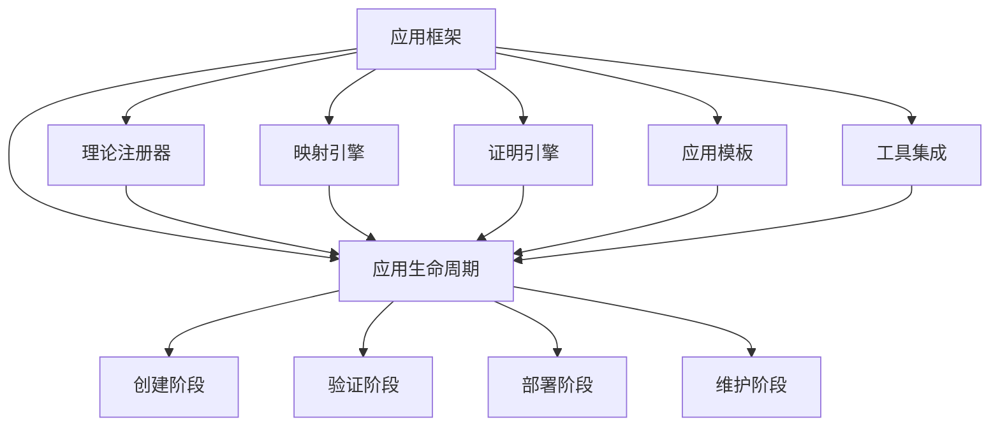

# 应用框架

## 目录

- [应用框架](#应用框架)
  - [目录](#目录)
  - [1. 理论基础](#1-理论基础)
    - [1.1 框架目标](#11-框架目标)
  - [2. 基本概念](#2-基本概念)
    - [2.1 框架结构](#21-框架结构)
    - [2.2 应用生命周期](#22-应用生命周期)
  - [3. 框架组件](#3-框架组件)
    - [3.1 理论注册器](#31-理论注册器)
    - [3.2 映射引擎](#32-映射引擎)
    - [3.3 证明引擎](#33-证明引擎)
  - [4. 应用模板](#4-应用模板)
    - [4.1 架构设计模板](#41-架构设计模板)
    - [4.2 形式化验证模板](#42-形式化验证模板)
    - [4.3 USTS应用模板](#43-usts应用模板)
    - [4.4 UMS应用模板](#44-ums应用模板)
    - [4.5 混合应用模板](#45-混合应用模板)
  - [5. 工具集成](#5-工具集成)
    - [5.1 工具链集成](#51-工具链集成)
    - [5.2 工作流引擎](#52-工作流引擎)
  - [6. 形式化表示](#6-形式化表示)
    - [6.1 框架结构图](#61-框架结构图)
    - [6.2 数学表示](#62-数学表示)
  - [7. 交叉引用](#7-交叉引用)
    - [7.1 相关理论](#71-相关理论)
    - [7.2 实践应用](#72-实践应用)
  - [8. 导航](#8-导航)
  - [2025 对齐](#2025-对齐)

## 1. 理论基础

应用框架是理论统一与整合的实践体现，为形式化架构理论提供具体的应用方法和工具支持。

### 1.1 框架目标

- 提供统一的应用接口
- 支持跨理论的应用开发
- 实现工具链的集成
- 确保应用的正确性和可靠性

## 2. 基本概念

### 2.1 框架结构

```rust
pub struct ApplicationFramework {
    pub theory_registry: TheoryRegistry,
    pub mapping_engine: MappingEngine,
    pub proof_engine: ProofEngine,
    pub application_templates: Vec<ApplicationTemplate>,
    pub tool_integration: ToolIntegration,
}

pub struct ApplicationTemplate {
    pub name: String,
    pub description: String,
    pub theory_requirements: Vec<Theory>,
    pub implementation: Box<dyn ApplicationImplementation>,
    pub validation_rules: Vec<ValidationRule>,
}

pub trait ApplicationImplementation {
    fn create_application(&self, requirements: &Requirements) -> Result<Application, Error>;
    fn validate_application(&self, application: &Application) -> Result<ValidationResult, Error>;
    fn deploy_application(&self, application: &Application) -> Result<DeploymentResult, Error>;
}
```

### 2.2 应用生命周期

```rust
pub struct ApplicationLifecycle {
    pub creation: CreationPhase,
    pub validation: ValidationPhase,
    pub deployment: DeploymentPhase,
    pub maintenance: MaintenancePhase,
}

impl ApplicationLifecycle {
    pub fn create_application(&self, requirements: &Requirements) -> Result<Application, Error> {
        // 1. 需求分析
        let analysis = self.creation.analyze_requirements(requirements)?;

        // 2. 理论选择
        let theories = self.creation.select_theories(&analysis)?;

        // 3. 应用构建
        let application = self.creation.build_application(&theories, requirements)?;

        // 4. 验证应用
        self.validation.validate_application(&application)?;

        Ok(application)
    }
}
```

## 3. 框架组件

### 3.1 理论注册器

```rust
pub struct TheoryRegistry {
    pub theories: HashMap<String, Theory>,
    pub dependencies: HashMap<String, Vec<String>>,
    pub compatibility_matrix: CompatibilityMatrix,
}

impl TheoryRegistry {
    pub fn register_theory(&mut self, theory: Theory) -> Result<(), Error> {
        // 1. 验证理论完整性
        self.validate_theory(&theory)?;

        // 2. 检查依赖关系
        self.check_dependencies(&theory)?;

        // 3. 更新兼容性矩阵
        self.update_compatibility_matrix(&theory)?;

        // 4. 注册理论
        self.theories.insert(theory.name.clone(), theory);

        Ok(())
    }

    pub fn find_compatible_theories(&self, requirements: &Requirements) -> Vec<Theory> {
        let mut compatible_theories = Vec::new();

        for theory in self.theories.values() {
            if self.is_compatible(theory, requirements) {
                compatible_theories.push(theory.clone());
            }
        }

        compatible_theories
    }
}
```

### 3.2 映射引擎

```rust
pub struct MappingEngine {
    pub mappers: HashMap<TheoryPair, Box<dyn TheoryMapper>>,
    pub mapping_cache: MappingCache,
}

impl MappingEngine {
    pub fn create_mapping(&self, source_theory: &Theory, target_theory: &Theory) -> Result<TheoryMapping, Error> {
        // 1. 查找映射器
        let mapper = self.find_mapper(source_theory, target_theory)?;

        // 2. 检查缓存
        if let Some(cached_mapping) = self.mapping_cache.get(source_theory, target_theory) {
            return Ok(cached_mapping);
        }

        // 3. 创建映射
        let mapping = mapper.map_theory(source_theory, target_theory)?;

        // 4. 缓存结果
        self.mapping_cache.store(source_theory, target_theory, &mapping);

        Ok(mapping)
    }
}
```

### 3.3 证明引擎

```rust
pub struct ProofEngine {
    pub proof_strategies: Vec<ProofStrategy>,
    pub verification_tools: Vec<VerificationTool>,
}

impl ProofEngine {
    pub fn prove_property(&self, property: &Property, context: &ProofContext) -> Result<Proof, Error> {
        // 1. 选择证明策略
        let strategy = self.select_proof_strategy(property, context)?;

        // 2. 执行证明
        let proof = strategy.execute_proof(property, context)?;

        // 3. 验证证明
        self.verify_proof(&proof)?;

        Ok(proof)
    }

    fn select_proof_strategy(&self, property: &Property, context: &ProofContext) -> Result<&ProofStrategy, Error> {
        let mut best_strategy = None;
        let mut best_score = 0.0;

        for strategy in &self.proof_strategies {
            let score = strategy.evaluate_applicability(property, context)?;
            if score > best_score {
                best_score = score;
                best_strategy = Some(strategy);
            }
        }

        best_strategy.ok_or(Error::NoSuitableStrategy)
    }
}
```

## 4. 应用模板

### 4.1 架构设计模板

```rust
pub struct ArchitectureDesignTemplate {
    pub usts_template: USTSTemplate,
    pub ums_template: UMSTemplate,
    pub hybrid_template: HybridTemplate,
}

impl ArchitectureDesignTemplate {
    pub fn create_usts_based_architecture(&self, requirements: &Requirements) -> Result<USTSArchitecture, Error> {
        // 基于USTS的架构设计模板
        let usts_system = self.usts_template.create_system(requirements)?;

        // 验证架构正确性
        self.validate_usts_architecture(&usts_system)?;

        Ok(usts_system)
    }

    pub fn create_ums_based_architecture(&self, requirements: &Requirements) -> Result<UMSArchitecture, Error> {
        // 基于UMS的架构设计模板
        let ums_system = self.ums_template.create_system(requirements)?;

        // 验证架构正确性
        self.validate_ums_architecture(&ums_system)?;

        Ok(ums_system)
    }

    pub fn create_hybrid_architecture(&self, requirements: &Requirements) -> Result<HybridArchitecture, Error> {
        // 混合USTS-UMS架构设计模板
        let hybrid_system = self.hybrid_template.create_system(requirements)?;

        // 验证架构正确性
        self.validate_hybrid_architecture(&hybrid_system)?;

        Ok(hybrid_system)
    }
}
```

### 4.2 形式化验证模板

```rust
pub struct FormalVerificationTemplate {
    pub usts_verification: USTSVerificationTemplate,
    pub ums_verification: UMSVerificationTemplate,
    pub cross_verification: CrossVerificationTemplate,
}

impl FormalVerificationTemplate {
    pub fn verify_usts_properties(&self, usts_system: &USTS, properties: &[USTSProperty]) -> Result<VerificationResult, Error> {
        // USTS性质验证模板
        let mut results = Vec::new();

        for property in properties {
            let result = self.usts_verification.verify_property(usts_system, property)?;
            results.push(result);
        }

        Ok(VerificationResult {
            system: "USTS".to_string(),
            properties: properties.to_vec(),
            results,
            overall_status: self.compute_overall_status(&results),
        })
    }

    pub fn verify_ums_properties(&self, ums_system: &UMS, properties: &[UMSProperty]) -> Result<VerificationResult, Error> {
        // UMS性质验证模板
        let mut results = Vec::new();

        for property in properties {
            let result = self.ums_verification.verify_property(ums_system, property)?;
            results.push(result);
        }

        Ok(VerificationResult {
            system: "UMS".to_string(),
            properties: properties.to_vec(),
            results,
            overall_status: self.compute_overall_status(&results),
        })
    }

    pub fn verify_cross_system_properties(&self, usts_system: &USTS, ums_system: &UMS, mapping: &USTS_UMS_Mapping) -> Result<CrossVerificationResult, Error> {
        // 跨系统性质验证模板
        let cross_result = self.cross_verification.verify_mapping_correctness(usts_system, ums_system, mapping)?;

        Ok(CrossVerificationResult {
            usts_system: usts_system.clone(),
            ums_system: ums_system.clone(),
            mapping: mapping.clone(),
            verification_result: cross_result,
        })
    }
}
```

### 4.3 USTS应用模板

```rust
pub struct USTSTemplate {
    pub state_machine_templates: HashMap<String, StateMachineTemplate>,
    pub transition_templates: HashMap<String, TransitionTemplate>,
    pub constraint_templates: HashMap<String, ConstraintTemplate>,
}

impl USTSTemplate {
    pub fn create_traffic_light_system(&self) -> Result<USTS, Error> {
        // 交通灯系统模板
        let template = self.state_machine_templates.get("traffic_light")
            .ok_or(Error::TemplateNotFound)?;

        let usts = template.create_system(&TrafficLightRequirements {
            states: vec!["red", "yellow", "green"],
            timing_constraints: vec![
                "red_duration >= 30",
                "yellow_duration >= 5",
                "green_duration >= 45",
            ],
            safety_constraints: vec![
                "always (red_light -> not green_light)",
                "always (yellow_light -> not red_light and not green_light)",
            ],
        })?;

        Ok(usts)
    }

    pub fn create_workflow_system(&self) -> Result<USTS, Error> {
        // 工作流系统模板
        let template = self.state_machine_templates.get("workflow")
            .ok_or(Error::TemplateNotFound)?;

        let usts = template.create_system(&WorkflowRequirements {
            states: vec!["init", "processing", "review", "complete"],
            transitions: vec![
                ("init", "processing", "start_processing"),
                ("processing", "review", "submit_for_review"),
                ("review", "processing", "request_changes"),
                ("review", "complete", "approve"),
            ],
            business_rules: vec![
                "review_required_before_completion",
                "changes_must_be_reviewed",
            ],
        })?;

        Ok(usts)
    }

    pub fn create_iot_device_system(&self) -> Result<USTS, Error> {
        // IoT设备系统模板
        let template = self.state_machine_templates.get("iot_device")
            .ok_or(Error::TemplateNotFound)?;

        let usts = template.create_system(&IoTDeviceRequirements {
            states: vec!["offline", "online", "collecting", "transmitting", "error"],
            events: vec![
                "connect", "disconnect", "start_collection", "stop_collection",
                "transmit_data", "error_occurred", "recover",
            ],
            reliability_constraints: vec![
                "always (error_state -> eventually online_state)",
                "always (collecting_state -> eventually transmitting_state)",
            ],
        })?;

        Ok(usts)
    }
}
```

### 4.4 UMS应用模板

```rust
pub struct UMSTemplate {
    pub component_templates: HashMap<String, ComponentTemplate>,
    pub interface_templates: HashMap<String, InterfaceTemplate>,
    pub composition_templates: HashMap<String, CompositionTemplate>,
}

impl UMSTemplate {
    pub fn create_microservice_system(&self) -> Result<UMS, Error> {
        // 微服务系统模板
        let template = self.component_templates.get("microservice")
            .ok_or(Error::TemplateNotFound)?;

        let ums = template.create_system(&MicroserviceRequirements {
            services: vec![
                "user_service", "order_service", "payment_service", "inventory_service",
            ],
            interfaces: vec![
                ("user_service", vec!["create_user", "get_user", "update_user"]),
                ("order_service", vec!["create_order", "get_order", "update_order"]),
                ("payment_service", vec!["process_payment", "refund_payment"]),
                ("inventory_service", vec!["check_stock", "update_stock"]),
            ],
            contracts: vec![
                "user_data_validity",
                "order_integrity",
                "payment_security",
                "inventory_consistency",
            ],
        })?;

        Ok(ums)
    }

    pub fn create_plugin_system(&self) -> Result<UMS, Error> {
        // 插件系统模板
        let template = self.component_templates.get("plugin")
            .ok_or(Error::TemplateNotFound)?;

        let ums = template.create_system(&PluginRequirements {
            core_components: vec!["plugin_manager", "plugin_loader", "plugin_registry"],
            plugin_interfaces: vec![
                "PluginInterface",
                "ConfigurableInterface",
                "EventDrivenInterface",
            ],
            lifecycle_hooks: vec![
                "on_load", "on_enable", "on_disable", "on_unload",
            ],
            safety_constraints: vec![
                "plugin_isolation",
                "resource_cleanup",
                "version_compatibility",
            ],
        })?;

        Ok(ums)
    }

    pub fn create_distributed_system(&self) -> Result<UMS, Error> {
        // 分布式系统模板
        let template = self.component_templates.get("distributed")
            .ok_or(Error::TemplateNotFound)?;

        let ums = template.create_system(&DistributedRequirements {
            nodes: vec![
                "coordinator", "worker_1", "worker_2", "worker_3",
            ],
            communication_patterns: vec![
                "request_response",
                "publish_subscribe",
                "event_streaming",
            ],
            consistency_models: vec![
                "strong_consistency",
                "eventual_consistency",
                "causal_consistency",
            ],
            fault_tolerance: vec![
                "replication",
                "failover",
                "circuit_breaker",
            ],
        })?;

        Ok(ums)
    }
}
```

### 4.5 混合应用模板

```rust
pub struct HybridTemplate {
    pub usts_ums_integration: USTS_UMS_IntegrationTemplate,
    pub cross_domain_mapping: CrossDomainMappingTemplate,
}

impl HybridTemplate {
    pub fn create_hybrid_system(&self, requirements: &HybridRequirements) -> Result<HybridSystem, Error> {
        // 创建混合USTS-UMS系统
        let usts_part = self.create_usts_part(&requirements.usts_requirements)?;
        let ums_part = self.create_ums_part(&requirements.ums_requirements)?;

        // 创建集成映射
        let integration = self.usts_ums_integration.create_integration(&usts_part, &ums_part)?;

        // 验证集成正确性
        self.validate_integration(&integration)?;

        Ok(HybridSystem {
            usts_component: usts_part,
            ums_component: ums_part,
            integration_mapping: integration,
        })
    }

    pub fn create_smart_manufacturing_system(&self) -> Result<HybridSystem, Error> {
        // 智能制造系统模板
        let requirements = HybridRequirements {
            usts_requirements: USTSRequirements {
                states: vec!["idle", "setup", "running", "maintenance", "error"],
                events: vec!["start_production", "stop_production", "maintenance_required", "error_detected"],
                constraints: vec![
                    "always (running_state -> eventually maintenance_state)",
                    "always (error_state -> eventually idle_state)",
                ],
            },
            ums_requirements: UMSRequirements {
                components: vec![
                    "production_controller", "quality_monitor", "maintenance_scheduler", "data_collector",
                ],
                interfaces: vec![
                    ("production_controller", vec!["start_job", "stop_job", "get_status"]),
                    ("quality_monitor", vec!["check_quality", "report_defect"]),
                    ("maintenance_scheduler", vec!["schedule_maintenance", "get_maintenance_status"]),
                    ("data_collector", vec!["collect_data", "analyze_trends"]),
                ],
                contracts: vec![
                    "production_safety",
                    "quality_standards",
                    "maintenance_compliance",
                    "data_integrity",
                ],
            },
        };

        self.create_hybrid_system(&requirements)
    }
}
```

## 5. 工具集成

### 5.1 工具链集成

```rust
pub struct ToolchainIntegration {
    pub tools: Vec<Tool>,
    pub integration_points: Vec<IntegrationPoint>,
    pub workflow_engine: WorkflowEngine,
}

impl ToolchainIntegration {
    pub fn integrate_tools(&mut self) -> Result<IntegratedToolchain, Error> {
        // 1. 工具注册
        self.register_tools()?;

        // 2. 接口定义
        self.define_interfaces()?;

        // 3. 工作流构建
        let workflows = self.build_workflows()?;

        // 4. 集成测试
        self.test_integration(&workflows)?;

        Ok(IntegratedToolchain::new(workflows))
    }

    pub fn register_usts_tools(&mut self) -> Result<(), Error> {
        // 注册USTS相关工具
        let usts_tools = vec![
            Tool::new("usts_designer", "USTS设计工具"),
            Tool::new("usts_verifier", "USTS验证工具"),
            Tool::new("usts_simulator", "USTS仿真工具"),
            Tool::new("usts_analyzer", "USTS分析工具"),
        ];

        for tool in usts_tools {
            self.tools.push(tool);
        }

        Ok(())
    }

    pub fn register_ums_tools(&mut self) -> Result<(), Error> {
        // 注册UMS相关工具
        let ums_tools = vec![
            Tool::new("ums_designer", "UMS设计工具"),
            Tool::new("ums_verifier", "UMS验证工具"),
            Tool::new("ums_composer", "UMS组合工具"),
            Tool::new("ums_analyzer", "UMS分析工具"),
        ];

        for tool in ums_tools {
            self.tools.push(tool);
        }

        Ok(())
    }

    pub fn register_unified_tools(&mut self) -> Result<(), Error> {
        // 注册统一理论工具
        let unified_tools = vec![
            Tool::new("theory_mapper", "理论映射工具"),
            Tool::new("symbol_unifier", "符号统一工具"),
            Tool::new("cross_prover", "跨领域证明工具"),
            Tool::new("hybrid_designer", "混合设计工具"),
        ];

        for tool in unified_tools {
            self.tools.push(tool);
        }

        Ok(())
    }
}
```

### 5.2 工作流引擎

```rust
pub struct WorkflowEngine {
    pub workflows: HashMap<String, Workflow>,
    pub execution_engine: ExecutionEngine,
    pub monitoring: MonitoringSystem,
}

impl WorkflowEngine {
    pub fn create_usts_design_workflow(&mut self) -> Result<Workflow, Error> {
        // 创建USTS设计工作流
        let workflow = Workflow {
            id: "usts_design".to_string(),
            name: "USTS系统设计工作流".to_string(),
            steps: vec![
                WorkflowStep::new("requirements_analysis", "需求分析"),
                WorkflowStep::new("state_identification", "状态识别"),
                WorkflowStep::new("transition_definition", "转换定义"),
                WorkflowStep::new("constraint_specification", "约束规范"),
                WorkflowStep::new("formal_verification", "形式化验证"),
                WorkflowStep::new("code_generation", "代码生成"),
            ],
            dependencies: vec![
                ("state_identification", "requirements_analysis"),
                ("transition_definition", "state_identification"),
                ("constraint_specification", "transition_definition"),
                ("formal_verification", "constraint_specification"),
                ("code_generation", "formal_verification"),
            ],
        };

        self.workflows.insert(workflow.id.clone(), workflow.clone());
        Ok(workflow)
    }

    pub fn create_ums_design_workflow(&mut self) -> Result<Workflow, Error> {
        // 创建UMS设计工作流
        let workflow = Workflow {
            id: "ums_design".to_string(),
            name: "UMS系统设计工作流".to_string(),
            steps: vec![
                WorkflowStep::new("requirements_analysis", "需求分析"),
                WorkflowStep::new("component_identification", "组件识别"),
                WorkflowStep::new("interface_definition", "接口定义"),
                WorkflowStep::new("contract_specification", "契约规范"),
                WorkflowStep::new("composition_design", "组合设计"),
                WorkflowStep::new("formal_verification", "形式化验证"),
                WorkflowStep::new("code_generation", "代码生成"),
            ],
            dependencies: vec![
                ("component_identification", "requirements_analysis"),
                ("interface_definition", "component_identification"),
                ("contract_specification", "interface_definition"),
                ("composition_design", "contract_specification"),
                ("formal_verification", "composition_design"),
                ("code_generation", "formal_verification"),
            ],
        };

        self.workflows.insert(workflow.id.clone(), workflow.clone());
        Ok(workflow)
    }

    pub fn create_hybrid_design_workflow(&mut self) -> Result<Workflow, Error> {
        // 创建混合设计工作流
        let workflow = Workflow {
            id: "hybrid_design".to_string(),
            name: "混合USTS-UMS设计工作流".to_string(),
            steps: vec![
                WorkflowStep::new("requirements_analysis", "需求分析"),
                WorkflowStep::new("theory_selection", "理论选择"),
                WorkflowStep::new("usts_design", "USTS设计"),
                WorkflowStep::new("ums_design", "UMS设计"),
                WorkflowStep::new("mapping_creation", "映射创建"),
                WorkflowStep::new("integration_verification", "集成验证"),
                WorkflowStep::new("code_generation", "代码生成"),
            ],
            dependencies: vec![
                ("theory_selection", "requirements_analysis"),
                ("usts_design", "theory_selection"),
                ("ums_design", "theory_selection"),
                ("mapping_creation", "usts_design"),
                ("mapping_creation", "ums_design"),
                ("integration_verification", "mapping_creation"),
                ("code_generation", "integration_verification"),
            ],
        };

        self.workflows.insert(workflow.id.clone(), workflow.clone());
        Ok(workflow)
    }
}
```

## 6. 形式化表示

### 6.1 框架结构图



### 6.2 数学表示

应用框架可定义为 $F = (T, M, P, A, I)$，其中：

- $T$ 为理论注册器
- $M$ 为映射引擎
- $P$ 为证明引擎
- $A$ 为应用模板集合
- $I$ 为工具集成

框架约束：
$$\forall a \in A: \text{Valid}(a) \land \text{Consistent}(a, T, M, P)$$

## 7. 交叉引用

### 7.1 相关理论

- [理论统一与整合总论](00-理论统一与整合总论.md)
- [理论映射关系](01-理论映射关系.md)
- [统一符号体系](02-统一符号体系.md)
- [跨领域证明](03-跨领域证明.md)

### 7.2 实践应用

- [实践应用开发](../08-实践应用开发/README.md)

## 8. 导航

- [返回理论统一与整合总论](00-理论统一与整合总论.md)
- [理论映射关系](01-理论映射关系.md)
- [统一符号体系](02-统一符号体系.md)
- [跨领域证明](03-跨领域证明.md)

## 2025 对齐

- **国际 Wiki**：
  - [Wikipedia: Application framework](https://en.wikipedia.org/wiki/Application_framework)
  - [Wikipedia: Software framework](https://en.wikipedia.org/wiki/Software_framework)
  - [Wikipedia: Web framework](https://en.wikipedia.org/wiki/Web_framework)
  - [Wikipedia: Framework (computer science)](https://en.wikipedia.org/wiki/Framework_(computer_science))

- **名校课程**：
  - [CMU 17-313: Foundations of Software Engineering](https://www.cs.cmu.edu/~ckaestne/17313/)（应用框架）
  - [MIT 6.033: Computer Systems Engineering](https://web.mit.edu/6.033/www/)（系统框架）
  - [Stanford CS 244: Advanced Computer Systems](https://web.stanford.edu/class/cs244/)（框架设计）

- **代表性论文**：
  - [Design Patterns: Elements of Reusable Object-Oriented Software](https://en.wikipedia.org/wiki/Design_Patterns) (Gang of Four, 1994)
  - [Framework Design Guidelines](https://www.pearson.com/us/higher-education/program/Cwalina-Framework-Design-Guidelines-Conventions-Idioms-and-Patterns-for-Reusable-NET-Libraries-2nd-Edition/PGM33482.html) (Cwalina & Abrams, 2008)
  - [Software Architecture: Perspectives on an Emerging Discipline](https://www.cs.cmu.edu/~able/publications/softwareArchitectureBook.pdf) (Shaw & Garlan, 1996)

- **前沿技术**：
  - [Spring Framework](https://spring.io/)（Java应用框架）
  - [Django](https://www.djangoproject.com/)（Python Web框架）
  - [React](https://react.dev/)（前端框架）
  - [.NET](https://dotnet.microsoft.com/)（Microsoft应用框架）

- **对齐状态**：已完成（最后更新：2025-01-15）
