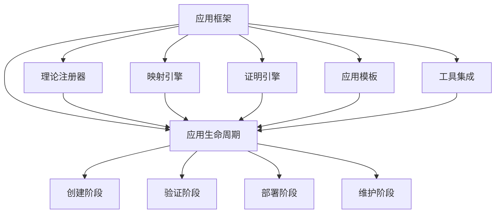

# 应用框架

## 1. 理论基础

应用框架是理论统一与整合的实践体现，为形式化架构理论提供具体的应用方法和工具支持。

### 1.1 框架目标

- 提供统一的应用接口
- 支持跨理论的应用开发
- 实现工具链的集成
- 确保应用的正确性和可靠性

## 2. 基本概念

### 2.1 框架结构

```rust
pub struct ApplicationFramework {
    pub theory_registry: TheoryRegistry,
    pub mapping_engine: MappingEngine,
    pub proof_engine: ProofEngine,
    pub application_templates: Vec<ApplicationTemplate>,
    pub tool_integration: ToolIntegration,
}

pub struct ApplicationTemplate {
    pub name: String,
    pub description: String,
    pub theory_requirements: Vec<Theory>,
    pub implementation: Box<dyn ApplicationImplementation>,
    pub validation_rules: Vec<ValidationRule>,
}

pub trait ApplicationImplementation {
    fn create_application(&self, requirements: &Requirements) -> Result<Application, Error>;
    fn validate_application(&self, application: &Application) -> Result<ValidationResult, Error>;
    fn deploy_application(&self, application: &Application) -> Result<DeploymentResult, Error>;
}
```

### 2.2 应用生命周期

```rust
pub struct ApplicationLifecycle {
    pub creation: CreationPhase,
    pub validation: ValidationPhase,
    pub deployment: DeploymentPhase,
    pub maintenance: MaintenancePhase,
}

impl ApplicationLifecycle {
    pub fn create_application(&self, requirements: &Requirements) -> Result<Application, Error> {
        // 1. 需求分析
        let analysis = self.creation.analyze_requirements(requirements)?;
        
        // 2. 理论选择
        let theories = self.creation.select_theories(&analysis)?;
        
        // 3. 应用构建
        let application = self.creation.build_application(&theories, requirements)?;
        
        // 4. 验证应用
        self.validation.validate_application(&application)?;
        
        Ok(application)
    }
}
```

## 3. 框架组件

### 3.1 理论注册器

```rust
pub struct TheoryRegistry {
    pub theories: HashMap<String, Theory>,
    pub dependencies: HashMap<String, Vec<String>>,
    pub compatibility_matrix: CompatibilityMatrix,
}

impl TheoryRegistry {
    pub fn register_theory(&mut self, theory: Theory) -> Result<(), Error> {
        // 1. 验证理论完整性
        self.validate_theory(&theory)?;
        
        // 2. 检查依赖关系
        self.check_dependencies(&theory)?;
        
        // 3. 更新兼容性矩阵
        self.update_compatibility_matrix(&theory)?;
        
        // 4. 注册理论
        self.theories.insert(theory.name.clone(), theory);
        
        Ok(())
    }
    
    pub fn find_compatible_theories(&self, requirements: &Requirements) -> Vec<Theory> {
        let mut compatible_theories = Vec::new();
        
        for theory in self.theories.values() {
            if self.is_compatible(theory, requirements) {
                compatible_theories.push(theory.clone());
            }
        }
        
        compatible_theories
    }
}
```

### 3.2 映射引擎

```rust
pub struct MappingEngine {
    pub mappers: HashMap<TheoryPair, Box<dyn TheoryMapper>>,
    pub mapping_cache: MappingCache,
}

impl MappingEngine {
    pub fn create_mapping(&self, source_theory: &Theory, target_theory: &Theory) -> Result<TheoryMapping, Error> {
        // 1. 查找映射器
        let mapper = self.find_mapper(source_theory, target_theory)?;
        
        // 2. 检查缓存
        if let Some(cached_mapping) = self.mapping_cache.get(source_theory, target_theory) {
            return Ok(cached_mapping);
        }
        
        // 3. 创建映射
        let mapping = mapper.map_theory(source_theory, target_theory)?;
        
        // 4. 缓存结果
        self.mapping_cache.store(source_theory, target_theory, &mapping);
        
        Ok(mapping)
    }
}
```

### 3.3 证明引擎

```rust
pub struct ProofEngine {
    pub proof_strategies: Vec<ProofStrategy>,
    pub verification_tools: Vec<VerificationTool>,
}

impl ProofEngine {
    pub fn prove_property(&self, property: &Property, context: &ProofContext) -> Result<Proof, Error> {
        // 1. 选择证明策略
        let strategy = self.select_proof_strategy(property, context)?;
        
        // 2. 执行证明
        let proof = strategy.execute_proof(property, context)?;
        
        // 3. 验证证明
        self.verify_proof(&proof)?;
        
        Ok(proof)
    }
    
    fn select_proof_strategy(&self, property: &Property, context: &ProofContext) -> Result<&ProofStrategy, Error> {
        let mut best_strategy = None;
        let mut best_score = 0.0;
        
        for strategy in &self.proof_strategies {
            let score = strategy.evaluate_applicability(property, context)?;
            if score > best_score {
                best_score = score;
                best_strategy = Some(strategy);
            }
        }
        
        best_strategy.ok_or(Error::NoSuitableStrategy)
    }
}
```

## 4. 应用模板

### 4.1 架构设计模板

```rust
pub struct ArchitectureDesignTemplate {
    pub design_methods: Vec<DesignMethod>,
    pub validation_rules: Vec<ValidationRule>,
}

impl ApplicationImplementation for ArchitectureDesignTemplate {
    fn create_application(&self, requirements: &Requirements) -> Result<Application, Error> {
        // 1. 选择设计方法
        let method = self.select_design_method(requirements)?;
        
        // 2. 应用设计方法
        let architecture = method.design_architecture(requirements)?;
        
        // 3. 验证架构
        self.validate_architecture(&architecture)?;
        
        Ok(Application::Architecture(architecture))
    }
    
    fn validate_application(&self, application: &Application) -> Result<ValidationResult, Error> {
        match application {
            Application::Architecture(arch) => self.validate_architecture(arch),
            _ => Err(Error::InvalidApplicationType),
        }
    }
}
```

### 4.2 形式化验证模板

```rust
pub struct FormalVerificationTemplate {
    pub verification_methods: Vec<VerificationMethod>,
    pub model_checkers: Vec<ModelChecker>,
}

impl ApplicationImplementation for FormalVerificationTemplate {
    fn create_application(&self, requirements: &Requirements) -> Result<Application, Error> {
        // 1. 构建形式模型
        let model = self.build_formal_model(requirements)?;
        
        // 2. 选择验证方法
        let method = self.select_verification_method(&model, requirements)?;
        
        // 3. 执行验证
        let verification_result = method.verify(&model)?;
        
        Ok(Application::Verification(verification_result))
    }
}
```

## 5. 工具集成

### 5.1 工具链集成

```rust
pub struct ToolIntegration {
    pub tools: HashMap<String, Box<dyn Tool>>,
    pub workflows: Vec<Workflow>,
    pub integration_points: Vec<IntegrationPoint>,
}

impl ToolIntegration {
    pub fn integrate_tools(&mut self) -> Result<IntegratedToolchain, Error> {
        // 1. 注册工具
        self.register_tools()?;
        
        // 2. 定义工作流
        let workflows = self.define_workflows()?;
        
        // 3. 建立集成点
        let integration_points = self.establish_integration_points()?;
        
        // 4. 测试集成
        self.test_integration(&workflows, &integration_points)?;
        
        Ok(IntegratedToolchain {
            tools: self.tools.clone(),
            workflows,
            integration_points,
        })
    }
}
```

### 5.2 工作流引擎

```rust
pub struct WorkflowEngine {
    pub workflows: Vec<Workflow>,
    pub execution_engine: ExecutionEngine,
}

impl WorkflowEngine {
    pub fn execute_workflow(&self, workflow_name: &str, input: &WorkflowInput) -> Result<WorkflowOutput, Error> {
        // 1. 查找工作流
        let workflow = self.find_workflow(workflow_name)?;
        
        // 2. 验证输入
        self.validate_input(&workflow, input)?;
        
        // 3. 执行工作流
        let output = self.execution_engine.execute(&workflow, input)?;
        
        // 4. 验证输出
        self.validate_output(&workflow, &output)?;
        
        Ok(output)
    }
}
```

## 6. 形式化表示

### 6.1 框架结构图



### 6.2 数学表示

应用框架可定义为 $F = (T, M, P, A, I)$，其中：

- $T$ 为理论注册器
- $M$ 为映射引擎
- $P$ 为证明引擎
- $A$ 为应用模板集合
- $I$ 为工具集成

框架约束：
$$\forall a \in A: \text{Valid}(a) \land \text{Consistent}(a, T, M, P)$$

## 7. 交叉引用

### 7.1 相关理论

- [理论统一与整合总论](00-理论统一与整合总论.md)
- [理论映射关系](01-理论映射关系.md)
- [统一符号体系](02-统一符号体系.md)
- [跨领域证明](03-跨领域证明.md)

### 7.2 实践应用

- [实践应用开发](../08-实践应用开发/README.md)

## 8. 导航

- [返回理论统一与整合总论](00-理论统一与整合总论.md)
- [理论映射关系](01-理论映射关系.md)
- [统一符号体系](02-统一符号体系.md)
- [跨领域证明](03-跨领域证明.md)
