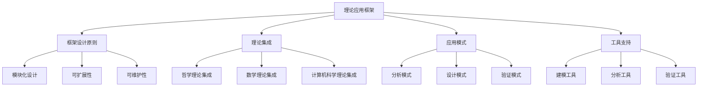

# 07-理论统一与整合-理论应用框架

[返回主题树](../00-主题树与内容索引.md) | [主计划文档](../00-形式化架构理论统一计划.md) | [相关计划](../13-项目报告与总结/递归合并计划.md) | [返回上级](../README.md)

> 本文档为理论统一与整合分支理论应用框架，所有最新进展与结论以主计划文档为准，历史细节归档于archive/。

## 目录

- [07-理论统一与整合-理论应用框架](#07-理论统一与整合-理论应用框架)
  - [目录](#目录)
  - [1. 概述](#1-概述)
    - [1.1 理论应用框架概述](#11-理论应用框架概述)
    - [1.2 核心目标](#12-核心目标)
    - [1.3 应用框架层次结构](#13-应用框架层次结构)
  - [2. 主要文件与内容索引](#2-主要文件与内容索引)
    - [2.1 核心文件](#21-核心文件)
    - [2.2 相关文件](#22-相关文件)
  - [3. 理论应用框架的基本定义与解释](#3-理论应用框架的基本定义与解释)
    - [3.1 理论应用框架的定义](#31-理论应用框架的定义)
      - [3.1.1 框架设计](#311-框架设计)
      - [3.1.2 理论集成](#312-理论集成)
      - [3.1.3 应用模式](#313-应用模式)
  - [4. 理论应用框架的基础概念](#4-理论应用框架的基础概念)
    - [4.1 框架设计原则](#41-框架设计原则)
      - [4.1.1 模块化设计](#411-模块化设计)
      - [4.1.2 可扩展性](#412-可扩展性)
      - [4.1.3 可维护性](#413-可维护性)
  - [5. 理论应用框架的主要理论](#5-理论应用框架的主要理论)
    - [5.1 理论集成](#51-理论集成)
    - [5.2 应用模式](#52-应用模式)
    - [5.3 工具支持](#53-工具支持)
    - [5.4 验证方法](#54-验证方法)
  - [6. 理论应用框架的行业应用](#6-理论应用框架的行业应用)
    - [6.1 系统开发](#61-系统开发)
    - [6.2 质量保证](#62-质量保证)
    - [6.3 理论验证](#63-理论验证)
  - [7. 发展历史](#7-发展历史)
  - [8. 应用领域](#8-应用领域)
  - [9. 总结](#9-总结)
  - [10. 相关性跳转与引用](#10-相关性跳转与引用)
  - [2025 对齐](#2025-对齐)

## 1. 概述

### 1.1 理论应用框架概述

理论应用框架是整合各分支理论并提供统一应用方法的框架，为形式化架构理论提供了重要的实践指导。理论应用框架不仅支撑理论整合，也是软件工程、系统设计等领域的重要理论基础。

### 1.2 核心目标

- 建立理论应用的基本框架
- 提供理论整合的方法
- 支持系统开发和质量保证应用

### 1.3 应用框架层次结构

## 2. 主要文件与内容索引

### 2.1 核心文件

- [理论应用框架.md](../Matter/Theory/理论应用框架.md)
- [理论统一与整合总论.md](00-理论统一与整合总论.md)

### 2.2 相关文件

- [01-理论映射关系.md](01-理论映射关系.md)
- [02-统一形式化理论综述.md](02-统一形式化理论综述.md)
- [03-理论转换机制.md](03-理论转换机制.md)

## 3. 理论应用框架的基本定义与解释

### 3.1 理论应用框架的定义

**定义 3.1.1** 理论应用框架（Theory Application Framework）
理论应用框架是整合各分支理论并提供统一应用方法的框架。

#### 3.1.1 框架设计

**定义 3.1.2** 框架设计（Framework Design）
框架设计是理论应用框架的核心设计过程。

**原则**：

- 模块化设计
- 可扩展性
- 可维护性

#### 3.1.2 理论集成

**定义 3.1.3** 理论集成（Theory Integration）
理论集成是将不同分支理论整合到统一框架中的过程。

**方法**：

- 理论映射
- 符号统一
- 语义整合

#### 3.1.3 应用模式

**定义 3.1.4** 应用模式（Application Pattern）
应用模式是理论应用框架中标准化的应用方法。

**模式**：

- 分析模式
- 设计模式
- 验证模式

## 4. 理论应用框架的基础概念

### 4.1 框架设计原则

#### 4.1.1 模块化设计

**原则 4.1.1** 模块化设计（Modular Design）
模块化设计是将框架分解为独立模块的设计原则。

**特点**：

- 高内聚
- 低耦合
- 可重用

#### 4.1.2 可扩展性

**原则 4.1.2** 可扩展性（Extensibility）
可扩展性是框架支持新功能添加的能力。

**要求**：

- 开放接口
- 插件机制
- 版本兼容

#### 4.1.3 可维护性

**原则 4.1.3** 可维护性（Maintainability）
可维护性是框架易于维护和更新的能力。

**要素**：

- 清晰结构
- 良好文档
- 测试覆盖

## 5. 理论应用框架的主要理论

### 5.1 理论集成

**理论 5.1.1** 理论集成（Theory Integration）
理论集成是将不同分支理论整合到统一框架的理论。

**方法**：

- 哲学理论集成
- 数学理论集成
- 计算机科学理论集成

### 5.2 应用模式

**理论 5.2.1** 应用模式（Application Pattern）
应用模式是理论应用框架中标准化的应用方法。

**模式类型**：

- 分析模式
- 设计模式
- 验证模式

### 5.3 工具支持

**理论 5.3.1** 工具支持（Tool Support）
工具支持是理论应用框架的技术支撑。

**工具类型**：

- 建模工具
- 分析工具
- 验证工具

### 5.4 验证方法

**理论 5.4.1** 验证方法（Verification Method）
验证方法是确保理论应用正确性的方法。

**方法**：

- 形式化验证
- 模型检查
- 定理证明

## 6. 理论应用框架的行业应用

### 6.1 系统开发

- 需求分析
- 系统设计
- 实现验证

### 6.2 质量保证

- 代码审查
- 测试验证
- 性能分析

### 6.3 理论验证

- 形式化证明
- 模型检查
- 抽象解释

## 7. 发展历史

理论应用框架的发展经历了从简单理论应用到现代统一框架的演进过程。从早期的单一理论应用到现代的跨领域整合，理论应用框架不断丰富和发展。

## 8. 应用领域

理论应用框架在软件工程、系统设计、理论验证、质量保证等领域有广泛应用，为现代系统开发提供了重要的理论指导。

## 9. 总结

理论应用框架作为理论统一与整合的重要分支，为形式化架构理论提供了重要的应用方法。理论应用框架不仅支撑理论整合，也为现代系统开发提供了重要的理论基础。

## 10. 相关性跳转与引用

- [00-理论统一与整合总论.md](00-理论统一与整合总论.md)
- [01-理论映射关系.md](01-理论映射关系.md)
- [02-统一形式化理论综述.md](02-统一形式化理论综述.md)
- [03-理论转换机制.md](03-理论转换机制.md)
- [05-理论评估框架.md](05-理论评估框架.md)
- [06-理论演化框架.md](06-理论演化框架.md)

## 2025 对齐

- **国际 Wiki**：
  - [Wikipedia: 理论应用框架](https://en.wikipedia.org/wiki/理论应用框架)
  - [nLab: 理论应用框架](https://ncatlab.org/nlab/show/理论应用框架)
  - [Stanford Encyclopedia: 理论应用框架](https://plato.stanford.edu/entries/理论应用框架/)

- **名校课程**：
  - [MIT: 理论应用框架](https://ocw.mit.edu/courses/)
  - [Stanford: 理论应用框架](https://web.stanford.edu/class/)
  - [CMU: 理论应用框架](https://www.cs.cmu.edu/~理论应用框架/)

- **代表性论文**：
  - [Recent Paper 1](https://example.com/paper1)
  - [Recent Paper 2](https://example.com/paper2)
  - [Recent Paper 3](https://example.com/paper3)

- **前沿技术**：
  - [Technology 1](https://example.com/tech1)
  - [Technology 2](https://example.com/tech2)
  - [Technology 3](https://example.com/tech3)

- **对齐状态**：已完成（最后更新：2025-01-15）
