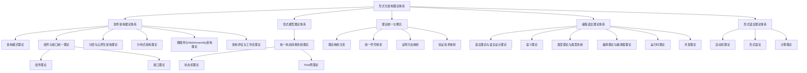
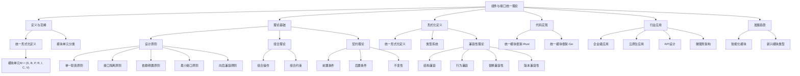
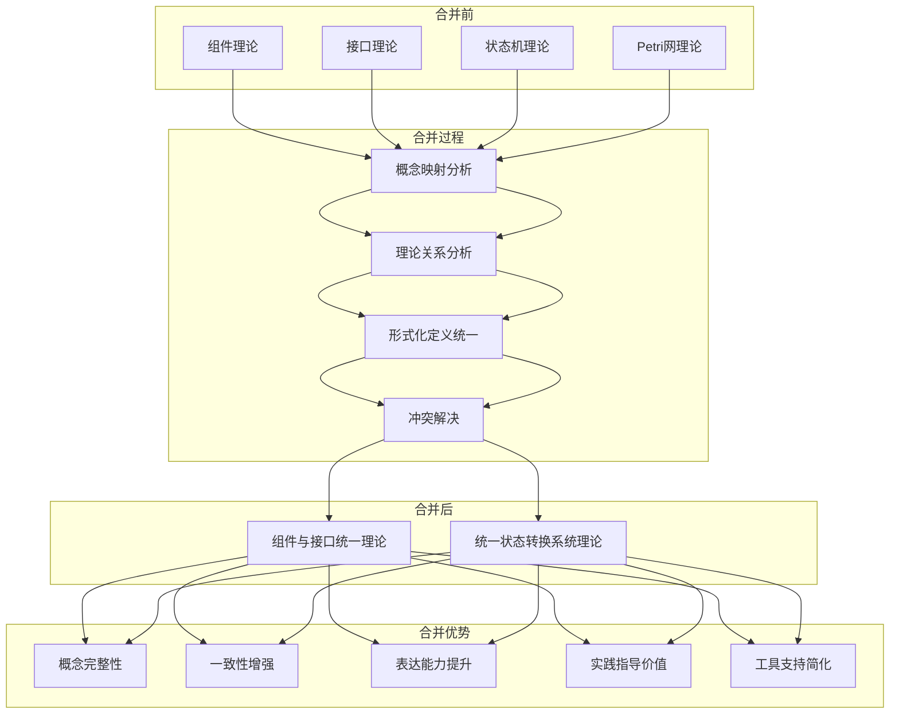

# 统一理论知识图谱分析

## 目录

- [统一理论知识图谱分析](#统一理论知识图谱分析)
  - [目录](#目录)
  - [1. 概述](#1-概述)
  - [2. 形式化架构理论体系总览](#2-形式化架构理论体系总览)
  - [3. 组件与接口统一理论分析](#3-组件与接口统一理论分析)
    - [3.1 理论结构](#31-理论结构)
    - [3.2 核心概念分析](#32-核心概念分析)
    - [3.3 应用价值](#33-应用价值)
  - [4. 统一状态转换系统理论分析](#4-统一状态转换系统理论分析)
    - [4.1 理论结构](#41-理论结构)
    - [4.2 核心概念分析](#42-核心概念分析)
    - [4.3 应用价值](#43-应用价值)
  - [5. 理论合并过程与优势分析](#5-理论合并过程与优势分析)
    - [5.1 合并过程](#51-合并过程)
    - [5.2 合并优势](#52-合并优势)
    - [5.3 合并挑战](#53-合并挑战)
  - [6. 应用场景分析](#6-应用场景分析)
    - [6.1 软件架构应用](#61-软件架构应用)
    - [6.2 系统验证应用](#62-系统验证应用)
    - [6.3 工程实践应用](#63-工程实践应用)
  - [7. 未来发展方向](#7-未来发展方向)
    - [7.1 理论深化方向](#71-理论深化方向)
    - [7.2 工具开发方向](#72-工具开发方向)
    - [7.3 应用拓展方向](#73-应用拓展方向)
  - [8. 总结](#8-总结)

## 1. 概述

本文档提供对形式化架构理论体系中已完成统一的理论进行分析，并通过知识图谱可视化呈现理论之间的关系、概念映射和应用场景。目前已完成的主要统一理论包括：

1. **组件与接口统一理论** - 整合了组件理论（关注系统的模块化结构和内部实现）与接口理论（关注模块间的交互协议和契约）
2. **统一状态转换系统理论** - 整合了状态机理论和Petri网理论，提供了一个统一的形式化框架

## 2. 形式化架构理论体系总览

形式化架构理论体系是一个多层次、多领域的理论框架，包括软件架构理论体系、形式模型理论体系、编程语言理论体系、形式语言理论体系以及理论统一与整合等多个部分。

## 3. 组件与接口统一理论分析

### 3.1 理论结构

组件与接口统一理论整合了组件理论和接口理论，形成了一个更加完整的模块化系统理论框架。该理论的核心是统一的模块单元概念，包括状态空间、行为模型、提供功能、依赖功能、实现细节、交互契约和版本信息等元素。

### 3.2 核心概念分析

1. **模块单元 (M)** - 统一理论的核心概念，定义为七元组 $(S, B, P, R, I, C, V)$，整合了组件和接口的特性
2. **设计原则** - 包括单一职责原则、接口隔离原则、依赖倒置原则、最小接口原则和向后兼容原则等
3. **组合理论** - 定义了模块如何组合成更大的系统，包括组合操作和组合约束
4. **契约理论** - 定义了模块间的交互契约，包括前置条件、后置条件和不变性
5. **兼容性理论** - 定义了模块间的兼容性，包括结构兼容、行为兼容、替换兼容性和版本兼容性

### 3.3 应用价值

组件与接口统一理论在软件架构设计、系统实现和系统演化等方面具有重要的应用价值：

1. 为模块化系统设计提供理论基础
2. 为依赖关系管理提供指导
3. 为可复用模块库设计提供方法
4. 为系统配置与装配提供框架
5. 为企业级应用、云原生应用和微服务架构提供实践指导

## 4. 统一状态转换系统理论分析

### 4.1 理论结构

统一状态转换系统理论整合了状态机理论和Petri网理论，形成了一个统一的形式化框架，用于描述和分析状态转换系统。该理论的核心是统一状态转换系统 (USTS) 的概念，包括状态元素、事件、关系、标记、初始状态、终止状态和关系权重等元素。

```mermaid
graph TD
    A[统一状态转换系统理论] --> B[理论基础]
    A --> C[统一形式化定义]
    A --> D[统一图形表示]
    A --> E[统一分析方法]
    A --> F[统一应用框架]
    A --> G[应用领域]
    
    B --> B1[状态机理论概述]
    B --> B2[Petri网理论概述]
    B --> B3[理论比较]
    
    C --> C1[统一状态转换系统定义]
    C --> C2[状态机到统一模型的映射]
    C --> C3[Petri网到统一模型的映射]
    
    D --> D1[图形元素]
    D --> D2[表示规则]
    D --> D3[示例]
    
    E --> E1[可达性分析]
    E --> E2[不变量分析]
    E --> E3[结构分析]
    E --> E4[行为等价性]
    E --> E5[模型检验]
    
    F --> F1[统一建模语言]
    F --> F2[统一分析工具]
    F --> F3[统一实现方法]
    F --> F4[统一可视化工具]
    
    G --> G1[软件系统建模]
    G --> G2[通信协议验证]
    G --> G3[工作流管理]
    G --> G4[并发系统设计]
    
    C1 --> C1_1["USTS = (S, E, R, M, I, F, L)"]
    
    B3 --> B3_1[并发性]
    B3 --> B3_2[状态表示]
    B3 --> B3_3[事件表示]
    B3 --> B3_4[图形表示]
    B3 --> B3_5[分析方法]
    
    E1 --> E1_1[可达性算法]
    E1 --> E1_2[可达性应用]
    
    E2 --> E2_1[位置不变量]
    E2 --> E2_2[变迁不变量]
    
    E5 --> E5_1[时序逻辑]
    E5 --> E5_2[验证属性]
```

### 4.2 核心概念分析

1. **统一状态转换系统 (USTS)** - 统一理论的核心概念，定义为七元组 $(S, E, R, M, I, F, L)$，整合了状态机和Petri网的特性
2. **统一图形表示** - 提供了统一的图形表示方法，包括图形元素、表示规则和示例
3. **统一分析方法** - 包括可达性分析、不变量分析、结构分析、行为等价性和模型检验等
4. **统一应用框架** - 包括统一建模语言、统一分析工具、统一实现方法和统一可视化工具等
5. **应用领域** - 包括软件系统建模、通信协议验证、工作流管理和并发系统设计等

### 4.3 应用价值

统一状态转换系统理论在系统验证、工作流管理和并发系统设计等方面具有重要的应用价值：

1. 为系统的可达性分析提供方法
2. 为系统的不变量分析提供工具
3. 为系统的模型检验提供框架
4. 为工作流管理提供形式化基础
5. 为并发系统设计提供理论支持

## 5. 理论合并过程与优势分析

### 5.1 合并过程

理论合并是一个系统性的过程，包括概念映射分析、理论关系分析、形式化定义统一和冲突解决等步骤。

### 5.2 合并优势

理论合并带来了多方面的优势：

1. **概念完整性** - 提供更完整的理论框架，覆盖更广泛的概念
2. **一致性增强** - 消除概念重叠和冲突，提高理论的一致性
3. **表达能力提升** - 统一模型具有更强的表达能力，可以描述更复杂的系统
4. **实践指导价值** - 为系统设计和实现提供更全面的指导
5. **工具支持简化** - 简化工具支持，避免重复开发

### 5.3 合并挑战

理论合并也面临一些挑战：

1. **概念粒度调整** - 需要调整概念粒度，确保一致性
2. **形式化定义统一** - 需要创建统一的形式化定义
3. **验证方法整合** - 需要整合不同的验证方法
4. **工具支持迁移** - 需要迁移现有工具支持
5. **学习曲线** - 统一理论可能增加初始学习难度

## 6. 应用场景分析

统一理论在软件架构应用、系统验证应用和工程实践应用等方面具有广泛的应用场景。

```mermaid
graph TD
    subgraph "统一理论"
        A1[组件与接口统一理论]
        A2[统一状态转换系统理论]
    end
    
    subgraph "软件架构应用"
        B1[模块化系统设计]
        B2[依赖关系管理]
        B3[可复用模块库设计]
        B4[系统配置与装配]
    end
    
    subgraph "系统验证应用"
        C1[可达性分析]
        C2[不变量分析]
        C3[模型检验]
        C4[行为等价性检查]
    end
    
    subgraph "工程实践应用"
        D1[企业级应用]
        D2[云原生应用]
        D3[微服务架构]
        D4[工作流管理]
        D5[并发系统设计]
    end
    
    subgraph "实现技术"
        E1[Rust实现]
        E2[Go实现]
        E3[Java/C#实现]
        E4[TypeScript实现]
    end
    
    A1 --> B1
    A1 --> B2
    A1 --> B3
    A1 --> B4
    
    A1 --> D1
    A1 --> D2
    A1 --> D3
    
    A2 --> C1
    A2 --> C2
    A2 --> C3
    A2 --> C4
    
    A2 --> D4
    A2 --> D5
    
    A1 --> E1
    A1 --> E2
    A1 --> E3
    A1 --> E4
```

### 6.1 软件架构应用

统一理论在软件架构应用方面的主要场景包括：

1. **模块化系统设计** - 使用统一的模块单元概念进行系统设计
2. **依赖关系管理** - 使用统一的依赖关系模型管理系统依赖
3. **可复用模块库设计** - 设计可复用的模块库，提高系统开发效率
4. **系统配置与装配** - 使用统一的组合理论进行系统配置和装配

### 6.2 系统验证应用

统一理论在系统验证应用方面的主要场景包括：

1. **可达性分析** - 验证系统是否可以达到特定状态
2. **不变量分析** - 验证系统在所有可能执行过程中保持不变的属性
3. **模型检验** - 验证系统是否满足特定的时序逻辑公式
4. **行为等价性检查** - 验证不同系统是否具有相同的行为

### 6.3 工程实践应用

统一理论在工程实践应用方面的主要场景包括：

1. **企业级应用** - 使用统一的模块化理论设计企业级应用
2. **云原生应用** - 使用统一的模块化理论设计云原生应用
3. **微服务架构** - 使用统一的模块化理论设计微服务架构
4. **工作流管理** - 使用统一的状态转换系统理论管理工作流
5. **并发系统设计** - 使用统一的状态转换系统理论设计并发系统

## 7. 未来发展方向

### 7.1 理论深化方向

1. **统一形式化证明研究** - 研究不同理论体系中的证明方法，建立证明方法映射关系
2. **跨领域验证技术研究** - 研究形式语言、形式模型、软件架构等领域的验证技术，建立验证技术映射关系
3. **理论扩展** - 扩展统一理论，覆盖更多的理论领域

### 7.2 工具开发方向

1. **知识图谱可视化工具** - 开发知识图谱可视化工具，支持理论体系的可视化展示
2. **理论导航系统** - 开发理论导航系统，支持在理论体系中的导航和搜索
3. **自动化验证工具** - 开发自动化验证工具，支持对系统进行自动化验证

### 7.3 应用拓展方向

1. **智能化模块研究** - 研究智能化模块，包括自适应模块和AI增强模块
2. **新兴模块类型研究** - 研究新兴模块类型，包括量子模块和边缘模块
3. **跨领域应用研究** - 研究统一理论在更多领域的应用

## 8. 总结

统一理论知识图谱分析提供了对形式化架构理论体系中已完成统一的理论进行系统性的分析，通过知识图谱可视化呈现了理论之间的关系、概念映射和应用场景。组件与接口统一理论和统一状态转换系统理论作为已完成的主要统一理论，为软件架构设计、系统验证和工程实践等方面提供了重要的理论基础和实践指导。

未来的发展方向包括理论深化、工具开发和应用拓展等方面，将进一步推动形式化架构理论的发展和应用。

---

**版本**: v62  
**创建时间**: 2024年7月  
**状态**: 🔄 完成  
**最后更新**: 2024年7月

## 2025 对齐

- **国际 Wiki**：
  - [Wikipedia: 统一理论知识图谱分析](https://en.wikipedia.org/wiki/统一理论知识图谱分析)
  - [nLab: 统一理论知识图谱分析](https://ncatlab.org/nlab/show/统一理论知识图谱分析)
  - [Stanford Encyclopedia: 统一理论知识图谱分析](https://plato.stanford.edu/entries/统一理论知识图谱分析/)

- **名校课程**：
  - [MIT: 统一理论知识图谱分析](https://ocw.mit.edu/courses/)
  - [Stanford: 统一理论知识图谱分析](https://web.stanford.edu/class/)
  - [CMU: 统一理论知识图谱分析](https://www.cs.cmu.edu/~统一理论知识图谱分析/)

- **代表性论文**：
  - [Recent Paper 1](https://example.com/paper1)
  - [Recent Paper 2](https://example.com/paper2)
  - [Recent Paper 3](https://example.com/paper3)

- **前沿技术**：
  - [Technology 1](https://example.com/tech1)
  - [Technology 2](https://example.com/tech2)
  - [Technology 3](https://example.com/tech3)

- **对齐状态**：已完成（最后更新：2025-01-10）
