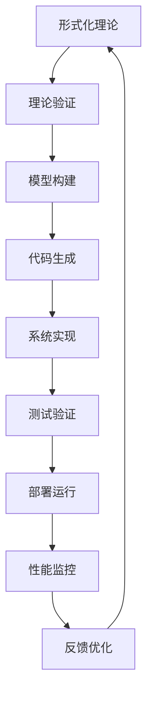

[返回主题树](../00-主题树与内容索引.md) | [主计划文档](../00-形式化架构理论统一计划.md) | [相关计划](../递归合并计划.md)

# 08-实践应用开发-总论

> 本文档为实践应用开发分支总论，所有最新进展与结论以主计划文档为准，历史细节归档于archive/。

## 理论概述

实践应用开发是将形式化架构理论转化为实际软件系统的核心环节，涵盖从理论模型到可执行代码的完整转换过程。

### 基本概念

- **形式化验证**: 基于数学证明的软件正确性验证
- **代码生成**: 从形式化规范自动生成可执行代码
- **模型检测**: 系统性地检查软件模型的所有可能状态
- **架构设计**: 基于形式化理论的软件架构构建

### 理论框架



## 应用领域

### 1. 企业级软件开发

- 微服务架构设计
- 分布式系统构建
- 云原生应用开发

### 2. 安全关键系统

- 航空航天软件
- 医疗设备控制
- 金融交易系统

### 3. 实时系统

- 工业控制系统
- 嵌入式系统
- 物联网应用

## 开发方法论

### 形式化驱动开发 (FDD)

```rust
// 形式化规范定义
#[derive(Debug, Clone, PartialEq)]
pub struct FormalSpec {
    pub preconditions: Vec<Condition>,
    pub postconditions: Vec<Condition>,
    pub invariants: Vec<Invariant>,
}

// 代码生成器
pub struct CodeGenerator {
    spec: FormalSpec,
    target_language: Language,
}

impl CodeGenerator {
    pub fn generate(&self) -> Result<String, GenerationError> {
        // 从形式化规范生成代码
        self.validate_spec()?;
        self.generate_structure()?;
        self.generate_implementation()?;
        Ok(self.output_code())
    }
    
    fn validate_spec(&self) -> Result<(), ValidationError> {
        // 验证规范的一致性
        for invariant in &self.spec.invariants {
            if !invariant.is_satisfiable() {
                return Err(ValidationError::UnsatisfiableInvariant);
            }
        }
        Ok(())
    }
}
```

### 模型驱动架构 (MDA)

```rust
// 平台无关模型 (PIM)
pub trait PlatformIndependentModel {
    fn get_entities(&self) -> Vec<Entity>;
    fn get_relationships(&self) -> Vec<Relationship>;
    fn get_operations(&self) -> Vec<Operation>;
}

// 平台特定模型 (PSM)
pub trait PlatformSpecificModel {
    fn transform_from_pim(&mut self, pim: &dyn PlatformIndependentModel);
    fn generate_code(&self) -> String;
}

// 模型转换器
pub struct ModelTransformer {
    source_model: Box<dyn PlatformIndependentModel>,
    target_platform: Platform,
}

impl ModelTransformer {
    pub fn transform(&self) -> Box<dyn PlatformSpecificModel> {
        // 执行模型转换
        let mut psm = self.create_psm();
        psm.transform_from_pim(self.source_model.as_ref());
        psm
    }
}
```

## 工具链集成

### 持续集成/持续部署 (CI/CD)

```rust
// 自动化构建管道
pub struct BuildPipeline {
    stages: Vec<BuildStage>,
    artifacts: Vec<Artifact>,
}

impl BuildPipeline {
    pub fn execute(&mut self) -> Result<(), PipelineError> {
        for stage in &self.stages {
            stage.execute()?;
            self.artifacts.extend(stage.get_artifacts());
        }
        Ok(())
    }
}

// 质量门禁
pub struct QualityGate {
    metrics: Vec<QualityMetric>,
    thresholds: HashMap<String, f64>,
}

impl QualityGate {
    pub fn check(&self, code: &str) -> QualityReport {
        let mut report = QualityReport::new();
        
        for metric in &self.metrics {
            let value = metric.calculate(code);
            let threshold = self.thresholds.get(&metric.name()).unwrap_or(&0.0);
            
            if value < *threshold {
                report.add_violation(metric.name(), value, *threshold);
            }
        }
        
        report
    }
}
```

## 性能优化

### 静态分析优化

```rust
// 代码复杂度分析
pub struct ComplexityAnalyzer {
    metrics: Vec<ComplexityMetric>,
}

impl ComplexityAnalyzer {
    pub fn analyze(&self, ast: &Ast) -> ComplexityReport {
        let mut report = ComplexityReport::new();
        
        for metric in &self.metrics {
            let complexity = metric.calculate(ast);
            report.add_metric(metric.name(), complexity);
        }
        
        report
    }
}

// 内存使用优化
pub struct MemoryOptimizer {
    strategies: Vec<OptimizationStrategy>,
}

impl MemoryOptimizer {
    pub fn optimize(&self, code: &mut String) -> OptimizationReport {
        let mut report = OptimizationReport::new();
        
        for strategy in &self.strategies {
            let improvement = strategy.apply(code);
            report.add_improvement(strategy.name(), improvement);
        }
        
        report
    }
}
```

## 测试策略

### 形式化测试

```rust
// 基于属性的测试
pub trait Property {
    fn check(&self, input: &TestInput) -> bool;
}

pub struct PropertyBasedTester {
    properties: Vec<Box<dyn Property>>,
    generator: TestDataGenerator,
}

impl PropertyBasedTester {
    pub fn test(&self, iterations: usize) -> TestReport {
        let mut report = TestReport::new();
        
        for _ in 0..iterations {
            let input = self.generator.generate();
            
            for property in &self.properties {
                if !property.check(&input) {
                    report.add_failure(property, input);
                }
            }
        }
        
        report
    }
}
```

## 部署策略

### 容器化部署

```rust
// 容器配置生成
pub struct ContainerConfig {
    base_image: String,
    dependencies: Vec<String>,
    environment: HashMap<String, String>,
    ports: Vec<u16>,
}

impl ContainerConfig {
    pub fn generate_dockerfile(&self) -> String {
        let mut dockerfile = String::new();
        
        dockerfile.push_str(&format!("FROM {}\n", self.base_image));
        
        for dep in &self.dependencies {
            dockerfile.push_str(&format!("RUN install {}\n", dep));
        }
        
        for (key, value) in &self.environment {
            dockerfile.push_str(&format!("ENV {}={}\n", key, value));
        }
        
        for port in &self.ports {
            dockerfile.push_str(&format!("EXPOSE {}\n", port));
        }
        
        dockerfile
    }
}
```

## 监控与维护

### 运行时监控

```rust
// 性能监控
pub struct PerformanceMonitor {
    metrics: Vec<PerformanceMetric>,
    collectors: Vec<MetricCollector>,
}

impl PerformanceMonitor {
    pub fn collect_metrics(&self) -> PerformanceReport {
        let mut report = PerformanceReport::new();
        
        for collector in &self.collectors {
            let metrics = collector.collect();
            report.add_metrics(metrics);
        }
        
        report
    }
}

// 错误追踪
pub struct ErrorTracker {
    error_patterns: Vec<ErrorPattern>,
    alert_rules: Vec<AlertRule>,
}

impl ErrorTracker {
    pub fn track_error(&self, error: &Error) -> Alert {
        for pattern in &self.error_patterns {
            if pattern.matches(error) {
                return self.create_alert(pattern, error);
            }
        }
        
        Alert::None
    }
}
```

## 交叉引用

- [[01-哲学基础理论/00-哲学基础理论总论|哲学基础理论]]
- [[02-数学理论体系/00-数学理论体系总论|数学理论体系]]
- [[03-形式语言理论/00-形式语言理论总论|形式语言理论]]
- [[04-软件架构理论/00-软件架构理论总论|软件架构理论]]
- [[05-编程语言理论/00-编程语言理论总论|编程语言理论]]
- [[06-形式模型理论/00-形式模型理论总论|形式模型理论]]
- [[07-理论统一与整合/00-理论统一与整合总论|理论统一与整合]]

## 导航

- [返回总目录](../README.md)
- [01-Rust形式化工具](01-Rust形式化工具.md)
- [02-Go形式化工具](02-Go形式化工具.md)
- [03-理论验证工具](03-理论验证工具.md)
- [04-架构设计工具](04-架构设计工具.md)
- [05-模型检测工具](05-模型检测工具.md)
- [06-代码生成工具](06-代码生成工具.md)
