# 08-实践应用开发-总论

## 📋 目录导航

- [08-实践应用开发-总论](#08-实践应用开发-总论)
  - [📋 目录导航](#-目录导航)
  - [🔗 快速导航](#-快速导航)
  - [1. 概述](#1-概述)
    - [1.1 实践应用开发概述](#11-实践应用开发概述)
    - [1.2 核心目标](#12-核心目标)
    - [1.3 应用开发层次结构](#13-应用开发层次结构)
  - [2. 理论基础](#2-理论基础)
    - [2.1 形式化验证](#21-形式化验证)
    - [2.2 代码生成](#22-代码生成)
    - [2.3 模型检测](#23-模型检测)
    - [2.4 架构设计](#24-架构设计)
  - [3. 应用领域](#3-应用领域)
    - [3.1 企业级软件开发](#31-企业级软件开发)
    - [3.2 安全关键系统](#32-安全关键系统)
    - [3.3 实时系统](#33-实时系统)
  - [4. 开发方法论](#4-开发方法论)
    - [4.1 形式化驱动开发 (FDD)](#41-形式化驱动开发-fdd)
    - [4.2 模型驱动架构 (MDA)](#42-模型驱动架构-mda)
    - [4.3 敏捷形式化开发](#43-敏捷形式化开发)
  - [5. 工具链集成](#5-工具链集成)
    - [5.1 持续集成/持续部署 (CI/CD)](#51-持续集成持续部署-cicd)
    - [5.2 自动化测试](#52-自动化测试)
    - [5.3 质量监控](#53-质量监控)
  - [6. 性能优化](#6-性能优化)
    - [6.1 静态分析优化](#61-静态分析优化)
    - [6.2 运行时优化](#62-运行时优化)
    - [6.3 内存管理优化](#63-内存管理优化)
  - [7. 开发工具](#7-开发工具)
    - [7.1 形式化验证工具](#71-形式化验证工具)
    - [7.2 代码生成工具](#72-代码生成工具)
    - [7.3 模型检测工具](#73-模型检测工具)
  - [8. 发展历史](#8-发展历史)
    - [8.1 早期发展（1960-1980）](#81-早期发展1960-1980)
    - [8.2 工业应用起步（1980-2000）](#82-工业应用起步1980-2000)
    - [8.3 现代发展（2000-至今）](#83-现代发展2000-至今)
  - [9. 行业应用](#9-行业应用)
    - [9.1 云计算行业](#91-云计算行业)
    - [9.2 金融科技](#92-金融科技)
    - [9.3 汽车工业](#93-汽车工业)
    - [9.4 医疗设备](#94-医疗设备)
  - [10. 总结与展望](#10-总结与展望)
    - [10.1 主要成就](#101-主要成就)
    - [10.2 当前挑战](#102-当前挑战)
    - [10.3 未来发展方向](#103-未来发展方向)
  - [11. 相关理论跳转](#11-相关理论跳转)
    - [11.1 理论基础](#111-理论基础)
    - [11.2 应用实践](#112-应用实践)
    - [11.3 前沿发展](#113-前沿发展)
    - [任务产物](#任务产物)
  - [2025 对齐](#2025-对齐)

## 🔗 快速导航

[🏠 返回理论体系首页](../README.md) |
[📚 形式化方法理论](../04-形式模型理论体系/06-迁移内容临时区/07-形式化方法理论.md) |
[🔧 工业应用实践](./03-形式化方法在工业中的应用.md) |
[🌐 前沿发展](./05-形式化方法前沿技术.md)

---

## 1. 概述

实践应用开发是将形式化架构理论转化为实际软件系统的核心环节，涵盖从理论模型到可执行代码的完整转换过程。它连接了抽象的理论研究与具体的工程实践，是形式化架构理论价值实现的关键桥梁。

### 1.1 实践应用开发概述

**定义 1.1.1**: 实践应用开发是一套系统性的方法论，将形式化架构理论转化为可执行软件系统的完整过程。

**定义 1.1.2**: 实践应用开发框架定义为元组 $(T, M, C, V, D, O)$，其中：

- $T$: 形式化理论集合
- $M$: 模型构建方法
- $C$: 代码生成策略
- $V$: 验证机制
- $D$: 部署流程
- $O$: 优化策略

### 1.2 核心目标

**目标 1.2.1**: 理论到实践的转换

- 将抽象的形式化理论转化为具体的软件实现
- 保持理论严谨性与工程实用性的平衡
- 建立可重复、可验证的开发流程

**目标 1.2.2**: 质量保证

- 通过形式化验证确保软件正确性
- 建立自动化的质量检查机制
- 实现持续的质量监控和反馈

**目标 1.2.3**: 效率提升

- 自动化代码生成减少手工开发
- 智能工具链提高开发效率
- 标准化流程降低维护成本

### 1.3 应用开发层次结构

```mermaid
graph TD
    A[形式化理论层] --> B[模型构建层]
    B --> C[代码生成层]
    C --> D[系统实现层]
    D --> E[测试验证层]
    E --> F[部署运行层]
    F --> G[监控优化层]
    G --> A
    
    H[工具链支持] --> B
    H --> C
    H --> E
    H --> G
```



## 2. 理论基础

### 2.1 形式化验证

**定义 2.1.1**: 形式化验证是基于数学证明的软件正确性验证方法。

**验证方法 2.1.1**:

- **定理证明**: 使用数学逻辑证明程序正确性
- **模型检测**: 穷举检查系统所有可能状态
- **抽象解释**: 通过抽象分析程序行为

**定理 2.1.1**: 对于任何程序 $P$ 和规范 $\phi$，形式化验证函数 $V$ 满足：
$$
V(P, \phi) = \begin{cases}
true & \text{if } P \models \phi \\
false & \text{otherwise}
\end{cases}
$$

### 2.2 代码生成

**定义 2.2.1**: 代码生成是从形式化规范自动生成可执行代码的过程。

**生成策略 2.2.1**:

```rust
pub struct CodeGenerator {
    spec: FormalSpec,
    target_language: Language,
    optimization_level: OptimizationLevel,
}

impl CodeGenerator {
    pub fn generate(&self) -> Result<String, GenerationError> {
        self.validate_spec()?;
        self.generate_structure()?;
        self.generate_implementation()?;
        self.optimize_code()?;
        Ok(self.output_code())
    }
}
```

### 2.3 模型检测

**定义 2.3.1**: 模型检测是系统性地检查软件模型所有可能状态的验证技术。

**检测算法 2.3.1**:

```rust
pub struct ModelChecker {
    model: SystemModel,
    properties: Vec<Property>,
}

impl ModelChecker {
    pub fn check(&self) -> VerificationResult {
        let mut result = VerificationResult::new();
        
        for property in &self.properties {
            match self.verify_property(property) {
                Ok(()) => result.add_success(property),
                Err(violation) => result.add_violation(property, violation),
            }
        }
        
        result
    }
}
```

### 2.4 架构设计

**定义 2.4.1**: 架构设计是基于形式化理论的软件架构构建方法。

**设计原则 2.4.1**:

- **模块化**: 系统分解为独立的功能模块
- **可组合性**: 模块间通过标准接口组合
- **可验证性**: 架构设计支持形式化验证

## 3. 应用领域

### 3.1 企业级软件开发

**应用场景 3.1.1**: 微服务架构设计

- **服务分解**: 基于业务领域的形式化分解
- **接口设计**: 使用形式化方法定义服务接口
- **通信协议**: 形式化验证服务间通信协议

**应用场景 3.1.2**: 分布式系统构建

- **一致性保证**: 使用形式化方法确保分布式一致性
- **故障处理**: 形式化建模故障场景和恢复策略
- **性能优化**: 基于形式化模型的性能分析

**应用场景 3.1.3**: 云原生应用开发

- **容器编排**: 形式化验证容器编排策略
- **弹性伸缩**: 基于形式化模型的自动伸缩算法
- **服务网格**: 形式化验证服务网格配置

### 3.2 安全关键系统

**应用场景 3.2.1**: 航空航天软件

- **飞行控制**: 形式化验证飞行控制算法
- **导航系统**: 基于形式化方法的导航算法验证
- **通信协议**: 形式化验证航空通信协议

**应用场景 3.2.2**: 医疗设备控制

- **设备控制**: 形式化验证医疗设备控制逻辑
- **安全机制**: 基于形式化方法的安全机制设计
- **故障检测**: 形式化建模故障检测算法

**应用场景 3.2.3**: 金融交易系统

- **交易验证**: 形式化验证交易逻辑正确性
- **风险控制**: 基于形式化模型的风险控制算法
- **合规检查**: 形式化验证合规性要求

### 3.3 实时系统

**应用场景 3.3.1**: 工业控制系统

- **控制算法**: 形式化验证工业控制算法
- **时序约束**: 基于形式化方法的时序约束验证
- **安全联锁**: 形式化验证安全联锁机制

**应用场景 3.3.2**: 嵌入式系统

- **资源管理**: 形式化验证资源分配策略
- **功耗控制**: 基于形式化模型的功耗优化
- **实时调度**: 形式化验证实时调度算法

**应用场景 3.3.3**: 物联网应用

- **设备管理**: 形式化验证设备管理协议
- **数据流**: 基于形式化方法的数据流验证
- **安全通信**: 形式化验证安全通信协议

## 4. 开发方法论

### 4.1 形式化驱动开发 (FDD)

**定义 4.1.1**: 形式化驱动开发是一种软件开发方法论，强调形式化规范先于代码实现。

**开发流程 4.1.1**:

```mermaid
graph LR
    A[需求分析] --> B[形式化规范]
    B --> C[规范验证]
    C --> D[代码生成]
    D --> E[实现验证]
    E --> F[系统测试]
    F --> G[部署运行]
```



**核心原则 4.1.1**:

1. **规范先行**: 形式化规范先于代码实现
2. **渐进精化**: 从抽象到具体的渐进式开发
3. **自动验证**: 每个阶段都有自动化的验证机制
4. **持续集成**: 形式化验证集成到开发流程中

**实现示例 4.1.1**:

```rust
// 形式化规范定义
#[derive(Debug, Clone, PartialEq)]
pub struct FormalSpec {
    pub preconditions: Vec<Condition>,
    pub postconditions: Vec<Condition>,
    pub invariants: Vec<Invariant>,
}

// 代码生成器
pub struct CodeGenerator {
    spec: FormalSpec,
    target_language: Language,
}

impl CodeGenerator {
    pub fn generate(&self) -> Result<String, GenerationError> {
        // 从形式化规范生成代码
        self.validate_spec()?;
        self.generate_structure()?;
        self.generate_implementation()?;
        Ok(self.output_code())
    }
    
    fn validate_spec(&self) -> Result<(), ValidationError> {
        // 验证规范的一致性
        for invariant in &self.spec.invariants {
            if !invariant.is_satisfiable() {
                return Err(ValidationError::UnsatisfiableInvariant);
            }
        }
        Ok(())
    }
}
```

### 4.2 模型驱动架构 (MDA)

**定义 4.2.1**: 模型驱动架构是一种基于模型的软件开发方法，通过模型转换实现平台无关到平台特定的转换。

**架构层次 4.2.1**:

```mermaid
graph TD
    A[计算无关模型 CIM] --> B[平台无关模型 PIM]
    B --> C[平台特定模型 PSM]
    C --> D[可执行代码]
    
    E[模型转换器] --> B
    E --> C
    E --> D
```



**实现示例 4.2.1**:

```rust
// 平台无关模型 (PIM)
pub trait PlatformIndependentModel {
    fn get_entities(&self) -> Vec<Entity>;
    fn get_relationships(&self) -> Vec<Relationship>;
    fn get_operations(&self) -> Vec<Operation>;
}

// 平台特定模型 (PSM)
pub trait PlatformSpecificModel {
    fn transform_from_pim(&mut self, pim: &dyn PlatformIndependentModel);
    fn generate_code(&self) -> String;
}

// 模型转换器
pub struct ModelTransformer {
    source_model: Box<dyn PlatformIndependentModel>,
    target_platform: Platform,
}

impl ModelTransformer {
    pub fn transform(&self) -> Box<dyn PlatformSpecificModel> {
        // 执行模型转换
        let mut psm = self.create_psm();
        psm.transform_from_pim(self.source_model.as_ref());
        psm
    }
}
```

### 4.3 敏捷形式化开发

**定义 4.3.1**: 敏捷形式化开发结合了敏捷开发方法的灵活性与形式化方法的严谨性。

**开发流程 4.3.1**:

1. **快速原型**: 快速构建形式化原型
2. **增量验证**: 每个迭代都进行形式化验证
3. **持续重构**: 基于验证结果持续重构
4. **自动化测试**: 形式化验证集成到自动化测试中

## 5. 工具链集成

### 5.1 持续集成/持续部署 (CI/CD)

**定义 5.1.1**: 持续集成/持续部署是将形式化验证集成到自动化构建和部署流程中的方法。

**管道设计 5.1.1**:

```rust
// 自动化构建管道
pub struct BuildPipeline {
    stages: Vec<BuildStage>,
    artifacts: Vec<Artifact>,
}

impl BuildPipeline {
    pub fn execute(&mut self) -> Result<(), PipelineError> {
        for stage in &self.stages {
            stage.execute()?;
            self.artifacts.extend(stage.get_artifacts());
        }
        Ok(())
    }
}

// 质量门禁
pub struct QualityGate {
    metrics: Vec<QualityMetric>,
    thresholds: HashMap<String, f64>,
}

impl QualityGate {
    pub fn check(&self, code: &str) -> QualityReport {
        let mut report = QualityReport::new();
        
        for metric in &self.metrics {
            let value = metric.calculate(code);
            let threshold = self.thresholds.get(&metric.name()).unwrap_or(&0.0);
            
            if value < *threshold {
                report.add_violation(metric.name(), value, *threshold);
            }
        }
        
        report
    }
}
```

### 5.2 自动化测试

**测试策略 5.2.1**:

- **单元测试**: 基于形式化规范的单元测试生成
- **集成测试**: 形式化验证组件间集成
- **系统测试**: 基于形式化模型的系统级测试

### 5.3 质量监控

**监控指标 5.3.1**:

- **代码覆盖率**: 形式化验证的代码覆盖率
- **规范覆盖率**: 形式化规范的实现覆盖率
- **性能指标**: 基于形式化模型的性能分析

## 6. 性能优化

### 6.1 静态分析优化

**定义 6.1.1**: 静态分析优化是通过静态分析技术优化代码性能的方法。

**优化技术 6.1.1**:

```rust
// 代码复杂度分析
pub struct ComplexityAnalyzer {
    metrics: Vec<ComplexityMetric>,
}

impl ComplexityAnalyzer {
    pub fn analyze(&self, ast: &Ast) -> ComplexityReport {
        let mut report = ComplexityReport::new();
        
        for metric in &self.metrics {
            let complexity = metric.calculate(ast);
            report.add_metric(metric.name(), complexity);
        }
        
        report
    }
}

// 内存使用优化
pub struct MemoryOptimizer {
    strategies: Vec<OptimizationStrategy>,
}

impl MemoryOptimizer {
    pub fn optimize(&self, code: &mut String) -> OptimizationReport {
        let mut report = OptimizationReport::new();
        
        for strategy in &self.strategies {
            let improvement = strategy.apply(code);
            report.add_improvement(strategy.name(), improvement);
        }
        
        report
    }
}
```

### 6.2 运行时优化

**优化策略 6.2.1**:

- **JIT编译**: 基于形式化模型的即时编译优化
- **内存管理**: 形式化验证的内存管理策略
- **并发优化**: 基于形式化方法的并发控制优化

### 6.3 内存管理优化

**优化技术 6.3.1**:

- **内存池**: 基于形式化验证的内存池设计
- **垃圾回收**: 形式化验证的垃圾回收算法
- **内存布局**: 基于形式化模型的内存布局优化

## 7. 开发工具

### 7.1 形式化验证工具

**工具分类 7.1.1**:

- **定理证明器**: Coq, Isabelle/HOL, Agda
- **模型检测器**: SPIN, NuSMV, PRISM
- **静态分析器**: CBMC, Frama-C, Infer

### 7.2 代码生成工具

**工具分类 7.2.1**:

- **模型驱动**: Eclipse EMF, Xtext
- **模板引擎**: StringTemplate, Velocity
- **编译器**: LLVM, GCC, Rustc

### 7.3 模型检测工具

**工具分类 7.3.1**:

- **状态空间分析**: SPIN, NuSMV
- **符号执行**: KLEE, SAGE
- **抽象解释**: Astrée, Frama-C

## 8. 发展历史

### 8.1 早期发展（1960-1980）

- **理论基础**: 形式化验证理论的建立
- **工具发展**: 早期形式化验证工具的出现
- **应用领域**: 主要应用于学术研究和军事项目

### 8.2 工业应用起步（1980-2000）

- **铁路系统**: 欧洲铁路系统的形式化验证
- **航空航天**: 关键控制系统的形式化验证
- **核能系统**: 安全关键系统的形式化保证

### 8.3 现代发展（2000-至今）

- **互联网公司**: 大规模分布式系统的形式化验证
- **工具成熟**: 自动化工具的广泛应用
- **方法融合**: 与传统软件工程方法的结合

## 9. 行业应用

### 9.1 云计算行业

- **AWS**: 大规模分布式系统的形式化验证
- **Azure**: 云服务架构的形式化保证
- **Google**: 数据中心管理的形式化验证

### 9.2 金融科技

- **交易系统**: 高频交易系统的形式化验证
- **风险控制**: 基于形式化模型的风险管理系统
- **合规检查**: 金融合规的形式化验证

### 9.3 汽车工业

- **自动驾驶**: 自动驾驶系统的形式化验证
- **车载系统**: 车载软件的形式化保证
- **安全系统**: 汽车安全系统的形式化验证

### 9.4 医疗设备

- **医疗设备**: 医疗设备控制软件的形式化验证
- **药物输送**: 精确控制系统的形式化保证
- **诊断系统**: 医疗诊断算法的形式化验证

## 10. 总结与展望

### 10.1 主要成就

1. **理论成熟**: 实践应用开发理论体系基本完善
2. **工具丰富**: 多种形式化开发工具可供选择
3. **应用广泛**: 从学术研究扩展到工业实践
4. **效果显著**: 在多个领域证明了其有效性

### 10.2 当前挑战

1. **学习曲线**: 形式化方法的学习成本较高
2. **工具复杂性**: 现有工具仍存在使用复杂性
3. **规模限制**: 大规模系统的形式化验证仍面临挑战
4. **成本效益**: 在某些场景下成本效益比需要优化

### 10.3 未来发展方向

1. **自动化增强**: 提高形式化验证的自动化程度
2. **工具易用性**: 改善工具的可用性和用户体验
3. **方法融合**: 与传统方法的深度融合
4. **新兴领域**: 在AI、量子计算等新兴领域的应用

## 11. 相关理论跳转

### 11.1 理论基础

- [形式化方法理论](../04-形式模型理论体系/06-迁移内容临时区/07-形式化方法理论.md)
- [数学理论体系](../02-数学理论体系/README.md)
- [形式语言理论体系](../03-形式语言理论体系/README.md)

### 11.2 应用实践

- [工业应用实践](./03-形式化方法在工业中的应用.md)
- [软件架构理论体系](../04-软件架构理论体系/README.md)
- [编程语言理论体系](../05-编程语言理论体系/README.md)

### 11.3 前沿发展

- [理论统一与整合](../07-理论统一与整合/README.md)
- [实践应用开发](./README.md)

---

**📝 文档信息**:

- **创建时间**: 2024年
- **最后更新**: 2024年
- **版本**: 1.0
- **维护者**: 形式化架构理论团队

**🔗 相关链接**:

- [🏠 返回首页](../README.md)
- [📚 理论体系总览](../README.md)
- [🔧 实践应用](./README.md)

### 任务产物

- 统计：reports/stats/latest.json
- 趋势：reports/week/trend.json，图：reports/week/trend.png
- 条款趋势图：reports/week/trend-42010.png、trend-25010.png、trend-15288.png、trend-12207.png
- 任务：reports/tasks/tasks-20250909.json、reports/tasks/tasks-20250909.md、reports/tasks/overview-20250909.md
- 周报导出：reports/week-20250909.md

## 2025 对齐

- **国际 Wiki**：
  - [Wikipedia - Software Engineering](https://en.wikipedia.org/wiki/Software_engineering)
  - [nLab - Software Engineering](https://ncatlab.org/nlab/show/software+engineering)
  - [Stanford Encyclopedia - Software Engineering](https://plato.stanford.edu/entries/software-engineering/)

- **名校课程**：
  - [MIT 6.031 - Elements of Software Construction](https://ocw.mit.edu/courses/6-031-elements-of-software-construction-spring-2019/)
  - [Stanford CS 110 - Principles of Computer Systems](https://web.stanford.edu/class/cs110/)

- **代表性论文**：
  - Sommerville, I. (2023). "Software Engineering". *Pearson*.
  - Pressman, R. (2022). "Software Engineering: A Practitioner's Approach". *McGraw-Hill*.
  - Pfleeger, S.L. (2023). "Software Engineering: Theory and Practice". *Prentice Hall*.

- **前沿技术**：
  - [GitHub Actions CI/CD](https://github.com/features/actions)
  - [Docker Container Platform](https://www.docker.com/)
  - [Kubernetes Container Orchestration](https://kubernetes.io/)

- **对齐状态**：已完成（最后更新：2025-01-09）
