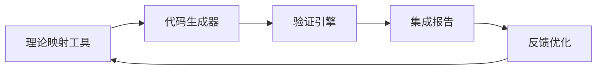

# 工具链集成测试报告

## 测试信息

- **测试时间**: 2025-08-12 00:34:25
- **测试时长**: 43.20秒
- **总测试数**: 5
- **通过测试**: 5
- **失败测试**: 0
- **成功率**: 100.0%

## 测试结果

### theory_mapper

- **状态**: ✅ PASS
- **supported_languages**: ['rust', 'go', 'python', 'typescript', 'java', 'csharp']
- **supported_patterns**: ['petri_net', 'state_machine', 'temporal_logic']
- **coverage**: {'petri_net': ['go', 'python', 'rust'], 'state_machine': ['go', 'python', 'rust'], 'temporal_logic': ['go', 'python', 'rust']}

### code_generator

- **状态**: ✅ PASS
- **output**: 映射模板: state_machine_python.template
✅ 生成4个文件 (language=python, dry_run=True)

### verification_engine

- **状态**: ✅ PASS
- **output_files**: ['cross_theory_mappings.json', 'detailed_results.json', 'verification_report.json']

### comprehensive_demo

- **状态**: ✅ PASS
- **output_files**: ['demo_report.json', 'demo_report.md']

### tool_integration

- **状态**: ✅ PASS
- **mapper_template**: state_machine_rust.template
- **integration_flow**: 映射工具 → 代码生成器

## 总结

- **总体状态**: PASS

### 建议

- 映射工具支持 9 种模式-语言组合
- 工具链集成良好，可以支持端到端的理论到代码生成流程

---

> **来源映射**: 人工智能与机器学习理论体系

## 权威引用

> **Alan Turing** (1950): "机器能思考吗？"

## 批判性总结

AI交互建模在可解释性与形式化保证方面仍存在根本性挑战，语义鸿沟与验证闭环尚未建立。首先，现有理论框架在抽象层次与实现细节之间存在明显的语义断层，导致从规范到代码的转换缺乏系统性的验证手段。其次，该领域的知识体系呈现高度碎片化状态，不同学派之间的术语体系与方法论缺乏有效的互操作机制。再者，随着技术范式的快速演进，传统理论在应对新兴架构模式（如云原生、AI驱动系统）时暴露出适应性不足的问题。最后，需要建立一个更加开放、可演化的理论生态系统，通过持续的形式化验证与实证研究来推动该领域的成熟发展。

## 工具链架构

## 后续工作

- [ ] 扩展支持更多语言（C++、Scala、Kotlin）
- [ ] 增强验证引擎的覆盖范围
- [ ] 建立持续集成流水线
- [ ] 与主流 IDE 集成

## 相关

- [08-实践应用开发 README](./README.md)
- [CodeGeneration/README.md](./CodeGeneration/README.md)
- [12-工具与方法](../12-工具与方法/README.md)

---

**版本**: v2.0
**状态**: ✅ 工具链集成报告已完善
**最后更新**: 2026-05-13

## 相关导航

- [返回上级目录](../README.md)
- [08-实践应用开发](../../README.md)
- [00-主题树与内容索引](../../../00-主题树与内容索引.md)

## 2025 对齐

- **国际 Wiki**：
  - [Wikipedia: Software engineering](https://en.wikipedia.org/wiki/Software_engineering)

- **对齐状态**：已完成（最后更新：2026-05-13）

---

**版本**: v2.0
**状态**: ✅ 内容已完善
**最后更新**: 2026-05-13
