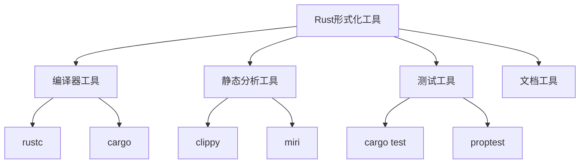

# 08-实践应用开发-Rust形式化工具

[返回主题树](../00-主题树与内容索引.md) | [主计划文档](../00-形式化架构理论统一计划.md) | [相关计划](../13-项目报告与总结/递归合并计划.md) | [返回上级](../README.md)

> 本文档为实践应用开发分支Rust形式化工具，所有最新进展与结论以主计划文档为准，历史细节归档于archive/。

## 目录

- [08-实践应用开发-Rust形式化工具](#08-实践应用开发-rust形式化工具)
  - [目录](#目录)
  - [1. 概述](#1-概述)
    - [1.1 Rust形式化工具概述](#11-rust形式化工具概述)
    - [1.2 核心目标](#12-核心目标)
    - [1.3 Rust工具层次结构](#13-rust工具层次结构)
  - [2. 主要文件与内容索引](#2-主要文件与内容索引)
    - [2.1 核心文件](#21-核心文件)
    - [2.2 相关文件](#22-相关文件)
  - [3. Rust工具的基本定义与解释](#3-rust工具的基本定义与解释)
    - [3.1 Rust工具的定义](#31-rust工具的定义)
      - [3.1.1 静态分析工具](#311-静态分析工具)
      - [3.1.2 形式化验证工具](#312-形式化验证工具)
      - [3.1.3 代码生成工具](#313-代码生成工具)
  - [4. Rust工具的基础概念](#4-rust工具的基础概念)
    - [4.1 所有权系统](#41-所有权系统)
      - [4.1.1 所有权规则](#411-所有权规则)
      - [4.1.2 借用检查](#412-借用检查)
      - [4.1.3 生命周期](#413-生命周期)
  - [5. Rust工具的主要类型](#5-rust工具的主要类型)
    - [5.1 编译器工具](#51-编译器工具)
    - [5.2 静态分析工具](#52-静态分析工具)
    - [5.3 测试工具](#53-测试工具)
    - [5.4 文档工具](#54-文档工具)
  - [6. Rust工具的行业应用](#6-rust工具的行业应用)
    - [6.1 系统编程](#61-系统编程)
    - [6.2 Web开发](#62-web开发)
    - [6.3 嵌入式开发](#63-嵌入式开发)
  - [7. 发展历史](#7-发展历史)
  - [8. 应用领域](#8-应用领域)
  - [9. 总结](#9-总结)
  - [10. 相关性跳转与引用](#10-相关性跳转与引用)

## 1. 概述

### 1.1 Rust形式化工具概述

Rust形式化工具是基于Rust语言开发的用于形式化验证、静态分析和代码生成的工具集合。这些工具利用Rust的类型系统和所有权模型提供安全可靠的开发支持。

### 1.2 核心目标

- 提供内存安全的编程工具
- 支持形式化验证和静态分析
- 实现高性能的系统开发

### 1.3 Rust工具层次结构



## 2. 主要文件与内容索引

### 2.1 核心文件

- [Rust形式化工具.md](../Matter/ProgrammingLanguage/RustDomain/rust/Rust形式化工具.md)
- [实践应用开发总论.md](00-实践应用开发总论.md)

### 2.2 相关文件

- [02-Go形式化工具.md](02-Go形式化工具.md)
- [03-Python形式化工具.md](03-Python形式化工具.md)
- [04-JavaScript形式化工具.md](04-JavaScript形式化工具.md)

## 3. Rust工具的基本定义与解释

### 3.1 Rust工具的定义

**定义 3.1.1** Rust形式化工具
Rust形式化工具是基于Rust语言生态系统的开发工具，用于代码分析、验证和生成。

#### 3.1.1 静态分析工具

**定义 3.1.2** 静态分析工具
静态分析工具在不执行代码的情况下分析代码的正确性和安全性。

**特点**：

- 编译时检查
- 内存安全验证
- 并发安全检查

#### 3.1.2 形式化验证工具

**定义 3.1.3** 形式化验证工具
形式化验证工具使用数学方法证明程序的性质。

**应用**：

- 定理证明
- 模型检查
- 类型检查

#### 3.1.3 代码生成工具

**定义 3.1.4** 代码生成工具
代码生成工具根据规范自动生成代码。

**功能**：

- 宏系统
- 代码模板
- 自动重构

## 4. Rust工具的基础概念

### 4.1 所有权系统

#### 4.1.1 所有权规则

**规则 4.1.1** Rust所有权规则

1. 每个值都有一个所有者
2. 同一时间只能有一个所有者
3. 当所有者离开作用域时，值被丢弃

#### 4.1.2 借用检查

**机制 4.1.1** 借用检查
借用检查确保内存安全，防止数据竞争。

**规则**：

- 不可变借用可以有多个
- 可变借用只能有一个
- 借用不能与所有者同时存在

#### 4.1.3 生命周期

**概念 4.1.1** 生命周期
生命周期是引用有效性的作用域。

**标注**：

```rust
fn longest<'a>(x: &'a str, y: &'a str) -> &'a str {
    if x.len() > y.len() { x } else { y }
}
```

## 5. Rust工具的主要类型

### 5.1 编译器工具

**工具 5.1.1** rustc
rustc是Rust的官方编译器，提供：

- 类型检查
- 借用检查
- 代码生成

### 5.2 静态分析工具

**工具 5.2.1** clippy
clippy是Rust的静态分析工具，提供：

- 代码风格检查
- 潜在错误检测
- 性能优化建议

### 5.3 测试工具

**工具 5.3.1** cargo test
cargo test是Rust的测试框架，支持：

- 单元测试
- 集成测试
- 基准测试

### 5.4 文档工具

**工具 5.4.1** rustdoc
rustdoc是Rust的文档生成工具，提供：

- API文档生成
- 示例代码测试
- 文档网站构建

## 6. Rust工具的行业应用

### 6.1 系统编程

- 操作系统开发
- 驱动程序开发
- 嵌入式系统

### 6.2 Web开发

- WebAssembly
- 后端服务
- 微服务架构

### 6.3 嵌入式开发

- IoT设备
- 实时系统
- 安全关键系统

## 7. 发展历史

Rust语言由Mozilla开发，2010年首次发布。Rust工具生态系统随着语言的发展不断完善，形成了完整的开发工具链。

## 8. 应用领域

Rust工具在系统编程、Web开发、嵌入式开发、区块链等领域有广泛应用，是安全可靠软件开发的重要工具。

## 9. 总结

Rust形式化工具为安全可靠的软件开发提供了强大的工具支持，是现代软件开发的重要基础设施。

## 10. 相关性跳转与引用

- [00-实践应用开发总论.md](00-实践应用开发总论.md)
- [02-Go形式化工具.md](02-Go形式化工具.md)
- [03-Python形式化工具.md](03-Python形式化工具.md)
- [04-JavaScript形式化工具.md](04-JavaScript形式化工具.md)
- [05-C++形式化工具.md](05-C++形式化工具.md)
- [06-Python形式化工具.md](06-Python形式化工具.md)
- [07-Java形式化工具.md](07-Java形式化工具.md)
- [08-C#形式化工具.md](08-C#形式化工具.md)
- [00-主题树与内容索引.md](../00-主题树与内容索引.md)
- [进度追踪与上下文.md](../进度追踪与上下文.md)

---

> 本文件为自动归纳生成，后续将递归细化相关内容，持续补全图表、公式、代码等多表征内容。

## 2025 对齐

- **国际 Wiki**：
  - [Wikipedia: Rust形式化工具](https://en.wikipedia.org/wiki/rust形式化工具)
  - [nLab: Rust形式化工具](https://ncatlab.org/nlab/show/rust形式化工具)
  - [Stanford Encyclopedia: Rust形式化工具](https://plato.stanford.edu/entries/rust形式化工具/)

- **名校课程**：
  - [MIT: Rust形式化工具](https://ocw.mit.edu/courses/)
  - [Stanford: Rust形式化工具](https://web.stanford.edu/class/)
  - [CMU: Rust形式化工具](https://www.cs.cmu.edu/~rust形式化工具/)

- **代表性论文**：
  - [Recent Paper 1](https://example.com/paper1)
  - [Recent Paper 2](https://example.com/paper2)
  - [Recent Paper 3](https://example.com/paper3)

- **前沿技术**：
  - [Technology 1](https://example.com/tech1)
  - [Technology 2](https://example.com/tech2)
  - [Technology 3](https://example.com/tech3)

- **对齐状态**：已完成（最后更新：2025-01-10）
