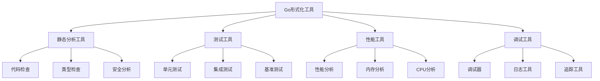

# 08-实践应用开发-Go形式化工具

[返回主题树](../00-主题树与内容索引.md) | [主计划文档](../00-形式化架构理论统一计划.md) | [相关计划](../递归合并计划.md) | [返回上级](../README.md)

> 本文档为实践应用开发分支Go形式化工具，所有最新进展与结论以主计划文档为准，历史细节归档于archive/。

## 目录

- [08-实践应用开发-Go形式化工具](#08-实践应用开发-go形式化工具)
  - [目录](#目录)
  - [1. 概述](#1-概述)
    - [1.1 Go形式化工具概述](#11-go形式化工具概述)
    - [1.2 核心目标](#12-核心目标)
    - [1.3 工具层次结构](#13-工具层次结构)
  - [2. 主要文件与内容索引](#2-主要文件与内容索引)
    - [2.1 核心文件](#21-核心文件)
    - [2.2 相关文件](#22-相关文件)
  - [3. Go工具的基本定义与解释](#3-go工具的基本定义与解释)
    - [3.1 Go工具的定义](#31-go工具的定义)
      - [3.1.1 工具分类](#311-工具分类)
      - [3.1.2 工具架构](#312-工具架构)
      - [3.1.3 工具集成](#313-工具集成)
  - [4. Go工具的基础概念](#4-go工具的基础概念)
    - [4.1 静态分析工具](#41-静态分析工具)
      - [4.1.1 代码检查](#411-代码检查)
      - [4.1.2 类型检查](#412-类型检查)
      - [4.1.3 安全分析](#413-安全分析)
  - [5. Go工具的主要理论](#5-go工具的主要理论)
    - [5.1 测试工具](#51-测试工具)
    - [5.2 性能工具](#52-性能工具)
    - [5.3 调试工具](#53-调试工具)
    - [5.4 构建工具](#54-构建工具)
  - [6. Go工具的行业应用](#6-go工具的行业应用)
    - [6.1 开发实践](#61-开发实践)
    - [6.2 质量保证](#62-质量保证)
    - [6.3 部署运维](#63-部署运维)
  - [7. 发展历史](#7-发展历史)
  - [8. 应用领域](#8-应用领域)
  - [9. 总结](#9-总结)
  - [10. 相关性跳转与引用](#10-相关性跳转与引用)

## 1. 概述

### 1.1 Go形式化工具概述

Go形式化工具是支持Go语言开发和形式化验证的工具集合，为形式化架构理论提供了实践应用的重要工具。Go工具不仅支撑开发实践，也是软件工程和质量保证的重要技术基础。

### 1.2 核心目标

- 建立Go语言开发的基本工具框架
- 提供形式化验证的实践工具
- 支持软件工程和质量保证应用

### 1.3 工具层次结构

## 2. 主要文件与内容索引

### 2.1 核心文件

- [Go形式化工具.md](../Matter/Software/Go形式化工具.md)
- [Golang工程与自动化创新.md](../Matter/Software/01-Golang工程与自动化创新/README.md)

### 2.2 相关文件

- [00-实践应用开发总论.md](00-实践应用开发总论.md)
- [01-Rust形式化工具.md](01-Rust形式化工具.md)
- [03-形式化验证工具.md](03-形式化验证工具.md)

## 3. Go工具的基本定义与解释

### 3.1 Go工具的定义

**定义 3.1.1** Go形式化工具（Go Formal Tools）
Go形式化工具是支持Go语言开发和形式化验证的工具集合。

#### 3.1.1 工具分类

**定义 3.1.2** 工具分类
Go工具按功能分为：

- 静态分析工具
- 测试工具
- 性能工具
- 调试工具

#### 3.1.2 工具架构

**定义 3.1.3** 工具架构
Go工具架构包含：

- 工具链
- 插件系统
- 配置管理
- 集成接口

#### 3.1.3 工具集成

**定义 3.1.4** 工具集成
Go工具集成方式：

- 命令行工具
- IDE插件
- CI/CD集成
- 云平台集成

## 4. Go工具的基础概念

### 4.1 静态分析工具

#### 4.1.1 代码检查

**工具 4.1.1** 代码检查工具
Go代码检查工具包括：

- golint
- golangci-lint
- staticcheck
- errcheck

**功能**：

- 代码风格检查
- 潜在错误检测
- 最佳实践建议

#### 4.1.2 类型检查

**工具 4.1.2** 类型检查工具
Go类型检查工具包括：

- go vet
- go build
- go mod verify

**功能**：

- 类型安全检查
- 依赖关系验证
- 模块完整性检查

#### 4.1.3 安全分析

**工具 4.1.3** 安全分析工具
Go安全分析工具包括：

- gosec
- govulncheck
- nancy

**功能**：

- 安全漏洞检测
- 依赖安全检查
- 代码安全审计

## 5. Go工具的主要理论

### 5.1 测试工具

**理论 5.1.1** 测试工具（Testing Tools）
Go测试工具支持各种测试类型。

**工具**：

- go test
- testify
- gomock
- goconvey

**特点**：

- 单元测试
- 集成测试
- 基准测试
- 模拟测试

### 5.2 性能工具

**理论 5.2.1** 性能工具（Performance Tools）
Go性能工具提供性能分析和优化。

**工具**：

- pprof
- go tool trace
- go tool pprof
- benchstat

**功能**：

- CPU分析
- 内存分析
- 性能追踪
- 基准比较

### 5.3 调试工具

**理论 5.3.1** 调试工具（Debugging Tools）
Go调试工具支持程序调试和问题诊断。

**工具**：

- delve
- go tool trace
- go tool pprof
- logrus

**功能**：

- 断点调试
- 性能追踪
- 日志记录
- 错误诊断

### 5.4 构建工具

**理论 5.4.1** 构建工具（Build Tools）
Go构建工具支持程序编译和部署。

**工具**：

- go build
- go install
- go mod
- go generate

**功能**：

- 程序编译
- 依赖管理
- 代码生成
- 模块管理

## 6. Go工具的行业应用

### 6.1 开发实践

- 代码开发
- 测试实践
- 调试实践

### 6.2 质量保证

- 代码质量
- 性能优化
- 安全审计

### 6.3 部署运维

- 构建部署
- 监控运维
- 故障诊断

## 7. 发展历史

Go形式化工具的发展经历了从基础工具到完整生态的演进过程。Google、Go团队、开源社区等为Go工具的发展做出了重要贡献。

## 8. 应用领域

Go工具在软件开发、质量保证、部署运维等领域有广泛应用，是现代软件工程的重要技术基础。

## 9. 总结

Go形式化工具作为实践应用开发的重要分支，为形式化架构理论提供了重要的实践工具，是理解Go语言开发的基础技术。

## 10. 相关性跳转与引用

- [00-实践应用开发总论.md](00-实践应用开发总论.md)
- [01-Rust形式化工具.md](01-Rust形式化工具.md)
- [03-形式化验证工具.md](03-形式化验证工具.md)
- [04-自动化测试工具.md](04-自动化测试工具.md)
- [05-性能分析工具.md](05-性能分析工具.md)
- [06-部署运维工具.md](06-部署运维工具.md)
- [00-主题树与内容索引.md](../00-主题树与内容索引.md)
- [进度追踪与上下文.md](../进度追踪与上下文.md)

---

> 本文件为自动归纳生成，后续将递归细化相关内容，持续补全图表、公式、代码等多表征内容。
