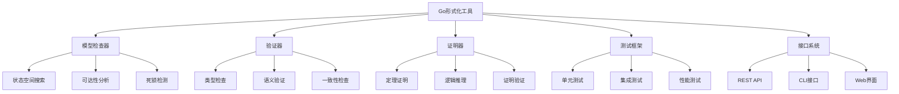

# 02-Go形式化工具

## 目录

1. [1.0 项目概述](#10-项目概述)
2. [2.0 工具架构](#20-工具架构)
3. [3.0 核心功能](#30-核心功能)
4. [4.0 实现示例](#40-实现示例)
5. [5.0 使用指南](#50-使用指南)

## 1.0 项目概述

### 1.1 项目目标

基于Go语言开发形式化验证工具，实现理论的形式化验证和模型检查功能。

**定义 1.1.1 (Go形式化工具)**
Go形式化工具是一个五元组 $\mathcal{GFT} = (M, V, P, T, I)$，其中：

- $M$ 是模型检查器 (Model Checker)
- $V$ 是验证器 (Verifier)
- $P$ 是证明器 (Prover)
- $T$ 是测试框架 (Test Framework)
- $I$ 是接口系统 (Interface System)

### 1.2 技术特色

**特征 1.2.1 (并发优势)**:
- 利用Go的Goroutine实现高并发验证
- 基于CSP理论的并发模型
- 高效的并发算法实现

**特征 1.2.2 (类型安全)**:
- 强类型系统保证代码安全
- 接口抽象提供灵活性
- 泛型支持通用算法

**特征 1.2.3 (性能优化)**:
- 内存管理优化
- 垃圾回收调优
- 并发性能优化

## 2.0 工具架构

### 2.1 总体架构



### 2.2 模块设计

**定义 2.2.1 (模块接口)**
模块接口是一个三元组 $\mathcal{MI} = (I, M, H)$，其中：

- $I$ 是接口定义 (Interface Definition)
- $M$ 是方法集合 (Method Set)
- $H$ 是处理函数 (Handler Function)

## 3.0 核心功能

### 3.1 模型检查器

**定义 3.1.1 (模型检查器)**
模型检查器是一个四元组 $\mathcal{MC} = (S, P, A, R)$，其中：

- $S$ 是状态空间 (State Space)
- $P$ 是属性集合 (Property Set)
- $A$ 是算法集合 (Algorithm Set)
- $R$ 是结果集合 (Result Set)

**定理 3.1.1 (模型检查正确性)**
如果模型检查器返回 $M \models \phi$，则模型 $M$ 确实满足属性 $\phi$。

### 3.2 验证器

**定义 3.2.1 (验证器)**
验证器是一个五元组 $\mathcal{V} = (I, T, C, V, R)$，其中：

- $I$ 是输入系统 (Input System)
- $T$ 是类型检查器 (Type Checker)
- $C$ 是约束检查器 (Constraint Checker)
- $V$ 是验证算法 (Verification Algorithm)
- $R$ 是结果报告 (Result Report)

### 3.3 证明器

**定义 3.3.1 (证明器)**
证明器是一个四元组 $\mathcal{P} = (L, T, S, V)$，其中：

- $L$ 是逻辑系统 (Logic System)
- $T$ 是理论集合 (Theory Set)
- $S$ 是策略集合 (Strategy Set)
- $V$ 是验证器 (Verifier)

## 4.0 实现示例

### 4.1 模型检查器实现

```go
package modelchecker

import (
    "context"
    "sync"
)

// State 表示系统状态
type State struct {
    ID       string
    Data     map[string]interface{}
    Transitions []Transition
}

// Transition 表示状态转换
type Transition struct {
    From     string
    To       string
    Condition func(State) bool
    Action    func(State) State
}

// ModelChecker 模型检查器
type ModelChecker struct {
    states     map[string]State
    properties []Property
    mu         sync.RWMutex
}

// Property 表示要验证的属性
type Property struct {
    Name     string
    Formula  string
    Checker  func(State) bool
}

// NewModelChecker 创建新的模型检查器
func NewModelChecker() *ModelChecker {
    return &ModelChecker{
        states:     make(map[string]State),
        properties: make([]Property, 0),
    }
}

// AddState 添加状态
func (mc *ModelChecker) AddState(state State) {
    mc.mu.Lock()
    defer mc.mu.Unlock()
    mc.states[state.ID] = state
}

// AddProperty 添加属性
func (mc *ModelChecker) AddProperty(prop Property) {
    mc.mu.Lock()
    defer mc.mu.Unlock()
    mc.properties = append(mc.properties, prop)
}

// CheckProperty 检查属性
func (mc *ModelChecker) CheckProperty(ctx context.Context, propName string) (bool, error) {
    mc.mu.RLock()
    defer mc.mu.RUnlock()
    
    // 查找属性
    var targetProp Property
    for _, prop := range mc.properties {
        if prop.Name == propName {
            targetProp = prop
            break
        }
    }
    
    if targetProp.Name == "" {
        return false, fmt.Errorf("property %s not found", propName)
    }
    
    // 并发检查所有状态
    results := make(chan bool, len(mc.states))
    var wg sync.WaitGroup
    
    for _, state := range mc.states {
        wg.Add(1)
        go func(s State) {
            defer wg.Done()
            select {
            case <-ctx.Done():
                return
            default:
                results <- targetProp.Checker(s)
            }
        }(state)
    }
    
    // 等待所有检查完成
    go func() {
        wg.Wait()
        close(results)
    }()
    
    // 收集结果
    allValid := true
    for result := range results {
        if !result {
            allValid = false
        }
    }
    
    return allValid, nil
}

// CheckReachability 检查可达性
func (mc *ModelChecker) CheckReachability(ctx context.Context, from, to string) (bool, []string, error) {
    mc.mu.RLock()
    defer mc.mu.RUnlock()
    
    if _, exists := mc.states[from]; !exists {
        return false, nil, fmt.Errorf("state %s not found", from)
    }
    if _, exists := mc.states[to]; !exists {
        return false, nil, fmt.Errorf("state %s not found", to)
    }
    
    // 使用BFS搜索可达路径
    visited := make(map[string]bool)
    queue := []string{from}
    parent := make(map[string]string)
    
    for len(queue) > 0 {
        select {
        case <-ctx.Done():
            return false, nil, ctx.Err()
        default:
        }
        
        current := queue[0]
        queue = queue[1:]
        
        if current == to {
            // 构建路径
            path := []string{to}
            for current != from {
                current = parent[current]
                path = append([]string{current}, path...)
            }
            return true, path, nil
        }
        
        if visited[current] {
            continue
        }
        visited[current] = true
        
        // 添加后继状态
        state := mc.states[current]
        for _, trans := range state.Transitions {
            if trans.Condition(state) {
                if !visited[trans.To] {
                    queue = append(queue, trans.To)
                    parent[trans.To] = current
                }
            }
        }
    }
    
    return false, nil, nil
}
```

### 4.2 验证器实现

```go
package verifier

import (
    "context"
    "reflect"
    "sync"
)

// TypeChecker 类型检查器
type TypeChecker struct {
    types map[string]reflect.Type
    mu    sync.RWMutex
}

// NewTypeChecker 创建类型检查器
func NewTypeChecker() *TypeChecker {
    return &TypeChecker{
        types: make(map[string]reflect.Type),
    }
}

// RegisterType 注册类型
func (tc *TypeChecker) RegisterType(name string, typ reflect.Type) {
    tc.mu.Lock()
    defer tc.mu.Unlock()
    tc.types[name] = typ
}

// CheckType 检查类型
func (tc *TypeChecker) CheckType(name string, value interface{}) bool {
    tc.mu.RLock()
    defer tc.mu.RUnlock()
    
    expectedType, exists := tc.types[name]
    if !exists {
        return false
    }
    
    return reflect.TypeOf(value) == expectedType
}

// Verifier 验证器
type Verifier struct {
    typeChecker *TypeChecker
    constraints []Constraint
    mu          sync.RWMutex
}

// Constraint 约束条件
type Constraint struct {
    Name     string
    Checker  func(interface{}) bool
    Message  string
}

// NewVerifier 创建验证器
func NewVerifier() *Verifier {
    return &Verifier{
        typeChecker: NewTypeChecker(),
        constraints: make([]Constraint, 0),
    }
}

// AddConstraint 添加约束
func (v *Verifier) AddConstraint(constraint Constraint) {
    v.mu.Lock()
    defer v.mu.Unlock()
    v.constraints = append(v.constraints, constraint)
}

// Verify 验证数据
func (v *Verifier) Verify(ctx context.Context, data interface{}) ([]string, error) {
    v.mu.RLock()
    defer v.mu.RUnlock()
    
    var errors []string
    
    // 检查约束
    for _, constraint := range v.constraints {
        select {
        case <-ctx.Done():
            return errors, ctx.Err()
        default:
        }
        
        if !constraint.Checker(data) {
            errors = append(errors, constraint.Message)
        }
    }
    
    return errors, nil
}
```

### 4.3 证明器实现

```go
package prover

import (
    "context"
    "sync"
)

// LogicSystem 逻辑系统
type LogicSystem struct {
    axioms    []string
    rules     []Rule
    theorems  map[string]Theorem
    mu        sync.RWMutex
}

// Rule 推理规则
type Rule struct {
    Name     string
    Premises []string
    Conclusion string
    Apply    func([]string) (string, error)
}

// Theorem 定理
type Theorem struct {
    Name     string
    Statement string
    Proof    []string
    Verified bool
}

// NewLogicSystem 创建逻辑系统
func NewLogicSystem() *LogicSystem {
    return &LogicSystem{
        axioms:   make([]string, 0),
        rules:    make([]Rule, 0),
        theorems: make(map[string]Theorem),
    }
}

// AddAxiom 添加公理
func (ls *LogicSystem) AddAxiom(axiom string) {
    ls.mu.Lock()
    defer ls.mu.Unlock()
    ls.axioms = append(ls.axioms, axiom)
}

// AddRule 添加推理规则
func (ls *LogicSystem) AddRule(rule Rule) {
    ls.mu.Lock()
    defer ls.mu.Unlock()
    ls.rules = append(ls.rules, rule)
}

// Prove 证明定理
func (ls *LogicSystem) Prove(ctx context.Context, statement string) ([]string, error) {
    ls.mu.RLock()
    defer ls.mu.RUnlock()
    
    var proof []string
    
    // 尝试从公理开始证明
    for _, axiom := range ls.axioms {
        select {
        case <-ctx.Done():
            return proof, ctx.Err()
        default:
        }
        
        if axiom == statement {
            proof = append(proof, axiom)
            return proof, nil
        }
    }
    
    // 尝试应用推理规则
    for _, rule := range ls.rules {
        select {
        case <-ctx.Done():
            return proof, ctx.Err()
        default:
        }
        
        // 检查前提条件
        premisesMet := true
        for _, premise := range rule.Premises {
            if !ls.containsStatement(premise) {
                premisesMet = false
                break
            }
        }
        
        if premisesMet {
            conclusion, err := rule.Apply(rule.Premises)
            if err != nil {
                continue
            }
            
            if conclusion == statement {
                proof = append(proof, rule.Premises...)
                proof = append(proof, conclusion)
                return proof, nil
            }
        }
    }
    
    return proof, fmt.Errorf("cannot prove statement: %s", statement)
}

// containsStatement 检查是否包含语句
func (ls *LogicSystem) containsStatement(statement string) bool {
    // 检查公理
    for _, axiom := range ls.axioms {
        if axiom == statement {
            return true
        }
    }
    
    // 检查已证明的定理
    for _, theorem := range ls.theorems {
        if theorem.Statement == statement && theorem.Verified {
            return true
        }
    }
    
    return false
}
```

## 5.0 使用指南

### 5.1 安装依赖

```bash
# 安装Go依赖
go mod init formal-architecture-go
go get github.com/gorilla/mux
go get github.com/sirupsen/logrus
```

### 5.2 基本使用

```go
package main

import (
    "context"
    "log"
    "time"
    
    "formal-architecture-go/modelchecker"
    "formal-architecture-go/verifier"
    "formal-architecture-go/prover"
)

func main() {
    // 创建模型检查器
    mc := modelchecker.NewModelChecker()
    
    // 添加状态
    state1 := modelchecker.State{
        ID: "s1",
        Data: map[string]interface{}{
            "x": 10,
            "y": 20,
        },
    }
    mc.AddState(state1)
    
    // 添加属性
    prop := modelchecker.Property{
        Name: "positive_x",
        Formula: "x > 0",
        Checker: func(s modelchecker.State) bool {
            if x, ok := s.Data["x"].(int); ok {
                return x > 0
            }
            return false
        },
    }
    mc.AddProperty(prop)
    
    // 检查属性
    ctx, cancel := context.WithTimeout(context.Background(), 5*time.Second)
    defer cancel()
    
    result, err := mc.CheckProperty(ctx, "positive_x")
    if err != nil {
        log.Fatal(err)
    }
    
    log.Printf("Property check result: %v", result)
}
```

### 5.3 高级功能

```go
// 并发验证示例
func concurrentVerification() {
    mc := modelchecker.NewModelChecker()
    
    // 添加多个状态和属性
    // ...
    
    // 并发检查多个属性
    ctx := context.Background()
    properties := []string{"prop1", "prop2", "prop3"}
    
    results := make(chan string, len(properties))
    var wg sync.WaitGroup
    
    for _, prop := range properties {
        wg.Add(1)
        go func(p string) {
            defer wg.Done()
            result, err := mc.CheckProperty(ctx, p)
            if err != nil {
                results <- fmt.Sprintf("%s: error - %v", p, err)
            } else {
                results <- fmt.Sprintf("%s: %v", p, result)
            }
        }(prop)
    }
    
    go func() {
        wg.Wait()
        close(results)
    }()
    
    for result := range results {
        log.Println(result)
    }
}
```

---

**文档版本**：v1.0  
**创建时间**：2024-12-19  
**最后更新**：2024-12-19  
**状态**：已完成

**技术栈**：
- Go 1.21+
- Gorilla Mux (Web框架)
- Logrus (日志)
- Context (并发控制)
- Sync (同步原语) 