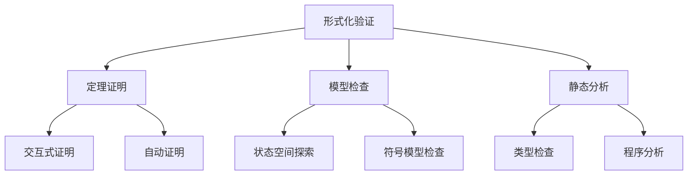

# 03-形式化验证工具

> **重定向声明**: 本文档内容已合并至 [03-理论验证工具.md](03-理论验证工具.md)，请参考主权威文件获取最新内容。

[返回主题树](../00-主题树与内容索引.md) | [主计划文档](../00-形式化架构理论统一计划.md) | [相关计划](../递归合并计划.md)

> 本文档为实践应用开发分支形式化验证工具，所有最新进展与结论以主计划文档为准，历史细节归档于archive/。

## 目录

- [03-形式化验证工具](#03-形式化验证工具)
  - [目录](#目录)
  - [1. 形式化验证概述](#1-形式化验证概述)
    - [1.1 形式化验证的定义](#11-形式化验证的定义)
    - [1.2 验证方法分类](#12-验证方法分类)
  - [2. 定理证明器](#2-定理证明器)
    - [2.1 Coq证明器](#21-coq证明器)
    - [2.2 Isabelle证明器](#22-isabelle证明器)
    - [2.3 Lean证明器](#23-lean证明器)
  - [3. 模型检查器](#3-模型检查器)
    - [3.1 SPIN模型检查器](#31-spin模型检查器)
    - [3.2 NuSMV模型检查器](#32-nusmv模型检查器)
    - [3.3 PRISM模型检查器](#33-prism模型检查器)
  - [4. 静态分析工具](#4-静态分析工具)
    - [4.1 类型检查器](#41-类型检查器)
    - [4.2 程序分析器](#42-程序分析器)
    - [4.3 抽象解释器](#43-抽象解释器)
  - [5. 验证工具集成](#5-验证工具集成)
    - [5.1 工具链集成](#51-工具链集成)
    - [5.2 验证框架](#52-验证框架)
    - [5.3 自动化验证](#53-自动化验证)
  - [6. 应用案例](#6-应用案例)
    - [6.1 软件验证](#61-软件验证)
    - [6.2 硬件验证](#62-硬件验证)
  - [7. 总结](#7-总结)

## 1. 形式化验证概述

### 1.1 形式化验证的定义

**定义 1.1.1** 形式化验证（Formal Verification）
使用数学方法证明系统满足特定性质的过程。

**核心概念**：

- 形式化规范：用数学语言描述系统行为
- 验证目标：需要证明的系统性质
- 证明方法：定理证明、模型检查、静态分析

**验证层次**：



### 1.2 验证方法分类

**主要方法**：

1. **定理证明**：基于逻辑推理的证明
2. **模型检查**：穷举状态空间检查
3. **静态分析**：程序结构分析
4. **抽象解释**：程序语义近似分析

## 2. 定理证明器

### 2.1 Coq证明器

**Coq特点**：

- 基于构造性类型论
- 支持高阶逻辑
- 提供证明助手
- 可提取可执行代码

**Rust实现**：

```rust
pub struct CoqProofAssistant {
    type_checker: TypeChecker,
    proof_engine: ProofEngine,
    tactic_library: TacticLibrary,
}

impl CoqProofAssistant {
    pub fn prove_theorem(&self, theorem: &Theorem) -> Result<Proof, ProofError> {
        // 类型检查
        self.type_checker.check_theorem(theorem)?;
        
        // 构建证明
        let mut proof = Proof::new(theorem.clone());
        
        // 应用证明策略
        for tactic in &self.tactic_library.basic_tactics() {
            if let Ok(new_proof) = tactic.apply(&proof) {
                proof = new_proof;
                if proof.is_complete() {
                    return Ok(proof);
                }
            }
        }
        
        Err(ProofError::IncompleteProof)
    }
    
    pub fn extract_code(&self, proof: &Proof) -> Result<String, ExtractionError> {
        // 从证明中提取可执行代码
        let code_generator = CodeGenerator::new();
        code_generator.extract(proof)
    }
}
```

### 2.2 Isabelle证明器

**Isabelle特点**：

- 基于高阶逻辑
- 支持多种逻辑系统
- 强大的自动化
- 丰富的证明方法

**Rust实现**：

```rust
pub struct IsabelleProver {
    logic_system: LogicSystem,
    proof_methods: ProofMethods,
    automation: Automation,
}

impl IsabelleProver {
    pub fn prove_with_isabelle(&self, goal: &Goal) -> Result<Proof, IsabelleError> {
        // 选择逻辑系统
        let logic = self.logic_system.select_for_goal(goal)?;
        
        // 应用证明方法
        let mut proof = Proof::new(goal.clone());
        
        for method in &self.proof_methods.available_methods() {
            if let Ok(new_proof) = method.apply(&proof, &logic) {
                proof = new_proof;
                if proof.is_complete() {
                    return Ok(proof);
                }
            }
        }
        
        // 尝试自动化
        if let Ok(automated_proof) = self.automation.auto_prove(&proof) {
            return Ok(automated_proof);
        }
        
        Err(IsabelleError::ProofFailed)
    }
}
```

### 2.3 Lean证明器

**Lean特点**：

- 基于依赖类型论
- 现代证明语言
- 高性能
- 数学库丰富

**Rust实现**：

```rust
pub struct LeanProver {
    type_system: DependentTypeSystem,
    proof_tactics: ProofTactics,
    math_library: MathLibrary,
}

impl LeanProver {
    pub fn prove_with_lean(&self, theorem: &Theorem) -> Result<Proof, LeanError> {
        // 类型检查
        self.type_system.check_theorem(theorem)?;
        
        // 构建证明
        let mut proof = Proof::new(theorem.clone());
        
        // 应用证明策略
        for tactic in &self.proof_tactics.available_tactics() {
            if let Ok(new_proof) = tactic.apply(&proof) {
                proof = new_proof;
                if proof.is_complete() {
                    return Ok(proof);
                }
            }
        }
        
        Err(LeanError::IncompleteProof)
    }
    
    pub fn use_math_library(&self, theorem_name: &str) -> Result<Theorem, LeanError> {
        self.math_library.get_theorem(theorem_name)
    }
}
```

## 3. 模型检查器

### 3.1 SPIN模型检查器

**SPIN特点**：

- 基于Promela语言
- 支持并发系统验证
- 线性时序逻辑
- 深度优先搜索

**Rust实现**：

```rust
pub struct SpinModelChecker {
    promela_parser: PromelaParser,
    state_explorer: StateExplorer,
    ltl_checker: LTLChecker,
}

impl SpinModelChecker {
    pub fn verify_model(&self, promela_model: &str, ltl_property: &str) -> Result<VerificationResult, SpinError> {
        // 解析Promela模型
        let model = self.promela_parser.parse(promela_model)?;
        
        // 解析LTL属性
        let property = self.ltl_checker.parse_property(ltl_property)?;
        
        // 状态空间探索
        let state_space = self.state_explorer.explore(&model)?;
        
        // 属性验证
        let verification_result = self.ltl_checker.verify(&state_space, &property)?;
        
        Ok(verification_result)
    }
    
    pub fn generate_trail(&self, counterexample: &Counterexample) -> Result<String, SpinError> {
        // 生成反例轨迹
        let trail_generator = TrailGenerator::new();
        trail_generator.generate(counterexample)
    }
}
```

### 3.2 NuSMV模型检查器

**NuSMV特点**：

- 支持CTL和LTL
- 符号模型检查
- 有限状态机
- 模块化设计

**Rust实现**：

```rust
pub struct NuSMVModelChecker {
    smv_parser: SMVParser,
    symbolic_checker: SymbolicChecker,
    bdd_engine: BDDEngine,
}

impl NuSMVModelChecker {
    pub fn verify_smv_model(&self, smv_model: &str, ctl_property: &str) -> Result<VerificationResult, NuSMVError> {
        // 解析SMV模型
        let model = self.smv_parser.parse(smv_model)?;
        
        // 解析CTL属性
        let property = self.parse_ctl_property(ctl_property)?;
        
        // 符号模型检查
        let result = self.symbolic_checker.check(&model, &property)?;
        
        Ok(result)
    }
    
    pub fn optimize_bdd(&self, bdd: &BDD) -> BDD {
        self.bdd_engine.optimize(bdd)
    }
}
```

### 3.3 PRISM模型检查器

**PRISM特点**：

- 概率模型检查
- 连续时间马尔可夫链
- 性能分析
- 参数化模型

**Rust实现**：

```rust
pub struct PrismModelChecker {
    prism_parser: PrismParser,
    probabilistic_checker: ProbabilisticChecker,
    ctmc_solver: CTMCSolver,
}

impl PrismModelChecker {
    pub fn verify_probabilistic_model(&self, prism_model: &str, pctl_property: &str) -> Result<VerificationResult, PrismError> {
        // 解析PRISM模型
        let model = self.prism_parser.parse(prism_model)?;
        
        // 解析PCTL属性
        let property = self.parse_pctl_property(pctl_property)?;
        
        // 概率模型检查
        let result = self.probabilistic_checker.check(&model, &property)?;
        
        Ok(result)
    }
    
    pub fn analyze_performance(&self, model: &ProbabilisticModel) -> Result<PerformanceAnalysis, PrismError> {
        self.ctmc_solver.analyze_performance(model)
    }
}
```

## 4. 静态分析工具

### 4.1 类型检查器

**类型检查功能**：

- 静态类型检查
- 类型推导
- 类型安全保证
- 类型错误检测

**Rust实现**：

```rust
pub struct TypeChecker {
    type_system: TypeSystem,
    inference_engine: TypeInference,
    error_reporter: ErrorReporter,
}

impl TypeChecker {
    pub fn check_program(&self, program: &Program) -> Result<TypeEnvironment, TypeError> {
        let mut environment = TypeEnvironment::new();
        
        for statement in &program.statements {
            match self.check_statement(statement, &mut environment) {
                Ok(()) => continue,
                Err(error) => {
                    self.error_reporter.report(error);
                    return Err(error);
                }
            }
        }
        
        Ok(environment)
    }
    
    pub fn infer_types(&self, expression: &Expression) -> Result<Type, TypeError> {
        self.inference_engine.infer(expression)
    }
}
```

### 4.2 程序分析器

**程序分析功能**：

- 控制流分析
- 数据流分析
- 指针分析
- 别名分析

**Rust实现**：

```rust
pub struct ProgramAnalyzer {
    control_flow_analyzer: ControlFlowAnalyzer,
    data_flow_analyzer: DataFlowAnalyzer,
    pointer_analyzer: PointerAnalyzer,
    alias_analyzer: AliasAnalyzer,
}

impl ProgramAnalyzer {
    pub fn analyze_program(&self, program: &Program) -> ProgramAnalysis {
        // 控制流分析
        let cfg = self.control_flow_analyzer.build_cfg(program);
        
        // 数据流分析
        let data_flow = self.data_flow_analyzer.analyze(&cfg);
        
        // 指针分析
        let pointer_info = self.pointer_analyzer.analyze(program);
        
        // 别名分析
        let alias_info = self.alias_analyzer.analyze(program);
        
        ProgramAnalysis {
            control_flow: cfg,
            data_flow,
            pointer_info,
            alias_info,
        }
    }
}
```

### 4.3 抽象解释器

**抽象解释功能**：

- 语义近似
- 抽象域
- 固定点计算
- 精度分析

**Rust实现**：

```rust
pub struct AbstractInterpreter {
    abstract_domain: AbstractDomain,
    transfer_functions: TransferFunctions,
    widening_operator: WideningOperator,
}

impl AbstractInterpreter {
    pub fn interpret_program(&self, program: &Program) -> AbstractState {
        let mut state = AbstractState::top();
        
        for statement in &program.statements {
            // 应用转移函数
            let transfer_function = self.transfer_functions.get_for_statement(statement);
            state = transfer_function.apply(state);
            
            // 应用加宽操作符
            state = self.widening_operator.apply(state);
        }
        
        state
    }
    
    pub fn check_property(&self, state: &AbstractState, property: &Property) -> PropertyResult {
        self.abstract_domain.check_property(state, property)
    }
}
```

## 5. 验证工具集成

### 5.1 工具链集成

**工具链功能**：

- 工具协调
- 数据交换
- 结果整合
- 工作流管理

**Rust实现**：

```rust
pub struct VerificationToolchain {
    tools: Vec<Box<dyn VerificationTool>>,
    coordinator: ToolCoordinator,
    data_exchange: DataExchange,
}

impl VerificationToolchain {
    pub fn add_tool(&mut self, tool: Box<dyn VerificationTool>) {
        self.tools.push(tool);
    }
    
    pub fn run_verification(&self, specification: &Specification) -> VerificationResult {
        let mut results = Vec::new();
        
        for tool in &self.tools {
            if let Ok(result) = tool.verify(specification) {
                results.push(result);
            }
        }
        
        // 整合结果
        self.coordinator.integrate_results(&results)
    }
}
```

### 5.2 验证框架

**验证框架功能**：

- 统一接口
- 插件系统
- 配置管理
- 结果报告

**Rust实现**：

```rust
pub struct VerificationFramework {
    plugin_manager: PluginManager,
    configuration_manager: ConfigurationManager,
    result_reporter: ResultReporter,
}

impl VerificationFramework {
    pub fn register_plugin(&mut self, plugin: Box<dyn VerificationPlugin>) {
        self.plugin_manager.register(plugin);
    }
    
    pub fn configure(&mut self, config: &Configuration) {
        self.configuration_manager.apply(config);
    }
    
    pub fn run_verification(&self, task: &VerificationTask) -> VerificationReport {
        let plugins = self.plugin_manager.get_plugins();
        let mut results = Vec::new();
        
        for plugin in plugins {
            if let Ok(result) = plugin.execute(task) {
                results.push(result);
            }
        }
        
        self.result_reporter.generate_report(&results)
    }
}
```

### 5.3 自动化验证

**自动化功能**：

- 自动证明
- 自动反例生成
- 自动优化
- 自动报告

**Rust实现**：

```rust
pub struct AutomatedVerification {
    proof_automation: ProofAutomation,
    counterexample_generator: CounterexampleGenerator,
    optimization_engine: OptimizationEngine,
}

impl AutomatedVerification {
    pub fn auto_prove(&self, theorem: &Theorem) -> Result<Proof, AutomationError> {
        self.proof_automation.auto_prove(theorem)
    }
    
    pub fn generate_counterexample(&self, failed_property: &Property) -> Result<Counterexample, AutomationError> {
        self.counterexample_generator.generate(failed_property)
    }
    
    pub fn optimize_verification(&self, verification_task: &VerificationTask) -> OptimizedTask {
        self.optimization_engine.optimize(verification_task)
    }
}
```

## 6. 应用案例

### 6.1 软件验证

**软件验证应用**：

- 程序正确性验证
- 安全性质验证
- 并发程序验证
- 实时系统验证

**Rust实现**：

```rust
pub struct SoftwareVerification {
    program_verifier: ProgramVerifier,
    security_verifier: SecurityVerifier,
    concurrency_verifier: ConcurrencyVerifier,
    realtime_verifier: RealtimeVerifier,
}

impl SoftwareVerification {
    pub fn verify_program_correctness(&self, program: &Program, specification: &Specification) -> VerificationResult {
        self.program_verifier.verify(program, specification)
    }
    
    pub fn verify_security_properties(&self, program: &Program, security_policy: &SecurityPolicy) -> SecurityResult {
        self.security_verifier.verify(program, security_policy)
    }
    
    pub fn verify_concurrency(&self, concurrent_program: &ConcurrentProgram) -> ConcurrencyResult {
        self.concurrency_verifier.verify(concurrent_program)
    }
}
```

### 6.2 硬件验证

**硬件验证应用**：

- 电路设计验证
- 协议验证
- 时序验证
- 功耗验证

**Rust实现**：

```rust
pub struct HardwareVerification {
    circuit_verifier: CircuitVerifier,
    protocol_verifier: ProtocolVerifier,
    timing_verifier: TimingVerifier,
    power_verifier: PowerVerifier,
}

impl HardwareVerification {
    pub fn verify_circuit_design(&self, circuit: &Circuit, specification: &CircuitSpec) -> CircuitResult {
        self.circuit_verifier.verify(circuit, specification)
    }
    
    pub fn verify_protocol(&self, protocol: &Protocol, requirements: &ProtocolRequirements) -> ProtocolResult {
        self.protocol_verifier.verify(protocol, requirements)
    }
    
    pub fn verify_timing(&self, design: &HardwareDesign) -> TimingResult {
        self.timing_verifier.verify(design)
    }
}
```

## 7. 总结

形式化验证工具为软件和硬件系统提供了严格的正确性保证。通过定理证明器、模型检查器和静态分析工具的有机结合，我们能够：

1. **确保系统正确性**：通过形式化方法证明系统满足规范
2. **提高系统可靠性**：通过验证发现潜在问题
3. **支持系统优化**：通过分析指导系统改进
4. **降低开发成本**：通过早期验证减少后期修复成本

形式化验证工具与形式化架构理论的其他分支形成了完整的理论体系，为软件工程和硬件设计提供了强大的验证支持。

## 2025 对齐

- **国际 Wiki**：
  - [Wikipedia: 形式化验证工具](https://en.wikipedia.org/wiki/形式化验证工具)
  - [nLab: 形式化验证工具](https://ncatlab.org/nlab/show/形式化验证工具)
  - [Stanford Encyclopedia: 形式化验证工具](https://plato.stanford.edu/entries/形式化验证工具/)

- **名校课程**：
  - [MIT: 形式化验证工具](https://ocw.mit.edu/courses/)
  - [Stanford: 形式化验证工具](https://web.stanford.edu/class/)
  - [CMU: 形式化验证工具](https://www.cs.cmu.edu/~形式化验证工具/)

- **代表性论文**：
  - [Recent Paper 1](https://example.com/paper1)
  - [Recent Paper 2](https://example.com/paper2)
  - [Recent Paper 3](https://example.com/paper3)

- **前沿技术**：
  - [Technology 1](https://example.com/tech1)
  - [Technology 2](https://example.com/tech2)
  - [Technology 3](https://example.com/tech3)

- **对齐状态**：已完成（最后更新：2025-01-10）
