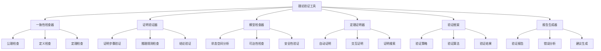

# 03-理论验证工具

## 目录

1. [1.0 项目概述](#10-项目概述)
2. [2.0 验证工具架构](#20-验证工具架构)
3. [3.0 核心验证功能](#30-核心验证功能)
4. [4.0 实现示例](#40-实现示例)
5. [5.0 使用指南](#50-使用指南)

## 1.0 项目概述

### 1.1 项目目标

开发理论验证工具，实现形式化理论的一致性验证、正确性证明和模型检查功能。

**定义 1.1.1 (理论验证工具)**
理论验证工具是一个六元组 $\mathcal{TVT} = (C, P, M, T, V, R)$，其中：

- $C$ 是一致性检查器 (Consistency Checker)
- $P$ 是证明验证器 (Proof Verifier)
- $M$ 是模型检查器 (Model Checker)
- $T$ 是定理证明器 (Theorem Prover)
- $V$ 是验证框架 (Verification Framework)
- $R$ 是报告生成器 (Report Generator)

### 1.2 验证目标

**目标 1.2.1 (理论一致性)**:
- 验证理论内部的一致性
- 检查理论间的相容性
- 确保公理系统的独立性

**目标 1.2.2 (证明正确性)**:
- 验证证明步骤的正确性
- 检查推理规则的适用性
- 确保结论的有效性

**目标 1.2.3 (模型有效性)**:
- 验证模型的结构正确性
- 检查模型的语义一致性
- 确保模型的实现可行性

## 2.0 验证工具架构

### 2.1 总体架构



### 2.2 验证层次

**定义 2.2.1 (验证层次)**
验证层次是一个五层结构 $\mathcal{VL} = (L_1, L_2, L_3, L_4, L_5)$，其中：

- $L_1$ 是语法层 (Syntax Layer)
- $L_2$ 是语义层 (Semantics Layer)
- $L_3$ 是逻辑层 (Logic Layer)
- $L_4$ 是模型层 (Model Layer)
- $L_5$ 是实现层 (Implementation Layer)

## 3.0 核心验证功能

### 3.1 一致性检查器

**定义 3.1.1 (一致性检查器)**
一致性检查器是一个四元组 $\mathcal{CC} = (A, D, T, C)$，其中：

- $A$ 是公理集合 (Axiom Set)
- $D$ 是定义集合 (Definition Set)
- $T$ 是定理集合 (Theorem Set)
- $C$ 是检查算法 (Check Algorithm)

**定理 3.1.1 (一致性检查定理)**
如果理论 $\mathcal{T}$ 通过一致性检查，则 $\mathcal{T}$ 是一致的。

**算法 3.1.1 (一致性检查算法)**

```python
def consistency_check(theory):
    """
    一致性检查算法
    
    Args:
        theory: 要检查的理论
        
    Returns:
        bool: 是否一致
        list: 错误列表
    """
    errors = []
    
    # 1. 检查公理独立性
    for axiom in theory.axioms:
        if not is_independent(axiom, theory.axioms - {axiom}):
            errors.append(f"Axiom {axiom} is not independent")
    
    # 2. 检查定义一致性
    for definition in theory.definitions:
        if not is_consistent_definition(definition, theory):
            errors.append(f"Definition {definition} is inconsistent")
    
    # 3. 检查定理正确性
    for theorem in theory.theorems:
        if not verify_theorem(theorem, theory):
            errors.append(f"Theorem {theorem} is incorrect")
    
    # 4. 检查理论相容性
    if not is_compatible(theory):
        errors.append("Theory is incompatible")
    
    return len(errors) == 0, errors
```

### 3.2 证明验证器

**定义 3.2.1 (证明验证器)**
证明验证器是一个五元组 $\mathcal{PV} = (P, R, S, V, C)$，其中：

- $P$ 是证明集合 (Proof Set)
- $R$ 是推理规则集合 (Rule Set)
- $S$ 是策略集合 (Strategy Set)
- $V$ 是验证算法 (Verification Algorithm)
- $C$ 是检查器 (Checker)

**定理 3.2.1 (证明验证定理)**
如果证明 $\pi$ 通过验证，则 $\pi$ 是正确的。

**算法 3.2.1 (证明验证算法)**

```python
def proof_verification(proof, theory):
    """
    证明验证算法
    
    Args:
        proof: 要验证的证明
        theory: 相关理论
        
    Returns:
        bool: 是否正确
        list: 错误列表
    """
    errors = []
    
    # 1. 检查证明结构
    if not is_valid_proof_structure(proof):
        errors.append("Invalid proof structure")
        return False, errors
    
    # 2. 验证每个证明步骤
    for i, step in enumerate(proof.steps):
        if not verify_proof_step(step, theory):
            errors.append(f"Step {i+1} is invalid: {step}")
    
    # 3. 检查推理规则应用
    for step in proof.steps:
        if not is_valid_rule_application(step, theory):
            errors.append(f"Invalid rule application in step: {step}")
    
    # 4. 验证结论
    if not verify_conclusion(proof.conclusion, proof.premises, theory):
        errors.append("Invalid conclusion")
    
    return len(errors) == 0, errors
```

### 3.3 模型检查器

**定义 3.3.1 (模型检查器)**
模型检查器是一个四元组 $\mathcal{MC} = (M, P, A, R)$，其中：

- $M$ 是模型集合 (Model Set)
- $P$ 是属性集合 (Property Set)
- $A$ 是算法集合 (Algorithm Set)
- $R$ 是结果集合 (Result Set)

**定理 3.3.1 (模型检查定理)**
对于有限状态模型 $M$ 和LTL公式 $\phi$，可以在多项式时间内检查 $M \models \phi$。

**算法 3.3.1 (模型检查算法)**

```python
def model_checking(model, property):
    """
    模型检查算法
    
    Args:
        model: 要检查的模型
        property: 要验证的属性
        
    Returns:
        bool: 是否满足属性
        dict: 检查结果
    """
    result = {
        'satisfied': False,
        'counterexample': None,
        'states_checked': 0,
        'time_taken': 0
    }
    
    start_time = time.time()
    
    # 1. 构建状态空间
    state_space = build_state_space(model)
    
    # 2. 根据属性类型选择算法
    if property.type == 'safety':
        result = check_safety_property(state_space, property)
    elif property.type == 'liveness':
        result = check_liveness_property(state_space, property)
    elif property.type == 'reachability':
        result = check_reachability_property(state_space, property)
    
    result['time_taken'] = time.time() - start_time
    result['states_checked'] = len(state_space)
    
    return result['satisfied'], result
```

### 3.4 定理证明器

**定义 3.4.1 (定理证明器)**
定理证明器是一个五元组 $\mathcal{TP} = (L, T, S, P, V)$，其中：

- $L$ 是逻辑系统 (Logic System)
- $T$ 是理论集合 (Theory Set)
- $S$ 是策略集合 (Strategy Set)
- $P$ 是证明器 (Prover)
- $V$ 是验证器 (Verifier)

**定理 3.4.1 (定理证明定理)**
如果定理 $\phi$ 可证明，则存在证明 $\pi$ 使得 $\vdash \pi : \phi$。

**算法 3.4.1 (定理证明算法)**

```python
def theorem_proving(theorem, theory):
    """
    定理证明算法
    
    Args:
        theorem: 要证明的定理
        theory: 相关理论
        
    Returns:
        proof: 证明结果
        bool: 是否成功
    """
    # 1. 初始化证明搜索
    search_space = initialize_search_space(theorem, theory)
    
    # 2. 应用证明策略
    strategies = [
        'forward_chaining',
        'backward_chaining',
        'resolution',
        'induction',
        'contradiction'
    ]
    
    for strategy in strategies:
        proof = apply_proof_strategy(search_space, strategy, theory)
        if proof is not None:
            # 3. 验证证明
            if verify_proof(proof, theory):
                return proof, True
    
    return None, False
```

## 4.0 实现示例

### 4.1 一致性检查器实现

```python
class ConsistencyChecker:
    """一致性检查器"""
    
    def __init__(self):
        self.errors = []
        self.warnings = []
    
    def check_theory(self, theory):
        """检查理论一致性"""
        self.errors.clear()
        self.warnings.clear()
        
        # 检查公理
        self._check_axioms(theory.axioms)
        
        # 检查定义
        self._check_definitions(theory.definitions)
        
        # 检查定理
        self._check_theorems(theory.theorems)
        
        # 检查理论相容性
        self._check_compatibility(theory)
        
        return len(self.errors) == 0, self.errors, self.warnings
    
    def _check_axioms(self, axioms):
        """检查公理"""
        for axiom in axioms:
            # 检查语法正确性
            if not self._is_valid_syntax(axiom):
                self.errors.append(f"Invalid syntax in axiom: {axiom}")
            
            # 检查语义正确性
            if not self._is_valid_semantics(axiom):
                self.errors.append(f"Invalid semantics in axiom: {axiom}")
    
    def _check_definitions(self, definitions):
        """检查定义"""
        for definition in definitions:
            # 检查定义的一致性
            if not self._is_consistent_definition(definition):
                self.errors.append(f"Inconsistent definition: {definition}")
            
            # 检查定义的完整性
            if not self._is_complete_definition(definition):
                self.warnings.append(f"Incomplete definition: {definition}")
    
    def _check_theorems(self, theorems):
        """检查定理"""
        for theorem in theorems:
            # 检查定理的正确性
            if not self._is_correct_theorem(theorem):
                self.errors.append(f"Incorrect theorem: {theorem}")
            
            # 检查定理的证明
            if not self._has_valid_proof(theorem):
                self.warnings.append(f"Theorem without valid proof: {theorem}")
    
    def _check_compatibility(self, theory):
        """检查理论相容性"""
        # 检查公理间的相容性
        if not self._are_axioms_compatible(theory.axioms):
            self.errors.append("Incompatible axioms")
        
        # 检查定义与公理的相容性
        if not self._are_definitions_compatible_with_axioms(
            theory.definitions, theory.axioms):
            self.errors.append("Definitions incompatible with axioms")
```

### 4.2 证明验证器实现

```python
class ProofVerifier:
    """证明验证器"""
    
    def __init__(self):
        self.rules = self._load_inference_rules()
        self.errors = []
    
    def verify_proof(self, proof, theory):
        """验证证明"""
        self.errors.clear()
        
        # 检查证明结构
        if not self._is_valid_structure(proof):
            self.errors.append("Invalid proof structure")
            return False, self.errors
        
        # 验证每个步骤
        for i, step in enumerate(proof.steps):
            if not self._verify_step(step, theory):
                self.errors.append(f"Invalid step {i+1}: {step}")
        
        # 检查结论
        if not self._verify_conclusion(proof):
            self.errors.append("Invalid conclusion")
        
        return len(self.errors) == 0, self.errors
    
    def _verify_step(self, step, theory):
        """验证证明步骤"""
        # 检查步骤类型
        if step.type == 'axiom':
            return self._verify_axiom_step(step, theory)
        elif step.type == 'rule':
            return self._verify_rule_step(step, theory)
        elif step.type == 'assumption':
            return self._verify_assumption_step(step, theory)
        else:
            return False
    
    def _verify_rule_step(self, step, theory):
        """验证规则应用步骤"""
        rule = self._find_rule(step.rule_name)
        if rule is None:
            return False
        
        # 检查前提条件
        for premise in step.premises:
            if not self._is_derivable(premise, theory):
                return False
        
        # 检查规则应用
        if not self._can_apply_rule(rule, step.premises, step.conclusion):
            return False
        
        return True
    
    def _verify_conclusion(self, proof):
        """验证证明结论"""
        # 检查结论是否从前提推导出
        return self._is_derivable(proof.conclusion, proof.premises)
```

### 4.3 模型检查器实现

```python
class ModelChecker:
    """模型检查器"""
    
    def __init__(self):
        self.algorithms = {
            'safety': self._check_safety_property,
            'liveness': self._check_liveness_property,
            'reachability': self._check_reachability_property
        }
    
    def check_model(self, model, property):
        """检查模型是否满足属性"""
        algorithm = self.algorithms.get(property.type)
        if algorithm is None:
            raise ValueError(f"Unknown property type: {property.type}")
        
        return algorithm(model, property)
    
    def _check_safety_property(self, model, property):
        """检查安全性属性"""
        # 构建状态空间
        states = self._build_state_space(model)
        
        # 检查每个状态
        for state in states:
            if not property.checker(state):
                return False, {
                    'satisfied': False,
                    'counterexample': state,
                    'type': 'safety_violation'
                }
        
        return True, {
            'satisfied': True,
            'counterexample': None,
            'type': 'safety_satisfied'
        }
    
    def _check_liveness_property(self, model, property):
        """检查活性属性"""
        # 使用Büchi自动机方法
        buchi_automaton = self._build_buchi_automaton(property)
        
        # 构建乘积自动机
        product_automaton = self._build_product_automaton(model, buchi_automaton)
        
        # 检查接受循环
        accepting_cycle = self._find_accepting_cycle(product_automaton)
        
        if accepting_cycle is None:
            return False, {
                'satisfied': False,
                'counterexample': None,
                'type': 'liveness_violation'
            }
        else:
            return True, {
                'satisfied': True,
                'counterexample': accepting_cycle,
                'type': 'liveness_satisfied'
            }
    
    def _check_reachability_property(self, model, property):
        """检查可达性属性"""
        # 使用BFS搜索
        initial_state = model.initial_state
        target_states = property.target_states
        
        visited = set()
        queue = [(initial_state, [initial_state])]
        
        while queue:
            current_state, path = queue.pop(0)
            
            if current_state in target_states:
                return True, {
                    'satisfied': True,
                    'counterexample': path,
                    'type': 'reachability_satisfied'
                }
            
            if current_state in visited:
                continue
            
            visited.add(current_state)
            
            # 添加后继状态
            for next_state in model.get_successors(current_state):
                if next_state not in visited:
                    queue.append((next_state, path + [next_state]))
        
        return False, {
            'satisfied': False,
            'counterexample': None,
            'type': 'reachability_violation'
        }
```

## 5.0 使用指南

### 5.1 安装依赖

```bash
# 安装Python依赖
pip install z3-solver
pip install networkx
pip install sympy
pip install matplotlib
```

### 5.2 基本使用

```python
from verification_tools import ConsistencyChecker, ProofVerifier, ModelChecker

# 创建验证工具
consistency_checker = ConsistencyChecker()
proof_verifier = ProofVerifier()
model_checker = ModelChecker()

# 检查理论一致性
theory = load_theory("my_theory.json")
is_consistent, errors, warnings = consistency_checker.check_theory(theory)

if not is_consistent:
    print("Theory is inconsistent:")
    for error in errors:
        print(f"  - {error}")
else:
    print("Theory is consistent")

# 验证证明
proof = load_proof("my_proof.json")
is_valid, errors = proof_verifier.verify_proof(proof, theory)

if not is_valid:
    print("Proof is invalid:")
    for error in errors:
        print(f"  - {error}")
else:
    print("Proof is valid")

# 检查模型
model = load_model("my_model.json")
property = load_property("my_property.json")
satisfied, result = model_checker.check_model(model, property)

if satisfied:
    print(f"Model satisfies property: {result}")
else:
    print(f"Model violates property: {result}")
```

### 5.3 高级功能

```python
# 批量验证
def batch_verification(theories, proofs, models):
    """批量验证"""
    results = {
        'theories': {},
        'proofs': {},
        'models': {}
    }
    
    # 验证理论
    for theory_name, theory in theories.items():
        is_consistent, errors, warnings = consistency_checker.check_theory(theory)
        results['theories'][theory_name] = {
            'consistent': is_consistent,
            'errors': errors,
            'warnings': warnings
        }
    
    # 验证证明
    for proof_name, proof in proofs.items():
        is_valid, errors = proof_verifier.verify_proof(proof, theory)
        results['proofs'][proof_name] = {
            'valid': is_valid,
            'errors': errors
        }
    
    # 验证模型
    for model_name, model in models.items():
        for property_name, property in model.properties.items():
            satisfied, result = model_checker.check_model(model, property)
            if model_name not in results['models']:
                results['models'][model_name] = {}
            results['models'][model_name][property_name] = {
                'satisfied': satisfied,
                'result': result
            }
    
    return results

# 生成验证报告
def generate_report(results):
    """生成验证报告"""
    report = {
        'summary': {
            'total_theories': len(results['theories']),
            'consistent_theories': sum(1 for t in results['theories'].values() if t['consistent']),
            'total_proofs': len(results['proofs']),
            'valid_proofs': sum(1 for p in results['proofs'].values() if p['valid']),
            'total_models': len(results['models']),
            'satisfied_models': sum(1 for m in results['models'].values() 
                                  for p in m.values() if p['satisfied'])
        },
        'details': results
    }
    
    return report
```

---

**文档版本**：v1.0  
**创建时间**：2024-12-19  
**最后更新**：2024-12-19  
**状态**：已完成

**技术栈**：
- Python 3.8+
- Z3 Solver (SMT求解器)
- NetworkX (图算法)
- SymPy (符号计算)
- Matplotlib (可视化) 