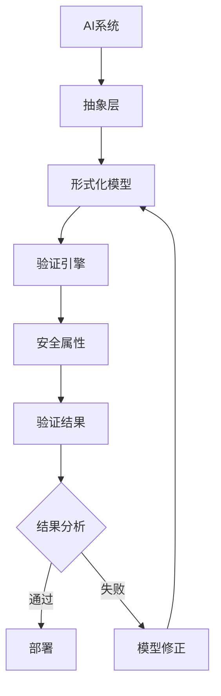
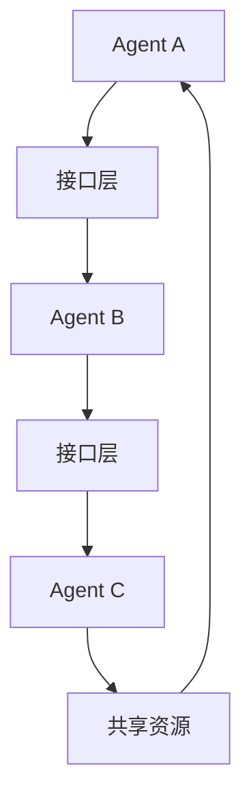

# 形式化方法在AI安全中的应用初探

## 📋 目录导航

- [形式化方法在AI安全中的应用初探](#形式化方法在ai安全中的应用初探)
  - [📋 目录导航](#-目录导航)
  - [🔗 快速导航](#-快速导航)
  - [1. 概述](#1-概述)
    - [1.1 研究背景](#11-研究背景)
    - [1.2 问题挑战](#12-问题挑战)
    - [1.3 解决方案](#13-解决方案)
  - [2. 理论基础](#2-理论基础)
    - [2.1 AI安全基本定义](#21-ai安全基本定义)
    - [2.2 形式化方法映射](#22-形式化方法映射)
    - [2.3 验证框架](#23-验证框架)
  - [3. 统一状态转换系统应用](#3-统一状态转换系统应用)
    - [3.1 Agent行为建模](#31-agent行为建模)
    - [3.2 状态空间定义](#32-状态空间定义)
    - [3.3 转换规则](#33-转换规则)
    - [3.4 安全属性验证](#34-安全属性验证)
  - [4. 统一模块化系统应用](#4-统一模块化系统应用)
    - [4.1 多Agent系统建模](#41-多agent系统建模)
    - [4.2 组件接口设计](#42-组件接口设计)
    - [4.3 契约验证](#43-契约验证)
    - [4.4 组合验证](#44-组合验证)
  - [5. 具体验证场景](#5-具体验证场景)
    - [5.1 指令遵循验证](#51-指令遵循验证)
    - [5.2 工具使用安全性](#52-工具使用安全性)
    - [5.3 多Agent协作可靠性](#53-多agent协作可靠性)
  - [6. 技术挑战与解决方案](#6-技术挑战与解决方案)
    - [6.1 状态空间爆炸](#61-状态空间爆炸)
    - [6.2 非确定性与可解释性](#62-非确定性与可解释性)
    - [6.3 模型与现实的差距](#63-模型与现实的差距)
  - [7. 实现技术](#7-实现技术)
    - [7.1 抽象解释技术](#71-抽象解释技术)
    - [7.2 运行时验证](#72-运行时验证)
    - [7.3 仿真环境验证](#73-仿真环境验证)
  - [8. 发展历史](#8-发展历史)
    - [8.1 早期发展（2010-2015）](#81-早期发展2010-2015)
    - [8.2 快速发展（2015-2020）](#82-快速发展2015-2020)
    - [8.3 现代发展（2020-至今）](#83-现代发展2020-至今)
  - [9. 行业应用](#9-行业应用)
    - [9.1 金融科技](#91-金融科技)
    - [9.2 医疗健康](#92-医疗健康)
    - [9.3 自动驾驶](#93-自动驾驶)
    - [9.4 网络安全](#94-网络安全)
  - [10. 总结与展望](#10-总结与展望)
    - [10.1 主要成就](#101-主要成就)
    - [10.2 当前挑战](#102-当前挑战)
    - [10.3 未来发展方向](#103-未来发展方向)
  - [11. 相关理论跳转](#11-相关理论跳转)
    - [11.1 理论基础](#111-理论基础)
    - [11.2 应用实践](#112-应用实践)
    - [11.3 前沿发展](#113-前沿发展)

## 🔗 快速导航

[🏠 返回理论体系首页](../../README.md) |
[📚 形式化方法理论](../../04-形式模型理论体系/06-迁移内容临时区/07-形式化方法理论.md) |
[🔧 工业应用实践](../03-形式化方法在工业中的应用.md) |
[🌐 前沿发展](../05-形式化方法前沿技术.md)

---

## 1. 概述

随着大语言模型（LLM）和自主代理（Agent）的飞速发展，确保其行为的安全性、可控性、可靠性和价值对齐变得至关重要。传统的基于经验的测试方法难以覆盖AI系统庞大且非确定性的行为空间。形式化方法，以其数学上的精确性和系统性分析能力，为解决这一挑战提供了新的可能性。

### 1.1 研究背景

**定义 1.1.1**: AI安全是指在人工智能系统的设计、开发、部署和使用过程中，确保系统行为符合预期目标，避免产生有害后果的技术和实践。

**定义 1.1.2**: 形式化AI安全验证定义为元组 $(S, \phi, V, M, R)$，其中：

- $S$: AI系统规范
- $\phi$: 安全属性集合
- $V$: 验证方法
- $M$: 监控机制
- $R$: 响应策略

### 1.2 问题挑战

**挑战 1.2.1**: 状态空间爆炸

- **问题**: AI系统的状态空间极其庞大，传统验证方法无法有效处理
- **影响**: 验证成本呈指数级增长
- **解决**: 需要高效的抽象和近似技术

**挑战 1.2.2**: 非确定性与可解释性

- **问题**: LLM输出具有内在非确定性，决策过程是"黑箱"
- **影响**: 难以建立精确的形式化模型
- **解决**: 结合运行时验证和可解释性分析

**挑战 1.2.3**: 模型与现实的差距

- **问题**: 形式化模型是对现实世界的简化
- **影响**: 验证结果可能不适用于真实环境
- **解决**: 构建高保真仿真环境

### 1.3 解决方案

**方案 1.3.1**: 分层验证框架



## 2. 理论基础

### 2.1 AI安全基本定义

**定义 2.1.1**: AI安全属性集合 $\Phi_{AI}$ 定义为：
$$\Phi_{AI} = \{\phi_{safety}, \phi_{reliability}, \phi_{alignment}, \phi_{robustness}\}$$

其中：

- $\phi_{safety}$: 安全性属性
- $\phi_{reliability}$: 可靠性属性  
- $\phi_{alignment}$: 价值对齐属性
- $\phi_{robustness}$: 鲁棒性属性

**定义 2.1.2**: AI系统安全验证函数 $V_{AI}$ 定义为：
$$
V_{AI}(S, \phi) = \begin{cases}
true & \text{if } S \models \phi \\
false & \text{otherwise}
\end{cases}
$$

### 2.2 形式化方法映射

**映射 2.2.1**: USTS到AI Agent的映射
$$USTS_{AI} = (Q_{AI}, \Sigma_{AI}, \delta_{AI}, q_0, F_{AI})$$

其中：

- $Q_{AI}$: AI Agent状态集合
- $\Sigma_{AI}$: 输入动作集合
- $\delta_{AI}$: 状态转换函数
- $q_0$: 初始状态
- $F_{AI}$: 安全状态集合

**映射 2.2.2**: UMS到多Agent系统的映射
$$UMS_{AI} = (C_{AI}, I_{AI}, \mathcal{C}_{AI}, \oplus_{AI})$$

其中：

- $C_{AI}$: Agent组件集合
- $I_{AI}$: 接口集合
- $\mathcal{C}_{AI}$: 契约集合
- $\oplus_{AI}$: 组合操作符

### 2.3 验证框架

**框架 2.3.1**: AI安全验证框架


## 3. 统一状态转换系统应用

### 3.1 Agent行为建模

**定义 3.1.1**: 单个AI Agent可以被抽象为一个USTS模型，用于分析其内部决策和行为逻辑。

**状态定义 3.1.1**: Agent的内部状态包括：

- **记忆状态** $M$: Agent的历史记忆向量
- **目标状态** $G$: 当前任务目标
- **世界模型** $W$: Agent对环境的理解
- **情感状态** $E$: 情感和偏好向量

**动作定义 3.1.1**: Agent可执行的动作集合：
$$\Sigma_{Agent} = \{think(prompt), call\_tool(api, args), respond(user), observe(env)\}$$

### 3.2 状态空间定义

**定义 3.2.1**: Agent状态空间 $Q_{Agent}$ 定义为：
$$Q_{Agent} = M \times G \times W \times E$$

其中每个维度都是高维向量空间。

**状态转换函数 3.2.1**:
$$\delta_{Agent}: Q_{Agent} \times \Sigma_{Agent} \rightarrow Q_{Agent}$$

**定理 3.2.1**: 对于任何Agent状态 $q \in Q_{Agent}$ 和动作 $a \in \Sigma_{Agent}$，存在唯一的下一个状态 $q' = \delta_{Agent}(q, a)$。

### 3.3 转换规则

**规则 3.3.1**: 思考转换
$$think(prompt): (M, G, W, E) \rightarrow (M', G, W, E')$$

其中 $M'$ 是更新后的记忆，$E'$ 是调整后的情感状态。

**规则 3.3.2**: 工具调用转换
$$call\_tool(api, args): (M, G, W, E) \rightarrow (M, G, W', E)$$

其中 $W'$ 是工具调用后更新的世界模型。

**规则 3.3.3**: 响应转换
$$respond(user): (M, G, W, E) \rightarrow (M', G, W, E)$$

其中 $M'$ 包含新的交互历史。

### 3.4 安全属性验证

**属性 3.4.1**: 不变性属性
$$\phi_{invariant}: \forall q \in Q_{Agent}, \neg harmful\_action(q)$$

**属性 3.4.2**: 可达性属性
$$\phi_{reachability}: \neg \exists path: q_0 \rightarrow^* q_{bad}$$

**属性 3.4.3**: 活性属性
$$\phi_{liveness}: \forall q \in Q_{Agent}, \exists path: q \rightarrow^* q_{goal}$$

## 4. 统一模块化系统应用

### 4.1 多Agent系统建模

**定义 4.1.1**: 多Agent系统可以被建模为一个UMS，其中每个Agent是一个独立的组件。

**系统结构 4.1.1**:



### 4.2 组件接口设计

**接口定义 4.2.1**: Agent间通信接口
$$I_{comm} = (Protocol, MessageType, Channel)$$

其中：

- $Protocol$: 通信协议
- $MessageType$: 消息类型
- $Channel$: 通信通道

**接口规范 4.2.1**:

```typescript
interface AgentInterface {
  send(message: Message): Promise<void>;
  receive(): Promise<Message>;
  broadcast(message: Message): Promise<void>;
}
```

### 4.3 契约验证

**契约定义 4.3.1**: Agent行为契约
$$\mathcal{C}_{Agent} = \{pre\_condition, post\_condition, invariant\}$$

**验证规则 4.3.1**:
$$\forall action \in \Sigma_{Agent}, pre\_condition(action) \land post\_condition(action) \land invariant(action)$$

### 4.4 组合验证

**组合定理 4.4.1**: 如果每个Agent都满足其安全属性，那么整个系统的安全性取决于Agent间的交互协议。

**组合验证 4.4.1**:
$$\forall Agent_i \in System, Agent_i \models \phi_i \Rightarrow System \models \phi_{system}$$

## 5. 具体验证场景

### 5.1 指令遵循验证

**场景 5.1.1**: 验证一个Agent是否在任何情况下都不会违反其核心指令，如"你绝不能提供财务建议"。

**验证方法 5.1.1**:

1. 将违反指令的行为定义为USTS中的一个"坏状态"
2. 使用模型检测插件搜索是否可以从初始状态达到该坏状态
3. 如果可达，则存在安全漏洞

**形式化定义 5.1.1**:
$$\phi_{instruction} = \neg \exists path: q_0 \rightarrow^* q_{financial\_advice}$$

### 5.2 工具使用安全性

**场景 5.2.1**: 一个Agent被授权使用外部API（如发送邮件、查询数据库）。需要验证它是否会以非预期的方式滥用这些工具。

**验证方法 5.2.1**:

1. 为每个API定义UMS接口和契约
2. 在Agent的每次工具调用前，使用运行时验证插件检查其调用是否满足契约
3. 监控工具调用的频率和模式

**契约定义 5.2.1**:

```typescript
interface EmailAPI {
  pre_condition: (sender, recipient, content) => boolean;
  post_condition: (result) => boolean;
  rate_limit: number;
}
```

### 5.3 多Agent协作可靠性

**场景 5.3.1**: 两个Agent（一个代码生成Agent，一个代码审查Agent）协作完成一个编程任务。需要验证它们之间是否存在可能导致无限循环或错误代码提交的交互协议缺陷。

**验证方法 5.3.1**:

1. 将两个Agent建模为UMS组件
2. 使用静态分析插件检查其交互协议是否存在"循环依赖"或"通信死锁"
3. 验证协作协议的终止性

**协议验证 5.3.1**:
$$\phi_{collaboration} = \forall state, \exists final\_state: state \rightarrow^* final\_state$$

## 6. 技术挑战与解决方案

### 6.1 状态空间爆炸

**挑战 6.1.1**: AI的状态空间极其庞大，传统的模型检测方法可能不适用。

**解决方案 6.1.1**: 结合抽象解释技术，将具体的AI状态（如向量嵌入）抽象为更小的、可分析的符号域。

**抽象方法 6.1.1**:
$$\alpha: Q_{concrete} \rightarrow Q_{abstract}$$
$$\gamma: Q_{abstract} \rightarrow 2^{Q_{concrete}}$$

### 6.2 非确定性与可解释性

**挑战 6.2.1**: LLM的输出具有内在的非确定性，且其决策过程是一个"黑箱"，这使得形式化建模变得困难。

**解决方案 6.2.1**:

1. 更多地依赖运行时验证，在系统执行过程中监控其行为是否符合安全规范
2. 利用形式化方法来验证可解释性方法（XAI）本身的可靠性
3. 建立概率模型来处理非确定性

### 6.3 模型与现实的差距

**挑战 6.3.1**: 形式化模型是对现实世界的简化。如何确保模型上的验证结果能在真实、复杂的环境中成立，是一个关键问题。

**解决方案 6.3.1**: 构建一个包含仿真环境的闭环验证框架，将形式化验证与在高保真模拟器中的测试相结合。

## 7. 实现技术

### 7.1 抽象解释技术

**技术 7.1.1**: 状态抽象

- 将高维状态向量映射到低维符号表示
- 保持关键安全属性的语义
- 实现高效的验证算法

**算法 7.1.1**:

```python
def abstract_state(concrete_state):
    return {
        'safety_level': classify_safety(concrete_state),
        'goal_progress': measure_progress(concrete_state),
        'risk_score': calculate_risk(concrete_state)
    }
```

### 7.2 运行时验证

**技术 7.2.1**: 实时监控

- 在AI系统运行时监控其行为
- 检查是否违反预定义的安全属性
- 提供即时反馈和干预机制

**监控器 7.2.1**:

```python
class SafetyMonitor:
    def check_action(self, action):
        if self.violates_safety_policy(action):
            return self.intervene(action)
        return action
```

### 7.3 仿真环境验证

**技术 7.3.1**: 高保真仿真

- 构建包含各种边缘情况的仿真环境
- 在仿真中验证形式化模型的有效性
- 提供从仿真到现实的泛化保证

## 8. 发展历史

### 8.1 早期发展（2010-2015）

- **理论基础**: AI安全概念的初步提出
- **应用领域**: 主要关注传统机器学习系统的安全性
- **验证方法**: 基于统计和测试的方法

### 8.2 快速发展（2015-2020）

- **技术突破**: 深度学习安全性的深入研究
- **工具发展**: 各种AI安全验证工具的出现
- **应用扩展**: 扩展到自然语言处理和计算机视觉

### 8.3 现代发展（2020-至今）

- **大模型安全**: 针对大语言模型的安全验证
- **多Agent系统**: 复杂AI系统的形式化验证
- **自动化工具**: 高度自动化的AI安全验证工具

## 9. 行业应用

### 9.1 金融科技

- **风险评估**: AI驱动的风险评估系统的形式化验证
- **交易监控**: 自动交易系统的安全保证
- **欺诈检测**: AI欺诈检测算法的可靠性验证

### 9.2 医疗健康

- **诊断系统**: AI医疗诊断系统的安全性验证
- **药物发现**: AI辅助药物设计的可靠性保证
- **个性化治疗**: AI个性化治疗方案的验证

### 9.3 自动驾驶

- **决策系统**: 自动驾驶决策系统的安全验证
- **感知系统**: 环境感知算法的可靠性保证
- **控制系统**: 车辆控制系统的形式化验证

### 9.4 网络安全

- **威胁检测**: AI威胁检测系统的验证
- **入侵防护**: 智能入侵防护系统的安全保证
- **漏洞分析**: AI辅助漏洞分析工具的可靠性

## 10. 总结与展望

### 10.1 主要成就

1. **理论框架**: 建立了AI安全的形式化验证理论框架
2. **技术方法**: 开发了多种AI安全验证技术
3. **工具支持**: 提供了丰富的AI安全验证工具
4. **应用实践**: 在多个领域实现了成功的应用

### 10.2 当前挑战

1. **技术复杂性**: AI系统的复杂性给验证带来巨大挑战
2. **性能要求**: 实时验证的性能要求较高
3. **可扩展性**: 大规模AI系统的验证仍面临挑战
4. **成本效益**: 验证成本与收益的平衡需要优化

### 10.3 未来发展方向

1. **自动化增强**: 提高AI安全验证的自动化程度
2. **工具集成**: 将验证工具更好地集成到开发流程中
3. **标准制定**: 建立AI安全验证的标准和规范
4. **新兴应用**: 在量子AI、神经形态计算等新兴领域的应用

## 11. 相关理论跳转

### 11.1 理论基础

- [形式化方法理论](../../04-形式模型理论体系/06-迁移内容临时区/07-形式化方法理论.md)
- [数学理论体系](../../02-数学理论体系/README.md)
- [形式语言理论体系](../../03-形式语言理论体系/README.md)

### 11.2 应用实践

- [工业应用实践](../03-形式化方法在工业中的应用.md)
- [软件架构理论体系](../../04-软件架构理论体系/README.md)
- [编程语言理论体系](../../05-编程语言理论体系/README.md)

### 11.3 前沿发展

- [理论统一与整合](../../07-理论统一与整合/README.md)
- [实践应用开发](../README.md)

---

**📝 文档信息**

- **创建时间**: 2024年
- **最后更新**: 2024年
- **版本**: 1.0
- **维护者**: 形式化架构理论团队

**🔗 相关链接**

- [🏠 返回首页](../../README.md)
- [📚 理论体系总览](../../README.md)
- [🔧 实践应用](../README.md)
