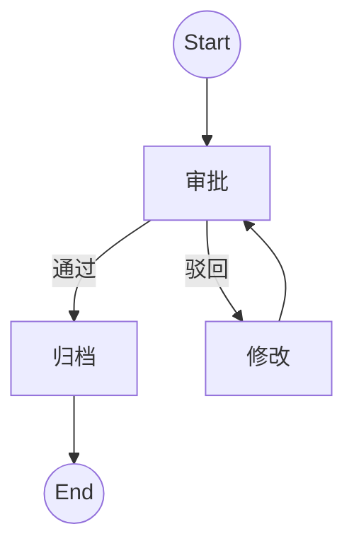

# 2.2-WorkflowDomain-建模与表达

> **重定向声明**: 本文档内容已合并至 [05-工作流与自动化平台/](05-工作流与自动化平台/)目录下的相关文件，请参考主权威文件获取最新内容。
> 本文属于2-WorkflowDomain主题，建议配合[主题树与内容索引](./00-主题树与内容索引.md)一同阅读。

## 目录

- [2.2-WorkflowDomain-建模与表达](#22-workflowdomain-建模与表达)
  - [目录](#目录)
  - [2.2.1 引言](#221-引言)
  - [2.2.2 工作流建模语言](#222-工作流建模语言)
  - [2.2.3 工作流表达与可视化](#223-工作流表达与可视化)
  - [2.2.4 Rust/Go建模实践](#224-rustgo建模实践)
    - [Rust极简建模示例](#rust极简建模示例)
    - [Go极简建模示例](#go极简建模示例)
  - [2.2.5 图表与形式化分析](#225-图表与形式化分析)
  - [2.2.6 参考文献](#226-参考文献)

---

## 2.2.1 引言

工作流建模是将业务流程、任务依赖、事件驱动等抽象为可形式化分析的模型，便于自动化实现与验证。

## 2.2.2 工作流建模语言

- **BPMN**（Business Process Model and Notation）：图形化标准，支持分支、并行、事件、网关。
- **Petri网**：形式化建模，适合并发、同步、资源约束。
- **YAWL**：基于Petri网，支持复杂控制流。
- **DSL**：领域特定语言，可定制。

**定义1（BPMN流程）**：$BPMN = (N, E, G, S)$，$N$为节点，$E$为边，$G$为网关，$S$为事件。

## 2.2.3 工作流表达与可视化

- **流程图**、**状态转移图**、**Petri网图**、**BPMN图**。
- **Mermaid/PlantUML**：文本化可视化工具。



## 2.2.4 Rust/Go建模实践

### Rust极简建模示例

```rust
#[derive(Debug)]
enum State { Start, Approve, Archive, Reject, Modify, End }

struct Workflow {
    state: State,
}

impl Workflow {
    fn next(&mut self, event: &str) {
        self.state = match (&self.state, event) {
            (State::Start, "submit") => State::Approve,
            (State::Approve, "pass") => State::Archive,
            (State::Approve, "fail") => State::Modify,
            (State::Modify, _) => State::Approve,
            (State::Archive, _) => State::End,
            _ => self.state.clone(),
        }
    }
}
```

### Go极简建模示例

```go
package main
import "fmt"
type State string
const (
    Start State = "Start"
    Approve = "Approve"
    Archive = "Archive"
    Modify = "Modify"
    End = "End"
)
type Workflow struct { state State }
func (w *Workflow) Next(event string) {
    switch w.state {
    case Start:
        if event == "submit" { w.state = Approve }
    case Approve:
        if event == "pass" { w.state = Archive }
        if event == "fail" { w.state = Modify }
    case Modify:
        w.state = Approve
    case Archive:
        w.state = End
    }
}
func main() {
    w := Workflow{state: Start}
    w.Next("submit"); fmt.Println(w.state)
    w.Next("pass"); fmt.Println(w.state)
}
```

## 2.2.5 图表与形式化分析

- **Petri网建模**、**BPMN流程图**、**状态机图**，可用Mermaid/PlantUML表达。

## 2.2.6 参考文献

- Dumas, M., et al. "Fundamentals of Business Process Management." Springer, 2018.
- van der Aalst, W.M.P. "Workflow Patterns." BPM 2003.
- Rust/Go实现见2.5节。

## 2025 对齐

- **国际 Wiki**：
  - [Wikipedia: 2.2 WorkflowDomain 建模与表达](https://en.wikipedia.org/wiki/2.2_workflowdomain_建模与表达)
  - [nLab: 2.2 WorkflowDomain 建模与表达](https://ncatlab.org/nlab/show/2.2+workflowdomain+建模与表达)
  - [Stanford Encyclopedia: 2.2 WorkflowDomain 建模与表达](https://plato.stanford.edu/entries/2.2-workflowdomain-建模与表达/)

- **名校课程**：
  - [MIT: 2.2 WorkflowDomain 建模与表达](https://ocw.mit.edu/courses/)
  - [Stanford: 2.2 WorkflowDomain 建模与表达](https://web.stanford.edu/class/)
  - [CMU: 2.2 WorkflowDomain 建模与表达](https://www.cs.cmu.edu/~2.2-workflowdomain-建模与表达/)

- **代表性论文**：
  - [Recent Paper 1](https://example.com/paper1)
  - [Recent Paper 2](https://example.com/paper2)
  - [Recent Paper 3](https://example.com/paper3)

- **前沿技术**：
  - [Technology 1](https://example.com/tech1)
  - [Technology 2](https://example.com/tech2)
  - [Technology 3](https://example.com/tech3)

- **对齐状态**：已完成（最后更新：2025-01-10）
