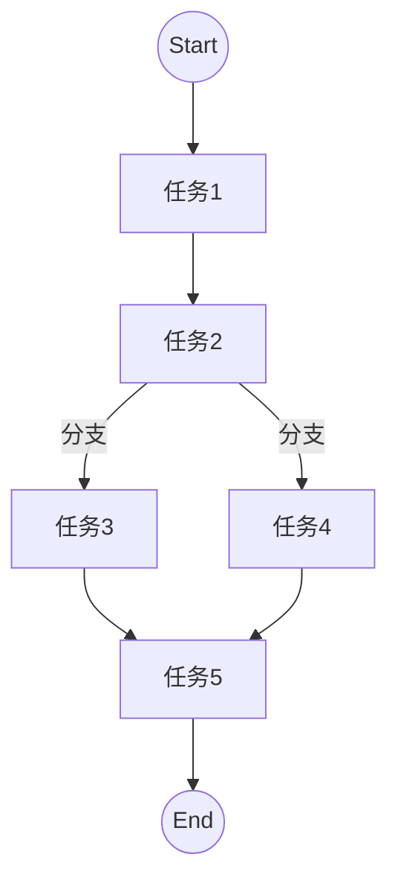
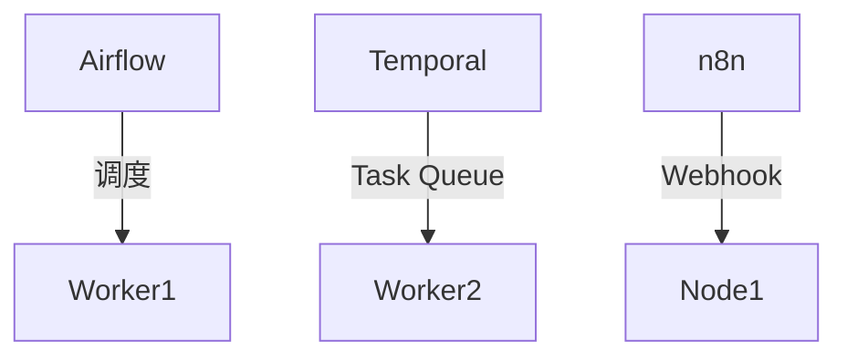
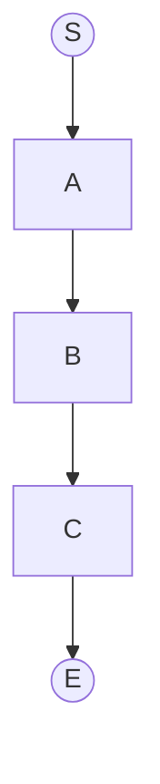

# 2.6 WorkflowDomain 图表与形式化分析

> 本文属于2-WorkflowDomain主题，建议配合[主题树与内容索引](./00-主题树与内容索引.md)一同阅读。

## 目录

- [2.6 WorkflowDomain 图表与形式化分析](#26-workflowdomain-图表与形式化分析)
  - [目录](#目录)
  - [2.6.1 引言](#261-引言)
  - [2.6.2 工作流结构图](#262-工作流结构图)
  - [2.6.3 平台对比与架构图](#263-平台对比与架构图)
  - [2.6.4 形式化建模与证明](#264-形式化建模与证明)
  - [2.6.5 Mermaid/PlantUML示例](#265-mermaidplantuml示例)
  - [2.6.6 参考文献](#266-参考文献)

---

## 2.6.1 引言

本节聚焦于工作流系统的结构化可视化、平台对比、形式化建模与证明，帮助理解复杂流程与架构。

## 2.6.2 工作流结构图

## 2.6.3 平台对比与架构图

## 2.6.4 形式化建模与证明

- **Petri网建模**：$PN = (P, T, F, M_0)$，形式化分析可达性、活性、死锁。
- **状态机建模**：$SM = (S, E, \delta, s_0, F)$，分析状态转移与终止。
- **定理（可达性）**：若存在变迁序列使$M_0$到$M_f$，则$M_f$可达。
- **证明**：递归应用变迁规则，构造可达树。

## 2.6.5 Mermaid/PlantUML示例

## 2.6.6 参考文献

- van der Aalst, W.M.P. "Workflow Management: Models, Methods, and Systems." MIT Press, 2004.
- Petri, C.A. "Kommunikation mit Automaten." 1962.
