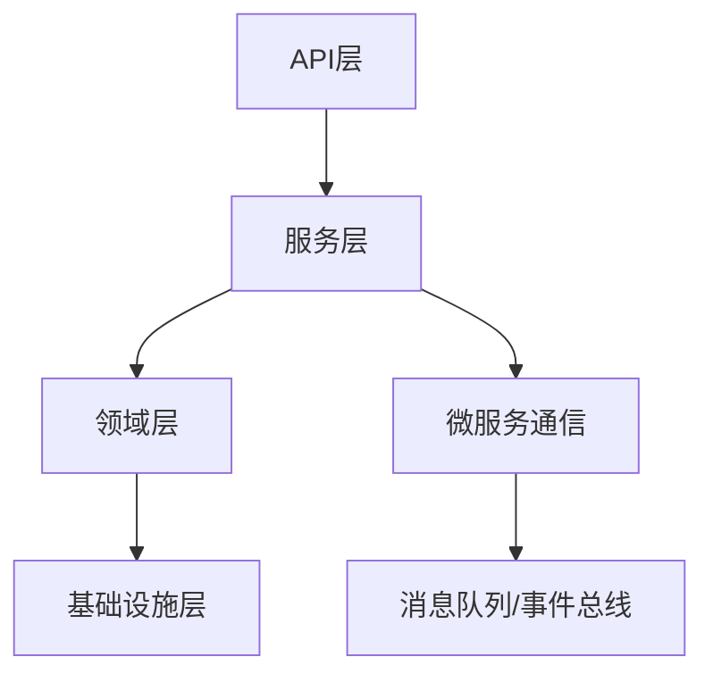

# 01-Golang/Rust后端工程理论与实践

> 本文档系统梳理Golang与Rust后端工程的核心理论、工程模式、性能优化、自动化实践与行业应用，突出现代后端开发的工程创新与自动化能力。

## 2025 对齐

- 国际 Wiki：[Go (programming language)](https://en.wikipedia.org/wiki/Go_(programming_language))、[Rust (programming language)](https://en.wikipedia.org/wiki/Rust_(programming_language))、[Communicating sequential processes](https://en.wikipedia.org/wiki/Communicating_sequential_processes)、[Actor model](https://en.wikipedia.org/wiki/Actor_model)
- 名校课程：[MIT 6.5840 Distributed Systems](https://pdos.csail.mit.edu/6.824/)（2024–2025）、[CMU 15-445/645 Database Systems](https://15445.courses.cs.cmu.edu/)（2024–2025）、[Berkeley CS 186](https://cs186berkeley.net/)（2024–2025）
- 代表性论文/标准：[IETF QUIC RFC 9000](https://www.rfc-editor.org/rfc/rfc9000)（持续）、[gRPC 官方](https://grpc.io/)、[Wasm 组件模型（Component Model）提案](https://component-model.bytecodealliance.org/)
- 前沿技术与版本：[Go 1.22/1.23 发布说明](https://go.dev/doc/devel/release)、[Rust 2024 Edition 指南](https://doc.rust-lang.org/edition-guide/)
  、[Tokio 官方](https://tokio.rs/)、[axum 0.7 文档](https://docs.rs/axum/0.7/axum/)、[OpenTelemetry](https://opentelemetry.io/)、[CNCF](https://www.cncf.io/)/[Kubernetes](https://kubernetes.io/)
- 对齐状态：进行中（最后更新：2025-09-07）

## 目录

- [01-Golang/Rust后端工程理论与实践](#01-golangrust后端工程理论与实践)
  - [2025 对齐](#2025-对齐)
  - [目录](#目录)
  - [1. 主题概述与内容索引](#1-主题概述与内容索引)
  - [2. 语言核心特性与类型系统](#2-语言核心特性与类型系统)
    - [2.1 Golang核心特性](#21-golang核心特性)
    - [2.2 Rust核心特性](#22-rust核心特性)
    - [2.3 类型系统对比](#23-类型系统对比)
  - [3. 并发模型与内存管理](#3-并发模型与内存管理)
    - [3.1 Golang并发模型](#31-golang并发模型)
    - [3.2 Rust并发模型](#32-rust并发模型)
  - [4. 工程模式与架构设计](#4-工程模式与架构设计)
    - [4.1 典型工程模式](#41-典型工程模式)
    - [4.2 架构设计要点](#42-架构设计要点)
    - [4.3 Mermaid架构图示例](#43-mermaid架构图示例)
  - [5. 性能优化与可观测性](#5-性能优化与可观测性)
    - [5.1 性能优化](#51-性能优化)
    - [5.2 可观测性](#52-可观测性)
  - [6. 自动化工程与工具链](#6-自动化工程与工具链)
  - [7. 代码示例（Golang/Rust）](#7-代码示例golangrust)
    - [7.1 Golang并发示例](#71-golang并发示例)
    - [7.2 Rust所有权与多线程示例](#72-rust所有权与多线程示例)
  - [8. 行业应用与最佳实践](#8-行业应用与最佳实践)
  - [9. 相关性跳转与引用](#9-相关性跳转与引用)

---

## 1. 主题概述与内容索引

- 聚焦Golang与Rust在后端开发中的理论基础与工程实践
- 强调类型系统、并发模型、内存安全、工程模式、性能优化、自动化工具链
- 适用于高性能服务、分布式系统、微服务、云原生等场景

---

## 2. 语言核心特性与类型系统

### 2.1 Golang核心特性

- 简洁语法、静态类型、垃圾回收、内置并发（goroutine/channel）
- 接口机制、包管理、跨平台编译

### 2.2 Rust核心特性

- 所有权与借用、零成本抽象、无GC、内存安全
- trait系统、泛型、模式匹配、宏系统

### 2.3 类型系统对比

| 特性         | Golang                | Rust                        |
|--------------|-----------------------|-----------------------------|
| 静态类型     | ✅                    | ✅                          |
| 泛型         | 1.18+                 | 强大泛型                    |
| 所有权/借用  | 无                    | ✅（核心）                  |
| 并发模型     | CSP(goroutine/channel)| 线程+消息/actor/async/await |
| 内存管理     | GC                    | 所有权/RAII                 |

---

## 3. 并发模型与内存管理

### 3.1 Golang并发模型

- goroutine轻量级线程，channel通信
- select多路复用，sync包同步原语

### 3.2 Rust并发模型

- 线程安全由类型系统保证，Send/Sync trait
- async/await异步编程，tokio/async-std生态
- 无GC，RAII自动资源管理

---

## 4. 工程模式与架构设计

### 4.1 典型工程模式

- Clean Architecture、Hexagonal、DDD
- 分层架构、微服务架构、事件驱动架构

### 4.2 架构设计要点

- 解耦与模块化、接口与依赖反转、可测试性
- 配置管理、服务注册与发现、健康检查

### 4.3 Mermaid架构图示例



---

## 5. 性能优化与可观测性

### 5.1 性能优化

- 内存分配与回收优化
- 并发调度与锁优化
- 零拷贝、池化、异步IO
- 编译优化、二进制瘦身

### 5.2 可观测性

- 日志、指标、分布式追踪（OpenTelemetry、Prometheus、Jaeger）
- 健康检查、告警、自动化监控

---

## 6. 自动化工程与工具链

- 依赖管理（Go Modules、Cargo）
- 自动化构建（Makefile、Taskfile、Cargo、Go Build）
- 单元测试与集成测试（go test、cargo test）
- 持续集成（GitHub Actions、GitLab CI、Drone）
- 容器化与部署（Docker、K8s、Helm）

---

## 7. 代码示例（Golang/Rust）

### 7.1 Golang并发示例

```go
package main
import (
    "fmt"
    "sync"
)
func main() {
    var wg sync.WaitGroup
    for i := 0; i < 5; i++ {
        wg.Add(1)
        go func(id int) {
            defer wg.Done()
            fmt.Printf("Goroutine %d\n", id)
        }(i)
    }
    wg.Wait()
}
```

### 7.2 Rust所有权与多线程示例

```rust
use std::thread;
fn main() {
    let data = vec![1, 2, 3];
    let handle = thread::spawn(move || {
        println!("Data: {:?}", data);
    });
    handle.join().unwrap();
}
```

---

## 8. 行业应用与最佳实践

- 高性能API服务、微服务网关、分布式任务调度
- 金融、电商、云原生、物联网等场景
- Rust安全高性能服务、Golang云原生微服务

---

## 9. 相关性跳转与引用

- [00-软件工程理论与实践体系总论.md](00-软件工程理论与实践体系总论.md)
- 进度追踪与上下文：
  - [软件工程体系版本](进度追踪与上下文.md)
  - [项目报告与总结版本](../../13-项目报告与总结/进度追踪与上下文.md)
  - [实践应用开发子目录版本](进度追踪与上下文.md)

---

> 本文件为自动归纳生成，后续将递归细化各分主题，持续补全图表、公式、代码等多表征内容。
