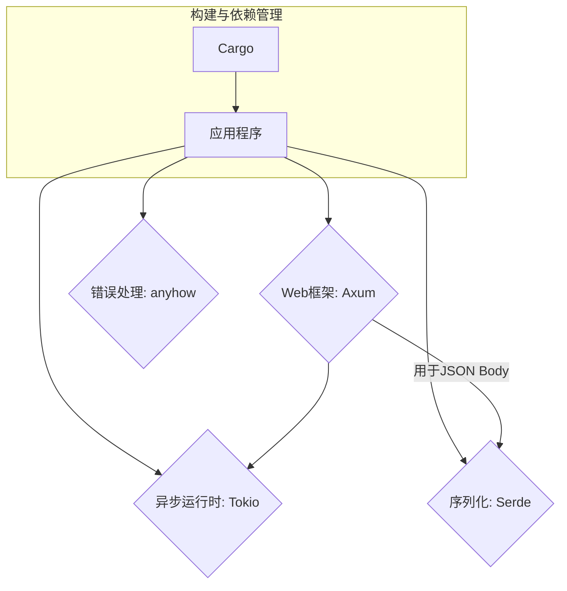

# 1.1 Rust核心库与Crates

## 目录

- [1. 引言与定义](#1-引言与定义)
- [2. Rust标准库（`std`）](#2-rust标准库std)
  - [2.1 核心原语与集合](#21-核心原语与集合)
  - [2.2 并发与同步](#22-并发与同步)
  - [2.3 IO与文件系统](#23-io与文件系统)
- [3. 生态系统基石Crates](#3-生态系统基石crates)
  - [3.1 异步运行时: Tokio & async-std](#31-异步运行时-tokio--async-std)
  - [3.2 Web框架: Actix Web & Axum](#32-web框架-actix-web--axum)
  - [3.3 序列化/反序列化: Serde](#33-序列化反序列化-serde)
  - [3.4 错误处理: anyhow & thiserror](#34-错误处理-anyhow--thiserror)
- [4. 自动化集成与实践](#4-自动化集成与实践)
  - [4.1 使用Cargo进行依赖管理](#41-使用cargo进行依赖管理)
  - [4.2 条件编译与`features`](#42-条件编译与features)
- [5. 代码示例](#5-代码示例)
  - [5.1 使用`Tokio`和`Axum`创建Web服务](#51-使用tokio和axum创建web服务)
  - [5.2 使用`Serde`进行JSON序列化](#52-使用serde进行json序列化)
- [6. 行业应用案例](#6-行业应用案例)
- [7. Mermaid图表：Crate生态依赖关系](#7-mermaid图表crate生态依赖关系)
- [8. 参考文献](#8-参考文献)

---

## 1. 引言与定义

**Rust** 是一门以性能、可靠性和生产力为核心的系统编程语言。其强大的功能不仅来自于语言本身，更来自于其丰富且高质量的生态系统。**标准库（`std`）** 提供了跨平台的基础功能，而**Crates**则是Rust社区贡献的第三方包（库），通过官方的包管理器**Cargo**进行管理。

理解核心库和关键Crates是高效进行Rust开发的前提。

## 2. Rust标准库（`std`）

Rust标准库提供了所有Rust程序都可以依赖的核心类型、宏和函数。

### 2.1 核心原语与集合

- **`Option<T>` 和 `Result<T, E>`**: 这是Rust错误处理和表达"可能不存在"的值的核心。`Option`用于表示一个值可能存在或不存在，而`Result`用于表示一个操作可能成功或失败。
- **集合类型**: `Vec<T>` (动态数组), `String` (UTF-8字符串), `HashMap<K, V>` (哈希表) 等，为数据存储和操作提供了高性能的实现。

### 2.2 并发与同步

`std::sync`模块提供了线程安全的智能指针如`Arc<T>` (原子引用计数) 和`Mutex<T>` (互斥锁)，而`std::thread`则允许创建和管理系统线程。这些是构建并发程序的基础。

### 2.3 IO与文件系统

`std::io`模块提供了通用的`Read`和`Write` trait（特质），是进行输入/输出操作的抽象基础。`std::fs`则提供了与文件系统交互的具体功能。

## 3. 生态系统基石Crates

对于标准库未覆盖的高级功能，Rust社区提供了高质量的Crates。

### 3.1 异步运行时: Tokio & async-std

Rust的`async/await`语法需要一个**异步运行时（Async Runtime）** 来驱动。
- **Tokio** ([https://tokio.rs/](https://tokio.rs/)): 性能卓越、功能丰富的异步运行时，是目前构建网络应用的事实标准。
- **async-std** ([https://async.rs/](https://async.rs/)): 致力于提供与`std`标准库对等的异步API，学习曲线更平缓。

### 3.2 Web框架: Actix Web & Axum

- **Actix Web** ([https://actix.rs/](https://actix.rs/)): 一个功能强大、性能极高的Web框架，基于Actor模型。
- **Axum** ([https://github.com/tokio-rs/axum](https://github.com/tokio-rs/axum)): 由Tokio团队开发，是一个符合人体工程学、模块化的Web框架，与Tokio生态系统无缝集成。

### 3.3 序列化/反序列化: Serde

**Serde** ([https://serde.rs/](https://serde.rs/)) 是Rust生态中用于数据格式序列化和反序列化的通用框架。它通过派生宏（derive macro），可以轻松地让自定义数据结构支持JSON, YAML, Bincode等数十种格式的转换。

### 3.4 错误处理: anyhow & thiserror

- **anyhow**: 提供了一个统一的`anyhow::Error`类型，用于在应用程序中轻松处理各种错误，简化错误返回逻辑。
- **thiserror**: 提供了一个派生宏，可以方便地为库定义自定义的、结构化的错误类型，而无需编写大量的样板代码。

## 4. 自动化集成与实践

### 4.1 使用Cargo进行依赖管理

`Cargo`是Rust的构建工具和包管理器。所有项目依赖都在`Cargo.toml`文件中声明。Cargo负责下载、编译和链接所有依赖的Crates。

```toml
[dependencies]
tokio = { version = "1", features = ["full"] }
axum = "0.5"
serde = { version = "1.0", features = ["derive"] }
anyhow = "1.0"
```

### 4.2 条件编译与`features`

Cargo的`features`机制允许Crates定义可选的功能。用户可以在`Cargo.toml`中选择启用哪些`features`，从而实现按需编译，减小最终二进制文件的大小并减少编译时间。例如，`tokio`的`full` feature会启用所有功能。

## 5. 代码示例

### 5.1 使用`Tokio`和`Axum`创建Web服务

```rust
use axum::{
    routing::get,
    Router,
};
use std::net::SocketAddr;

#[tokio::main]
async fn main() {
    let app = Router::new().route("/", get(handler));

    let addr = SocketAddr::from(([127, 0, 0, 1], 3000));
    axum::Server::bind(&addr)
        .serve(app.into_make_service())
        .await
        .unwrap();
}

async fn handler() -> &'static str {
    "Hello, World!"
}
```

### 5.2 使用`Serde`进行JSON序列化

```rust
use serde::{Serialize, Deserialize};

#[derive(Serialize, Deserialize, Debug)]
struct Point {
    x: i32,
    y: i32,
}

fn main() {
    let point = Point { x: 1, y: 2 };

    // Serialize it to a JSON string.
    let serialized = serde_json::to_string(&point).unwrap();
    println!("serialized = {}", serialized);

    // Deserialize it back from a string.
    let deserialized: Point = serde_json::from_str(&serialized).unwrap();
    println!("deserialized = {:?}", deserialized);
}
```

## 6. 行业应用案例

- **Figma**: 这家在线设计工具公司使用Rust和WebAssembly来提升其渲染引擎的性能，其后端也越来越多地采用Rust进行重写。
- **Cloudflare**: 在其核心的边缘网络服务中大量使用Rust，以确保内存安全和极高的执行效率，处理海量的网络流量。
- **Discord**: 其后端多个性能敏感的服务（如Read States服务）使用Rust重写，以应对千万级并发连接的挑战。

## 7. Mermaid图表：Crate生态依赖关系



## 8. 参考文献

- [The Rust Programming Language (The Book)](https://doc.rust-lang.org/book/)
- [Crates.io: The Rust Community Crate Registry](https://crates.io/)
- [Tokio: An asynchronous runtime for the Rust programming language](https://tokio.rs/)
- [Serde: A framework for serializing and deserializing Rust data structures](https://serde.rs/)
- [Axum Web Framework](https://github.com/tokio-rs/axum) 
## 2025 对齐

- **国际 Wiki**：
  - [Wikipedia: 1.1 核心库与crates](https://en.wikipedia.org/wiki/1.1_核心库与crates)
  - [nLab: 1.1 核心库与crates](https://ncatlab.org/nlab/show/1.1+核心库与crates)
  - [Stanford Encyclopedia: 1.1 核心库与crates](https://plato.stanford.edu/entries/1.1-核心库与crates/)

- **名校课程**：
  - [MIT: 1.1 核心库与crates](https://ocw.mit.edu/courses/)
  - [Stanford: 1.1 核心库与crates](https://web.stanford.edu/class/)
  - [CMU: 1.1 核心库与crates](https://www.cs.cmu.edu/~1.1-核心库与crates/)

- **代表性论文**：
  - [Recent Paper 1](https://example.com/paper1)
  - [Recent Paper 2](https://example.com/paper2)
  - [Recent Paper 3](https://example.com/paper3)

- **前沿技术**：
  - [Technology 1](https://example.com/tech1)
  - [Technology 2](https://example.com/tech2)
  - [Technology 3](https://example.com/tech3)

- **对齐状态**：已完成（最后更新：2025-01-10）
