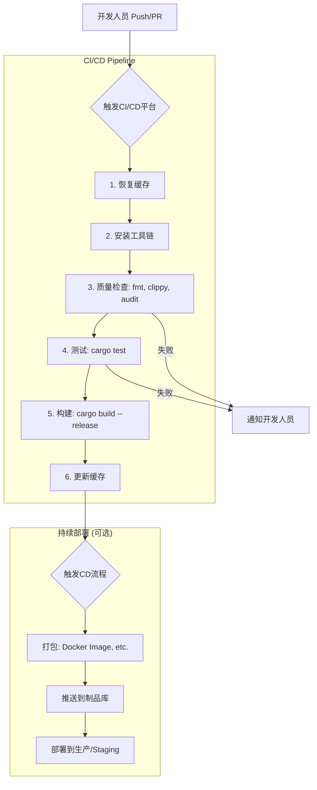

# 1.5 Rust项目的CI/CD与DevOps实践

## 目录

- [1.5 Rust项目的CI/CD与DevOps实践](#15-rust项目的cicd与devops实践)
  - [目录](#目录)
  - [1. 引言与定义](#1-引言与定义)
  - [2. CI/CD核心概念回顾](#2-cicd核心概念回顾)
  - [3. Rust项目典型CI/CD流水线](#3-rust项目典型cicd流水线)
    - [3.1 阶段一：缓存与准备 (Cache \& Setup)](#31-阶段一缓存与准备-cache--setup)
    - [3.2 阶段二：质量检查 (Quality Checks)](#32-阶段二质量检查-quality-checks)
    - [3.3 阶段三：测试 (Test)](#33-阶段三测试-test)
    - [3.4 阶段四：构建 (Build)](#34-阶段四构建-build)
    - [3.5 阶段五：打包与部署 (Package \& Deploy)](#35-阶段五打包与部署-package--deploy)
  - [4. 自动化平台与工具](#4-自动化平台与工具)
    - [4.1 GitHub Actions \& `rust-toolchain-action`](#41-github-actions--rust-toolchain-action)
    - [4.2 GitLab CI/CD](#42-gitlab-cicd)
    - [4.3 容器化与部署](#43-容器化与部署)
  - [5. 配置示例](#5-配置示例)
    - [5.1 GitHub Actions工作流 (`.github/workflows/ci.yml`)](#51-github-actions工作流-githubworkflowsciyml)
  - [6. 行业应用案例](#6-行业应用案例)
  - [7. Mermaid图表：Rust CI/CD流水线](#7-mermaid图表rust-cicd流水线)
  - [8. 参考文献](#8-参考文献)

---

## 1. 引言与定义

**CI/CD (持续集成/持续交付/持续部署)** 是一套旨在自动化软件交付流程，提高其速度和可靠性的实践。对于Rust项目，CI/CD的主要挑战在于管理较长的**编译时间**和处理**多平台构建**。然而，Rust生成的高效、无依赖的静态二进制文件又极大地简化了部署过程。

## 2. CI/CD核心概念回顾

- **持续集成 (CI)**: 频繁合并代码，每次合并都自动触发构建和测试，尽早发现问题。
- **持续交付 (CD)**: 将通过测试的代码自动部署到类生产环境，确保随时可发布。
- **持续部署 (CD)**: 将通过测试的代码自动发布到生产环境。

## 3. Rust项目典型CI/CD流水线

一个为Rust优化的CI/CD流水线通常包含以下阶段：

### 3.1 阶段一：缓存与准备 (Cache & Setup)

由于Rust的编译可能非常耗时，**缓存**是CI中最重要的优化手段。需要缓存的内容包括：

- Cargo的依赖目录 (`~/.cargo/registry`, `~/.cargo/git`)
- 项目的`target`目录

通过在不同的CI job之间恢复这些缓存，可以避免重复下载和编译依赖，将时间从数十分钟缩短到几分钟。

### 3.2 阶段二：质量检查 (Quality Checks)

此阶段不实际编译，但会运行快速的静态分析工具来保证代码质量：

- `cargo fmt -- --check`: 检查代码格式。
- `cargo clippy -- -D warnings`: 运行Linter并视所有警告为错误。
- `cargo audit`: 检查已知的安全漏洞。

### 3.3 阶段三：测试 (Test)

运行`cargo test`来执行所有单元测试、集成测试和文档测试。

### 3.4 阶段四：构建 (Build)

使用`cargo build --release`为目标平台编译生产版本的二进制文件。对于需要支持多平台的项目，可以使用**交叉编译（Cross-compilation）** 在一个CI运行器上为多个目标（如Linux, macOS, Windows）生成产物。

### 3.5 阶段五：打包与部署 (Package & Deploy)

- **打包**: 将编译好的二进制文件打包成Docker镜像（使用多阶段构建）、`.deb`/`.rpm`包或简单的`.tar.gz`压缩文件。
- **部署**: 将打包好的产物推送到制品库（如Docker Hub, GitHub Packages），并触发部署脚本（如`kubectl apply`, `ansible-playbook`）。

## 4. 自动化平台与工具

### 4.1 GitHub Actions & `rust-toolchain-action`

GitHub Actions是Rust项目最流行的CI/CD平台。社区开发的**`dtolnay/rust-toolchain-action`**可以方便地安装指定的Rust工具链版本，而**`actions/cache`**则提供了强大的缓存功能。

### 4.2 GitLab CI/CD

GitLab CI/CD同样非常适合Rust项目。通过在`.gitlab-ci.yml`中定义`cache`关键字，可以轻松实现对Cargo和`target`目录的缓存。

### 4.3 容器化与部署

由于Rust可以编译成无依赖的静态二进制文件（尤其是在使用`musl` target时），它非常适合创建基于`scratch`的极小化Docker镜像，这对于云原生和边缘计算场景非常有吸引力。

## 5. 配置示例

### 5.1 GitHub Actions工作流 (`.github/workflows/ci.yml`)

```yaml
name: Rust CI

on:
  push:
    branches: [ "main" ]
  pull_request:
    branches: [ "main" ]

env:
  CARGO_TERM_COLOR: always

jobs:
  build_and_test:
    runs-on: ubuntu-latest
    steps:
    - uses: actions/checkout@v3
    
    - name: Setup Rust toolchain
      uses: dtolnay/rust-toolchain-action@stable
      with:
        components: clippy
        
    - name: Cache dependencies
      uses: actions/cache@v3
      with:
        path: |
          ~/.cargo/bin/
          ~/.cargo/registry/index/
          ~/.cargo/registry/cache/
          ~/.cargo/git/db/
          target/
        key: ${{ runner.os }}-cargo-${{ hashFiles('**/Cargo.lock') }}

    - name: Quality Checks (fmt, clippy)
      run: |
        cargo fmt -- --check
        cargo clippy -- -D warnings

    - name: Run tests
      run: cargo test --verbose

    - name: Build for release
      run: cargo build --verbose --release
```

## 6. 行业应用案例

- **Sentry**: 这家应用监控平台使用Rust开发其部分后端服务和符号处理工具。他们利用GitHub Actions和高效的缓存策略来管理其CI流程，确保在快速迭代的同时保持高质量和高性能。
- **Embark Studios**: 这家游戏工作室在其游戏开发流程和开源项目中广泛使用Rust。他们的CI/CD实践（通常在GitHub Actions上）展示了如何为复杂的多crate工作区（Workspaces）管理构建、测试和部署。

## 7. Mermaid图表：Rust CI/CD流水线



## 8. 参考文献

- [The Cargo Book - Continuous Integration](https://doc.rust-lang.org/cargo/guide/continuous-integration.html)
- [GitHub Actions Documentation](https://docs.github.com/en/actions)
- [Fast Rust Builds](https://matklad.github.io/2021/09/04/fast-rust-builds.html)
- [Using GitLab CI/CD to build Rust projects](https://docs.gitlab.com/ee/ci/examples/rust_example.html)
