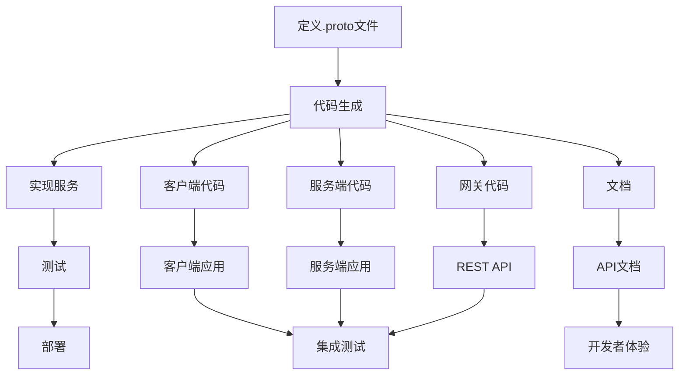
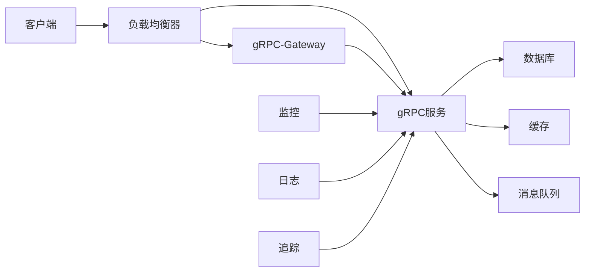
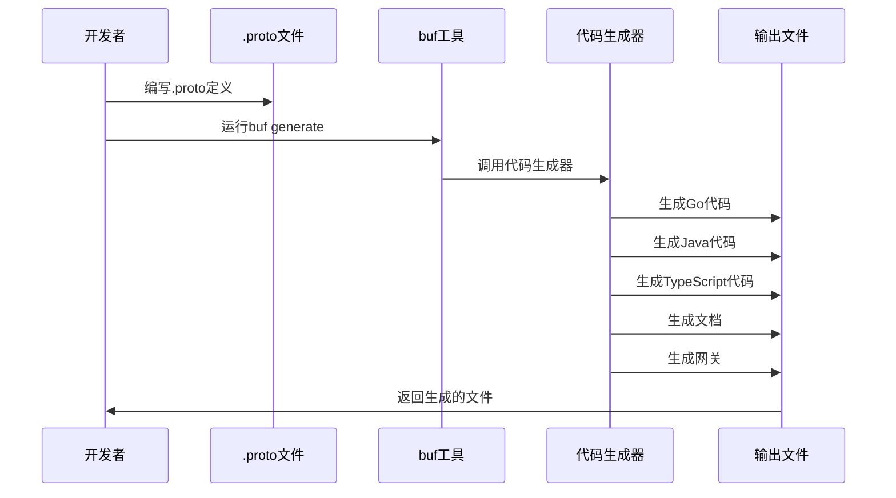

# 1.2 gRPC与Protocol Buffers：自动化实践

## 目录

- [1.2 gRPC与Protocol Buffers：自动化实践](#12-grpc与protocol-buffers自动化实践)
  - [目录](#目录)
  - [1. 引言与定义](#1-引言与定义)
    - [1.1 自动化价值](#11-自动化价值)
    - [1.2 与传统REST的对比](#12-与传统rest的对比)
  - [2. 核心概念](#2-核心概念)
    - [2.1 Protocol Buffers (Protobuf)](#21-protocol-buffers-protobuf)
      - [2.1.1 核心特性](#211-核心特性)
      - [2.1.2 版本演进](#212-版本演进)
    - [2.2 gRPC](#22-grpc)
      - [2.2.1 通信模式](#221-通信模式)
    - [2.3 `.proto` 文件](#23-proto-文件)
      - [2.3.1 文件结构](#231-文件结构)
  - [3. 自动化工作流](#3-自动化工作流)
    - [3.1 核心：代码生成](#31-核心代码生成)
      - [3.1.1 支持的语言](#311-支持的语言)
      - [3.1.2 生成的文件类型](#312-生成的文件类型)
    - [3.2 服务反射与发现](#32-服务反射与发现)
      - [3.2.1 反射API](#321-反射api)
      - [3.2.2 工具支持](#322-工具支持)
    - [3.3 API文档生成](#33-api文档生成)
      - [3.3.1 文档生成工具](#331-文档生成工具)
      - [3.3.2 示例配置](#332-示例配置)
    - [3.4 网关生成 (gRPC-Gateway)](#34-网关生成-grpc-gateway)
      - [3.4.1 注解语法](#341-注解语法)
      - [3.4.2 生成的网关](#342-生成的网关)
  - [4. 核心工具与实践](#4-核心工具与实践)
    - [4.1 `protoc`: 协议编译器](#41-protoc-协议编译器)
      - [4.1.1 基本用法](#411-基本用法)
      - [4.1.2 插件系统](#412-插件系统)
    - [4.2 `buf`: 新一代Protobuf工具链](#42-buf-新一代protobuf工具链)
      - [4.2.1 核心功能](#421-核心功能)
      - [4.2.2 配置文件](#422-配置文件)
      - [4.2.3 工作流命令](#423-工作流命令)
    - [4.3 `grpcurl`: gRPC的cURL](#43-grpcurl-grpc的curl)
      - [4.3.1 基本用法](#431-基本用法)
      - [4.3.2 高级功能](#432-高级功能)
    - [4.4 `gRPC-Gateway`](#44-grpc-gateway)
      - [4.4.1 安装与配置](#441-安装与配置)
      - [4.4.2 服务配置](#442-服务配置)
  - [5. 配置/代码示例](#5-配置代码示例)
    - [5.1 `.proto`定义文件示例 (`payment.proto`)](#51-proto定义文件示例-paymentproto)
    - [5.2 `protoc`代码生成命令](#52-protoc代码生成命令)
    - [5.3 `buf.gen.yaml`代码生成配置](#53-bufgenyaml代码生成配置)
  - [6. 行业应用案例](#6-行业应用案例)
    - [6.1 Google Cloud Platform](#61-google-cloud-platform)
    - [6.2 Netflix](#62-netflix)
    - [6.3 Uber](#63-uber)
    - [6.4 金融科技](#64-金融科技)
  - [7. Mermaid图表：gRPC自动化工作流](#7-mermaid图表grpc自动化工作流)
    - [7.1 开发工作流](#71-开发工作流)
    - [7.2 部署架构](#72-部署架构)
    - [7.3 代码生成流程](#73-代码生成流程)
  - [8. 参考文献](#8-参考文献)
    - [8.1 官方文档](#81-官方文档)
    - [8.2 工具文档](#82-工具文档)
    - [8.3 最佳实践](#83-最佳实践)
    - [8.4 相关技术](#84-相关技术)

---

## 1. 引言与定义

**Protocol Buffers (Protobuf)** 是一种由Google开发的、语言无关、平台无关、可扩展的用于序列化结构化数据的机制。
**gRPC**则是一个基于Protobuf的高性能、开源的通用RPC（远程过程调用）框架。

### 1.1 自动化价值

gRPC + Protobuf 的核心价值在于**自动化代码生成**，通过定义 `.proto` 文件，可以自动生成：

- 客户端/服务端代码（多语言）
- API文档
- 网关代理
- 测试代码
- 类型安全的接口

### 1.2 与传统REST的对比

| 特性 | gRPC + Protobuf | REST + JSON |
|------|----------------|-------------|
| 序列化 | 二进制，紧凑 | 文本，冗余 |
| 代码生成 | 自动，类型安全 | 手动，易出错 |
| 流式传输 | 原生支持 | 需要特殊处理 |
| 性能 | 高 | 中等 |
| 调试 | 需要工具 | 直观 |

## 2. 核心概念

### 2.1 Protocol Buffers (Protobuf)

Protobuf 是一种**接口定义语言 (IDL)**，用于定义数据结构和服务接口。

#### 2.1.1 核心特性

- **向前兼容**：新增字段不影响旧版本
- **向后兼容**：删除字段时保留编号
- **跨语言**：支持 20+ 编程语言
- **高性能**：二进制序列化，比JSON快3-10倍

#### 2.1.2 版本演进

```protobuf
// v1: 基础消息
message User {
  string name = 1;
  int32 age = 2;
}

// v2: 新增字段（向前兼容）
message User {
  string name = 1;
  int32 age = 2;
  string email = 3;  // 新增
}
```

### 2.2 gRPC

gRPC 是基于 HTTP/2 的 RPC 框架，支持四种通信模式：

#### 2.2.1 通信模式

1. **一元 RPC (Unary RPC)**

   ```protobuf
   rpc GetUser(GetUserRequest) returns (User);
   ```

2. **服务端流式 RPC (Server Streaming RPC)**

   ```protobuf
   rpc WatchUser(WatchUserRequest) returns (stream User);
   ```

3. **客户端流式 RPC (Client Streaming RPC)**

   ```protobuf
   rpc UploadUsers(stream User) returns (UploadResponse);
   ```

4. **双向流式 RPC (Bidirectional Streaming RPC)**

   ```protobuf
   rpc Chat(stream Message) returns (stream Message);
   ```

### 2.3 `.proto` 文件

`.proto` 文件是 Protobuf 的核心，定义了：

- 消息结构
- 服务接口
- 导入依赖
- 编译选项

#### 2.3.1 文件结构

```protobuf
syntax = "proto3";  // 语法版本

package payment.v1;  // 包名

import "google/protobuf/timestamp.proto";  // 导入

option go_package = "github.com/example/payment/v1";  // Go包路径

// 服务定义
service PaymentService {
  rpc ProcessPayment(PaymentRequest) returns (PaymentResponse);
}

// 消息定义
message PaymentRequest {
  string order_id = 1;
  double amount = 2;
  string currency = 3;
}
```

## 3. 自动化工作流

### 3.1 核心：代码生成

代码生成是 gRPC 自动化的核心，支持多语言：

#### 3.1.1 支持的语言

- **Go**: `protoc-gen-go`, `protoc-gen-go-grpc`
- **Java**: `protoc-gen-java`
- **Python**: `protoc-gen-python`
- **C++**: `protoc-gen-cpp`
- **C#**: `protoc-gen-csharp`
- **TypeScript**: `protoc-gen-ts`

#### 3.1.2 生成的文件类型

```bash
# Go 示例
payment.pb.go          # 消息定义
payment_grpc.pb.go     # 服务接口
```

### 3.2 服务反射与发现

gRPC 支持服务反射，可以动态发现服务信息：

#### 3.2.1 反射API

```go
import (
    "google.golang.org/grpc/reflection"
    "google.golang.org/grpc/reflection/grpc_reflection_v1alpha"
)

// 启用反射
reflection.Register(s)

// 客户端发现服务
client := grpc_reflection_v1alpha.NewServerReflectionClient(conn)
```

#### 3.2.2 工具支持

- **grpcurl**: 命令行工具
- **BloomRPC**: GUI客户端
- **gRPC UI**: Web界面

### 3.3 API文档生成

从 `.proto` 文件自动生成API文档：

#### 3.3.1 文档生成工具

- **protoc-gen-doc**: 生成Markdown/HTML
- **grpc-gateway**: 生成OpenAPI/Swagger
- **buf**: 内置文档生成

#### 3.3.2 示例配置

```yaml
# buf.gen.yaml
version: v1
plugins:
  - plugin: buf.build/protocolbuffers/go
    out: gen
  - plugin: buf.build/grpc/go
    out: gen
  - plugin: buf.build/bufbuild/connect-go
    out: gen
  - plugin: buf.build/grpc-ecosystem/grpc-gateway
    out: gen
    opt: logtostderr=true
  - plugin: buf.build/grpc-ecosystem/grpc-gateway
    out: gen
    opt: standalone=true
```

### 3.4 网关生成 (gRPC-Gateway)

gRPC-Gateway 自动生成 REST API 网关：

#### 3.4.1 注解语法

```protobuf
import "google/api/annotations.proto";

service PaymentService {
  rpc ProcessPayment(PaymentRequest) returns (PaymentResponse) {
    option (google.api.http) = {
      post: "/v1/payments"
      body: "*"
    };
  }
}
```

#### 3.4.2 生成的网关

```go
// 自动生成的HTTP处理器
func RegisterPaymentServiceHandlerServer(ctx context.Context, mux *runtime.ServeMux, server PaymentServiceServer) error {
    mux.Handle("POST", pattern_PaymentService_ProcessPayment_0, func(w http.ResponseWriter, req *http.Request, pathParams map[string]string) {
        // 自动生成的HTTP处理逻辑
    })
}
```

## 4. 核心工具与实践

### 4.1 `protoc`: 协议编译器

`protoc` 是官方的 Protobuf 编译器：

#### 4.1.1 基本用法

```bash
# 生成Go代码
protoc --go_out=. --go_opt=paths=source_relative \
       --go-grpc_out=. --go-grpc_opt=paths=source_relative \
       payment.proto

# 生成Java代码
protoc --java_out=src/main/java payment.proto

# 生成文档
protoc --doc_out=docs payment.proto
```

#### 4.1.2 插件系统

```bash
# 安装Go插件
go install google.golang.org/protobuf/cmd/protoc-gen-go@latest
go install google.golang.org/grpc/cmd/protoc-gen-go-grpc@latest

# 安装其他插件
npm install -g grpc-tools
```

### 4.2 `buf`: 新一代Protobuf工具链

`buf` 是现代化的 Protobuf 工具链：

#### 4.2.1 核心功能

- **Linting**: 代码质量检查
- **Breaking**: 破坏性变更检测
- **Generation**: 代码生成
- **Formatting**: 代码格式化

#### 4.2.2 配置文件

```yaml
# buf.yaml
version: v1
name: buf.build/example/payment
deps:
  - buf.build/googleapis/googleapis
lint:
  use:
    - DEFAULT
breaking:
  use:
    - FILE
```

```yaml
# buf.gen.yaml
version: v1
plugins:
  - plugin: buf.build/protocolbuffers/go
    out: gen
    opt: paths=source_relative
  - plugin: buf.build/grpc/go
    out: gen
    opt: paths=source_relative
```

#### 4.2.3 工作流命令

```bash
# 格式化
buf format -w

# 检查
buf lint

# 生成代码
buf generate

# 检查破坏性变更
buf breaking --against '.git#branch=main'
```

### 4.3 `grpcurl`: gRPC的cURL

`grpcurl` 是 gRPC 的命令行调试工具：

#### 4.3.1 基本用法

```bash
# 列出服务
grpcurl -plaintext localhost:50051 list

# 列出方法
grpcurl -plaintext localhost:50051 list PaymentService

# 调用方法
grpcurl -plaintext -d '{"order_id": "123", "amount": 100.0}' \
        localhost:50051 PaymentService/ProcessPayment

# 流式调用
grpcurl -plaintext -d '{"user_id": "123"}' \
        localhost:50051 PaymentService/WatchUser
```

#### 4.3.2 高级功能

```bash
# 使用反射
grpcurl -plaintext localhost:50051 describe PaymentService.ProcessPayment

# 生成示例请求
grpcurl -plaintext localhost:50051 describe PaymentService.ProcessPayment.Request

# 使用TLS
grpcurl -insecure localhost:50051 list
```

### 4.4 `gRPC-Gateway`

gRPC-Gateway 提供 REST API 网关：

#### 4.4.1 安装与配置

```bash
# 安装
go install github.com/grpc-ecosystem/grpc-gateway/v2/protoc-gen-grpc-gateway@latest

# 生成网关代码
protoc -I . \
       --grpc-gateway_out . \
       --grpc-gateway_opt logtostderr=true \
       payment.proto
```

#### 4.4.2 服务配置

```go
import (
    "github.com/grpc-ecosystem/grpc-gateway/v2/runtime"
    "google.golang.org/grpc"
)

func main() {
    // gRPC服务器
    grpcServer := grpc.NewServer()
    RegisterPaymentServiceServer(grpcServer, &paymentServer{})
    
    // HTTP网关
    mux := runtime.NewServeMux()
    opts := []grpc.DialOption{grpc.WithInsecure()}
    RegisterPaymentServiceHandlerFromEndpoint(ctx, mux, "localhost:50051", opts)
    
    // 启动服务
    http.ListenAndServe(":8080", mux)
}
```

## 5. 配置/代码示例

### 5.1 `.proto`定义文件示例 (`payment.proto`)

```protobuf
syntax = "proto3";

package payment.v1;

import "google/api/annotations.proto";
import "google/protobuf/timestamp.proto";

option go_package = "github.com/example/payment/v1";

// 支付服务
service PaymentService {
  // 处理支付
  rpc ProcessPayment(PaymentRequest) returns (PaymentResponse) {
    option (google.api.http) = {
      post: "/v1/payments"
      body: "*"
    };
  }
  
  // 查询支付状态
  rpc GetPaymentStatus(PaymentStatusRequest) returns (PaymentStatusResponse) {
    option (google.api.http) = {
      get: "/v1/payments/{payment_id}/status"
    };
  }
  
  // 流式支付通知
  rpc StreamPaymentNotifications(NotificationRequest) returns (stream PaymentNotification) {
    option (google.api.http) = {
      get: "/v1/payments/notifications"
    };
  }
}

// 支付请求
message PaymentRequest {
  string order_id = 1;
  double amount = 2;
  string currency = 3;
  PaymentMethod payment_method = 4;
  map<string, string> metadata = 5;
}

// 支付响应
message PaymentResponse {
  string payment_id = 1;
  PaymentStatus status = 2;
  google.protobuf.Timestamp created_at = 3;
  string transaction_id = 4;
}

// 支付状态请求
message PaymentStatusRequest {
  string payment_id = 1;
}

// 支付状态响应
message PaymentStatusResponse {
  string payment_id = 1;
  PaymentStatus status = 2;
  google.protobuf.Timestamp updated_at = 3;
}

// 通知请求
message NotificationRequest {
  string user_id = 1;
  repeated string payment_ids = 2;
}

// 支付通知
message PaymentNotification {
  string payment_id = 1;
  PaymentStatus status = 2;
  google.protobuf.Timestamp timestamp = 3;
  string message = 4;
}

// 支付方式
enum PaymentMethod {
  PAYMENT_METHOD_UNSPECIFIED = 0;
  PAYMENT_METHOD_CREDIT_CARD = 1;
  PAYMENT_METHOD_DEBIT_CARD = 2;
  PAYMENT_METHOD_BANK_TRANSFER = 3;
  PAYMENT_METHOD_DIGITAL_WALLET = 4;
}

// 支付状态
enum PaymentStatus {
  PAYMENT_STATUS_UNSPECIFIED = 0;
  PAYMENT_STATUS_PENDING = 1;
  PAYMENT_STATUS_PROCESSING = 2;
  PAYMENT_STATUS_COMPLETED = 3;
  PAYMENT_STATUS_FAILED = 4;
  PAYMENT_STATUS_CANCELLED = 5;
}
```

### 5.2 `protoc`代码生成命令

```bash
#!/bin/bash
# generate.sh

# 设置输出目录
OUT_DIR="./gen"
PROTO_DIR="./proto"

# 创建输出目录
mkdir -p $OUT_DIR

# 生成Go代码
protoc -I $PROTO_DIR \
       --go_out=$OUT_DIR \
       --go_opt=paths=source_relative \
       --go-grpc_out=$OUT_DIR \
       --go-grpc_opt=paths=source_relative \
       $PROTO_DIR/*.proto

# 生成gRPC-Gateway代码
protoc -I $PROTO_DIR \
       --grpc-gateway_out=$OUT_DIR \
       --grpc-gateway_opt=logtostderr=true \
       --grpc-gateway_opt=paths=source_relative \
       $PROTO_DIR/*.proto

# 生成OpenAPI文档
protoc -I $PROTO_DIR \
       --openapiv2_out=$OUT_DIR \
       --openapiv2_opt=logtostderr=true \
       $PROTO_DIR/*.proto

# 生成文档
protoc -I $PROTO_DIR \
       --doc_out=$OUT_DIR \
       --doc_opt=markdown,api.md \
       $PROTO_DIR/*.proto

echo "代码生成完成！"
```

### 5.3 `buf.gen.yaml`代码生成配置

```yaml
version: v1
managed:
  enabled: true
  go_package_prefix:
    default: github.com/example/payment/gen
plugins:
  # Go 消息定义
  - plugin: buf.build/protocolbuffers/go
    out: gen
    opt: paths=source_relative
  
  # Go gRPC 服务
  - plugin: buf.build/grpc/go
    out: gen
    opt: paths=source_relative
  
  # gRPC-Gateway
  - plugin: buf.build/grpc-ecosystem/grpc-gateway
    out: gen
    opt: 
      - logtostderr=true
      - paths=source_relative
  
  # OpenAPI/Swagger
  - plugin: buf.build/grpc-ecosystem/grpc-gateway
    out: gen
    opt: 
      - standalone=true
      - paths=source_relative
  
  # Connect-Go (gRPC兼容的HTTP库)
  - plugin: buf.build/bufbuild/connect-go
    out: gen
    opt: paths=source_relative
  
  # TypeScript 客户端
  - plugin: buf.build/bufbuild/connect-es
    out: gen
    opt: target=ts
  
  # 文档生成
  - plugin: buf.build/community/neoeinstein-protoparse
    out: gen
    opt: markdown,api.md
```

## 6. 行业应用案例

### 6.1 Google Cloud Platform

Google Cloud 大量使用 gRPC：

- **Cloud APIs**: 所有云服务API
- **Kubernetes**: etcd 通信
- **Istio**: 服务网格控制平面

### 6.2 Netflix

Netflix 使用 gRPC 构建微服务：

- **Titus**: 容器编排平台
- **Dynomite**: 分布式缓存
- **Spinnaker**: 持续部署平台

### 6.3 Uber

Uber 的微服务架构：

- **服务间通信**: 内部API
- **实时数据**: 位置和状态更新
- **支付系统**: 交易处理

### 6.4 金融科技

- **Stripe**: 支付API
- **Square**: 移动支付
- **PayPal**: 跨境支付

## 7. Mermaid图表：gRPC自动化工作流

### 7.1 开发工作流



### 7.2 部署架构



### 7.3 代码生成流程



## 8. 参考文献

### 8.1 官方文档

- [Protocol Buffers Developer Guide](https://developers.google.com/protocol-buffers/docs/overview)
- [gRPC Documentation](https://grpc.io/docs/)
- [gRPC-Gateway Documentation](https://grpc-ecosystem.github.io/grpc-gateway/)

### 8.2 工具文档

- [buf Documentation](https://docs.buf.build/)
- [grpcurl Documentation](https://github.com/fullstorydev/grpcurl)
- [protoc-gen-doc](https://github.com/pseudomuto/protoc-gen-doc)

### 8.3 最佳实践

- [Google API Design Guide](https://cloud.google.com/apis/design)
- [gRPC Best Practices](https://grpc.io/docs/guides/best-practices/)
- [Protocol Buffers Style Guide](https://developers.google.com/protocol-buffers/docs/style)

### 8.4 相关技术

- [HTTP/2 Specification](https://httpwg.org/specs/rfc7540.html)
- [OpenAPI Specification](https://swagger.io/specification/)
- [GraphQL vs gRPC](https://blog.logrocket.com/graphql-vs-grpc/)

---

**最后更新**: 2025年01月
