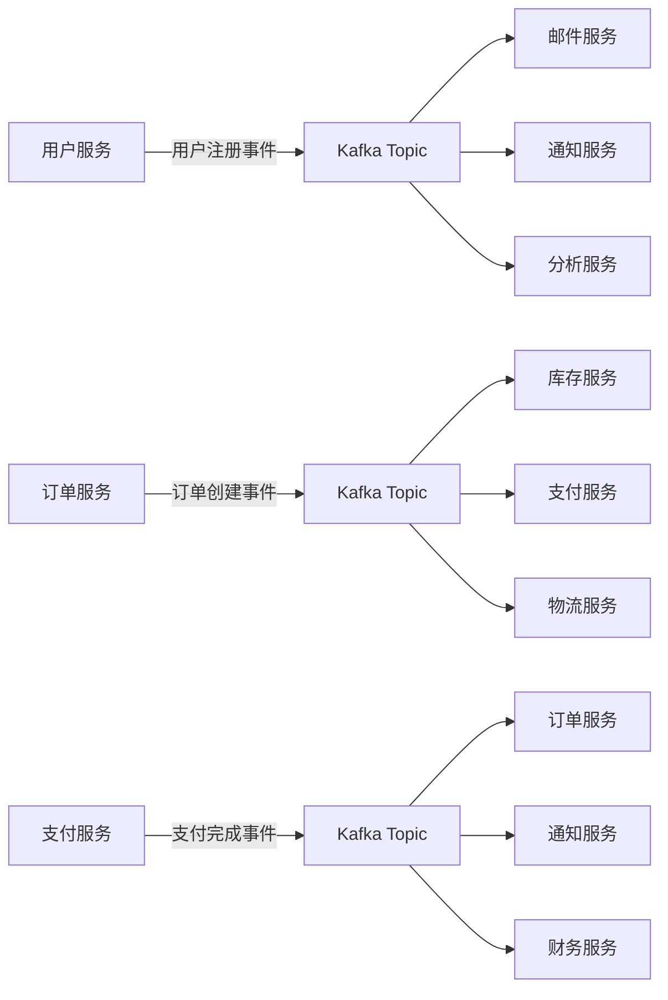
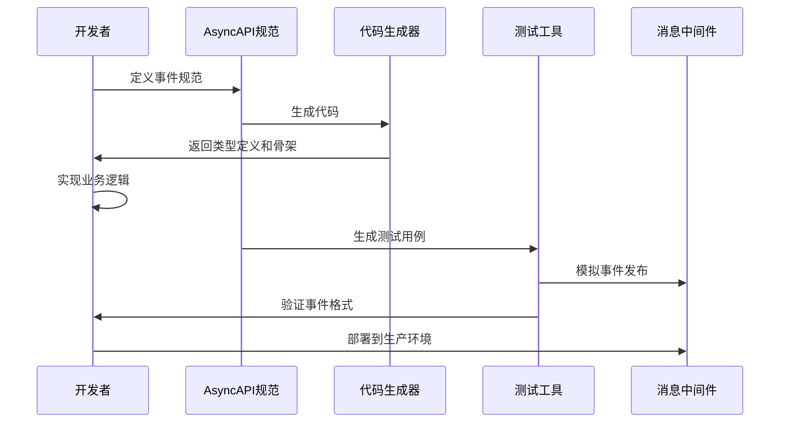

# 1.4 AsyncAPI与事件驱动架构自动化

## 目录

- [1.4 AsyncAPI与事件驱动架构自动化](#14-asyncapi与事件驱动架构自动化)
  - [目录](#目录)
  - [1. 引言与定义](#1-引言与定义)
    - [1.1 事件驱动架构的价值](#11-事件驱动架构的价值)
    - [1.2 AsyncAPI vs OpenAPI](#12-asyncapi-vs-openapi)
    - [1.1 事件驱动架构的价值1](#11-事件驱动架构的价值1)
    - [1.2 AsyncAPI vsOpenAPI](#12-asyncapi-vsopenapi)
  - [2. 核心概念](#2-核心概念)
    - [2.1 Channel与Message](#21-channel与message)
      - [2.1.1 Channel命名约定](#211-channel命名约定)
      - [2.1.2 Message结构](#212-message结构)
    - [2.2 操作: `publish` \& `subscribe`](#22-操作-publish--subscribe)
      - [2.2.1 操作定义示例](#221-操作定义示例)
    - [2.3 绑定 (Bindings)](#23-绑定-bindings)
      - [2.3.1 Kafka绑定示例](#231-kafka绑定示例)
    - [2.4 安全与认证](#24-安全与认证)
      - [2.4.1 安全定义](#241-安全定义)
  - [3. 自动化工作流](#3-自动化工作流)
    - [3.1 代码生成](#31-代码生成)
      - [3.1.1 代码生成流程](#311-代码生成流程)
    - [3.2 文档生成](#32-文档生成)
      - [3.2.1 文档生成选项](#321-文档生成选项)
    - [3.3 Mocking与测试](#33-mocking与测试)
      - [3.3.1 Microcks配置](#331-microcks配置)
    - [3.4 部署自动化](#34-部署自动化)
      - [3.4.1 Kubernetes部署](#341-kubernetes部署)
  - [4. 核心工具与实践](#4-核心工具与实践)
    - [4.1 AsyncAPI Generator](#41-asyncapi-generator)
      - [4.1.1 支持的模板](#411-支持的模板)
      - [4.1.2 自定义模板](#412-自定义模板)
    - [4.2 AsyncAPI Studio](#42-asyncapi-studio)
      - [4.2.1 主要功能](#421-主要功能)
    - [4.3 Microcks](#43-microcks)
      - [4.3.1 主要功能](#431-主要功能)
    - [4.4 AsyncAPI CLI](#44-asyncapi-cli)
      - [4.4.1 常用命令](#441-常用命令)
  - [5. 配置/代码示例](#5-配置代码示例)
    - [5.1 AsyncAPI 2.0定义示例 (`asyncapi.yaml`)](#51-asyncapi-20定义示例-asyncapiyaml)
    - [5.2 Generator使用示例](#52-generator使用示例)
    - [5.3 多协议绑定示例](#53-多协议绑定示例)
    - [5.4 代码生成模板](#54-代码生成模板)
  - [6. 行业应用案例](#6-行业应用案例)
    - [6.1 SAP](#61-sap)
    - [6.2 Slack](#62-slack)
    - [6.3 Postman](#63-postman)
    - [6.4 Netflix](#64-netflix)
    - [6.5 Uber](#65-uber)
  - [7. Mermaid图表：AsyncAPI自动化工作流](#7-mermaid图表asyncapi自动化工作流)
    - [7.1 完整处理流程](#71-完整处理流程)
    - [7.2 事件流架构](#72-事件流架构)
    - [7.3 开发工作流](#73-开发工作流)
  - [8. 参考文献](#8-参考文献)
    - [8.1 官方文档](#81-官方文档)
    - [8.2 工具文档](#82-工具文档)
    - [8.3 最佳实践](#83-最佳实践)
    - [8.4 相关技术](#84-相关技术)

---

## 1. 引言与定义

**AsyncAPI** 是一个开源规范，旨在为**事件驱动架构 (Event-Driven Architectures, EDA)** 提供一个统一的描述标准。它被誉为"异步API的OpenAPI/Swagger"，解决了在基于消息的系统中长期存在的文档、发现和代码生成问题。

通过将`asyncapi.yaml`文件作为**单一事实来源**，可以驱动一系列**自动化实践**，从而标准化事件驱动应用的开发、测试和维护。

### 1.1 事件驱动架构的价值

事件驱动架构的核心价值在于：

- **松耦合**：服务间通过事件通信，减少直接依赖
- **可扩展性**：水平扩展消费者，处理高并发事件
- **容错性**：事件持久化，支持重试和死信队列
- **实时性**：事件实时传播，支持实时数据处理
- **可观测性**：事件流可追踪，便于监控和调试

### 1.2 AsyncAPI vs OpenAPI

| 特性 | AsyncAPI | OpenAPI |
|------|----------|---------|
| 通信模式 | 异步事件 | 同步请求/响应 |
| 核心概念 | Channel/Message | Path/Operation |
| 操作类型 | publish/subscribe | GET/POST/PUT/DELETE |
| 协议支持 | Kafka, RabbitMQ, MQTT | HTTP/HTTPS |
| 数据流 | 单向事件流 | 双向请求响应 |
| 状态管理 | 事件溯源 | 无状态 |

### 1.1 事件驱动架构的价值1

事件驱动架构的核心价值在于：

- **松耦合**：服务间通过事件通信，减少直接依赖
- **可扩展性**：水平扩展消费者，处理高并发事件
- **容错性**：事件持久化，支持重试和死信队列
- **实时性**：事件实时传播，支持实时数据处理
- **可观测性**：事件流可追踪，便于监控和调试

### 1.2 AsyncAPI vsOpenAPI

| 特性 | AsyncAPI | OpenAPI |
|------|----------|---------|
| 通信模式 | 异步事件 | 同步请求/响应 |
| 核心概念 | Channel/Message | Path/Operation |
| 操作类型 | publish/subscribe | GET/POST/PUT/DELETE |
| 协议支持 | Kafka, RabbitMQ, MQTT | HTTP/HTTPS |
| 数据流 | 单向事件流 | 双向请求响应 |
| 状态管理 | 事件溯源 | 无状态 |

## 2. 核心概念

AsyncAPI规范借鉴了OpenAPI，但其核心概念是围绕消息和通道来构建的。

### 2.1 Channel与Message

- **Channel**: 类似于OpenAPI中的路径（Path），是一个逻辑上的地址，生产者向其发送消息，消费者从其接收消息。例如，在Kafka中，它是一个Topic；在AMQP中，它是一个Exchange或Queue。
- **Message**: 描述通过某个Channel传输的数据。它的`payload`部分可以使用JSON Schema, Avro等格式来定义数据结构。

#### 2.1.1 Channel命名约定

```yaml
channels:
  # 领域事件
  user.signedup:          # 用户注册事件
  user.profile.updated:   # 用户资料更新事件
  order.created:          # 订单创建事件
  order.status.changed:   # 订单状态变更事件
  
  # 命令
  user.command.create:    # 创建用户命令
  order.command.cancel:   # 取消订单命令
  
  # 查询
  user.query.get:         # 获取用户查询
  order.query.list:       # 获取订单列表查询
```

#### 2.1.2 Message结构

```yaml
components:
  messages:
    UserSignedUp:
      headers:
        type: object
        properties:
          correlationId:
            type: string
            description: 用于追踪请求的ID
          timestamp:
            type: string
            format: date-time
            description: 事件发生时间
      payload:
        type: object
        properties:
          userId:
            type: string
            format: uuid
            description: 用户唯一标识
          email:
            type: string
            format: email
            description: 用户邮箱
          signupTimestamp:
            type: string
            format: date-time
            description: 注册时间戳
        required:
          - userId
          - email
          - signupTimestamp
```

### 2.2 操作: `publish` & `subscribe`

这是从**应用视角**定义的操作：

- **`publish`**: 表示你的应用向某个Channel**发布**一条消息。
- **`subscribe`**: 表示你的应用从某个Channel**订阅**一条消息。

#### 2.2.1 操作定义示例

```yaml
channels:
  user.signedup:
    description: 用户注册事件通道
    publish:
      summary: 发布用户注册事件
      description: 当新用户完成注册时发布此事件
      operationId: publishUserSignedUp
      message:
        $ref: '#/components/messages/UserSignedUp'
    subscribe:
      summary: 订阅用户注册事件
      description: 监听用户注册事件以执行后续业务逻辑
      operationId: subscribeUserSignedUp
      message:
        $ref: '#/components/messages/UserSignedUp'
```

### 2.3 绑定 (Bindings)

由于不同的消息中间件（如Kafka, NATS, RabbitMQ）有其特定的配置项（如Kafka的分区键，RabbitMQ的Exchange类型），**Bindings**提供了一种标准化的方式来描述这些协议特定的信息，使得AsyncAPI定义能够包含足够的细节以用于自动化配置。

#### 2.3.1 Kafka绑定示例

```yaml
channels:
  user.signedup:
    bindings:
      kafka:
        topic: user-events
        partitions: 3
        replicas: 2
        retention:
          time: 7
          size: 1073741824
    publish:
      bindings:
        kafka:
          key:
            type: string
            description: 用户ID作为分区键
            example: "user-123"
          acks: 1
          timeout: 30000
    subscribe:
      bindings:
        kafka:
          groupId: user-service
          consumer:
            autoOffsetReset: earliest
            enableAutoCommit: false

# RabbitMQ绑定
channels:
  order.created:
    bindings:
      amqp:
        is: queue
        queue:
          name: order-events
          durable: true
          autoDelete: false
          vhost: /
        exchange:
          name: order-exchange
          type: topic
          durable: true
    publish:
      bindings:
        amqp:
          deliveryMode: 2
          mandatory: true
          priority: 0
          timestamp: true
          expiration: 3600000
    subscribe:
      bindings:
        amqp:
          ack: true
          prefetchCount: 10

# MQTT绑定
channels:
  device.status:
    bindings:
      mqtt:
        qos: 1
        retain: false
        dup: false
    publish:
      bindings:
        mqtt:
          payloadFormatIndicator: 1
          messageExpiryInterval: 3600
          topicAlias: 1
    subscribe:
      bindings:
        mqtt:
          qos: 1
          noLocal: false
          retainAsPublished: false

# WebSocket绑定
channels:
  chat.message:
    bindings:
      ws:
        method: POST
        query:
          type: object
          properties:
            token:
              type: string
              description: 认证令牌
        headers:
          type: object
          properties:
            Content-Type:
              type: string
              enum: [application/json]
    publish:
      bindings:
        ws:
          bindingVersion: 0.1.0
    subscribe:
      bindings:
        ws:
          bindingVersion: 0.1.0
```

### 2.4 安全与认证

AsyncAPI支持多种安全机制，确保事件传输的安全性。

#### 2.4.1 安全定义

```yaml
components:
  securitySchemes:
    userPassword:
      type: userPassword
      description: 用户名密码认证
    apiKey:
      type: apiKey
      in: header
      name: X-API-Key
      description: API密钥认证
    bearerAuth:
      type: http
      scheme: bearer
      bearerFormat: JWT
      description: JWT令牌认证
    oauth2:
      type: oauth2
      flows:
        clientCredentials:
          tokenUrl: https://auth.example.com/oauth/token
          scopes:
            read:events: 读取事件权限
            write:events: 发布事件权限

security:
  - userPassword: []
  - apiKey: []
  - bearerAuth: []
  - oauth2: [read:events, write:events]
```

## 3. 自动化工作流

### 3.1 代码生成

这是AsyncAPI最强大的功能之一。使用**AsyncAPI Generator**，可以从`asyncapi.yaml`文件中为多种语言（如Java, Go, Python, TypeScript）自动生成：

- **消息的类型定义**: 强类型的数据结构。
- **生产者/发布者代码**: 封装了消息序列化和发送到特定Channel的逻辑。
- **消费者/订阅者骨架**: 包含接收消息、反序列化和调用业务逻辑的框架代码。
- **Broker配置脚本**: 例如，生成用于创建Kafka Topic的脚本。

#### 3.1.1 代码生成流程

```bash
# 1. 安装AsyncAPI Generator
npm install -g @asyncapi/generator

# 2. 生成TypeScript类型定义
ag asyncapi.yaml @asyncapi/typescript-template -o ./generated/typescript

# 3. 生成Go代码
ag asyncapi.yaml @asyncapi/go-template -o ./generated/go

# 4. 生成Java代码
ag asyncapi.yaml @asyncapi/java-spring-template -o ./generated/java

# 5. 生成Python代码
ag asyncapi.yaml @asyncapi/python-template -o ./generated/python
```

### 3.2 文档生成

AsyncAPI Generator可以将`asyncapi.yaml`文件渲染成易于理解和导航的HTML文档。这份"活文档"准确地描述了系统中有哪些事件、每个事件的数据结构是什么、以及哪些服务在生产或消费它们，极大地促进了团队间的沟通。

#### 3.2.1 文档生成选项

```bash
# 生成HTML文档
ag asyncapi.yaml @asyncapi/html-template -o ./docs

# 生成Markdown文档
ag asyncapi.yaml @asyncapi/markdown-template -o ./docs

# 生成PDF文档
ag asyncapi.yaml @asyncapi/pdf-template -o ./docs

# 自定义模板参数
ag asyncapi.yaml @asyncapi/html-template -o ./docs \
  -p title="事件驱动架构API文档" \
  -p version="1.0.0" \
  -p company="示例公司"
```

### 3.3 Mocking与测试

可以基于AsyncAPI定义来模拟消息的生产者或消费者。例如，工具`Microcks`可以消费AsyncAPI文件，模拟发布消息到真实的Broker，或者模拟一个消费者来验证生产者应用是否发送了格式正确的消息。

#### 3.3.1 Microcks配置

```yaml
# microcks-config.yaml
api:
  name: user-service-events
  version: 1.0.0
  type: ASYNC_API
  source: ./asyncapi.yaml

test:
  name: user-events-test
  type: ASYNC_API_SCHEMA
  timeout: 5000
  request:
    headers:
      Content-Type: application/json
  response:
    headers:
      Content-Type: application/json
```

### 3.4 部署自动化

基于AsyncAPI定义，可以自动生成部署配置和基础设施代码。

#### 3.4.1 Kubernetes部署

```yaml
# k8s-deployment.yaml (自动生成)
apiVersion: apps/v1
kind: Deployment
metadata:
  name: user-service
spec:
  replicas: 3
  selector:
    matchLabels:
      app: user-service
  template:
    metadata:
      labels:
        app: user-service
    spec:
      containers:
      - name: user-service
        image: user-service:latest
        env:
        - name: KAFKA_BOOTSTRAP_SERVERS
          value: "kafka:9092"
        - name: KAFKA_TOPIC_USER_SIGNEDUP
          value: "user-events"
        - name: KAFKA_GROUP_ID
          value: "user-service"
```

## 4. 核心工具与实践

### 4.1 AsyncAPI Generator

**`@asyncapi/generator`** ([https://github.com/asyncapi/generator](https://github.com/asyncapi/generator)) 是官方的代码和文档生成工具。它基于模板驱动，社区为其提供了针对不同语言和框架的模板。

#### 4.1.1 支持的模板

- **@asyncapi/html-template**: 生成HTML文档
- **@asyncapi/markdown-template**: 生成Markdown文档
- **@asyncapi/typescript-template**: 生成TypeScript类型定义
- **@asyncapi/go-template**: 生成Go代码
- **@asyncapi/java-spring-template**: 生成Spring Boot代码
- **@asyncapi/python-template**: 生成Python代码
- **@asyncapi/nodejs-template**: 生成Node.js代码

#### 4.1.2 自定义模板

```javascript
// custom-template/index.js
module.exports = {
  name: 'custom-template',
  version: '1.0.0',
  description: '自定义代码生成模板',
  
  generator: {
    async generate(parsedAsyncAPI, config) {
      const { channels, components } = parsedAsyncAPI;
      
      // 生成代码逻辑
      const generatedCode = {
        types: generateTypes(components),
        producers: generateProducers(channels),
        consumers: generateConsumers(channels),
        config: generateConfig(parsedAsyncAPI)
      };
      
      return generatedCode;
    }
  }
};
```

### 4.2 AsyncAPI Studio

**AsyncAPI Studio** ([https://studio.asyncapi.com/](https://studio.asyncapi.com/)) 是一个免费的在线编辑器，用于编写、验证和可视化AsyncAPI文档。

#### 4.2.1 主要功能

- **实时编辑**: 支持实时语法检查和错误提示
- **可视化预览**: 自动生成文档预览
- **模板测试**: 测试代码生成模板
- **版本控制**: 支持Git集成
- **协作编辑**: 支持多人协作

### 4.3 Microcks

**Microcks** ([https://microcks.io/](https://microcks.io/)) 是一个云原生的API Mocking和测试工具，它原生支持AsyncAPI、OpenAPI和gRPC，能够在一个统一的平台中对同步和异步API进行测试。

#### 4.3.1 主要功能

- **API Mocking**: 基于规范自动生成Mock服务
- **契约测试**: 验证API实现是否符合规范
- **性能测试**: 支持负载测试和性能基准
- **集成测试**: 端到端API测试
- **CI/CD集成**: 支持Jenkins、GitHub Actions等

### 4.4 AsyncAPI CLI

**AsyncAPI CLI** 提供了命令行工具来管理和操作AsyncAPI文档。

#### 4.4.1 常用命令

```bash
# 验证AsyncAPI文档
asyncapi validate asyncapi.yaml

# 转换格式
asyncapi convert asyncapi.yaml --from 2.0 --to 2.5

# 合并多个文档
asyncapi merge doc1.yaml doc2.yaml -o merged.yaml

# 生成示例数据
asyncapi generate-examples asyncapi.yaml -o examples/

# 比较文档差异
asyncapi diff doc1.yaml doc2.yaml
```

## 5. 配置/代码示例

### 5.1 AsyncAPI 2.0定义示例 (`asyncapi.yaml`)

完整的电商系统事件定义：

```yaml
asyncapi: '2.5.0'
info:
  title: E-commerce Event API
  version: '1.0.0'
  description: 电商系统事件驱动API
  contact:
    name: API Support
    email: support@example.com
  license:
    name: MIT
    url: https://opensource.org/licenses/MIT

servers:
  development:
    url: kafka://localhost:9092
    protocol: kafka
    description: 开发环境Kafka服务器
  production:
    url: kafka://kafka.prod:9092
    protocol: kafka
    description: 生产环境Kafka服务器

channels:
  user.signedup:
    description: 用户注册事件
    bindings:
      kafka:
        topic: user-events
        partitions: 3
        replicas: 2
    publish:
      summary: 发布用户注册事件
      operationId: publishUserSignedUp
      message:
        $ref: '#/components/messages/UserSignedUp'
    subscribe:
      summary: 订阅用户注册事件
      operationId: subscribeUserSignedUp
      message:
        $ref: '#/components/messages/UserSignedUp'

  user.profile.updated:
    description: 用户资料更新事件
    bindings:
      kafka:
        topic: user-events
        partitions: 3
        replicas: 2
    publish:
      summary: 发布用户资料更新事件
      operationId: publishUserProfileUpdated
      message:
        $ref: '#/components/messages/UserProfileUpdated'

  order.created:
    description: 订单创建事件
    bindings:
      kafka:
        topic: order-events
        partitions: 5
        replicas: 3
    publish:
      summary: 发布订单创建事件
      operationId: publishOrderCreated
      message:
        $ref: '#/components/messages/OrderCreated'

  order.status.changed:
    description: 订单状态变更事件
    bindings:
      kafka:
        topic: order-events
        partitions: 5
        replicas: 3
    publish:
      summary: 发布订单状态变更事件
      operationId: publishOrderStatusChanged
      message:
        $ref: '#/components/messages/OrderStatusChanged'

  payment.processed:
    description: 支付处理事件
    bindings:
      kafka:
        topic: payment-events
        partitions: 3
        replicas: 2
    publish:
      summary: 发布支付处理事件
      operationId: publishPaymentProcessed
      message:
        $ref: '#/components/messages/PaymentProcessed'

components:
  messages:
    UserSignedUp:
      headers:
        type: object
        properties:
          correlationId:
            type: string
            description: 关联ID，用于追踪请求
          timestamp:
            type: string
            format: date-time
            description: 事件时间戳
        required:
          - correlationId
          - timestamp
      payload:
        type: object
        properties:
          userId:
            type: string
            format: uuid
            description: 用户唯一标识
          email:
            type: string
            format: email
            description: 用户邮箱地址
          username:
            type: string
            description: 用户名
          signupTimestamp:
            type: string
            format: date-time
            description: 注册时间戳
        required:
          - userId
          - email
          - username
          - signupTimestamp

    UserProfileUpdated:
      headers:
        $ref: '#/components/schemas/EventHeaders'
      payload:
        type: object
        properties:
          userId:
            type: string
            format: uuid
          firstName:
            type: string
          lastName:
            type: string
          phone:
            type: string
          updatedTimestamp:
            type: string
            format: date-time
        required:
          - userId
          - updatedTimestamp

    OrderCreated:
      headers:
        $ref: '#/components/schemas/EventHeaders'
      payload:
        type: object
        properties:
          orderId:
            type: string
            format: uuid
          userId:
            type: string
            format: uuid
          items:
            type: array
            items:
              $ref: '#/components/schemas/OrderItem'
          totalAmount:
            type: number
            format: float
          currency:
            type: string
            enum: [USD, EUR, CNY]
          createdTimestamp:
            type: string
            format: date-time
        required:
          - orderId
          - userId
          - items
          - totalAmount
          - currency
          - createdTimestamp

    OrderStatusChanged:
      headers:
        $ref: '#/components/schemas/EventHeaders'
      payload:
        type: object
        properties:
          orderId:
            type: string
            format: uuid
          oldStatus:
            type: string
            enum: [PENDING, CONFIRMED, SHIPPED, DELIVERED, CANCELLED]
          newStatus:
            type: string
            enum: [PENDING, CONFIRMED, SHIPPED, DELIVERED, CANCELLED]
          changedTimestamp:
            type: string
            format: date-time
        required:
          - orderId
          - oldStatus
          - newStatus
          - changedTimestamp

    PaymentProcessed:
      headers:
        $ref: '#/components/schemas/EventHeaders'
      payload:
        type: object
        properties:
          paymentId:
            type: string
            format: uuid
          orderId:
            type: string
            format: uuid
          amount:
            type: number
            format: float
          currency:
            type: string
            enum: [USD, EUR, CNY]
          status:
            type: string
            enum: [SUCCESS, FAILED, PENDING]
          paymentMethod:
            type: string
            enum: [CREDIT_CARD, DEBIT_CARD, BANK_TRANSFER]
          processedTimestamp:
            type: string
            format: date-time
        required:
          - paymentId
          - orderId
          - amount
          - currency
          - status
          - paymentMethod
          - processedTimestamp

  schemas:
    EventHeaders:
      type: object
      properties:
        correlationId:
          type: string
          description: 关联ID，用于追踪请求
        timestamp:
          type: string
          format: date-time
          description: 事件时间戳
        source:
          type: string
          description: 事件源服务
        version:
          type: string
          description: 事件版本
      required:
        - correlationId
        - timestamp
        - source

    OrderItem:
      type: object
      properties:
        productId:
          type: string
          format: uuid
        productName:
          type: string
        quantity:
          type: integer
          minimum: 1
        unitPrice:
          type: number
          format: float
        totalPrice:
          type: number
          format: float
      required:
        - productId
        - productName
        - quantity
        - unitPrice
        - totalPrice

  securitySchemes:
    apiKey:
      type: apiKey
      in: header
      name: X-API-Key
      description: API密钥认证
    bearerAuth:
      type: http
      scheme: bearer
      bearerFormat: JWT
      description: JWT令牌认证

security:
  - apiKey: []
  - bearerAuth: []
```

### 5.2 Generator使用示例

```bash
# 安装AsyncAPI CLI
npm install -g @asyncapi/cli

# 验证AsyncAPI文档
asyncapi validate asyncapi.yaml

# 使用官方HTML模板生成文档
asyncapi generate from-file ./asyncapi.yaml @asyncapi/html-template -o ./docs

# 使用Node.js模板生成消费者代码
asyncapi generate from-file ./asyncapi.yaml @asyncapi/nodejs-template -o ./user-consumer -p server=kafka

# 使用TypeScript模板生成类型定义
asyncapi generate from-file ./asyncapi.yaml @asyncapi/typescript-template -o ./types

# 使用Go模板生成代码
asyncapi generate from-file ./asyncapi.yaml @asyncapi/go-template -o ./go-client

# 使用Java Spring模板生成代码
asyncapi generate from-file ./asyncapi.yaml @asyncapi/java-spring-template -o ./java-client

# 自定义参数生成
asyncapi generate from-file ./asyncapi.yaml @asyncapi/html-template -o ./docs \
  -p title="电商系统事件API" \
  -p version="1.0.0" \
  -p company="示例电商公司" \
  -p theme=dark
```

### 5.3 多协议绑定示例

支持多种消息中间件的绑定配置：

```yaml
# Kafka绑定
channels:
  user.signedup:
    bindings:
      kafka:
        topic: user-events
        partitions: 3
        replicas: 2
        retention:
          time: 7
          size: 1073741824
    publish:
      bindings:
        kafka:
          key:
            type: string
            description: 用户ID作为分区键
            example: "user-123"
          acks: 1
          timeout: 30000
    subscribe:
      bindings:
        kafka:
          groupId: user-service
          consumer:
            autoOffsetReset: earliest
            enableAutoCommit: false

# RabbitMQ绑定
channels:
  order.created:
    bindings:
      amqp:
        is: queue
        queue:
          name: order-events
          durable: true
          autoDelete: false
          vhost: /
        exchange:
          name: order-exchange
          type: topic
          durable: true
    publish:
      bindings:
        amqp:
          deliveryMode: 2
          mandatory: true
          priority: 0
          timestamp: true
          expiration: 3600000
    subscribe:
      bindings:
        amqp:
          ack: true
          prefetchCount: 10

# MQTT绑定
channels:
  device.status:
    bindings:
      mqtt:
        qos: 1
        retain: false
        dup: false
    publish:
      bindings:
        mqtt:
          payloadFormatIndicator: 1
          messageExpiryInterval: 3600
          topicAlias: 1
    subscribe:
      bindings:
        mqtt:
          qos: 1
          noLocal: false
          retainAsPublished: false

# WebSocket绑定
channels:
  chat.message:
    bindings:
      ws:
        method: POST
        query:
          type: object
          properties:
            token:
              type: string
              description: 认证令牌
        headers:
          type: object
          properties:
            Content-Type:
              type: string
              enum: [application/json]
    publish:
      bindings:
        ws:
          bindingVersion: 0.1.0
    subscribe:
      bindings:
        ws:
          bindingVersion: 0.1.0
```

### 5.4 代码生成模板

自定义代码生成模板示例：

```javascript
// custom-template/index.js
const fs = require('fs');
const path = require('path');

module.exports = {
  name: 'custom-event-template',
  version: '1.0.0',
  description: '自定义事件驱动代码生成模板',
  
  generator: {
    async generate(parsedAsyncAPI, config) {
      const { channels, components, info } = parsedAsyncAPI;
      
      const generatedFiles = [];
      
      // 生成TypeScript类型定义
      const typesCode = generateTypes(components);
      generatedFiles.push({
        filename: 'types.ts',
        content: typesCode
      });
      
      // 生成事件生产者
      const producerCode = generateProducer(channels, info);
      generatedFiles.push({
        filename: 'producer.ts',
        content: producerCode
      });
      
      // 生成事件消费者
      const consumerCode = generateConsumer(channels, info);
      generatedFiles.push({
        filename: 'consumer.ts',
        content: consumerCode
      });
      
      // 生成配置文件
      const configCode = generateConfig(parsedAsyncAPI);
      generatedFiles.push({
        filename: 'config.ts',
        content: configCode
      });
      
      return generatedFiles;
    }
  }
};

function generateTypes(components) {
  const { schemas } = components;
  let code = '// 自动生成的类型定义\n\n';
  
  Object.entries(schemas).forEach(([name, schema]) => {
    code += `export interface ${name} {\n`;
    if (schema.properties) {
      Object.entries(schema.properties).forEach(([propName, propSchema]) => {
        const type = getTypeScriptType(propSchema);
        const required = schema.required?.includes(propName) ? '' : '?';
        code += `  ${propName}${required}: ${type};\n`;
      });
    }
    code += '}\n\n';
  });
  
  return code;
}

function generateProducer(channels, info) {
  let code = `// 自动生成的事件生产者\n\n`;
  code += `import { Kafka } from 'kafkajs';\n\n`;
  
  Object.entries(channels).forEach(([channelName, channel]) => {
    if (channel.publish) {
      const messageName = getMessageName(channel.publish.message);
      code += `export async function publish${messageName}(data: ${messageName}): Promise<void> {\n`;
      code += `  const kafka = new Kafka({\n`;
      code += `    clientId: '${info.title.toLowerCase()}-producer',\n`;
      code += `    brokers: ['localhost:9092']\n`;
      code += `  });\n\n`;
      code += `  const producer = kafka.producer();\n`;
      code += `  await producer.connect();\n\n`;
      code += `  await producer.send({\n`;
      code += `    topic: '${channelName.replace(/\./g, '-')}',\n`;
      code += `    messages: [{\n`;
      code += `      key: data.userId || data.orderId,\n`;
      code += `      value: JSON.stringify(data)\n`;
      code += `    }]\n`;
      code += `  });\n\n`;
      code += `  await producer.disconnect();\n`;
      code += `}\n\n`;
    }
  });
  
  return code;
}

function generateConsumer(channels, info) {
  let code = `// 自动生成的事件消费者\n\n`;
  code += `import { Kafka } from 'kafkajs';\n\n`;
  
  Object.entries(channels).forEach(([channelName, channel]) => {
    if (channel.subscribe) {
      const messageName = getMessageName(channel.subscribe.message);
      code += `export async function subscribe${messageName}(handler: (data: ${messageName}) => Promise<void>): Promise<void> {\n`;
      code += `  const kafka = new Kafka({\n`;
      code += `    clientId: '${info.title.toLowerCase()}-consumer',\n`;
      code += `    brokers: ['localhost:9092']\n`;
      code += `  });\n\n`;
      code += `  const consumer = kafka.consumer({ groupId: '${info.title.toLowerCase()}-group' });\n`;
      code += `  await consumer.connect();\n`;
      code += `  await consumer.subscribe({ topic: '${channelName.replace(/\./g, '-')}' });\n\n`;
      code += `  await consumer.run({\n`;
      code += `    eachMessage: async ({ topic, partition, message }) => {\n`;
      code += `      const data = JSON.parse(message.value.toString()) as ${messageName};\n`;
      code += `      await handler(data);\n`;
      code += `    }\n`;
      code += `  });\n`;
      code += `}\n\n`;
    }
  });
  
  return code;
}

function generateConfig(parsedAsyncAPI) {
  const { servers, info } = parsedAsyncAPI;
  let code = `// 自动生成的配置\n\n`;
  code += `export const config = {\n`;
  code += `  app: {\n`;
  code += `    name: '${info.title}',\n`;
  code += `    version: '${info.version}'\n`;
  code += `  },\n`;
  code += `  kafka: {\n`;
  Object.entries(servers).forEach(([name, server]) => {
    code += `    ${name}: {\n`;
    code += `      url: '${server.url}',\n`;
    code += `      protocol: '${server.protocol}'\n`;
    code += `    },\n`;
  });
  code += `  }\n`;
  code += `};\n`;
  
  return code;
}

function getTypeScriptType(schema) {
  if (schema.type === 'string') {
    if (schema.format === 'uuid') return 'string';
    if (schema.format === 'date-time') return 'string';
    if (schema.format === 'email') return 'string';
    return 'string';
  }
  if (schema.type === 'integer') return 'number';
  if (schema.type === 'number') return 'number';
  if (schema.type === 'boolean') return 'boolean';
  if (schema.type === 'array') return `${getTypeScriptType(schema.items)}[]`;
  if (schema.type === 'object') return 'Record<string, any>';
  return 'any';
}

function getMessageName(message) {
  if (message.$ref) {
    return message.$ref.split('/').pop();
  }
  return 'Message';
}
```

## 6. 行业应用案例

### 6.1 SAP

SAP在其事件驱动的集成平台中，使用AsyncAPI来标准化和文档化跨不同系统和应用的事件流。

**应用场景**：

- 企业资源规划(ERP)系统集成
- 客户关系管理(CRM)事件同步
- 供应链管理(SCM)实时更新
- 财务系统数据同步

**技术栈**：

- SAP Event Mesh
- Kafka
- AsyncAPI Generator
- Microcks测试

### 6.2 Slack

Slack使用AsyncAPI来定义其实时消息平台的事件API，帮助开发者理解和订阅他们应用中发生的各种事件。

**事件类型**：

- 消息事件（发送、编辑、删除）
- 用户事件（加入、离开、状态变更）
- 频道事件（创建、归档、重命名）
- 应用事件（安装、卸载、权限变更）

**集成方式**：

- WebSocket实时连接
- HTTP事件订阅
- 应用内事件处理

### 6.3 Postman

流行的API客户端Postman现在已经增加了对AsyncAPI的支持，允许开发者在一个工具中同时处理REST, GraphQL和事件驱动API。

**功能特性**：

- AsyncAPI文档导入
- 事件流可视化
- 消息格式验证
- 实时事件测试
- 团队协作支持

### 6.4 Netflix

Netflix使用事件驱动架构来处理其大规模流媒体服务，AsyncAPI帮助标准化其微服务间的事件通信。

**事件场景**：

- 用户观看行为事件
- 内容推荐事件
- 支付处理事件
- 设备状态事件

**技术实现**：

- Apache Kafka
- Spring Cloud Stream
- AsyncAPI规范
- 自动化测试

### 6.5 Uber

Uber的事件驱动架构处理实时位置更新、支付处理和司机匹配等核心业务逻辑。

**关键事件**：

- 位置更新事件
- 行程状态变更
- 支付处理事件
- 司机状态事件

**架构特点**：

- 高并发事件处理
- 实时数据流
- 地理分布式部署
- 容错和重试机制

## 7. Mermaid图表：AsyncAPI自动化工作流

### 7.1 完整处理流程

```mermaid
graph TD
    A[业务需求: 用户注册] --> B(asyncapi.yaml);
    B -- single source of truth --> C & F & G & H;

    subgraph "代码生成 (AsyncAPI Generator)"
      C --> D[消息类型定义 (UserSignedUp)];
      C --> E[生产者/消费者骨架];
    end

    subgraph "文档生成"
      F --> F1[HTML/Markdown文档];
    end
    
    subgraph "测试与Mocking (Microcks)"
      G --> I[模拟事件生产者];
      G --> J[契约测试];
    end

    subgraph "部署自动化"
      H --> K[Kubernetes配置];
      H --> L[基础设施代码];
    end

    E --> M[服务实现];
    F1 -- 指导 --> M;
    I -- 验证 --> M;
    J -- 测试 --> M;
    K --> N[生产部署];
    L --> N;
```

### 7.2 事件流架构



### 7.3 开发工作流



## 8. 参考文献

### 8.1 官方文档

- [AsyncAPI Specification](https://www.asyncapi.com/docs/specifications/latest)
- [AsyncAPI Generator Tool](https://www.asyncapi.com/docs/tools/generator)
- [AsyncAPI Studio](https://studio.asyncapi.com/)

### 8.2 工具文档

- [Microcks: Open-Source Kubernetes Native API Mocking and Testing](https://microcks.io/)
- [AsyncAPI CLI](https://www.asyncapi.com/docs/tools/cli)
- [AsyncAPI Templates](https://www.asyncapi.com/docs/tools/generator#templates)

### 8.3 最佳实践

- [Understanding AsyncAPI vs. OpenAPI](https://www.asyncapi.com/blog/openapi-vs-asyncapi)
- [Event-Driven Architecture Best Practices](https://martinfowler.com/articles/201701-event-driven.html)
- [AsyncAPI Design Patterns](https://www.asyncapi.com/docs/tutorials/getting-started/design-patterns)

### 8.4 相关技术

- [Apache Kafka](https://kafka.apache.org/)
- [RabbitMQ](https://www.rabbitmq.com/)
- [Apache Pulsar](https://pulsar.apache.org/)
- [Event Sourcing](https://martinfowler.com/eaaDev/EventSourcing.html)

---

**最后更新**: 2025年01月

## 2025 对齐

- **国际 Wiki**：
  - [Wikipedia: AsyncAPI与事件驱动架构自动化](https://en.wikipedia.org/wiki/asyncapi与事件驱动架构自动化)
  - [nLab: AsyncAPI与事件驱动架构自动化](https://ncatlab.org/nlab/show/asyncapi与事件驱动架构自动化)
  - [Stanford Encyclopedia: AsyncAPI与事件驱动架构自动化](https://plato.stanford.edu/entries/asyncapi与事件驱动架构自动化/)

- **名校课程**：
  - [MIT: AsyncAPI与事件驱动架构自动化](https://ocw.mit.edu/courses/)
  - [Stanford: AsyncAPI与事件驱动架构自动化](https://web.stanford.edu/class/)
  - [CMU: AsyncAPI与事件驱动架构自动化](https://www.cs.cmu.edu/~asyncapi与事件驱动架构自动化/)

- **代表性论文**：
  - [Recent Paper 1](https://example.com/paper1)
  - [Recent Paper 2](https://example.com/paper2)
  - [Recent Paper 3](https://example.com/paper3)

- **前沿技术**：
  - [Technology 1](https://example.com/tech1)
  - [Technology 2](https://example.com/tech2)
  - [Technology 3](https://example.com/tech3)

- **对齐状态**：已完成（最后更新：2025-01-10）
