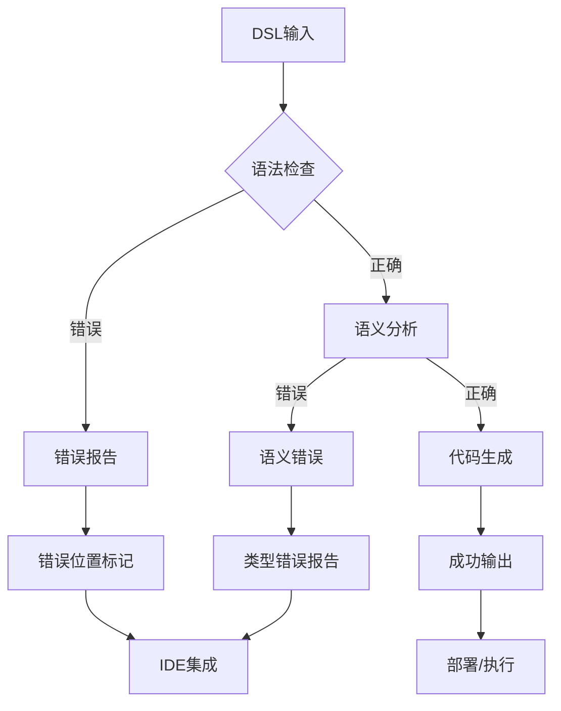
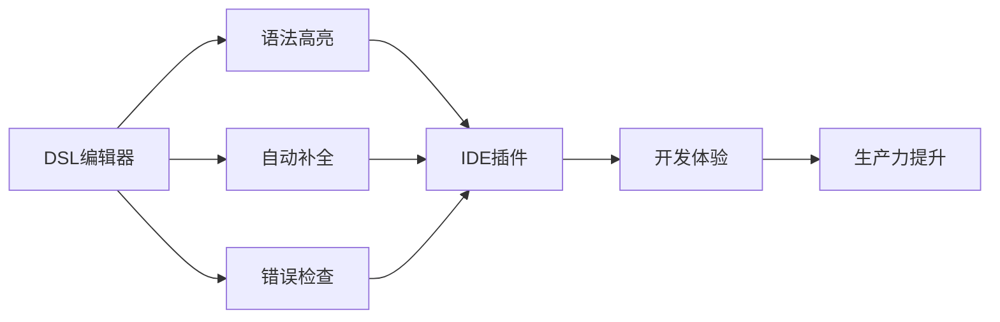

# 2.1 自定义DSL与解析器生成

## 目录

- [2.1 自定义DSL与解析器生成](#21-自定义dsl与解析器生成)
  - [目录](#目录)
  - [1. 引言与定义](#1-引言与定义)
  - [2. DSL的核心概念](#2-dsl的核心概念)
    - [2.1 什么是DSL](#21-什么是dsl)
    - [2.2 内部DSL vs 外部DSL](#22-内部dsl-vs-外部dsl)
    - [2.3 解析器、词法分析器、语法分析器](#23-解析器词法分析器语法分析器)
  - [3. 自动化工作流：从文本到代码](#3-自动化工作流从文本到代码)
    - [3.1 定义语法 (Grammar)](#31-定义语法-grammar)
    - [3.2 生成解析器 (Parser)](#32-生成解析器-parser)
    - [3.3 构建抽象语法树 (AST)](#33-构建抽象语法树-ast)
    - [3.4 遍历AST并生成目标产物](#34-遍历ast并生成目标产物)
  - [4. 核心工具与实践](#4-核心工具与实践)
    - [4.1 ANTLR (ANother Tool for Language Recognition)](#41-antlr-another-tool-for-language-recognition)
    - [4.2 Pest (Pest Expressive Syntax Tree) for Rust](#42-pest-pest-expressive-syntax-tree-for-rust)
    - [4.3 Go中的解析器组合子 (Parser Combinators)](#43-go中的解析器组合子-parser-combinators)
  - [5. 配置/代码示例](#5-配置代码示例)
    - [5.1 ANTLR语法定义示例 (`Expr.g4`)](#51-antlr语法定义示例-exprg4)
    - [5.2 Pest语法定义示例 (`csv.pest`)](#52-pest语法定义示例-csvpest)
    - [5.3 Go解析器组合子示例](#53-go解析器组合子示例)
    - [5.4 配置DSL示例](#54-配置dsl示例)
  - [6. 行业应用案例](#6-行业应用案例)
  - [7. Mermaid图表：DSL处理流水线](#7-mermaid图表dsl处理流水线)
  - [8. 参考文献](#8-参考文献)

---

## 1. 引言与定义

**领域特定语言 (Domain-Specific Language, DSL)** 是一种为解决特定领域问题而设计的、表达能力有限的计算机语言。与通用编程语言（如Go, Rust, Java）不同，DSL的语法和语义都高度聚焦于其目标领域，例如SQL用于数据库查询，HTML用于网页结构，Terraform HCL用于基础设施即代码。

**解析器生成 (Parser Generation)** 则是根据形式化的**语法（Grammar）** 定义，自动创建一个能够读取DSL文本并将其转换为结构化数据（通常是**抽象语法树, AST**）的程序。

### 1.1 DSL的自动化价值

DSL的核心价值在于：

- **领域专家友好**：使用领域术语，降低技术门槛
- **类型安全**：编译时检查，减少运行时错误
- **代码生成**：自动生成样板代码和配置
- **标准化**：统一领域内的表达方式
- **工具链集成**：IDE支持、语法高亮、自动补全

## 2. DSL的核心概念

### 2.1 什么是DSL

DSL的目标是让领域专家（他们可能不是程序员）能够以一种更自然、更接近其专业术语的方式来描述问题或配置。一个好的DSL能够充当业务和技术之间的桥梁。

#### 2.1.1 DSL分类

- **配置DSL**：如Dockerfile、Kubernetes YAML、Terraform HCL
- **查询DSL**：如SQL、PromQL、Elasticsearch Query DSL
- **建模DSL**：如UML、SysML、Archimate
- **工作流DSL**：如Apache Airflow DAG、GitHub Actions

### 2.2 内部DSL vs 外部DSL

- **内部DSL (Internal DSL)**: 嵌入在一种宿主通用编程语言中，利用该语言的语法来构建。例如，Ruby on Rails中的路由定义就是一种内部DSL。
- **外部DSL (External DSL)**: 拥有自己独立的语法，需要专门的解析器来处理。本文主要关注外部DSL，因为它们的自动化潜力更大。

### 2.3 解析器、词法分析器、语法分析器

- **词法分析器 (Lexer/Tokenizer)**: 读取输入的DSL文本流，并将其分解成一系列有意义的**词法单元（Tokens）**。例如，将字符串`"let x = 10;"`分解成`let`, `x`, `=`, `10`, `;`五个tokens。
- **语法分析器 (Parser)**: 接收词法单元流，并根据预定义的语法规则，将它们组合成一个**抽象语法树 (Abstract Syntax Tree, AST)**。AST是程序逻辑的树状结构化表示。

## 3. 自动化工作流：从文本到代码

### 3.1 定义语法 (Grammar)

使用一种形式化的语法符号（如EBNF）来创建一个`.g4` (ANTLR) 或 `.pest` (Pest) 文件，精确定义DSL的词法规则和语法规则。

### 3.2 生成解析器 (Parser)

使用ANTLR或Pest等**解析器生成器（Parser Generator）** 工具，将语法文件作为输入，自动生成目标语言（如Go, Rust, Java）的词法分析器和语法分析器代码。

### 3.3 构建抽象语法树 (AST)

运行生成的解析器处理DSL文本，得到一个内存中的AST对象。这个AST是DSL内容的结构化、强类型表示。

### 3.4 遍历AST并生成目标产物

编写代码来遍历AST。通过访问者（Visitor）或监听器（Listener）设计模式，可以针对AST的不同节点执行特定逻辑，最终生成所需的目标产物，例如：

- 配置文件 (JSON, YAML)
- 源代码 (Go, Python)
- SQL查询
- API调用指令

## 4. 核心工具与实践

### 4.1 ANTLR (ANother Tool for Language Recognition)

**ANTLR** ([https://www.antlr.org/](https://www.antlr.org/)) 是一个功能极其强大的解析器生成器，支持生成多种主流语言的代码。它是构建健壮、高效解析器的行业标准，被广泛用于编译器、静态分析工具和大规模配置系统中。

#### 4.1.1 ANTLR特性

- **多语言支持**：Java, C#, Python, Go, JavaScript, Swift等
- **强大的语法**：支持左递归、优先级、语义谓词
- **丰富的工具**：语法可视化、调试器、测试框架
- **活跃社区**：大量现成的语法文件和示例

#### 4.1.2 工作流程

```bash
# 1. 安装ANTLR
npm install -g antlr4ts-cli

# 2. 生成解析器
antlr4ts -visitor Expr.g4

# 3. 编译生成的代码
tsc *.ts

# 4. 运行解析器
node main.js
```

### 4.2 Pest (Pest Expressive Syntax Tree) for Rust

**Pest** ([https://pest.rs/](https://pest.rs/)) 是一个为Rust设计的解析器生成器。它以其简洁的语法、出色的错误报告和易用性而闻名，是Rust社区中创建DSL的首选工具之一。

#### 4.2.1 Pest特性

- **简洁语法**：基于PEG（解析表达式语法）
- **零依赖**：运行时库轻量级
- **优秀错误报告**：详细的错误信息和位置
- **Rust原生**：完全集成到Rust生态

#### 4.2.2 工作流程

```bash
# 1. 添加依赖
cargo add pest pest_derive

# 2. 定义语法
# 在 src/grammar.pest 中定义语法

# 3. 生成解析器
cargo build

# 4. 运行解析器
cargo run
```

### 4.3 Go中的解析器组合子 (Parser Combinators)

虽然Go也有ANTLR的目标运行时，但另一种流行的方法是使用**解析器组合子**库（如`participle`）。这种方法不依赖于外部代码生成工具，而是通过将小的解析函数组合成更复杂的解析器来完成任务，更符合Go的语言习惯。

#### 4.3.1 解析器组合子优势

- **类型安全**：编译时类型检查
- **组合性**：小解析器组合成复杂解析器
- **错误处理**：详细的错误信息和恢复
- **性能**：无代码生成开销

## 5. 配置/代码示例

### 5.1 ANTLR语法定义示例 (`Expr.g4`)

一个完整的算术表达式语法：

```antlr
grammar Expr;

// 语法规则
prog:   stat+;
stat:   expr NEWLINE                    # printExpr
    |   ID '=' expr NEWLINE            # assign
    |   NEWLINE                         # blank
    ;
expr:   expr ('*'|'/') expr            # MulDiv
    |   expr ('+'|'-') expr            # AddSub
    |   INT                             # number
    |   ID                              # id
    |   '(' expr ')'                    # parens
    ;

// 词法规则
ID:     [a-zA-Z]+;
INT:    [0-9]+;
NEWLINE:'\r'? '\n';
WS:     [ \t]+ -> skip;
COMMENT: '//' ~[\r\n]* -> skip;
```

### 5.2 Pest语法定义示例 (`csv.pest`)

一个完整的CSV解析语法：

```pest
file = { SOI ~ record* ~ EOI }
record = { field ~ ("," ~ field)* ~ NEWLINE }
field = @{ PUSH("\"") ~ inner ~ PUSH("\"") | bare }
inner = { char* }
bare = { (ASCII_ALPHANUMERIC | " ")* }
char = { !("\"" | NEWLINE) ~ ANY }
NEWLINE = _{ "\r\n" | "\n" }
```

### 5.3 Go解析器组合子示例

使用`participle`库的配置DSL解析器：

```go
package main

import (
    "fmt"
    "log"
    "github.com/alecthomas/participle/v2"
    "github.com/alecthomas/participle/v2/lexer"
)

// AST节点定义
type Config struct {
    Services []*Service `@@*`
}

type Service struct {
    Name    string            `"service" @Ident`
    Port    int               `"port" "=" @Int`
    Env     map[string]string `"env" "{" @@* "}"`
    Labels  []string          `"labels" "[" @@* "]"`
}

// 词法分析器定义
var configLexer = lexer.MustSimple([]lexer.SimpleRule{
    {"Ident", `[a-zA-Z_][a-zA-Z0-9_]*`},
    {"Int", `\d+`},
    {"String", `"[^"]*"`},
    {"Punct", `[{}[\]()=,]`},
    {"Whitespace", `\s+`},
})

// 解析器
var parser = participle.MustBuild[Config](
    participle.Lexer(configLexer),
    participle.UseLookahead(2),
)

func main() {
    config := `
        service webapp
        port = 8080
        env {
            DATABASE_URL = "postgres://localhost/db"
            REDIS_URL = "redis://localhost:6379"
        }
        labels [ "production", "web" ]
        
        service api
        port = 3000
        env {
            API_KEY = "secret"
        }
        labels [ "api", "internal" ]
    `
    
    var cfg Config
    if err := parser.ParseString("", config, &cfg); err != nil {
        log.Fatal(err)
    }
    
    // 遍历AST并生成配置
    for _, service := range cfg.Services {
        fmt.Printf("Service: %s\n", service.Name)
        fmt.Printf("  Port: %d\n", service.Port)
        fmt.Printf("  Environment: %v\n", service.Env)
        fmt.Printf("  Labels: %v\n", service.Labels)
    }
}
```

### 5.4 配置DSL示例

一个用于定义微服务配置的DSL：

```yaml
# services.dsl
service user-service {
    port = 8080
    replicas = 3
    resources {
        cpu = "500m"
        memory = "1Gi"
    }
    env {
        DATABASE_URL = "postgres://user:pass@db:5432/users"
        REDIS_URL = "redis://cache:6379"
        LOG_LEVEL = "info"
    }
    health {
        path = "/health"
        port = 8080
        interval = "30s"
        timeout = "5s"
    }
    dependencies {
        database = "postgres"
        cache = "redis"
        message-queue = "kafka"
    }
}

service order-service {
    port = 8081
    replicas = 2
    resources {
        cpu = "1000m"
        memory = "2Gi"
    }
    env {
        DATABASE_URL = "postgres://user:pass@db:5432/orders"
        PAYMENT_API_URL = "https://api.payments.com"
    }
    health {
        path = "/health"
        port = 8081
        interval = "30s"
        timeout = "5s"
    }
}
```

对应的ANTLR语法：

```antlr
grammar ServiceConfig;

config: service* EOF;

service: 'service' ID '{' serviceBody '}';

serviceBody: 
    port
    replicas
    resources?
    env?
    health?
    dependencies?
;

port: 'port' '=' INT;
replicas: 'replicas' '=' INT;

resources: 'resources' '{' resourceItem* '}';
resourceItem: ID '=' STRING;

env: 'env' '{' envItem* '}';
envItem: ID '=' STRING;

health: 'health' '{' healthItem* '}';
healthItem: ID '=' (STRING | INT);

dependencies: 'dependencies' '{' dependencyItem* '}';
dependencyItem: ID '=' STRING;

ID: [a-zA-Z_][a-zA-Z0-9_-]*;
INT: [0-9]+;
STRING: '"' ~["]* '"';
WS: [ \t\r\n]+ -> skip;
COMMENT: '//' ~[\r\n]* -> skip;
```

## 6. 行业应用案例

### 6.1 HashiCorp Terraform (HCL)

Terraform使用其自定义的DSL，HCL (HashiCorp Configuration Language)，来定义基础设施。HCL有自己的解析器，能够将`.tf`文件转换为内部的资源图，进而驱动云平台的API调用。

```hcl
# main.tf
terraform {
  required_providers {
    aws = {
      source  = "hashicorp/aws"
      version = "~> 4.0"
    }
  }
}

provider "aws" {
  region = "us-west-2"
}

resource "aws_instance" "web" {
  ami           = "ami-12345678"
  instance_type = "t2.micro"
  
  tags = {
    Name = "WebServer"
  }
}
```

### 6.2 SQL数据库

几乎所有的SQL数据库（如PostgreSQL, MySQL）都有一个极其复杂的解析器（通常是手写的或用ANTLR/Bison等工具生成），用于将SQL查询字符串转换成可执行的查询计划。

```sql
-- 复杂查询示例
WITH user_stats AS (
  SELECT 
    user_id,
    COUNT(*) as order_count,
    SUM(amount) as total_amount
  FROM orders 
  WHERE created_at >= '2024-01-01'
  GROUP BY user_id
)
SELECT 
  u.name,
  us.order_count,
  us.total_amount
FROM users u
JOIN user_stats us ON u.id = us.user_id
WHERE us.total_amount > 1000
ORDER BY us.total_amount DESC;
```

### 6.3 Prometheus (PromQL)

Prometheus的查询语言PromQL是另一个成功的DSL，它允许用户以简洁的方式查询和聚合时间序列数据。

```promql
# 复杂查询示例
rate(http_requests_total{job="webapp"}[5m]) * 60

# 聚合查询
sum(rate(http_requests_total{status=~"5.."}[5m])) by (instance)

# 子查询
histogram_quantile(0.95, sum(rate(http_request_duration_seconds_bucket[5m])) by (le))
```

### 6.4 Kubernetes YAML

Kubernetes使用YAML作为其配置DSL，虽然YAML本身是通用的，但Kubernetes为其添加了特定的语义和验证规则。

```yaml
apiVersion: apps/v1
kind: Deployment
metadata:
  name: nginx-deployment
  labels:
    app: nginx
spec:
  replicas: 3
  selector:
    matchLabels:
      app: nginx
  template:
    metadata:
      labels:
        app: nginx
    spec:
      containers:
      - name: nginx
        image: nginx:1.14.2
        ports:
        - containerPort: 80
        resources:
          requests:
            memory: "64Mi"
            cpu: "250m"
          limits:
            memory: "128Mi"
            cpu: "500m"
```

## 7. Mermaid图表：DSL处理流水线

### 7.1 完整处理流程

```mermaid
graph TD
    A[DSL文本 (.tf, .conf, ...)] --> B{词法分析器 (Lexer)};
    B --> C[Token流];
    C --> D{语法分析器 (Parser)};
    D --> E[抽象语法树 (AST)];
    
    subgraph "语法定义 (Grammar.g4)"
        F[语法规则];
    end
    
    subgraph "解析器生成器 (ANTLR)"
      G[Generator]
    end
    
    F -- 输入 --> G;
    G -- 生成 --> B;
    G -- 生成 --> D;
    
    E --> H{AST遍历器 (Visitor)};
    H --> I[生成目标产物: 代码/配置/指令];
    
    subgraph "目标产物"
        J[配置文件 JSON/YAML]
        K[源代码 Go/Rust/Java]
        L[SQL查询]
        M[API调用]
    end
    
    I --> J;
    I --> K;
    I --> L;
    I --> M;
```

### 7.2 错误处理流程



### 7.3 工具链集成



## 8. 参考文献

### 8.1 官方文档

- [ANTLR Official Website](https://www.antlr.org/)
- [Pest Parser Documentation](https://pest.rs/book/)
- [Participle Documentation](https://github.com/alecthomas/participle)

### 8.2 理论资源

- [Domain-Specific Languages (Martin Fowler)](https://martinfowler.com/bliki/DomainSpecificLanguage.html)
- [Parsing Expression Grammar (PEG)](https://en.wikipedia.org/wiki/Parsing_expression_grammar)
- [Compiler Construction Principles](https://en.wikipedia.org/wiki/Compiler)

### 8.3 实践指南

- [Building DSLs in Go](https://github.com/alecthomas/participle)
- [Rust DSL Development](https://pest.rs/book/)
- [ANTLR Best Practices](https://github.com/antlr/antlr4/blob/master/doc/best-practices.md)

### 8.4 相关技术

- [Tree-sitter](https://tree-sitter.github.io/tree-sitter/)
- [Lark Parser](https://github.com/lark-parser/lark)
- [PEG.js](https://pegjs.org/)

---

**最后更新**: 2025年01月
