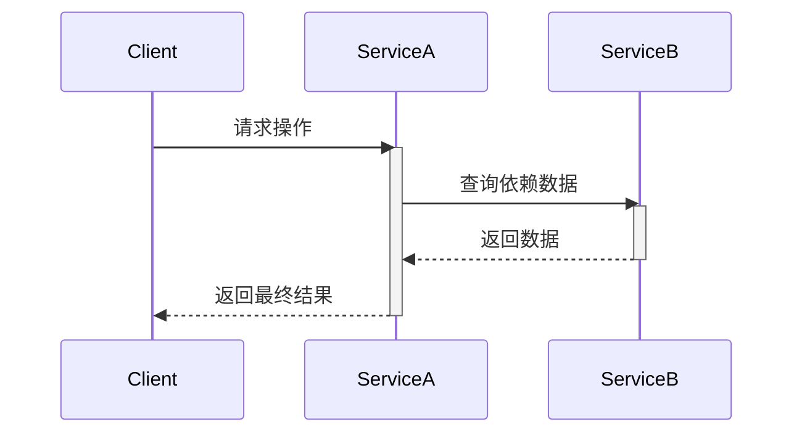
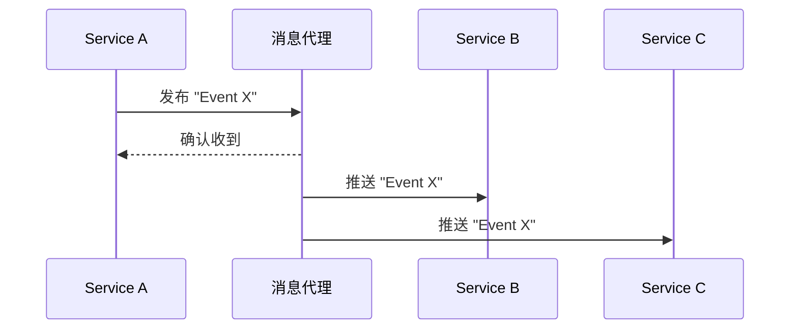

# 2.3 服务间通信 (RPC/事件驱动)

## 目录

- [2.3 服务间通信 (RPC/事件驱动)](#23-服务间通信-rpc事件驱动)
  - [目录](#目录)
  - [1. 引言：通信是架构的命脉](#1-引言通信是架构的命脉)
  - [2. 交互方式的分类](#2-交互方式的分类)
  - [3. 同步通信：紧密协作](#3-同步通信紧密协作)
  - [4. 异步通信：松散耦合](#4-异步通信松散耦合)
  - [5. 如何选择合适的通信方式](#5-如何选择合适的通信方式)
  - [6. Mermaid图解通信模式](#6-mermaid图解通信模式)
    - [同步 (RPC/REST)](#同步-rpcrest)
    - [异步 (事件驱动)](#异步-事件驱动)
  - [7. 参考文献](#7-参考文献)

---

## 1. 引言：通信是架构的命脉

在微服务架构中，服务间的通信方式是决定系统性能、弹性和耦合度的关键。选择同步还是异步，采用何种协议，直接影响着整个系统的架构特性。一个设计良好的通信策略可以使系统既高效又健壮，反之则可能导致性能瓶颈和级联失败。

## 2. 交互方式的分类

服务间的交互可以从两个维度进行划分：

1. **一对一 vs 一对多**:
    - **一对一**: 一个客户端请求只由一个服务实例处理（如典型的RPC调用）。
    - **一对多**: 一个事件被发布后，可以被多个不同的服务实例消费（如发布/订阅模式）。
2. **同步 vs 异步**:
    - **同步**: 客户端发送请求后，会阻塞并等待服务端的响应。
    - **异步**: 客户端发送消息后不会直接等待响应，而是通过回调、Future或消息代理来处理结果。

## 3. 同步通信：紧密协作

在同步模式下，服务间的调用类似于本地函数调用，客户端在获得结果前会一直等待。

- **定义**: 客户端与服务端在时间上是耦合的，必须同时在线才能完成交互。
- **协议与技术**:
  - **REST/HTTP**: 基于HTTP/1.1或HTTP/2，使用JSON作为数据格式。它简单、通用、生态成熟，是事实上的标准。
  - **gRPC**: Google开源的RPC框架，基于HTTP/2，使用Protocol Buffers进行序列化。它性能高、类型安全，支持双向流，非常适合内部服务间的高性能通信。
- **优点**:
  - 编程模型简单直观，易于理解和调试。
- **缺点**:
  - **时间耦合 (Temporal Coupling)**: 降低了系统的整体弹性。如果一个被调用的服务响应缓慢或不可用，会直接阻塞调用方，容易引发"级联失败"。
  - **点对点通信**: 在复杂交互中容易形成网状的、难以管理的调用链。

## 4. 异步通信：松散耦合

在异步模式下，服务间通过消息传递进行协作，通常会引入一个消息中间件（Message Broker）。

- **定义**: 生产者（Producer）发送消息到中间件后即可返回，消费者（Consumer）在合适的时候从中间件获取并处理消息。生产者和消费者在时间上是解耦的。
- **协议与技术**:
  - **消息代理**: Apache Kafka, RabbitMQ, NATS, Apache Pulsar等。
- **核心模式**:
  - **发布/订阅 (Publish/Subscribe)**: 消息被发布到一个"主题"（Topic），所有订阅了该主题的消费者都会收到一份消息的副本。非常适合一对多的通知场景。
  - **消息队列 (Message Queuing)**: 消息被发送到一个"队列"（Queue），并且只会被一个消费者处理。适合将任务分发给一组工作者实例的场景。
- **优点**:
  - **高度解耦**: 生产者和消费者无需感知对方的存在。
  - **高弹性与可用性**: 即使消费者暂时宕机，消息代理也可以缓存消息，待其恢复后再进行处理。
  - **负载削峰 (Load Leveling)**: 可以平滑处理突发流量，消息代理作为缓冲区，消费者可以按照自己的节奏进行处理。
- **缺点**:
  - **架构复杂性增加**: 需要引入和维护一个高可用的消息中间件。
  - **调试困难**: 调用链不直观，追踪一个完整的业务流程变得更加复杂。
  - **最终一致性**: 由于异步处理，数据一致性模型通常是"最终一致性"，需要开发者特别注意。

## 5. 如何选择合适的通信方式

没有一种方式是万能的，通常采用混合模式：

- **使用同步通信 (gRPC/REST)**:
  - 当客户端需要**立即获得**操作结果时，如查询数据、执行一个需要实时确认的命令。
  - 适用于读操作或简单的写操作。
- **使用异步通信 (消息驱动)**:
  - 当操作可以**延迟处理**或需要通知多个下游系统时，如用户注册后发送欢迎邮件和初始化数据。
  - 当需要**解耦服务**以提高系统整体弹性时。
  - 当需要**缓冲流量洪峰**时。

## 6. Mermaid图解通信模式

### 同步 (RPC/REST)

### 异步 (事件驱动)

## 7. 参考文献

- [Microservices.io - Communication Style](https://microservices.io/patterns/communication-style/messaging.html)
- [gRPC Documentation](https://grpc.io/docs/what-is-grpc/introduction/)
- [Apache Kafka Documentation](https://kafka.apache.org/documentation/)

---
> 支持断点续写与递归细化，如需扩展某一小节请指定。
