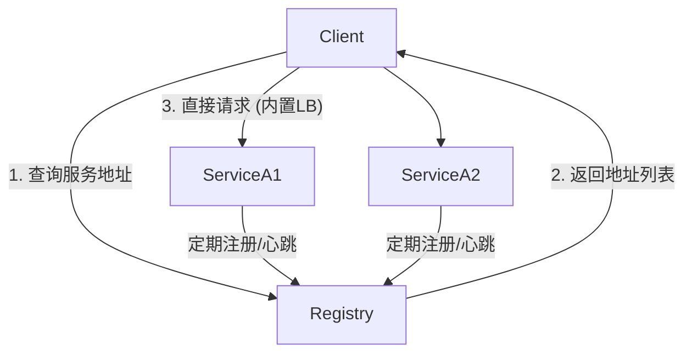
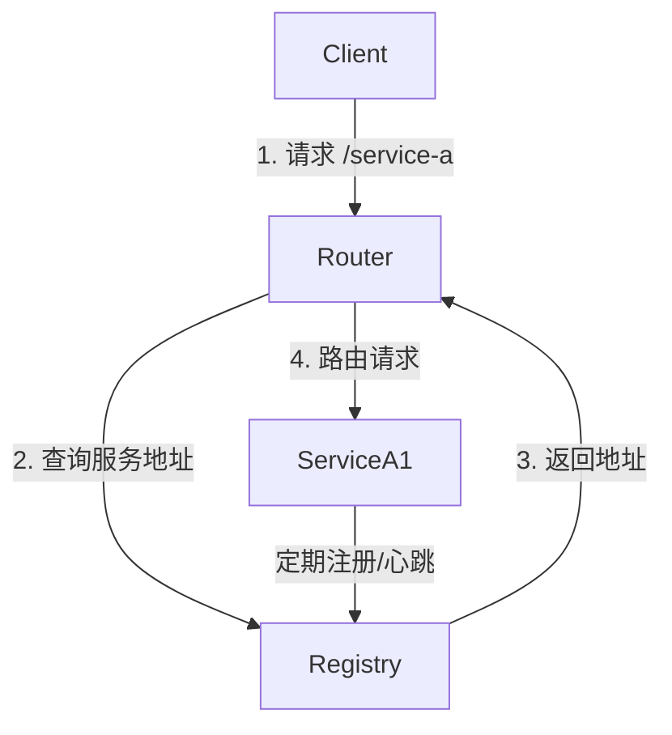

# 2.1 服务发现与注册 (Consul/Etcd)

## 目录

- [2.1 服务发现与注册 (Consul/Etcd)](#21-服务发现与注册-consuletcd)
  - [目录](#目录)
  - [1. 引言：动态环境下的地址难题](#1-引言动态环境下的地址难题)
  - [2. 核心概念与组件](#2-核心概念与组件)
  - [3. 服务发现的两种核心模式](#3-服务发现的两种核心模式)
    - [3.1 客户端发现 (Client-Side Discovery)](#31-客户端发现-client-side-discovery)
    - [3.2 服务端发现 (Server-Side Discovery)](#32-服务端发现-server-side-discovery)
  - [4. 主流注册中心工具](#4-主流注册中心工具)
  - [5. Consul配置与API示例](#5-consul配置与api示例)
    - [服务注册 (JSON配置文件)](#服务注册-json配置文件)
    - [服务发现 (通过HTTP API查询)](#服务发现-通过http-api查询)
  - [6. Mermaid图解核心模式](#6-mermaid图解核心模式)
    - [客户端发现](#客户端发现)
    - [服务端发现](#服务端发现)
  - [7. 参考文献](#7-参考文献)
  - [服务发现与注册的形式化建模与工程实践](#服务发现与注册的形式化建模与工程实践)
    - [1. 形式化建模](#1-形式化建模)
    - [2. 工程实践](#2-工程实践)

---

## 1. 引言：动态环境下的地址难题

在现代云原生环境中，服务实例是动态变化的：它们会因为自动扩缩容、故障恢复、滚动更新等原因频繁地创建和销毁，其网络地址（IP和端口）也随之改变。
因此，硬编码服务地址是完全不可行的。
服务发现机制解决了这个核心问题：它提供了一种方法，让服务能够动态地找到彼此，而无需关心对方的具体网络位置。

## 2. 核心概念与组件

一个典型的服务发现系统包含以下几个部分：

- **服务注册中心 (Service Registry)**: 一个高可用的数据库，作为服务网络位置的"黄页"。它存储了每个服务实例的名称、地址、端口、元数据等信息。
- **服务注册 (Service Registration)**: 服务实例在启动时，主动向注册中心"登记"自己的信息。
- **服务注销 (Service Deregistration)**: 服务实例在正常关闭时，从注册中心"注销"自己。
- **健康检查 (Health Checking)**: 注册中心（或服务实例自身）通过心跳、API轮询等方式持续检查服务实例的健康状况。当一个实例不健康时，注册中心会将其临时或永久地从可用列表中移除，防止流量流向故障实例。

## 3. 服务发现的两种核心模式

### 3.1 客户端发现 (Client-Side Discovery)

在这种模式下，客户端直接查询服务注册中心，获取目标服务所有可用实例的地址列表。然后，客户端根据内置的负载均衡算法（如轮询、随机、哈希）选择一个实例并直接发起请求。

- **优点**:
  - 架构简单，请求路径直接（Client -> Service）。
  - 客户端可以根据需要实现更智能的负载均衡策略。
- **缺点**:
  - 客户端与注册中心紧密耦合。
  - 需要在每种语言/框架的客户端中都实现一套服务发现和负载均衡的逻辑，增加了复杂性。

### 3.2 服务端发现 (Server-Side Discovery)

在这种模式下，客户端将请求发送到一个中间层，通常是API网关或专用的负载均衡器（Router/Load Balancer）。这个中间层负责查询注册中心，并将请求路由到后端一个健康的实例上。

- **优点**:
  - 客户端无需关心服务发现的细节，逻辑被集中到了中间层。
  - 简化了客户端的实现。
- **缺点**:
  - 中间层可能成为系统的性能瓶颈或单点故障。
  - 增加了一次网络跳转，可能导致延迟略微增高。
  - **Kubernetes内置的服务发现（ClusterIP/NodePort Service）就是典型的服务端发现模式。**

## 4. 主流注册中心工具

- **Consul**: HashiCorp出品，功能全面的服务网格解决方案。它不仅提供服务发现，还包括健康检查、K/V存储、多数据中心支持等。其设计同时支持客户端和服务端发现模式。
- **Etcd**: CoreOS开发的高可用、强一致性的分布式键值存储。作为Kubernetes的默认后台数据库而闻名。虽然它本身不是一个完整的服务发现解决方案，但其可靠的K/V存储和Watch机制使其成为构建服务注册中心的理想基础组件。
- **Zookeeper**: Apache基金会的经典项目，是分布式协调服务的"元老"。功能与Etcd类似，但更复杂，在新的项目中已逐渐被Etcd和Consul取代。

## 5. Consul配置与API示例

### 服务注册 (JSON配置文件)

```json
{
  "service": {
    "name": "order-service",
    "tags": ["go", "api"],
    "port": 8080,
    "check": {
      "http": "http://localhost:8080/health",
      "interval": "10s"
    }
  }
}
```

### 服务发现 (通过HTTP API查询)

```bash
# 查询名为 "order-service" 的所有健康实例
curl http://localhost:8500/v1/health/service/order-service
```

这将返回一个JSON数组，其中包含所有健康实例的地址、端口等详细信息。

## 6. Mermaid图解核心模式

### 客户端发现



### 服务端发现



## 7. 参考文献

- [Consul by HashiCorp](https://www.consul.io/)
- [Etcd Documentation](https://etcd.io/docs/)
- [Pattern: Service registry](https://microservices.io/patterns/service-registry.html)

---

## 服务发现与注册的形式化建模与工程实践

### 1. 形式化建模

- **定义**：服务发现机制用于动态感知分布式系统中各服务实例的可用性与位置。
- **抽象模型**：
  - 服务注册表 $R = \{(service, instance, meta)\}$
  - 心跳机制 $H: instance \rightarrow \{alive, dead\}$
  - 发现过程 $D: client \rightarrow R$
- **一致性与可用性分析**：注册中心需权衡CAP，常见实现如AP（Consul）、CP（etcd）。

### 2. 工程实践

- **Consul**：基于Gossip协议，支持健康检查、服务分区、KV存储。
- **etcd**：基于Raft协议，强一致性，广泛用于Kubernetes等云原生平台。
- **批判性分析**：服务发现提升了系统弹性与自动化，但引入了新的单点与一致性挑战。

---

> 本节内容吸收自FormalUnified分支，系统性补充服务发现与注册的形式化建模、可验证性分析与工程案例。
