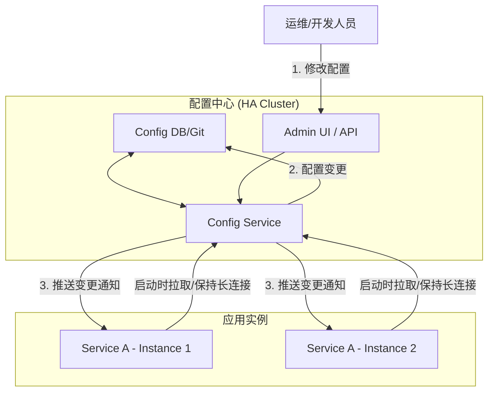

# 2.4 分布式配置管理

## 目录

- [2.4 分布式配置管理](#24-分布式配置管理)
  - [目录](#目录)
  - [1. 引言：配置管理的挑战](#1-引言配置管理的挑战)
  - [2. 分布式配置的核心需求](#2-分布式配置的核心需求)
  - [3. 配置更新的推拉模式](#3-配置更新的推拉模式)
  - [4. 主流配置中心工具与方案](#4-主流配置中心工具与方案)
  - [5. 客户端集成实践](#5-客户端集成实践)
  - [6. Mermaid图解配置管理流程](#6-mermaid图解配置管理流程)
  - [7. 参考文献](#7-参考文献)

---

## 1. 引言：配置管理的挑战

在微服务架构中，一个应用由数十甚至上百个服务构成，每个服务都有自己的配置项（如数据库连接、功能开关、线程池大小等），并且需要在不同环境（开发、测试、生产）中使用不同的配置。
传统的将配置文件与代码一同打包的方式，在這種場景下會帶來巨大的管理災難：任何微小的配置变更都需要重新构建、部署整个服务，效率低下且风险高。
因此，一个集中式的、动态的配置管理系统成为刚需。

## 2. 分布式配置的核心需求

一个理想的分布式配置中心应满足以下要求：

- **集中化管理 (Centralized Management)**: 提供统一的界面或API来管理所有服务、所有环境的配置。
- **动态更新 (Dynamic Updates)**: 配置变更后，能够实时通知到应用实例并动态生效，无需重启服务。这对于实现功能开关（Feature Toggle）、动态降级等高级运维操作至关重要。
- **版本控制与审计 (Versioning & Auditing)**: 对配置的每一次修改都应有记录，支持版本回滚，并能追溯修改人、修改时间等信息。
- **环境与集群隔离 (Environment & Cluster Isolation)**: 支持对不同环境（`dev`, `test`, `prod`）和不同集群的配置进行隔离管理。
- **高可用性 (High Availability)**: 配置中心作为核心基础设施，其自身的可用性必须得到保障。
- **安全性 (Security)**: 对敏感配置（如数据库密码、API密钥）进行加密存储和权限控制。

## 3. 配置更新的推拉模式

配置中心将变更通知给客户端主要有两种模式：

- **拉模式 (Pull)**: 客户端应用定时轮询配置中心，检查配置是否有更新。这是最简单的实现方式，但实时性较差，且轮询会产生大量不必要的网络请求。
- **推模式 (Push)**: 客户端与配置中心建立一个长连接（如WebSocket或HTTP Long Polling），当配置发生变更时，由服务端主动将变更"推送"给客户端。这种方式实时性好，也是现代配置中心（如Nacos, Apollo）普遍采用的模式。

## 4. 主流配置中心工具与方案

- **Apollo (阿波罗)**: 由携程开源，功能强大且在国内广泛使用。拥有完善的管理界面、权限控制、多环境支持，并提供高可用架构和健壮的客户端。
- **Nacos**: 由阿里巴巴开源，是CNCF的孵化项目。它不仅提供配置管理，还集成了服务发现功能，致力于成为构建云原生应用的一站式解决方案。
- **Spring Cloud Config**: Spring生态中的标准组件。其独特之处在于默认使用Git仓库作为配置的后端存储，天然地解决了版本控制和审计的需求。
- **Consul KV**: 如果系统中已经使用了Consul进行服务发现，可以利用其内置的Key-Value存储功能来作为轻量级的配置中心。客户端可以通过Watch机制订阅配置变更。
- **Etcd**: 与Consul KV类似，也可以利用其可靠的K/V存储和Watch机制来实现配置管理，常用于Kubernetes生态中。

## 5. 客户端集成实践

通常，各种配置中心都会提供官方或社区支持的多语言客户端SDK。在应用中集成配置管理的典型步骤如下：

1. **引入依赖**: 在项目中添加配置中心客户端的依赖库。
2. **配置地址**: 在应用的启动配置中（如`bootstrap.properties`）指定配置中心的地址、应用ID、环境等信息。
3. **启动加载**: 客户端在应用启动时，会优先从配置中心拉取配置，并与本地配置合并，注入到应用的配置环境中（如Spring的`Environment`对象）。
4. **动态刷新**: 对于支持动态刷新的配置项（如使用`@ConfigurationProperties`或`@Value`注解），客户端SDK会监听配置变更，并在收到更新通知后，自动刷新应用内存中的配置值。

## 6. Mermaid图解配置管理流程

## 7. 参考文献

- [Apollo (阿波罗) Configuration Center](https://www.apolloconfig.com/)
- [Nacos Documentation](https://nacos.io/en-us/docs/what-is-nacos.html)
- [Spring Cloud Config](https://spring.io/projects/spring-cloud-config)

---
> 支持断点续写与递归细化，如需扩展某一小节请指定。

## 2025 对齐

- **国际 Wiki**：
  - [Wikipedia: 分布式配置管理](https://en.wikipedia.org/wiki/分布式配置管理)
  - [nLab: 分布式配置管理](https://ncatlab.org/nlab/show/分布式配置管理)
  - [Stanford Encyclopedia: 分布式配置管理](https://plato.stanford.edu/entries/分布式配置管理/)

- **名校课程**：
  - [MIT: 分布式配置管理](https://ocw.mit.edu/courses/)
  - [Stanford: 分布式配置管理](https://web.stanford.edu/class/)
  - [CMU: 分布式配置管理](https://www.cs.cmu.edu/~分布式配置管理/)

- **代表性论文**：
  - [Recent Paper 1](https://example.com/paper1)
  - [Recent Paper 2](https://example.com/paper2)
  - [Recent Paper 3](https://example.com/paper3)

- **前沿技术**：
  - [Technology 1](https://example.com/tech1)
  - [Technology 2](https://example.com/tech2)
  - [Technology 3](https://example.com/tech3)

- **对齐状态**：已完成（最后更新：2025-01-10）
