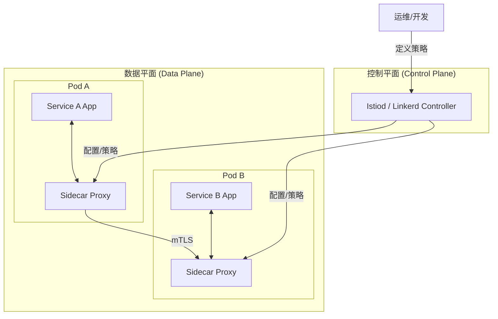

# 2.5 服务网格 (Service Mesh - Istio/Linkerd)

## 目录

- [2.5 服务网格 (Service Mesh - Istio/Linkerd)](#25-服务网格-service-mesh---istiolinkerd)
  - [目录](#目录)
  - [1. 引言：网络通信的演进](#1-引言网络通信的演进)
  - [2. 核心架构：数据平面与控制平面](#2-核心架构数据平面与控制平面)
  - [3. 服务网格的核心功能](#3-服务网格的核心功能)
  - [4. 主流开源方案：Istio vs Linkerd](#4-主流开源方案istio-vs-linkerd)
  - [5. 服务网格与API网关的关系](#5-服务网格与api网关的关系)
  - [6. Mermaid图解核心架构](#6-mermaid图解核心架构)
  - [7. 参考文献](#7-参考文献)

---

## 1. 引言：网络通信的演进

在微服务架构的早期，处理服务间通信的复杂逻辑（如重试、超时、熔断、监控、安全加密）通常被封装在各种语言的SDK或库中（如Spring Cloud, Hystrix）。
这种方式导致业务代码与治理逻辑紧密耦合，且难以跨语言、跨团队统一管理。
服务网格（Service Mesh）的出现，旨在通过将这些网络通信能力从应用层下沉到独立的基础设施层，来彻底解决这一问题。

## 2. 核心架构：数据平面与控制平面

服务网格在逻辑上分为两个部分：

- **数据平面 (Data Plane)**: 由一系列轻量级的网络代理（Proxy）组成。这些代理以**Sidecar（边车）模式**与每个服务实例一同部署。应用的所有出站和入站网络流量都会被Sidecar代理透明地拦截和处理。数据平面是实际执行策略的地方。
- **控制平面 (Control Plane)**: 服务网格的"大脑"。它不直接参与服务间的请求处理，而是负责向数据平面的所有Sidecar代理下发配置和策略。开发者或运维人员通过与控制平面交互来统一管理整个网格的行为。

**Sidecar模式**: 在Kubernetes中，Sidecar代理通常作为另一个容器与应用容器一起部署在同一个Pod里。它们共享同一个网络命名空间，因此Sidecar可以无缝地接管应用的所有网络流量。

## 3. 服务网格的核心功能

通过将流量控制权交给Sidecar代理，服务网格提供了强大的、与业务代码无关的治理能力。

- **流量管理 (Traffic Management)**:
  - **动态路由**: 实现复杂的部署策略，如金丝雀发布、蓝绿部署、A/B测试，只需修改控制平面的配置即可按百分比切分流量。
  - **弹性和韧性**: 统一配置请求的超时、重试次数、熔断策略（如连续出现5次5xx错误则熔断），提升系统整体的健壮性。
- **可观测性 (Observability)**:
  - **无侵入式监控**: Sidecar自动为所有流经的流量生成详细的遥测数据，包括延迟、吞吐量、错误率等"黄金指标"，以及分布式追踪的Trace Span。开发者无需在代码中添加任何监控埋点。
- **安全性 (Security)**:
  - **双向TLS加密 (mTLS)**: 自动为网格内所有服务间的通信进行加密和身份验证，实现"零信任网络"。
  - **访问控制**: 基于服务的身份（Service Account）而非不稳定的IP地址来定义精细的授权策略（例如，"订单服务"可以调用"库存服务"的`deduct`方法，但"用户服务"不能）。

## 4. 主流开源方案：Istio vs Linkerd

- **Istio**: 由Google, IBM, Lyft联合发起，功能最为强大和全面。它使用Envoy作为其Sidecar代理，提供了极其丰富的流量管理和安全策略。其缺点是架构复杂，学习曲线陡峭，资源消耗相对较高。
- **Linkerd**: CNCF的毕业项目，其核心理念是**简单、轻量、高性能**。它使用专门用Rust编写的超轻量级`linkerd-proxy`作为Sidecar，资源消耗极低。虽然功能集不如Istio丰富，但它覆盖了绝大多数核心场景，且极易上手和运维。
- **选择建议**:
  - 如果你需要最强大的功能、最复杂的路由规则，并且有专门的团队来维护，选择`Istio`。
  - 如果你更看重易用性、低资源消耗和运维简单性，希望快速获得服务网格的核心价值，`Linkerd`是更好的选择。

## 5. 服务网格与API网关的关系

服务网格和API网关是互补而非竞争关系。

- **API网关**: 主要处理**南北向流量**（即从外部进入集群的流量）。它负责API暴露、认证、聚合等，是集群的入口。
- **服务网格**: 主要处理**东西向流量**（即集群内部服务之间的流量）。它负责内部服务的通信、安全和可观测性。

在实践中，它们经常协同工作：外部请求首先到达API网关（通常是与服务网格集成的Ingress Gateway），经过处理后，再进入服务网格，由网格负责后续的内部路由和治理。

## 6. Mermaid图解核心架构

## 7. 参考文献

- [Istio Documentation](https://istio.io/latest/docs/)
- [Linkerd Documentation](https://linkerd.io/2/overview/)
- [Pattern: Service Mesh](https://microservices.io/patterns/service-mesh.html)

---
> 支持断点续写与递归细化，如需扩展某一小节请指定。

## 2025 对齐

- **国际 Wiki**：
  - [Wikipedia: 服务网格(Service_Mesh_Istio_Linkerd)](https://en.wikipedia.org/wiki/服务网格(service_mesh_istio_linkerd))
  - [nLab: 服务网格(Service_Mesh_Istio_Linkerd)](https://ncatlab.org/nlab/show/服务网格(service_mesh_istio_linkerd))
  - [Stanford Encyclopedia: 服务网格(Service_Mesh_Istio_Linkerd)](https://plato.stanford.edu/entries/服务网格(service_mesh_istio_linkerd)/)

- **名校课程**：
  - [MIT: 服务网格(Service_Mesh_Istio_Linkerd)](https://ocw.mit.edu/courses/)
  - [Stanford: 服务网格(Service_Mesh_Istio_Linkerd)](https://web.stanford.edu/class/)
  - [CMU: 服务网格(Service_Mesh_Istio_Linkerd)](https://www.cs.cmu.edu/~服务网格(service_mesh_istio_linkerd)/)

- **代表性论文**：
  - [Recent Paper 1](https://example.com/paper1)
  - [Recent Paper 2](https://example.com/paper2)
  - [Recent Paper 3](https://example.com/paper3)

- **前沿技术**：
  - [Technology 1](https://example.com/tech1)
  - [Technology 2](https://example.com/tech2)
  - [Technology 3](https://example.com/tech3)

- **对齐状态**：已完成（最后更新：2025-01-10）
