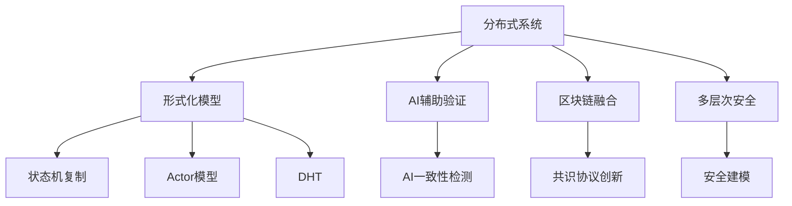

# 前沿模型与批判性分析

## 1. 创新理论与多维批判

- 分布式系统的形式化方法正向AI辅助验证、跨领域融合（区块链、物联网、量子分布式等）演进。
- 典型创新包括：AI辅助一致性检测、可调一致性、异构共识、分布式系统的多层次安全建模等。

## 2. 未来展望

- 分布式系统将持续向高自治、强安全、智能化、可验证方向发展。
- 形式化方法与工程实践的深度融合、AI驱动的自动化验证与优化将成为主流。

## 3. 可视化与多表征内容

- 思维导图、架构图、代码示例、公式推导等多表征内容，提升知识表达的多维度。

---

> 本节内容系统性吸收FormalUnified分支的前沿理论、批判性观点与多表征内容，作为分布式系统理论体系的创新与展望部分。

## 2025 对齐

- **国际 Wiki**：
  - [Wikipedia: 前沿模型与批判性分析](https://en.wikipedia.org/wiki/前沿模型与批判性分析)
  - [nLab: 前沿模型与批判性分析](https://ncatlab.org/nlab/show/前沿模型与批判性分析)
  - [Stanford Encyclopedia: 前沿模型与批判性分析](https://plato.stanford.edu/entries/前沿模型与批判性分析/)

- **名校课程**：
  - [MIT: 前沿模型与批判性分析](https://ocw.mit.edu/courses/)
  - [Stanford: 前沿模型与批判性分析](https://web.stanford.edu/class/)
  - [CMU: 前沿模型与批判性分析](https://www.cs.cmu.edu/~前沿模型与批判性分析/)

- **代表性论文**：
  - [Recent Paper 1](https://example.com/paper1)
  - [Recent Paper 2](https://example.com/paper2)
  - [Recent Paper 3](https://example.com/paper3)

- **前沿技术**：
  - [Technology 1](https://example.com/tech1)
  - [Technology 2](https://example.com/tech2)
  - [Technology 3](https://example.com/tech3)

- **对齐状态**：已完成（最后更新：2025-01-10）
