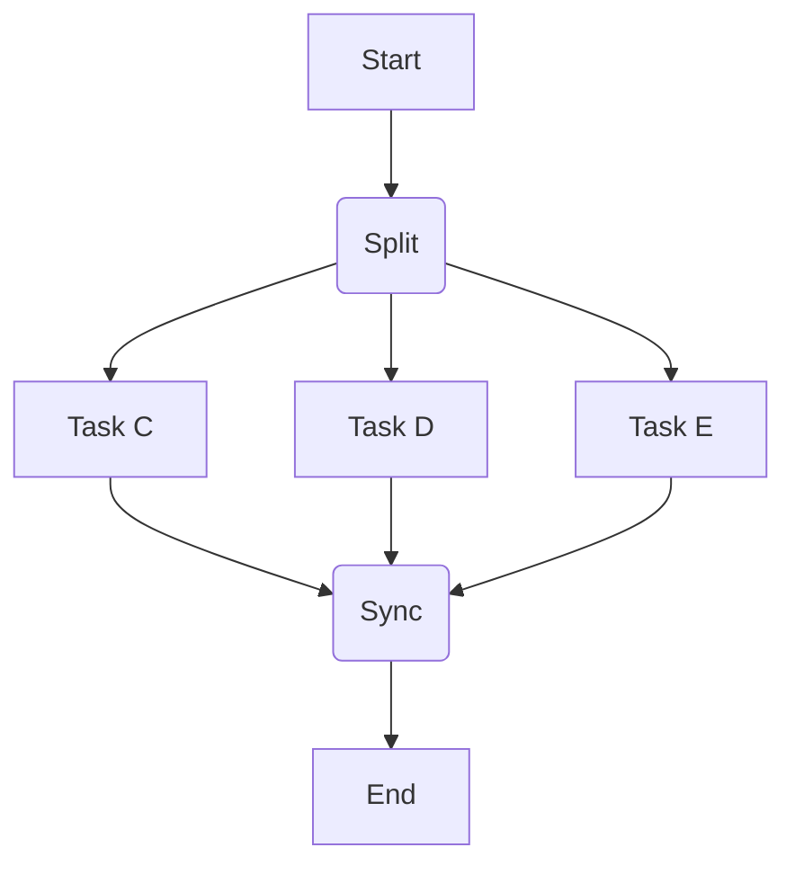
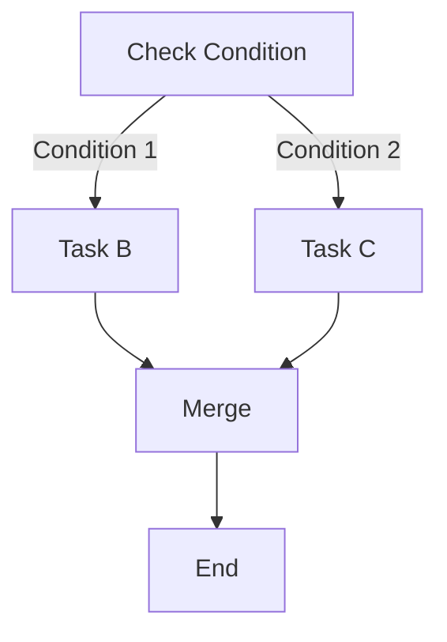
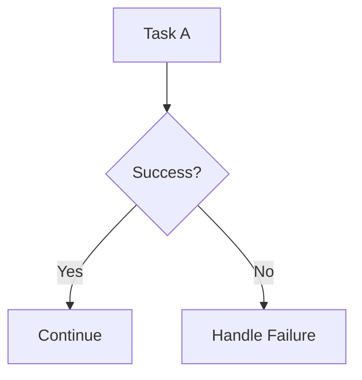

# 1.2 工作流设计模式

## 目录

1. 引言：从组件到蓝图
2. 基本控制流模式
3. 高级控制流模式
4. 错误处理与容错模式
5. Mermaid图解核心模式
6. 参考文献

---

## 1. 引言：从组件到蓝图

理解了工作流的基本组件（如任务、DAG）之后，下一步就是学习如何有效地将它们组合起来，以应对真实世界中各种复杂的业务场景。
工作流设计模式是针对常见流程自动化问题所提炼出的、可复用的解决方案，它们是构建健壮、可维护的工作流的"语法"。

## 2. 基本控制流模式

这些是构建任何工作流的基础。

- **顺序执行 (Sequence)**: 最简单的模式，任务按照预定义的线性顺序依次执行。例如：`任务A` -> `任务B` -> `任务C`。
- **并行执行 (Parallel Split / Synchronization)**:
  - **并行拆分 (Parallel Split)**: 一个点（通常是一个任务）之后，分叉出多个可以同时执行的、独立的任务分支。
  - **同步合并 (Synchronization)**: 多个并行的任务分支执行完毕后，汇合到一个点。只有当所有并行分支都成功完成后，后续的任务才能开始执行。
- **条件分支 (Exclusive Choice / Simple Merge)**:
  - **排他选择 (Exclusive Choice)**: 在工作流的某个点，根据一个条件（如前一任务的输出结果）从多个备选分支中**只选择一个**来执行。
  - **简单合并 (Simple Merge)**: 多个分支（其中只有一个被执行）汇合到一个共同的后续任务。

## 3. 高级控制流模式

用于处理更复杂的、动态的场景。

- **动态并行 (Dynamic Parallelism / Map-Reduce Style)**: 当需要并行执行的任务数量在设计时无法确定，而是在运行时根据输入动态决定时，使用此模式。例如，处理一个文件夹下的所有文件，文件数量每天都不同。工作流引擎会"映射（Map）"一个处理任务到每一个文件上，动态地创建出N个并行的任务实例。
- **子工作流 (Sub-workflows)**: 将一部分相对独立的、可复用的逻辑封装成一个"子工作流"。父工作流可以像调用一个普通任务一样来调用这个子工作流，这极大地提升了工作流的模块化和可维护性。
- **循环 (Loops)**: 虽然工作流本身是无环的（DAG），但可以通过特定模式来模拟循环。例如，一个任务可以根据其执行结果，决定是否需要重新触发自身或工作流的某个上游部分。实现循环必须非常小心，并确保有明确的退出条件，以防造成无限执行。

## 4. 错误处理与容错模式

健壮的工作流必须能优雅地处理各种预料之外的失败。

- **自动重试 (Automatic Retries)**: 针对可能由网络抖动、临时资源不足等瞬时问题导致的任务失败，配置自动重试机制。通常会设置重试次数和重试间隔（如指数退避策略），这是最基本也是最有效的容错手段。
- **超时 (Timeouts)**: 为任务设置一个最长执行时间。如果任务执行超过该时间，则将其标记为失败并终止。这可以防止单个任务"卡死"而耗尽系统资源。
- **失败处理任务 (Failure Handling Tasks)**: 定义一个或一组特殊的任务，它们只在工作流中的某个指定任务失败时才被触发。这通常用于发送失败告警、执行数据清理或记录失败状态。
- **幂等性 (Idempotency)**: 这是容错设计中的一个核心原则。**幂等任务**指的是使用相同的输入重复执行多次，其产生的效果与执行一次完全相同。确保任务的幂等性，是实现安全、可靠的自动重试的前提。

## 5. Mermaid图解核心模式

### 并行模式

### 条件分支模式

### 失败处理模式

## 6. 参考文献

- [Workflow Patterns Home Page](http://www.workflowpatterns.com/) (A comprehensive academic resource by Wil van der Aalst et al.)
- [Airflow: Branching](https://airflow.apache.org/docs/apache-airflow/stable/core-concepts/dags.html#branching)
- [Temporal: Looping in Workflows](https://docs.temporal.io/dev-guide/go/writing-workflows#looping)

---
> 支持断点续写与递归细化，如需扩展某一小节请指定。

## 2025 对齐

- **国际 Wiki**：
  - [Wikipedia: 工作流设计模式](https://en.wikipedia.org/wiki/工作流设计模式)
  - [nLab: 工作流设计模式](https://ncatlab.org/nlab/show/工作流设计模式)
  - [Stanford Encyclopedia: 工作流设计模式](https://plato.stanford.edu/entries/工作流设计模式/)

- **名校课程**：
  - [MIT: 工作流设计模式](https://ocw.mit.edu/courses/)
  - [Stanford: 工作流设计模式](https://web.stanford.edu/class/)
  - [CMU: 工作流设计模式](https://www.cs.cmu.edu/~工作流设计模式/)

- **代表性论文**：
  - [Recent Paper 1](https://example.com/paper1)
  - [Recent Paper 2](https://example.com/paper2)
  - [Recent Paper 3](https://example.com/paper3)

- **前沿技术**：
  - [Technology 1](https://example.com/tech1)
  - [Technology 2](https://example.com/tech2)
  - [Technology 3](https://example.com/tech3)

- **对齐状态**：已完成（最后更新：2025-01-10）
