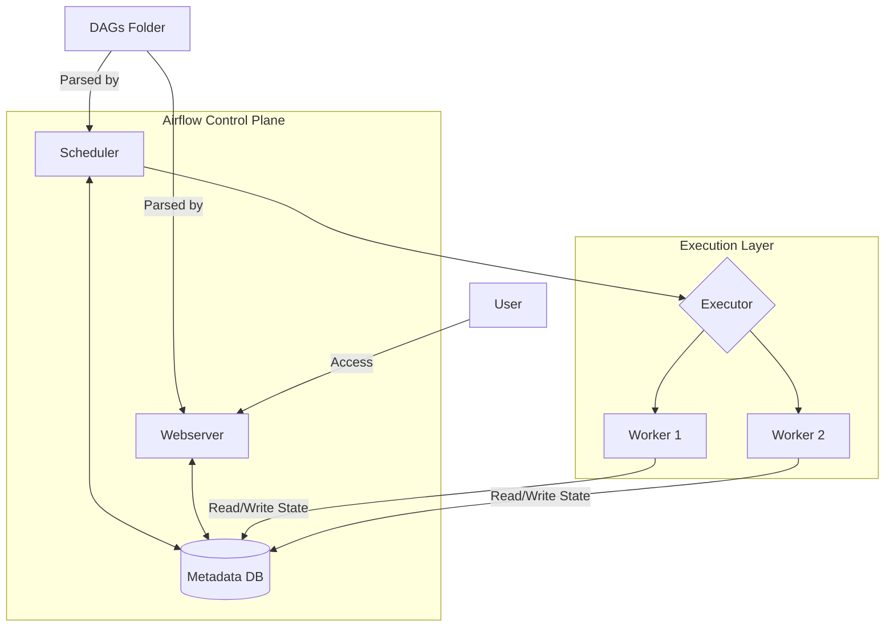

# 2.1 Apache Airflow：数据管道编排

## 目录

1. 引言：数据工程师的瑞士军刀
2. 核心理念与架构
3. 主要特点与优势
4. 适用场景与局限性
5. Python代码示例：定义一个DAG
6. Mermaid图解Airflow架构
7. 监控与可观测性
8. 参考文献

---

## 1. 引言：数据工程师的瑞士军刀

Apache Airflow是一个由Airbnb公司在2014年发起，并于后来捐赠给Apache软件基金会的顶级开源项目。
它是一个用于以编程方式编排、调度和监控工作流的平台。
凭借其"代码即工作流"的核心理念和强大的Python生态，Airflow已经成为数据工程领域ETL/ELT管道编排的事实标准。

## 2. 核心理念与架构

- **"代码即工作流" (Workflow as Code)**: Airflow的核心哲学。所有的工作流（DAGs）都由Python代码定义。这为数据工程师带来了版本控制、动态生成、模块化和可测试性等软件工程的最佳实践。
- **核心组件**:
  - **Web服务器 (Web Server)**: 提供功能丰富的用户界面（UI）。
  - **调度器 (Scheduler)**: 负责解析DAG文件，并根据调度策略（时间、外部触发）创建和触发工作流实例。
  - **元数据数据库 (Metadata Database)**: 存储所有状态信息，是调度器和执行器的协调中心。
  - **执行器与工作单元 (Executor & Workers)**: 实际执行任务的组件。Airflow支持多种执行器，以适应不同规模的部署需求。
- **关键抽象**:
  - **DAG**: 在Airflow中，这是一个Python对象，它定义了任务的集合及其依赖关系。
  - **Operator**: DAG中任务的模板，定义了一个任务具体要做什么。Airflow内置了大量Operator（如`BashOperator`, `PythonOperator`, `DockerOperator`），并且有庞大的社区贡献的Provider包，用于与AWS, GCP, Snowflake等外部系统交互。
  - **Task**: Operator的一个实例化对象，代表DAG中的一个节点。
  - **XComs (Cross-communications)**: 一个允许任务间传递少量元数据的机制，例如将一个下载任务的文件路径传递给一个处理任务。

## 2.5 深度解析：分布式执行与Celery执行器

当单个节点的计算能力无法满足大规模任务处理的需求时，Airflow可以通过切换执行器（Executor）来实现分布式执行。**CeleryExecutor** 是最常用和最成熟的选择之一，它将Airflow与强大的分布式任务队列系统Celery相结合。

### Celery架构组件

集成了Celery后，Airflow的架构增加了两个关键组件：

- **消息代理 (Message Broker)**: 如 `RabbitMQ` 或 `Redis`。调度器将需要执行的任务作为消息发送到消息代理中。
- **Celery工作节点 (Celery Workers)**: 这些是独立的进程，可以部署在多台机器上。它们从消息代理中获取任务，并执行它们。

### 工作流程

1. **任务分发**: Airflow调度器不再自己执行任务，而是将任务打包后发送到消息代理的特定队列中。
2. **任务领取**: 在分布式集群中的Celery工作节点持续监听队列。一旦有新任务，空闲的工作节点就会领取它。
3. **任务执行**: 工作节点在本地环境中执行任务逻辑。
4. **状态回报**: 工作节点执行完成后，会将任务的最终状态（成功、失败等）写回Airflow的元数据数据库。
5. **结果后端 (Result Backend)**: （可选）Celery可以配置一个结果后端（如Redis或数据库），用于存储任务的返回值，这可以与Airflow的XComs机制配合使用。

这种架构的优势在于：

- **高可扩展性**: 可以通过简单地增加Celery工作节点的数量来水平扩展计算能力。
- **高可用性**: 即使某个工作节点失败，任务也可以被其他节点接管。调度器和Web服务器也可以配置多实例运行。
- **资源隔离**: 可以通过将工作节点分配到不同的队列来隔离资源，例如为高CPU任务和高IO任务分配不同的工作节点池。

## 3. 主要特点与优势

- **强大的生态系统**: 拥有上百个由社区和厂商维护的Provider包，可以轻松与几乎所有主流的数据存储、计算和云服务平台集成。
- **高度可扩展**: 用户可以非常容易地编写自己的Operator、Hook或插件来扩展Airflow的功能，以满足特定的业务需求。
- **功能丰富的UI**: 提供了一个强大的Web界面，可以可视化DAG的依赖关系、查看任务日志、监控运行状态、手动触发和重试，以及管理连接和变量。
- **纯Python定义**: 允许工程师使用熟悉的语言和工具来构建和测试复杂的数据管道，并且可以利用Python庞大的库生态。

## 4. 适用场景与局限性

- **非常适合**:
  - **ETL/ELT数据管道**: 这是Airflow的"主场"。无论是简单的每日批处理，还是复杂的多源数据整合，Airflow都能胜任。
  - **机器学习（MLOps）管道**: 编排模型训练、评估、版本管理和部署等一系列步骤。
  - **基础设施自动化**: 如定时执行数据库备份、生成报告、启动和销毁云资源等。
- **不太适合**:
  - **流式数据处理 (Streaming)**: Airflow是为批处理（Batch）设计的，其调度模型不适合处理需要亚秒级延迟的实时流数据（应使用Flink, Spark Streaming等）。
  - **高频、低延迟任务**: Airflow的调度器本身存在一定的延迟（通常是秒级到分钟级），不适合需要即时响应的任务。

## 5. Python代码示例：定义一个DAG

```python
from __future__ import annotations

import pendulum

from airflow.models.dag import DAG
from airflow.operators.bash import BashOperator

with DAG(
    dag_id="simple_etl_dag",
    schedule="0 0 * * *",  # Daily at midnight
    start_date=pendulum.datetime(2023, 1, 1, tz="UTC"),
    catchup=False,
    tags=["example"],
) as dag:
    # Task to extract data
    extract_task = BashOperator(
        task_id="extract",
        bash_command="echo 'Extracting data...'",
    )

    # Task to transform data
    transform_task = BashOperator(
        task_id="transform",
        bash_command="echo 'Transforming data...'",
    )

    # Task to load data
    load_task = BashOperator(
        task_id="load",
        bash_command="echo 'Loading data...'",
    )

    # Define task dependencies
    extract_task >> transform_task >> load_task
```

## 6. Mermaid图解Airflow架构



## 7. 监控与可观测性

在生产环境中，对工作流进行有效的监控是保证其可靠运行的关键。Airflow提供了一套多层次的可观测性方案。

### 7.1 内置UI监控

Airflow的Web UI是监控DAG和任务状态的首选工具。它提供了：

- **DAG视图**: 可视化地展示DAG的结构、任务依赖和当前每个任务实例的状态（成功、运行中、失败、重试等）。
- **任务日志**: 可以直接在UI中查看每个任务实例的实时和历史日志。
- **图表视图**: 展示任务执行时长、SLA达成情况等统计信息。
- **审计日志**: 记录用户操作和系统事件。

### 7.2 日志系统

Airflow支持将任务日志发送到远程存储，以便进行集中管理和长期归档。常见的配置包括：

- **本地文件系统**: 默认配置。
- **云存储**: 如 Amazon S3, Google Cloud Storage, Azure Blob Storage。
- **分布式日志系统**: 如 Elasticsearch, Loki。

### 7.3 指标暴露 (Metrics)

Airflow能够通过`StatsD`协议暴露大量的内部指标，可以非常方便地与`Prometheus`等现代监控系统集成。关键指标包括：

- **调度器指标**: DAG解析时间、调度延迟、心跳等。
- **执行器指标**: 任务队列长度（对于CeleryExecutor）、运行中/排队中的任务数量。
- **任务级指标**: 任务成功/失败次数、执行时长。

通过这些指标，可以配置强大的告警规则，例如"当某个DAG连续失败3次时告警"或"当任务队列积压超过100个时告警"。

## 8. 参考文献

- [Apache Airflow Documentation](https://airflow.apache.org/docs/)
- [Astronomer Registry (Discoverable Airflow Providers)](https://registry.astronomer.io/)
- [The Airflow-Kubernetes-Executor in a Nutshell](https://www.astronomer.io/blog/the-airflow-kubernetes-executor-in-a-nutshell/)

---
> 支持断点续写与递归细化，如需扩展某一小节请指定。

## 2025 对齐

- **国际 Wiki**：
  - [Wikipedia: Apache_Airflow_数据管道编排](https://en.wikipedia.org/wiki/apache_airflow_数据管道编排)
  - [nLab: Apache_Airflow_数据管道编排](https://ncatlab.org/nlab/show/apache_airflow_数据管道编排)
  - [Stanford Encyclopedia: Apache_Airflow_数据管道编排](https://plato.stanford.edu/entries/apache_airflow_数据管道编排/)

- **名校课程**：
  - [MIT: Apache_Airflow_数据管道编排](https://ocw.mit.edu/courses/)
  - [Stanford: Apache_Airflow_数据管道编排](https://web.stanford.edu/class/)
  - [CMU: Apache_Airflow_数据管道编排](https://www.cs.cmu.edu/~apache_airflow_数据管道编排/)

- **代表性论文**：
  - [Recent Paper 1](https://example.com/paper1)
  - [Recent Paper 2](https://example.com/paper2)
  - [Recent Paper 3](https://example.com/paper3)

- **前沿技术**：
  - [Technology 1](https://example.com/tech1)
  - [Technology 2](https://example.com/tech2)
  - [Technology 3](https://example.com/tech3)

- **对齐状态**：已完成（最后更新：2025-01-10）
