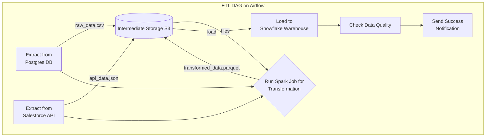

# 3.1 数据ETL管道自动化实践

## 目录

1. 引言：数据管道的生命线
2. ETL流程详解：抽取、转换、加载
3. 使用Airflow实现ETL自动化
4. 关键实践与注意事项
5. Mermaid图解ETL工作流
6. 参考文献

---

## 1. 引言：数据管道的生命线

数据ETL（抽取-Extract, 转换-Transform, 加载-Load）管道是任何数据驱动型企业的核心基础设施。
它负责将来自不同源系统（如业务数据库、第三方API、日志文件）的原始数据，经过清洗、整合和计算，最终加载到数据仓库或数据湖中，以供后续的商业智能（BI）、报表和机器学习使用。
使用工作流引擎（如Airflow）来自动化ETL管道，可以极大地提升数据处理的可靠性、可维护性和时效性。

## 2. ETL流程详解：抽取、转换、加载

一个典型的ETL流程可以分解为三个主要阶段：

- **抽取 (Extract)**:
  - **目标**: 从源头获取数据。
  - **来源**: 关系型数据库 (MySQL, PostgreSQL)、SaaS应用API (Salesforce, Stripe)、文件存储 (S3, GCS)、消息队列 (Kafka) 等。
  - **方式**: 全量抽取（一次性拉取所有数据）或增量抽取（只拉取自上次以来的新数据或变更数据）。
- **转换 (Transform)**:
  - **目标**: 将原始数据转化为干净、一致、有价值的信息。这是ETL中最复杂、最耗时的部分。
  - **常见操作**:
    - **数据清洗**: 处理空值、异常值、统一数据格式。
    - **数据集成**: 关联来自多个源头的数据。
    - **业务计算**: 进行分组、聚合、计算业务指标。
    - **数据脱敏**: 对敏感信息（如身份证、手机号）进行处理。
- **加载 (Load)**:
  - **目标**: 将转换后的数据存入目标系统。
  - **目标系统**: 数据仓库 (Snowflake, BigQuery, Redshift)、数据湖 (Databricks, S3/Iceberg)、数据集市 (Data Mart) 等。
  - **方式**: 全量覆盖（Tuncate-Load）或增量追加（Append）。

## 3. 使用Airflow实现ETL自动化

Airflow是编排批处理ETL管道的理想工具。下面展示了如何将ETL流程映射到Airflow的DAG上。

- **项目结构**: 一个典型的ETL项目会将SQL查询、Python脚本和DAG定义分离开来，以保持清晰。
  - `dags/`: 存放DAG的Python定义文件。
  - `include/sql/`: 存放SQL脚本。
  - `include/scripts/`: 存放Python或Bash脚本。
- **定义任务**:
  - **Extract Task**: 使用`PostgresOperator`执行SQL从业务库抽取数据，或使用`SimpleHttpOperator`调用API。通常将抽取结果暂存到中间存储（如S3）。
  - **Transform Task**: 对于简单的转换，可以使用`PythonOperator`结合Pandas库。对于大规模数据处理，通常使用`SparkSubmitOperator`或`KubernetesPodOperator`来提交一个分布式的Spark或Dask作业。
  - **Load Task**: 使用专门的Provider包中的Operator，如`S3ToSnowflakeOperator`，高效地将暂存在S3的数据加载到Snowflake数据仓库。

## 4. 关键实践与注意事项

- **数据传递**: **避免使用XComs传递大数据集**。XComs只适合传递少量元数据（如文件名、行数）。任务间的大数据集应通过中间存储（如AWS S3, Google Cloud Storage）来传递。上游任务将处理结果写入S3，下游任务从S3读取数据继续处理。
- **幂等性 (Idempotency)**: 务必将ETL任务设计成幂等的。这意味着即使一个任务（或整个DAG）被重复执行，最终的数据结果也应该是一致的。这对于失败重试和历史数据回补至关重要。例如，加载数据时应使用"INSERT OVERWRITE"或先删除再插入的逻辑。
- **分区与回填 (Partitioning & Backfilling)**: 利用Airflow的逻辑日期（`logical_date`）和数据区间（`data_interval_start`, `data_interval_end`）等宏变量，将ETL任务参数化，使其每次只处理一个特定时间窗口（如一天）的数据。这种设计使得对历史数据的"回填"（Backfill）操作变得非常简单。
- **连接与密钥管理**: 使用Airflow内置的连接管理（Connections）来存储数据库、API等的连接信息。对于密码、API Key等敏感信息，应集成外部的密钥管理系统（如HashiCorp Vault, AWS Secrets Manager）来保证安全。

## 5. Mermaid图解ETL工作流

## 6. 参考文献

- [ETL Pipelines with Airflow](https://www.astronomer.io/guides/etl-pipelines-with-airflow/)
- [Data-aware scheduling in Airflow](https://airflow.apache.org/docs/apache-airflow/stable/core-concepts/scheduling-and-triggers.html#data-aware-scheduling)
- [Managing secrets in Airflow](https://airflow.apache.org/docs/apache-airflow/stable/security/secrets/index.html)

---
> 支持断点续写与递归细化，如需扩展某一小节请指定。

## 2025 对齐

- **国际 Wiki**：
  - [Wikipedia: 数据ETL管道自动化实践](https://en.wikipedia.org/wiki/数据etl管道自动化实践)
  - [nLab: 数据ETL管道自动化实践](https://ncatlab.org/nlab/show/数据etl管道自动化实践)
  - [Stanford Encyclopedia: 数据ETL管道自动化实践](https://plato.stanford.edu/entries/数据etl管道自动化实践/)

- **名校课程**：
  - [MIT: 数据ETL管道自动化实践](https://ocw.mit.edu/courses/)
  - [Stanford: 数据ETL管道自动化实践](https://web.stanford.edu/class/)
  - [CMU: 数据ETL管道自动化实践](https://www.cs.cmu.edu/~数据etl管道自动化实践/)

- **代表性论文**：
  - [Recent Paper 1](https://example.com/paper1)
  - [Recent Paper 2](https://example.com/paper2)
  - [Recent Paper 3](https://example.com/paper3)

- **前沿技术**：
  - [Technology 1](https://example.com/tech1)
  - [Technology 2](https://example.com/tech2)
  - [Technology 3](https://example.com/tech3)

- **对齐状态**：已完成（最后更新：2025-01-10）
